# Mnemome — Cultural Memory, Cultural Evolution & Collective Intelligence

## 1. 개요

상세 문서: [01. 개요와 개념 경계](./cultural-memory/01-overview-and-boundaries.md)

### 1.1 문서 목적

이 문서는 여러 AI agent가 각자의 독립성을 유지하면서 meme을 형성하고 전달하고 검증하고 축적하는 **Mnemome**, 그 population-level **Cultural Memory**, 그리고 여기에서 나타나는 **Collective Intelligence(집단지능)**의 개념 구조를 설명한다.

설명은 다음 순서로 내려간다.

1. 전체 시스템이 왜 필요한지 설명한다.
2. 전체 구성도와 전체 시퀀스로 큰 흐름을 보여준다.
3. 각 기억 계층의 구성과 시퀀스를 분리해 설명한다.
4. 계층 안에서 수행되는 주요 기능을 구성도와 시퀀스로 설명한다.
5. 마지막으로 개념 검증 기준과 아직 결정하지 않은 질문을 정리한다.

이 문서에서는 저장소, 캐시, 큐, API, 프레임워크 같은 구현 방식을 정하지 않는다.

제품 경계상 Mnemome은 Agent나 Agent inference를 제공하지 않는다. 이 문서의 `Online Execution` 또는 `Agent Runtime`은 Mnemome을 사용하는 **외부 Agent**를 뜻한다. Mnemome은 그 Agent가 Working/Long-Term/Cultural Memory와 Workspace에 접근할 수 있는 Environment interface와, 토론의 phase·visibility·argument protocol을 관리하는 wrapper를 제공한다. 내부 LLM 사용은 별도의 bounded Judge/Evaluator 역할로 한정한다.

### 1.2 한 문장 정의

**Mnemome**은 하나의 agent population이 보유한 meme과 그 표현, variant, lineage, 검증 근거, 반례를 연결하는 전체 체계를 뜻하는 이 프로젝트의 고유 용어다.

Mnemome은 개인 경험을 그대로 공유하는 저장소가 아니다. Agent의 경험에서 발견된 cultural variant를 명세 가능한 Meme Artifact로 외재화하고, 독립 검증과 cultural transmission을 거쳐 population의 Cultural Memory로 보존한다.

Collective Intelligence는 모든 agent가 같은 기억이나 결론을 갖는 상태가 아니다. 서로 다른 agent와 subpopulation이 독립성을 유지한 채 meme을 검증하고, 반례를 만들고, variant를 형성하고, 필요하면 회수함으로써 만들어 내는 집단 수준의 문제 해결 능력이다.

### 1.3 해결하려는 문제

개별 agent는 반복 작업에서 유용한 shortcut이나 일반화된 규칙을 발견할 수 있다. 그러나 개인 경험을 곧바로 전체 agent population에 공유하면 다음 문제가 생긴다.

- 개인 대화, 사용자 정보, secret이 다른 agent에게 노출될 수 있다.
- 한 번의 우연한 성공이 일반적인 지식으로 오인될 수 있다.
- 잘못된 지식이나 prompt injection이 빠르게 확산될 수 있다.
- 모든 agent가 같은 전략으로 수렴해 집단 오류가 커질 수 있다.
- 변형된 지식의 출처, 근거, 실패 원인을 추적하기 어렵다.
- Shortcut이 실패했을 때 원래 실행 경로로 돌아가지 못할 수 있다.

따라서 개인의 경험과 population의 Cultural Memory 사이에 **일반화, 비식별화, 독립 검증, cultural transmission, 회수**라는 경계를 둔다.

### 1.4 핵심 개념과 분야별 용어

#### 인지과학과 기억 연구

| 용어 | 정의 |
| --- | --- |
| Working Memory | 한 번의 task execution에서 Query, Plan, 최근 observation, 임시 판단을 유지하고 조작하는 작업 기억 |
| Episodic Memory | 특정 task episode의 상황, 행동, 결과, 실패, 정정을 시간적 맥락과 함께 보존하는 일화 기억 |
| Semantic Memory | 여러 episode에서 추상화된 사실, 개념, 선호, 일반화된 규칙을 보존하는 의미 기억 |
| Agent Long-Term Memory | Episodic Memory와 Semantic Memory를 포함하는 agent 범위의 장기 기억 |
| Distributed Cognition | 인지가 개별 agent 내부에만 있지 않고 agent, tool, artifact, environment의 상호작용에 분산된다는 관점 |
| Transactive Memory | 구성원이 모든 지식을 공유하지 않고 누가 무엇을 아는지를 앎으로써 분산된 전문성을 활용하는 집단 기억 체계 |

#### 사회학, 기억 연구, 조직 연구

| 용어 | 정의 |
| --- | --- |
| Collaborative Workspace | 여러 agent가 현재 협업에 필요한 task state, evidence, decision, disagreement를 공유하는 작업공간 |
| Cultural Deliberation Workspace | 사용자 요청과 분리된 비동기 Cultural Learning Plane에서 proposal, 독립 review, 반론, 실험 계획과 governance recommendation을 다루는 임시 작업공간 |
| Collective Memory | 집단이 과거를 공동으로 표상하고 해석하는 기억. 모든 공유 데이터나 절차를 뜻하지 않는다. |
| Cultural Memory | 세대를 넘어 반복적으로 재사용할 수 있도록 외재화되고 안정화된 문화적 기억. Mnemome의 population-level memory layer에 해당한다. |
| Organizational Memory | 특정 조직이나 tenant 안에서 지식의 획득, 보존, 회상, 사용 이력을 유지하는 범위 제한적 기억 |
| Collective Intelligence | 독립적인 구성원의 관찰과 판단을 결합해 집단 수준에서 나타나는 문제 해결 능력 |

#### 문화진화와 인류학

| 용어 | 정의 |
| --- | --- |
| Cultural Trait / Cultural Variant | 사회학습을 통해 전달될 수 있는 행동, 기술, 규칙, 표상 또는 artifact의 분석 단위 |
| Meme | Mnemome에서 사용하는 조작적 용어. Agent 사이에서 cultural transmission되고 variant를 형성할 수 있는 경계가 명시된 cultural variant |
| Social Learning | 다른 agent의 행동, 결과 또는 artifact를 이용해 지식을 획득하는 과정 |
| Cultural Transmission | Meme 또는 cultural variant가 agent 사이에서 전달되는 과정. 현재 범위는 동시대 peer 사이의 horizontal transmission이 중심이다. |
| Cumulative Cultural Evolution | 이전 variant를 보존하면서 개선을 축적하는 과정. 실패 시 Baseline Procedure로 복귀하는 구조가 cultural ratchet의 퇴행 방지 역할을 한다. |
| Cultural Selection | 정확성, 효율성, 안전성 같은 기준에 따라 어떤 variant가 더 넓게 전달될지 달라지는 과정 |
| Cultural Drift | 성능 차이와 무관한 우연이나 빈도 효과로 variant의 사용률이 변하는 현상 |
| Transmission Bias | Content bias, conformity bias, prestige bias처럼 어떤 variant 또는 source를 더 쉽게 선택하게 만드는 편향 |
| Agent Subpopulation | 일정 기간 독립적으로 학습하고 제한적으로 meme을 교환하는 agent 하위집단. 진화계산과 population model에서는 deme 또는 island라고도 부른다. |

#### Mnemome의 조작적 용어

| 용어 | 정의 |
| --- | --- |
| Mnemome | Meme과 그 artifact, expression, variant, lineage, evidence, counterexample의 구조화된 총체를 가리키는 프로젝트 고유 용어 |
| Knowledge Artifact | 문서, 규칙, 절차처럼 외재화된 지식을 가리키는 일반 용어. Cultural transmission이나 variation을 전제하지 않는다. |
| Meme Artifact | Meme을 다른 agent가 해석하고 검증하고 재사용할 수 있도록 claim, conditions, Baseline Procedure, provenance와 함께 외재화한 표현 |
| Meme Variant | Revision 또는 재맥락화를 통해 parent meme에서 파생된 새 variant |
| Meme Lineage | Parent, descendant, revision, recombination의 계보. Horizontal transmission 때문에 항상 단순한 tree는 아니다. |
| Cultural Repertoire | 하나의 agent 또는 subpopulation이 접근하고 사용할 수 있는 meme과 cultural variant의 집합 |
| Transmission Network | Cultural variant가 agent와 subpopulation 사이에서 전달되고 재검증되는 연결 구조 |

각 장의 상세 설명, 절차, 클래스 및 활동 다이어그램은 [상세 설계 문서 모음](./cultural-memory/README.md)에서 분리해 다룬다.

### 1.5 설계 원칙

1. Agent Long-Term Memory의 내용은 자동으로 Collaborative Workspace나 Cultural Memory가 되지 않는다.
2. 공유보다 독립적인 판단과 전략 다양성 보존을 우선한다.
3. 모든 Meme Artifact는 출처, 적용 조건, 실패 경계, Baseline Procedure, 검증 근거를 가져야 한다.
4. 인기, 사용률, 단순 다수결을 진실의 기준으로 사용하지 않는다.
5. Revision은 기존 Meme Artifact를 덮어쓰지 않고 새로운 Meme Variant와 Meme Lineage를 만든다.
6. 같은 Meme Lineage에서 파생된 결과를 독립 증거로 중복 계산하지 않는다.
7. 잘못된 Meme Artifact는 descendant와 영향을 함께 추적하고 회수할 수 있어야 한다.
8. Meme Artifact는 새로운 권한을 부여하거나 기존 안전 경계를 우회하지 않는다.
9. 실시간 요청 처리와 느린 Cumulative Cultural Evolution을 분리한다.
10. 실패 시 Baseline Procedure로 복귀할 수 있어야 한다.
11. 토론, A/B Test와 lifecycle 판단은 Online Execution의 latency 경로에 포함하지 않는다.

### 1.6 개념 검증 범위

첫 검증 범위는 다음과 같이 제한한다.

- 하나의 분리된 agent population
- 서로 다른 관점을 가진 여러 agent subpopulation
- Baseline Procedure가 있는 shortcut Meme Artifact 한 종류
- Proposed, Under Validation, Validated를 중심으로 한 최소 수명주기
- 서로 독립적인 사례와 independent validator를 이용한 검증
- Online Execution과 분리된 Cultural Deliberation Session
- 구조화된 토론과 Baseline 대조 A/B Test
- 적용 조건이나 실패 경계를 개선하는 제한적 revision
- 정확성, 효율성, 일반화, 안전, 복구, 다양성의 관찰

다음 항목은 이 문서의 현재 범위에서 제외한다.

- 서로 신뢰 경계가 다른 population 사이의 무제한 공유
- 원문 대화나 외부 instruction의 직접 공유
- 임의 코드를 실행하는 Meme Artifact
- 완전 자동 권한 확대
- 복잡한 Meme Recombination
- 하나의 종합 평가 점수에 의한 자동 순위화

---

## 2. 전체 구성도와 시퀀스

상세 문서: [02. 전체 시스템과 이중 루프](./cultural-memory/02-system-architecture-and-workflows.md)

### 2.1 전체 구성도

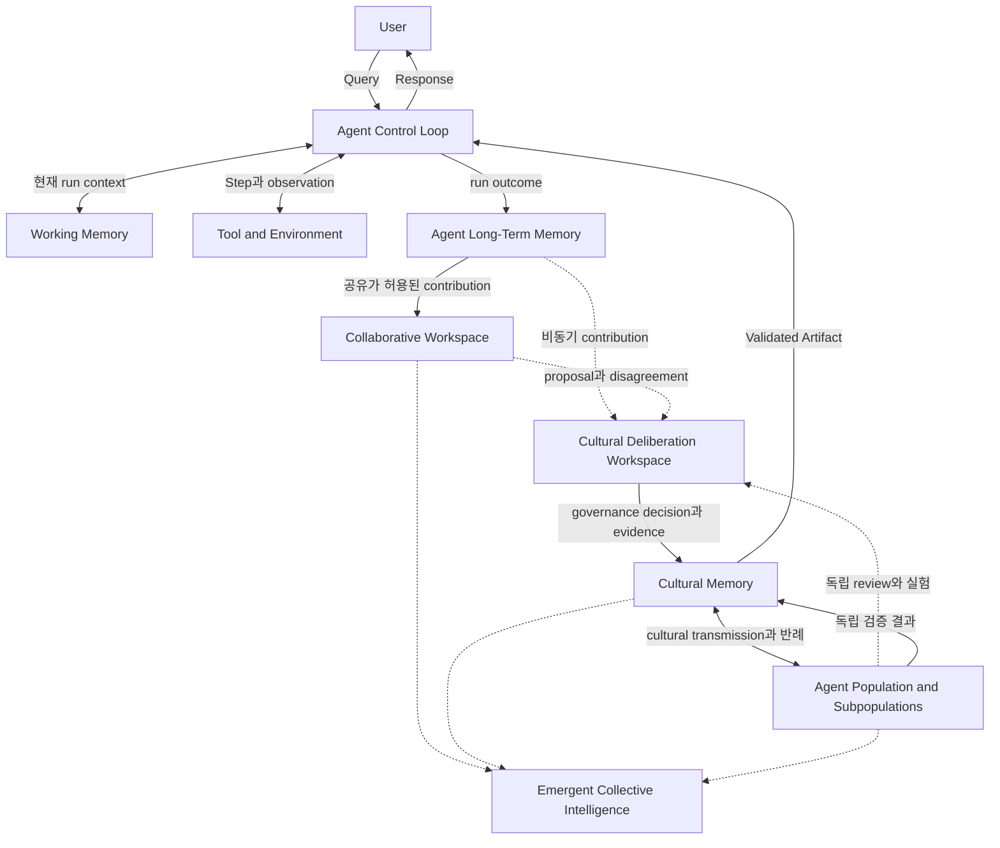

전체 시스템은 세 가지 시간 범위를 가진다.

| 시간 범위 | 중심 계층 | 목적 |
| --- | --- | --- |
| 현재 요청 | Agent Control Loop, Working Memory | Query를 계획하고 실행해 Response를 만든다. |
| 여러 요청 | Agent Long-Term Memory, Collaborative Workspace | Episode와 협업 evidence에서 반복 패턴과 반례를 찾는다. |
| Cumulative Cultural Evolution | Cultural Deliberation Workspace, Cultural Memory, Agent Population | 사용자 요청과 분리된 공간에서 토론·실험·검증하고, 승인된 variant를 제한적으로 전달하고 회수한다. |

화살표는 모든 원문 정보가 자유롭게 이동한다는 뜻이 아니다. 계층이 바뀔 때마다 scope, privacy, provenance, capability 조건을 다시 만족해야 한다.

전체 구성은 agent, tool, workspace, artifact가 함께 인지 과정을 수행한다는 의미에서 **Distributed Cognitive System**으로 볼 수 있다. **Collective Intelligence**는 별도의 저장 모듈이 아니라 이 분산된 상호작용에서 나타나는 population-level 성과다.

### 2.2 전체 실행 시퀀스

다음 시퀀스는 한 번의 사용자 요청이 처리되는 빠른 loop를 보여준다.

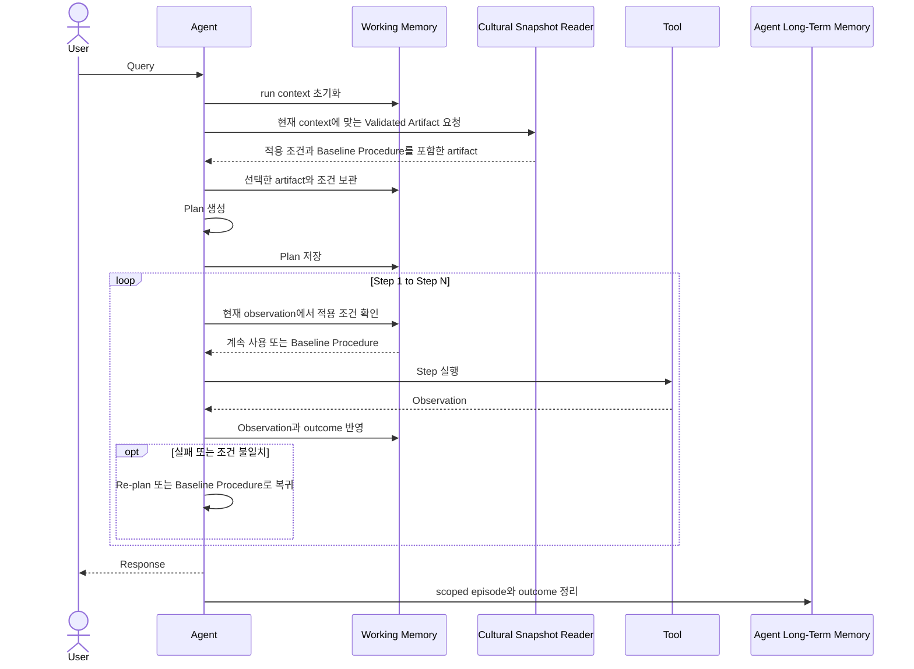

핵심은 Step loop 안에서 Cultural Memory에 반복 접근하지 않는다는 점이다.

- 실행 전에 Validated Artifact와 적용 조건을 한 번 가져온다.
- 선택한 artifact의 조건과 Baseline Procedure를 Working Memory에 둔다.
- 각 Step에서는 현재 observation과 보관된 조건을 비교한다.
- 실패하면 보관된 Baseline Procedure로 복귀한다.
- 실행 결과는 Response 이후 Agent Long-Term Memory의 episode로 정리한다.

실행 도중 context가 근본적으로 바뀌어 완전히 다른 cultural variant가 필요한 경우에만 Re-plan 과정에서 예외적으로 새 proposal을 요청한다.

### 2.3 전체 Cumulative Cultural Evolution 시퀀스

다음 시퀀스는 여러 요청과 여러 agent에 걸쳐 진행되는 느린 loop를 보여준다.

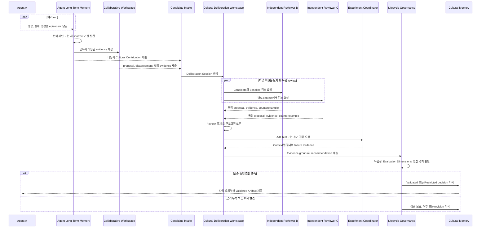

한 번의 성공이나 실패는 Cultural Memory를 즉시 바꾸지 않는다. 반복 Episode뿐 아니라 의도적인 proposal, 구조화된 토론, A/B Test도 candidate와 evidence를 만들 수 있다. 다만 이러한 활동은 Response 이후 비동기로 진행되며, governance decision이 완료된 뒤 다음 Cultural Snapshot부터 반영된다.

### 2.4 두 loop의 관계

```mermaid
flowchart LR
    Query["Query"]
    Plan["Plan"]
    Steps["Steps"]
    Response["Response"]
    Episode["Scoped Episode"]
    Trigger["Pattern · Proposal · Counterexample"]
    Proposal["Proposed Meme Variant"]
    Deliberation["Async Deliberation"]
    Experiment["A/B Test · Independent Validation"]
    Governance["Lifecycle Governance"]
    Validated["Validated Artifact"]

    Query --> Plan --> Steps --> Response
    Response --> Episode
    Episode -.-> Trigger --> Proposal --> Deliberation --> Experiment --> Governance --> Validated
    Validated -.->|"다음 요청의 policy proposal"| Plan
    Steps -.->|"실패 시 Re-plan"| Plan
```

- **빠른 실행 loop:** Query → Plan → Steps → Response
- **느린 Cumulative Cultural Evolution loop:** Episode 또는 의도적 Proposal → Deliberation → Experiment → Governance → Validated
- **연결점:** Validated Artifact는 다음 요청의 policy proposal이 되고, 실행 결과는 다시 episode가 된다.

빠른 loop는 현재 사용자의 요청을 안정적으로 해결한다. 느린 loop는 여러 실행의 지식을 성급하게 일반화하지 않도록 통제한다.

느린 loop를 문화진화의 과정과 대응시키면 다음과 같다.

| Mnemome 과정 | 문화진화 용어 | 의미 |
| --- | --- | --- |
| 반복 episode에서 새 shortcut 발견 | Innovation / Guided Variation | 기존 경험을 바탕으로 새 cultural variant를 만든다. |
| 구조화된 토론에서 proposal 형성 | Deliberative Variation | 독립 제안, 반론과 대안을 통해 검증 가능한 variant를 명세한다. |
| Baseline과 candidate의 A/B Test | Controlled Cultural Selection | 정의된 context와 평가 차원에서 variant의 차이를 실험한다. |
| Proposed Meme Variant 작성 | Variation | 전달 가능한 차이를 가진 variant를 명세한다. |
| 독립 검증과 비교 | Cultural Selection | 어떤 variant를 더 넓게 전달할지 결정한다. |
| Agent가 검증된 artifact를 사용 | Meme Expression | 추상적인 meme이 실제 task behavior로 발현된다. 이 용어는 분석할 때만 사용하며 별도 모듈명으로 만들지 않는다. |
| Subpopulation 사이의 제한적 공유 | Horizontal Cultural Transmission / Migration | 동시대 peer 집단 사이에서 variant가 이동한다. |
| 우연한 사용률 변화 | Cultural Drift | 성능 차이와 무관하게 variant 빈도가 변한다. |
| 개선을 보존하면서 다음 variant 형성 | Cumulative Cultural Evolution | 이전 개선이 사라지지 않도록 ratchet effect를 만든다. |

---

## 3. 계층별 구성도와 시퀀스

상세 문서: [03. 기억 계층 상세](./cultural-memory/03-memory-layers.md)

### 3.1 Agent Control Loop과 Working Memory 계층

#### 구성도

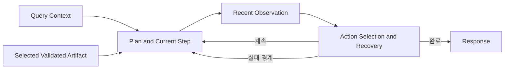

이 계층은 한 번의 task execution을 제어하는 작업 공간이다.

| 내부 요소 | 역할 |
| --- | --- |
| Query Context | 현재 요청의 목표, 제약, 필요한 배경을 유지한다. |
| Selected Validated Artifact | 실행 전에 선택한 지식 산출물과 적용 조건, 실패 경계, Baseline Procedure를 유지한다. |
| Plan and Current Step | 실행 가능한 계획과 현재 진행 위치를 유지한다. |
| Recent Observation | Tool 결과와 새로 드러난 사실을 반영한다. |
| Action Selection and Recovery | 계속 실행, Re-plan, Recovery Policy 적용, 완료 중 하나를 판단한다. |
| Response | 현재 요청에 대한 최종 결과를 만든다. |

이 계층은 비공개 chain-of-thought를 공유하는 공간이 아니다. 구조화된 Plan, 관찰 가능한 Tool 결과, outcome을 다룬다.

#### 시퀀스

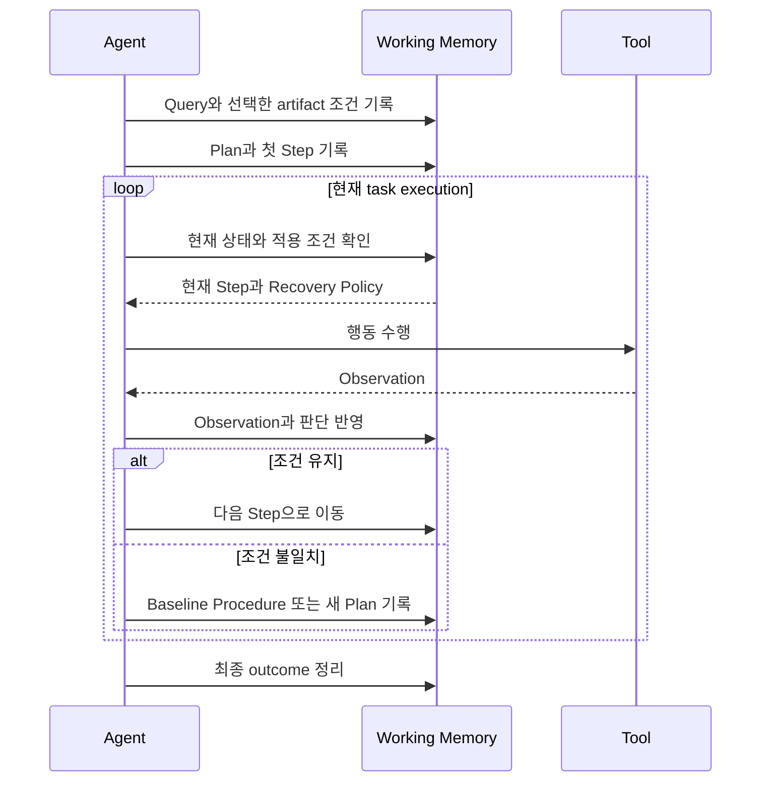

이 계층의 수명은 현재 task execution에 한정된다. Response 이후에는 필요한 결과만 task episode로 정리하고, 나머지 임시 context는 cultural knowledge으로 전환하지 않는다.

---

### 3.2 Agent Long-Term Memory 계층

#### 구성도

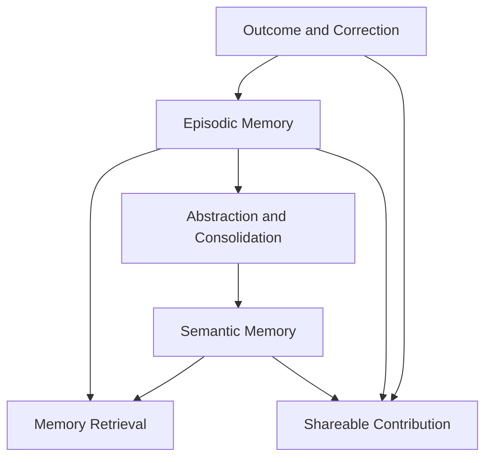

Agent Long-Term Memory는 Episodic Memory와 Semantic Memory를 함께 사용해 개인의 경험을 session 너머로 연결한다. Cultural Memory와 달리 한 agent 또는 user의 맥락을 우선한다.

| 내부 요소 | 역할 |
| --- | --- |
| Episodic Memory | 각 task episode의 상황, 행동, 결과, 실패, 정정을 시간적 맥락과 함께 보존한다. |
| Semantic Memory | 여러 episode에서 추상화된 사실, 선호, 개념, 일반화된 규칙을 보존한다. |
| Outcome and Correction | 무엇이 작동했고 무엇이 틀렸으며 어떻게 정정되었는지 episode와 연결한다. |
| Abstraction and Consolidation | 반복 경험에서 안정적인 의미 구조를 추출해 Semantic Memory로 통합한다. |
| Memory Retrieval | 다음 개인 요청에 관련 episode와 semantic knowledge를 제공한다. |
| Shareable Contribution | 일반화와 비식별화가 가능한 일부 근거만 다음 계층의 proposal로 만든다. |

#### 시퀀스

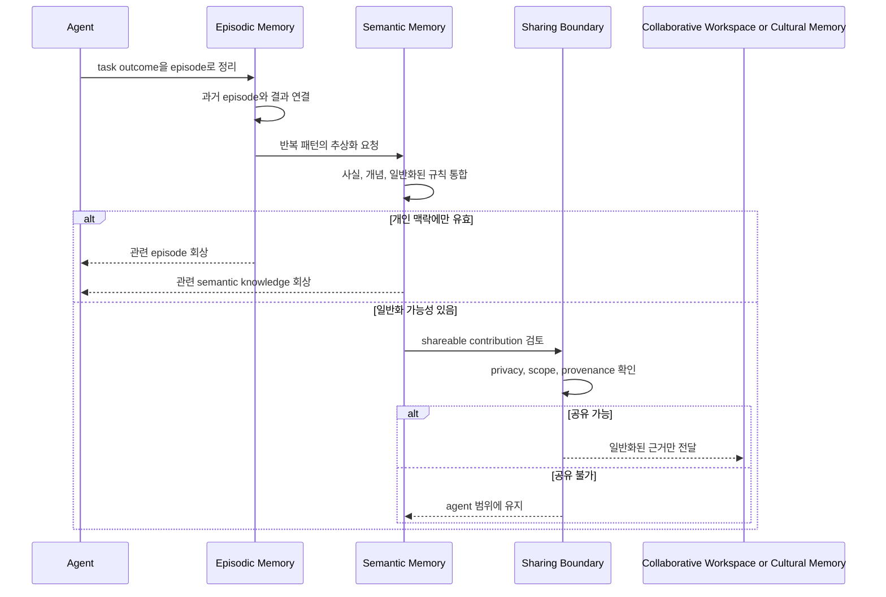

Episodic Memory의 원문 episode는 그 자체로 공유되지 않는다. 다음 계층으로 이동하는 것은 목적에 필요한 최소한의 일반화된 contribution이며, Semantic Memory의 내용도 scope와 provenance 검토를 통과해야 한다.

---

### 3.3 Collaborative Workspace 계층

#### 구성도

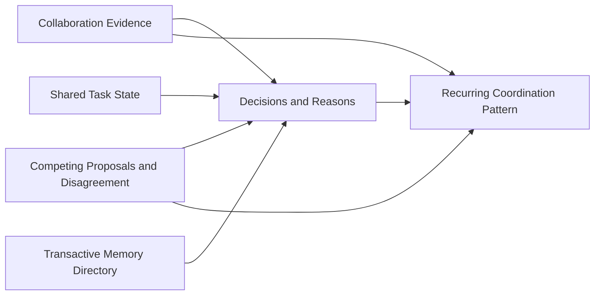

Collaborative Workspace는 Cultural Memory보다 짧고 구체적인 협업 맥락을 다룬다. 목적은 모든 agent의 기억을 합치는 것이 아니라, 같은 작업에 필요한 evidence와 disagreement를 연결하는 것이다.

| 내부 요소 | 역할 |
| --- | --- |
| Shared Task State | 현재 협업의 목표, 진행 상태, 남은 문제를 연결한다. |
| Collaboration Evidence | 각 agent가 관찰한 사실과 결과를 보존한다. |
| Decisions and Reasons | 어떤 결정을 왜 내렸는지 기록한다. |
| Competing Proposals and Disagreement | 서로 다른 제안, 반대 의견, 모순되는 evidence를 지우지 않는다. |
| Transactive Memory Directory | 어떤 agent가 어떤 지식과 전문성을 보유하는지, 즉 누가 무엇을 아는지를 나타낸다. |
| Recurring Coordination Pattern | 여러 협업에서 반복된 조정 패턴을 Proposed Meme Variant의 근거로 제공한다. |

#### 시퀀스

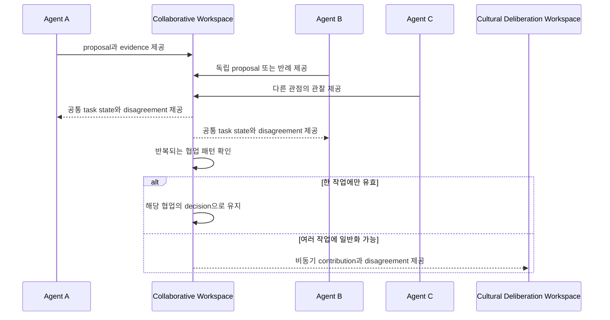

Collaborative Workspace에서 여러 agent가 합의했더라도, 그 합의만으로 해당 내용을 Cultural Memory의 검증된 지식으로 승격하지 않는다. Agent들이 같은 source, 실행 결과 또는 Meme Lineage에 의존했다면 이들의 판단은 서로 독립된 증거가 아니라 하나의 상관된 증거로 계산한다.

---

### 3.4 Cultural Deliberation Workspace

Cultural Deliberation Workspace는 Working Memory나 현재 사용자 task의 Collaborative Workspace가 아니다. Response 이후 별도의 **Cultural Learning Plane**에서 열리는 일시적인 session으로, Candidate를 검토하고 Cultural Memory에 제출할 governance recommendation을 만든다.

#### 구성도

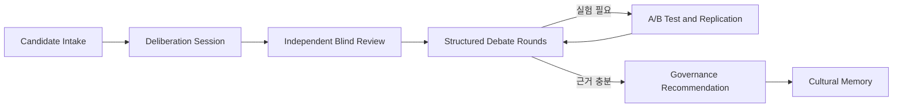

| 내부 기능 | 역할 |
| --- | --- |
| Candidate Intake | Episode pattern, 의도적 proposal, counterexample과 협업 contribution을 받는다. |
| Deliberation Session | Candidate version, scope, 참여자, phase, time budget을 고정한다. |
| Independent Blind Review | Reviewer가 서로의 판단을 보기 전에 proposal과 반례를 제출하게 한다. |
| Structured Debate Rounds | 공개된 review를 기준으로 claim, rebuttal, evidence request를 제한된 round에서 교환한다. |
| A/B Test and Replication | Baseline과 candidate를 통제된 context에서 비교하고 독립 재현한다. |
| Governance Recommendation | Evidence groups, unresolved disagreement, 권장 lifecycle decision을 만든다. |

#### 비동기 시퀀스

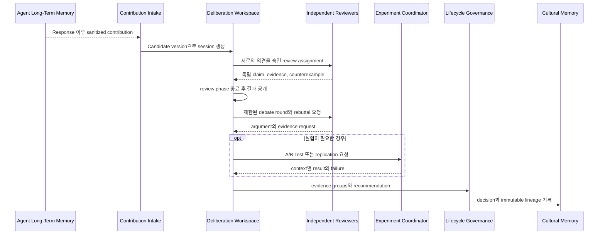

토론은 Online Execution의 critical path에 포함되지 않는다. Online Agent는 이미 배포된 Cultural Snapshot만 읽고, 새로운 decision은 완료된 다음 snapshot부터 사용할 수 있다. 세부 시스템 구조는 [Cultural Deliberation 시스템 설계](./cultural-memory/08-cultural-deliberation-system.md)에서 다룬다.

---

### 3.5 Cultural Memory 계층

#### 구성도

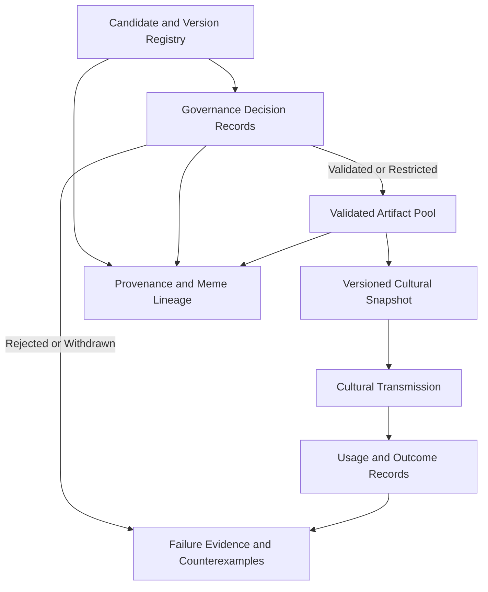

Cultural Memory는 여러 agent가 재사용할 수 있는 meme의 상태와 근거를 다룬다. Organizational Memory가 특정 tenant나 조직의 보존 범위를 설명한다면, 이 계층은 agent population을 가로지르는 cultural transmission과 cumulative change를 설명한다.

| 내부 기능 | 역할 |
| --- | --- |
| Candidate and Version Registry | Proposed, Under Validation, revision 상태의 immutable version과 identity를 보존한다. |
| Governance Decision Records | Deliberation Workspace가 제출한 evidence와 recommendation에 대한 승인, 제한, 보류, 거부, 회수 판단을 보존한다. |
| Validated Artifact Pool | 검증된 Meme Artifact와 그 variant를 적용 조건과 함께 제한적으로 제공한다. |
| Versioned Cultural Snapshot | 특정 시점에 Online Execution이 읽을 수 있는 validated artifact 집합을 immutable version으로 발행한다. |
| Cultural Transmission | 검증된 variant를 agent와 subpopulation에 제한적으로 전달한다. |
| Usage and Outcome Records | 전달된 artifact가 실제 task에서 어떻게 사용되었고 어떤 결과를 냈는지 연결한다. 문화진화 분석에서는 이를 meme expression으로 해석할 수 있다. |
| Provenance and Meme Lineage | 출처, version, revision, 검증 관계를 연결한다. |
| Failure Evidence and Counterexamples | 실패 경계, 반례, 위해 신호를 성공 근거와 함께 보존한다. |

#### 시퀀스

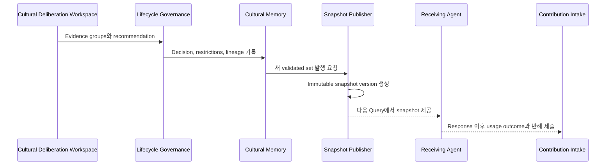

Cultural Memory는 답을 강제하지 않는다. Agent에게 Validated Artifact와 applicability conditions를 제공하고, 실제 policy selection은 현재 context를 가진 Agent가 결정한다.

---

### 3.6 계층 전이 규칙

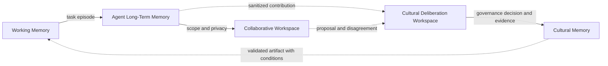

| 전이 | 허용되는 내용 | 허용되지 않는 내용 |
| --- | --- | --- |
| Working Memory → Agent Long-Term Memory | 목적, 구조화된 Plan, 관찰 가능한 결과, outcome | 불필요한 임시 context, 비공개 추론 원문 |
| Agent Long-Term Memory → Collaborative Workspace | 협업에 필요한 최소 evidence와 task state | 개인 대화 원문, 범위를 벗어난 개인 정보 |
| Agent Long-Term Memory → Cultural Deliberation Workspace | 일반화된 pattern, 의도적 proposal, provenance, 실패 경계 | 원문 episode, 출처 없는 shortcut |
| Collaborative Workspace → Cultural Deliberation Workspace | 반복 협업 pattern, 독립 proposal, disagreement | 단순 다수결이나 한 작업의 일시적 합의 |
| Cultural Deliberation Workspace → Cultural Memory | Evidence groups, unresolved disagreement, governance decision | 진행 중인 토론의 임시 메시지, 승인되지 않은 recommendation |
| Cultural Memory → Working Memory | Validated Artifact, 적용 조건, 실패 경계, Baseline Procedure | 무조건 실행해야 하는 명령, 새로운 권한 |

---

## 4. 계층 내 기능별 구성도와 시퀀스

상세 문서: [04. Cultural Memory 기능 상세](./cultural-memory/04-cultural-memory-functions.md)

### 4.1 Meme Artifact 식별과 명세화

#### 구성도

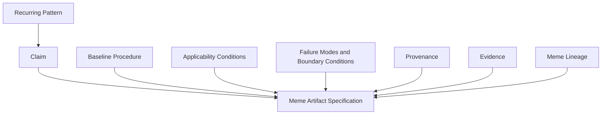

Meme Artifact는 단순한 답변, prompt, 요약문이 아니다. 다른 agent가 언제 사용할지 판단하고, Baseline Procedure와 비교하고, 실패하면 되돌릴 수 있는 지식 단위다.

| 요소 | 설명 |
| --- | --- |
| Claim | 무엇을 더 잘하거나 더 짧게 할 수 있다는 주장 |
| Baseline Procedure | Shortcut을 사용하지 않을 때의 원래 실행 경로 |
| Applicability Conditions | 유효하다고 예상되는 상황과 전제 조건 |
| Failure Modes and Boundary Conditions | 사용하면 안 되는 조건, 알려진 실패 방식, 반례 |
| Provenance | 어떤 경험과 관찰에서 일반화되었는지에 대한 출처 |
| Validation Evidence | 성공, 실패, 정정, 독립 검증 결과 |
| Meme Lineage | 어떤 Meme Artifact에서 파생되었는지에 대한 version 관계 |

#### 시퀀스

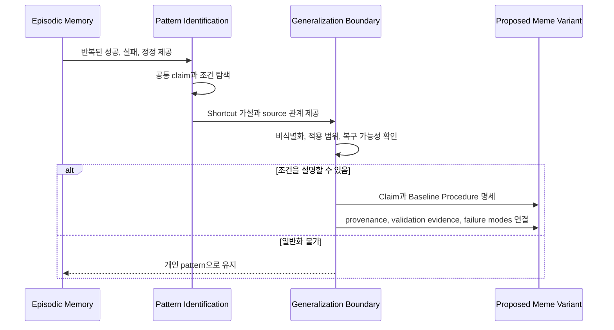

예를 들어 `A ⇒ E`라는 shortcut Meme Artifact는 반드시 Baseline Procedure인 `A → B → C → D → E`, applicability conditions, failure modes, Recovery Policy를 함께 가진다.

---

### 4.2 독립 검증과 수명주기 관리

이 기능은 User Query의 실시간 흐름이 아니라 Response 이후의 Cultural Deliberation Session에서 비동기로 실행한다. Candidate version과 review 결과는 phase별로 고정하며, independent review가 끝나기 전에는 reviewer에게 다른 판단을 공개하지 않는다.

#### 구성도

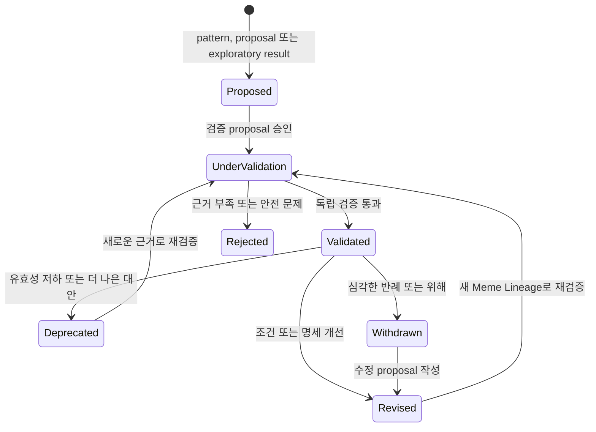

#### 시퀀스

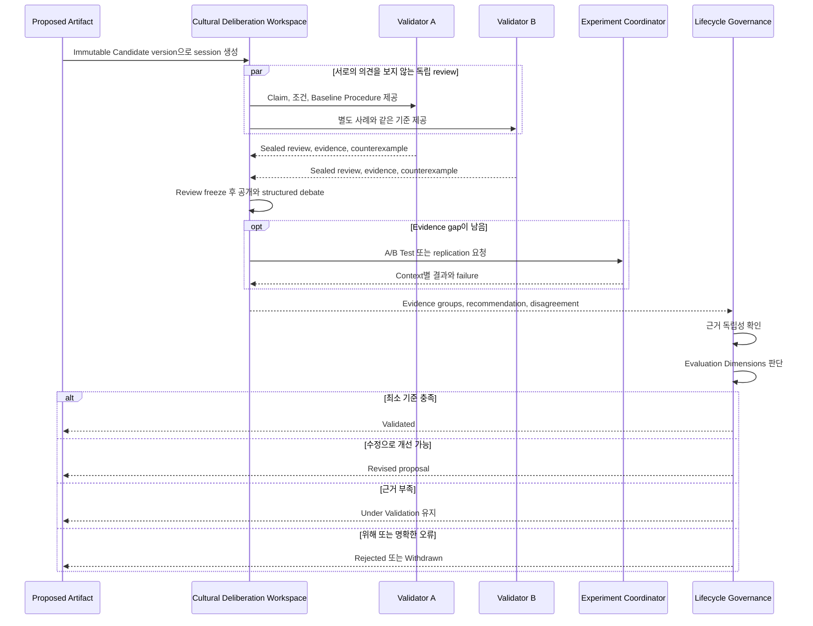

독립 검증은 agent 이름이 다르다는 뜻만은 아니다. 같은 source episode, 같은 Meme Lineage, 같은 생성 과정에 의존한 결과는 하나의 상관된 근거로 보아야 한다.

검증 결과는 하나의 점수로 압축하지 않는다.

| 차원 | 질문 |
| --- | --- |
| Accuracy | Baseline Procedure와 같거나 더 정확한가? |
| Efficiency | 시간, 비용, 단계 수를 실질적으로 줄이는가? |
| Generalization | 새로운 상황에서도 적용 조건이 유지되는가? |
| Safety | 민감 정보, 권한, 위해 가능성을 통제하는가? |
| Recoverability | 실패를 감지하고 Baseline Procedure로 돌아갈 수 있는가? |
| Explainability | 선택 이유와 근거를 추적할 수 있는가? |
| Diversity Impact | 다른 전략과 소수 관점을 부당하게 제거하지 않는가? |

---

### 4.3 Cultural Transmission, Policy Selection, Recovery

#### 구성도

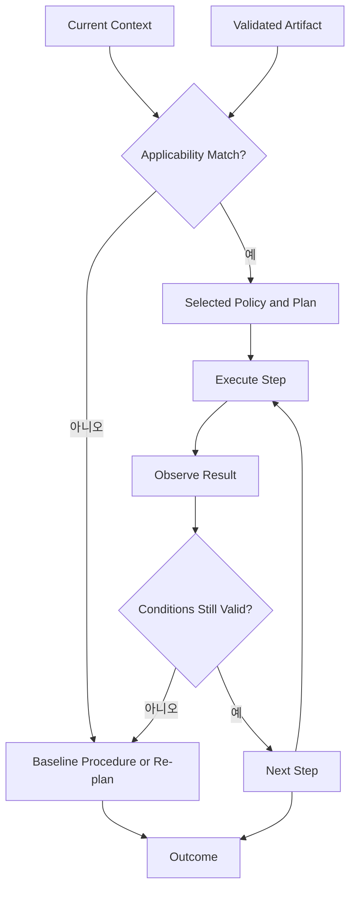

#### 시퀀스

```mermaid
sequenceDiagram
    participant Agent
    participant Short as Working Memory
    participant Tool

    Agent->>Short: artifact 조건과 Baseline Procedure 확인
    alt 현재 context에 적용 가능
        Agent->>Short: artifact를 포함한 Plan 기록
    else 적용 불가
        Agent->>Short: Baseline Procedure로 Plan 기록
    end

    loop 실행
        Agent->>Tool: 현재 Step 수행
        Tool-->>Agent: Observation
        Agent->>Short: Observation 반영
        alt 적용 조건 유지
            Short-->>Agent: 다음 shortcut Step
        else 실패 경계 도달
            Short-->>Agent: Baseline Procedure 또는 Re-plan
        end
    end
```

검증된 artifact의 policy selection은 task execution 시작 시 한 번 끝나는 결정이 아니다. 실행 전에 받은 applicability conditions를 현재 observation과 비교하면서 계속 재검토한다.

이 재검토는 Step마다 Cultural Memory에 다시 접근한다는 뜻이 아니다. 조건과 Baseline Procedure는 현재 task execution의 Working Memory에 있으며, loop 안에서는 이를 사용한다.

---

### 4.4 통제된 지식 확산과 전략 다양성 보존

#### 구성도

```mermaid
flowchart LR
    Artifact["Validated Artifact"]
    Trial["Limited Transfer Trial"]
    SubpopulationA["Subpopulation A"]
    SubpopulationB["Subpopulation B"]
    SubpopulationC["Subpopulation C"]
    Evidence["Success, Failure, Counterexample"]
    Decision["Expand, Hold, Withdraw"]

    Artifact --> Trial --> SubpopulationA
    SubpopulationA --> Evidence
    SubpopulationB -.->|"기존 전략 유지"| Evidence
    SubpopulationC -.->|"다른 관점 유지"| Evidence
    Evidence --> Decision
    Decision -.->|"새로운 맥락에서 재검증"| SubpopulationB
    Decision -.->|"새로운 맥락에서 재검증"| SubpopulationC
```

#### 시퀀스

```mermaid
sequenceDiagram
    participant OrgMemory as Cultural Memory
    participant SubpopulationA as Trial Subpopulation
    participant SubpopulationB as Baseline Subpopulation
    participant SubpopulationC as Alternative Subpopulation

    OrgMemory->>SubpopulationA: Validated Artifact를 제한된 범위로 제공
    OrgMemory-->>SubpopulationB: 기존 전략 유지
    OrgMemory-->>SubpopulationC: 다른 전략 유지
    SubpopulationA-->>OrgMemory: 성공, 실패, 반례
    SubpopulationB-->>OrgMemory: 기준선 결과
    SubpopulationC-->>OrgMemory: 대안 전략 결과
    OrgMemory->>OrgMemory: 성능과 다양성 영향을 함께 판단

    alt 일반화와 다양성 기준 충족
        OrgMemory->>SubpopulationB: 새로운 맥락에서 재검증 요청
    else 성능 불명확
        OrgMemory->>OrgMemory: 현재 범위 유지
    else 위해 또는 premature convergence
        OrgMemory->>OrgMemory: 확산 중단 또는 회수
    end
```

지식 확산은 자동 복제가 아니라 새로운 맥락에서의 재검증이다. 일정 비율의 agent와 subpopulation은 기존 또는 다른 전략을 유지해 baseline과 strategy diversity를 보존한다.

집단사고를 막기 위해 다음 원칙을 적용한다.

- 사용률이 높다는 사실을 정확성의 증거로 보지 않는다.
- 비슷한 Meme Lineage의 표를 독립된 합의로 세지 않는다.
- 실패 사례와 disagreement를 성공 사례와 같은 수준으로 보존한다.
- 하나의 보편적 artifact보다 조건이 분명한 여러 지역적 variant를 허용한다.
- 새로운 revision은 parent의 인기를 상속하지 않고 다시 검증한다.

문화진화 관점에서는 높은 사용률이 **conformity bias** 또는 **cultural drift**의 결과일 수 있고, 특정 agent의 지위에 따른 확산은 **prestige bias**일 수 있다. Mnemome은 이런 transmission bias를 관찰 신호로 다루되 정확성의 대리값으로 사용하지 않는다.

---

### 4.5 Variant Formation, Lineage, Withdrawal

#### 구성도

```mermaid
flowchart TB
    Source["Source Episodes"]
    Parent["Parent Meme Artifact"]
    VariantA["Variant A"]
    VariantB["Variant B"]
    EvidenceA["Evidence A"]
    EvidenceB["Evidence B"]
    Counter["Serious Counterexample"]
    Review["Impact Review"]

    Source --> Parent
    Parent --> VariantA
    Parent --> VariantB
    VariantA --> EvidenceA
    VariantB --> EvidenceB
    Counter --> Parent
    Counter --> Review
    Parent --> Review
    VariantA --> Review
    VariantB --> Review
```

#### 시퀀스

```mermaid
sequenceDiagram
    participant Agent
    participant OrgMemory as Cultural Memory
    participant Parent as Parent Meme Artifact
    participant Child as Descendant Meme Artifact

    Agent->>OrgMemory: 심각한 반례 보고
    OrgMemory->>Parent: Claim과 failure boundary 재검토
    OrgMemory->>Child: 상속된 조건과 근거 재검토
    Parent-->>OrgMemory: 영향받는 판단과 사용 범위
    Child-->>OrgMemory: 독립 근거와 상속 근거 구분

    alt Parent의 오류가 descendant에도 영향
        OrgMemory->>Parent: Withdrawn 또는 Under Validation
        OrgMemory->>Child: Under Validation 후 재검증
    else Child에 독립적인 근거가 충분
        OrgMemory->>Child: 범위를 제한해 재검증
    end
```

Revision은 기존 버전을 덮어쓰는 행위가 아니라 새로운 variant와 Meme Lineage를 만드는 행위다. Parent와 descendant가 같은 source를 공유한다면 그 결과를 독립 증거로 중복 계산하지 않는다.

회수는 한 Meme Artifact만 숨기는 것으로 끝나지 않는다. 반례가 어떤 descendant, 검증, 선택 판단에 영향을 주는지 함께 재검토해야 한다.

---

### 4.6 안전과 책임 경계

#### 구성도

```mermaid
flowchart LR
    Input["Proposal or Contribution"]
    Privacy{"Privacy Safe?"}
    Provenance{"Provenance Clear?"}
    Capability{"Capability Allowed?"}
    Independence{"Evidence Independent?"}
    Diversity{"Diversity Preserved?"}
    Accept["Continue Independent Validation"]
    Hold["Hold, Restrict, or Reject"]

    Input --> Privacy
    Privacy -->|"예"| Provenance
    Privacy -->|"아니오"| Hold
    Provenance -->|"예"| Capability
    Provenance -->|"아니오"| Hold
    Capability -->|"예"| Independence
    Capability -->|"아니오"| Hold
    Independence -->|"예"| Diversity
    Independence -->|"아니오"| Hold
    Diversity -->|"예"| Accept
    Diversity -->|"아니오"| Hold
```

#### 시퀀스

```mermaid
sequenceDiagram
    participant Source
    participant Boundary as Safety Boundary
    participant Validation as Independent Validation
    participant OrgMemory as Cultural Memory

    Source->>Boundary: proposal과 근거 제공
    Boundary->>Boundary: 개인 정보와 scope 확인
    Boundary->>Boundary: 출처와 Meme Lineage 확인
    Boundary->>Boundary: 권한과 위해 가능성 확인

    alt 기본 경계 통과
        Boundary->>Validation: 독립성과 다양성 검증 요청
        Validation-->>Boundary: 결과와 반례
        alt 전체 기준 충족
            Boundary-->>OrgMemory: 제한된 proposal로 전달
        else 불충분
            Boundary-->>Source: 범위 축소 또는 추가 근거 요청
        end
    else 경계 위반
        Boundary-->>Source: 공유 중단
    end
```

안전 경계의 핵심 원칙은 다음과 같다.

- 개인 대화 원문이나 식별 가능한 정보는 cultural knowledge이 될 수 없다.
- 출처 없는 Meme Artifact는 검증된 지식이 아니라 주장으로 취급한다.
- Meme Artifact는 새로운 권한을 부여하지 않는다.
- 외부 instruction이나 실행 결과를 곧바로 Meme Artifact로 승인하지 않는다.
- 과도하게 빠른 확산과 비정상적으로 높은 성공 주장을 경고 신호로 본다.
- 삭제 또는 보존 제한이 필요한 source는 descendant에 미치는 영향도 검토한다.

---

## 5. 개념 검증 시나리오

상세 문서: [05. 개념 검증과 평가](./cultural-memory/05-concept-validation.md)

첫 검증은 `A → B → C → D → E`라는 기존 경로를 `A ⇒ E`로 줄이는 shortcut Meme Artifact 한 종류에 집중한다.

### 5.1 검증 구성도

```mermaid
flowchart TD
    Existing["기존 경로 반복"]
    Hypothesis["Shortcut 가설 발견"]
    Specification["조건, 실패 경계, Baseline Procedure 명세"]
    Independent["독립 사례에서 검증"]
    Gate{"정확성, 안전, 복구 충족?"}
    Trial["제한된 범위에서 사용"]
    Hold["검증 보류 또는 revision"]
    Observe["성공, 실패, 반례 관찰"]
    Continue{"계속 유효한가?"}
    Expand["새로운 맥락에서 재검증"]
    Revoke["회수와 영향 재검토"]

    Existing --> Hypothesis --> Specification --> Independent --> Gate
    Gate -->|"예"| Trial
    Gate -->|"아니오"| Hold
    Trial --> Observe --> Continue
    Continue -->|"예"| Expand
    Continue -->|"아니오"| Revoke
```

### 5.2 검증 시퀀스

```mermaid
sequenceDiagram
    participant Baseline as Baseline Procedure
    participant Proposal as Shortcut Meme Artifact
    participant EvalA as Validation Context A
    participant EvalB as Validation Context B
    participant OrgMemory as Cultural Memory

    Baseline->>EvalA: A to B to C to D to E 실행
    Proposal->>EvalA: A to E 실행
    Baseline->>EvalB: Baseline Procedure 실행
    Proposal->>EvalB: Shortcut 실행
    EvalA-->>OrgMemory: 정확성, 효율, 실패 경계
    EvalB-->>OrgMemory: 일반화, 안전, 복구 가능성
    OrgMemory->>OrgMemory: 독립성과 strategy diversity impact 판단

    alt 기준 충족
        OrgMemory->>Proposal: 제한된 Validated 상태
    else 기준 미충족
        OrgMemory->>Proposal: Under Validation, 수정 또는 거부
    end
```

### 5.3 성공 기준

| 관점 | 확인할 질문 |
| --- | --- |
| 성능 | Baseline Procedure보다 정확성을 유지하면서 시간, 비용, 단계 수를 줄이는가? |
| 일반화 | 익숙하지 않은 사례에서도 적용 조건과 실패 경계가 유효한가? |
| 안전 | 개인 정보, 권한, 오염된 근거가 population으로 확산되지 않는가? |
| 다양성 | Alternative strategy와 agent subpopulation 간 차이가 유지되는가? |
| 복구 | 실패를 감지하고 Baseline Procedure로 실제 복귀할 수 있는가? |
| 설명 가능성 | 결과에서 Meme Artifact, 근거, Meme Lineage, 선택 이유까지 추적할 수 있는가? |

이 개념은 공유량이나 사용률이 아니라 **독립성을 보존하면서 더 잘 학습하는가**로 검증한다.

---

## 6. 아직 결정하지 않은 개념 질문

상세 문서: [06. 미결정 질문과 의사결정](./cultural-memory/06-open-concept-questions.md)

1. 어떤 cultural variant를 하나의 Meme으로 볼 것인가? Declarative rule, procedural skill, policy, workflow의 경계를 어디에 둘 것인가?
2. 서로 다른 근거가 독립적이라고 볼 수 있는 최소 조건은 무엇인가?
3. 정확성, 효율성, 안전, 다양성이 충돌할 때 어떤 원칙으로 우선순위를 정하는가?
4. 적용 범위가 다른 Meme Artifact들이 충돌할 때 어떤 것을 우선하는가?
5. 하나의 Meme에 여러 표현이 생긴 것과 새로운 Meme Variant가 형성된 것을 어떻게 구분하는가?
6. Meme Recombination을 허용한다면 부모 Meme Artifact의 실패 경계를 어떻게 계승하는가?
7. Alternative strategy를 얼마나 오래 보존하고, conformity bias와 cultural drift를 어떻게 구분하는가?
8. 자동 판단과 사람의 승인이 각각 필요한 경계는 어디인가?
9. 오래 사용되지 않은 Meme Artifact와 환경 변화로 유효성을 잃은 Meme Artifact를 어떻게 구분하는가?
10. 잊힐 권리와 Meme Lineage의 추적 가능성이 충돌할 때 무엇을 보존해야 하는가?
11. Cultural Memory와 tenant별 Organizational Memory 사이의 전이와 책임 경계를 어디에 둘 것인가?

---

## 7. 다음 컨셉 고도화 순서

상세 문서: [07. 컨셉 고도화 로드맵](./cultural-memory/07-concept-refinement-roadmap.md)

1. Shortcut Meme 한 종류와 그 Meme Artifact의 의미 및 경계를 예시로 고정한다.
2. 적용 조건, 실패 경계, Baseline Procedure를 표현하는 공통 언어를 정의한다.
3. 독립 근거와 상관된 근거를 구분하는 판단 규칙을 정한다.
4. 검증 승인, 검증 보류, 회수, 재검증의 의사결정 원칙을 구체화한다.
5. Agent Subpopulation과 strategy diversity가 필요한 최소 조건을 정한다.
6. Privacy, provenance, capability가 충돌하는 사례를 수집한다.
7. 첫 benchmark 시나리오와 반례 세트를 설계한다.
8. 개념이 충분히 안정된 뒤에 별도 문서에서 구현 선택을 다룬다.

---

이 설계의 핵심은 agent가 같은 memory를 공유하는 것이 아니다. 각 agent가 독립적으로 경험하고 판단하되, **검증 가능한 Meme Artifact만 제한적으로 전달하고 실패와 반례까지 Cultural Memory의 일부로 보존하는 것**이다.
