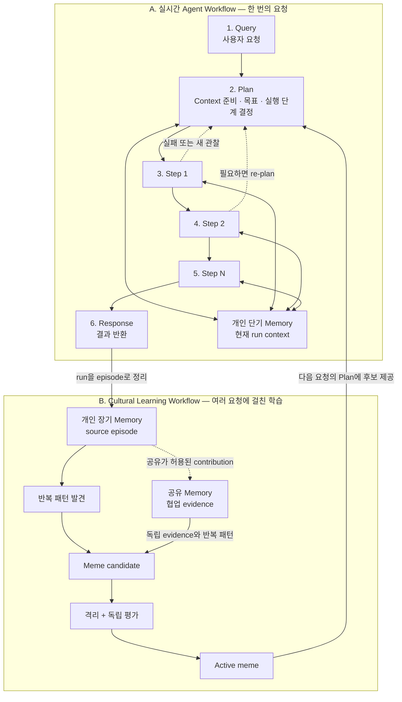
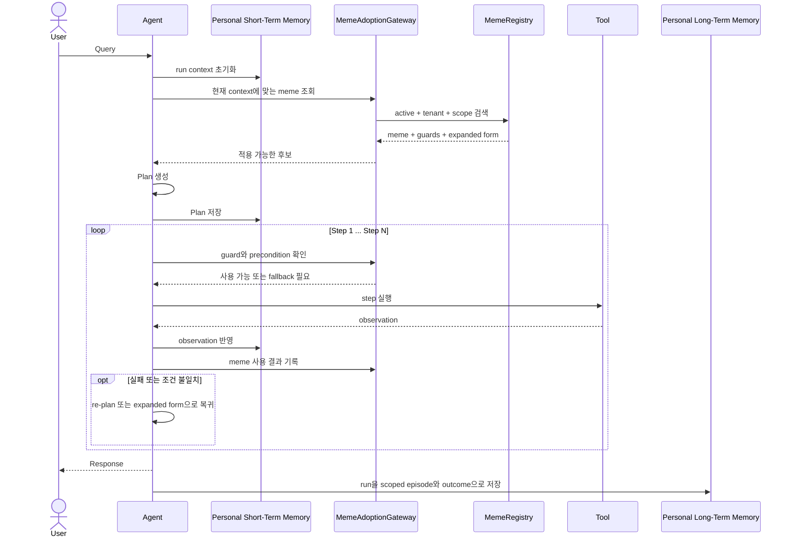
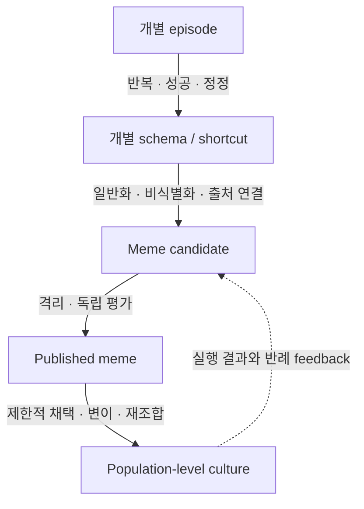
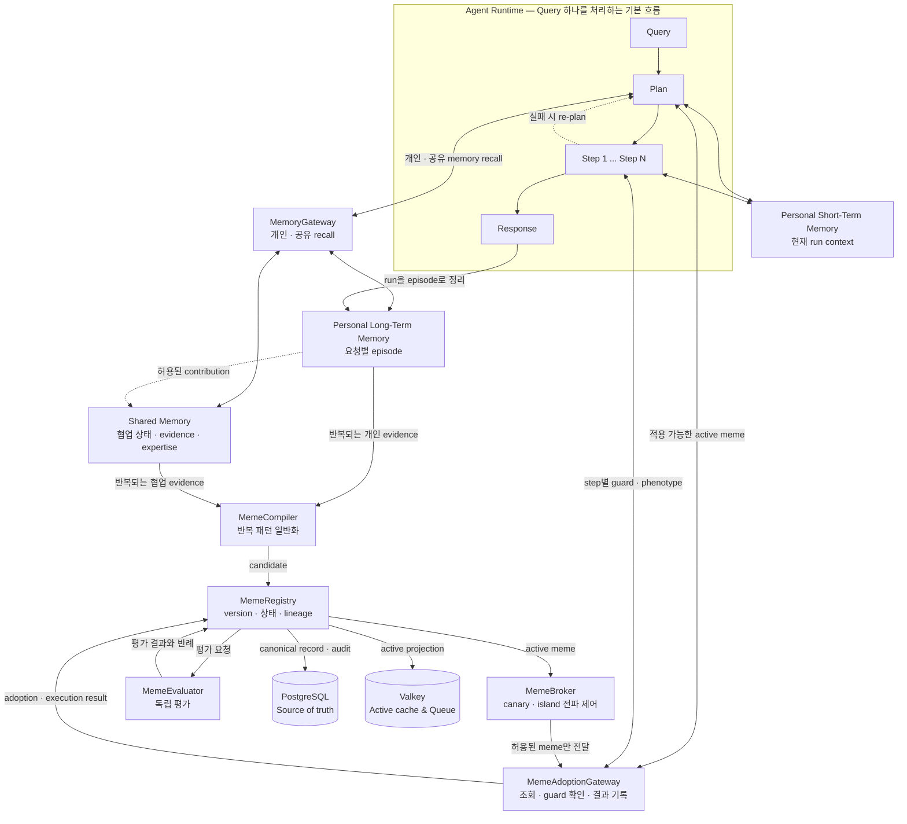
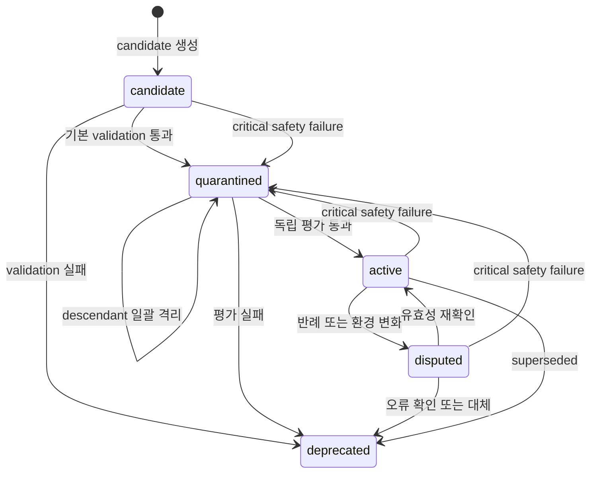
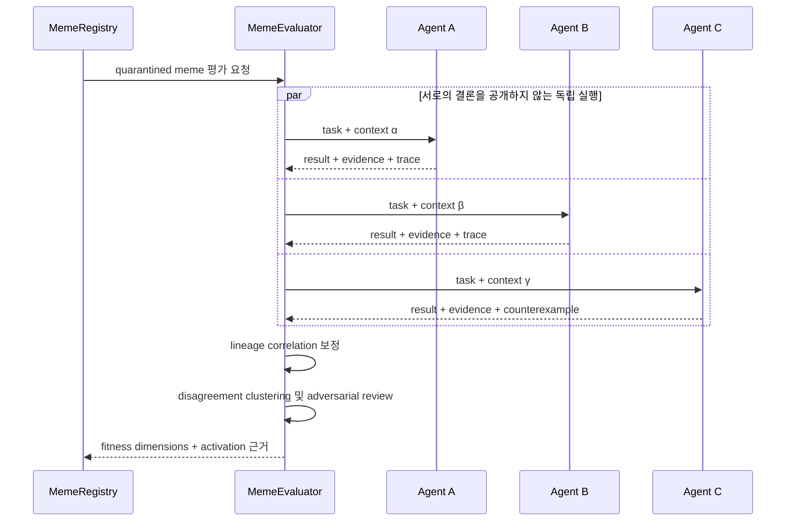
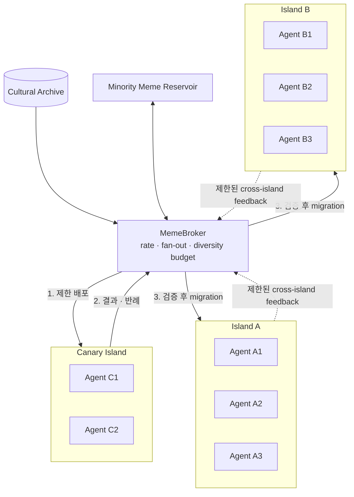
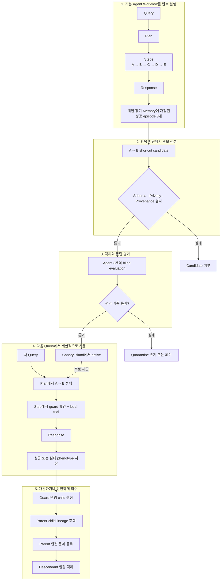

# Cultural Memory & Hivemind — 이해하기 쉬운 구현 계획

## 1. 문서 목적

이 문서는 여러 AI agent가 각자의 독립성을 유지하면서, 검증된 지식과 문제 해결 방식을 안전하게 공유하는 **cultural memory 시스템**의 구현 기준을 정의한다.

이 프로젝트에서 공유하는 것은 agent의 원문 memory나 하나의 중앙집중식 기억 저장소가 아니다. 공유 가능한 형태로 일반화되고, 출처와 검증 이력을 가진 **meme package**다.

쉽게 말하면 다음과 같다.

- **개인 단기 memory**는 한 번의 `Query → Plan → Steps → Response` 동안 사용하는 제한된 작업 공간이다.
- **개인 장기 memory**는 session을 넘어 보존되는 개인 작업 노트로, episode·선호·성공·실패·정정을 기억한다.
- **공유 memory**는 team 또는 tenant 안에서 협동에 필요한 작업 상태·evidence·역할 정보를 연결한다.
- **meme**은 여러 번 효과가 확인된 재사용 가능한 작업 요령 또는 playbook이다.
- **cultural memory**는 검증된 meme과 그 version·lineage·실패 이력을 관리하는 문화적 도서관이다.
- **hivemind**는 모든 agent가 같은 생각을 하는 상태가 아니라, 서로 다른 agent가 playbook을 시험하고 개선하는 전체 생태계다.

---

## 2. 핵심 개념

| 개념 | 정의 |
| --- | --- |
| Personal short-term memory | 현재 agent run의 Query context, Plan, 최근 observation을 제한적으로 유지하는 작업 공간 |
| Personal long-term memory | agent/user scope에서 episode와 개인 schema를 session 너머로 보존하는 기억 |
| Shared memory | team/tenant/island가 협동하기 위해 작업 상태, evidence, expertise를 제한적으로 공유하는 기억 |
| Meme | agent 사이에서 복제·실행·검증·변형될 수 있는 문화적 지식 단위 |
| Cultural memory | 검증된 meme package와 provenance, version, lineage, 평가 이력을 관리하는 계층 |
| Memetic network | meme이 제한적으로 전파되는 agent population과 연결 구조 |
| Collective intelligence | 독립적인 agent들의 관찰과 판단을 결합해 더 나은 결정을 만드는 과정 |
| Hivemind | meme, network, collective intelligence가 지속적으로 feedback을 교환하며 만드는 emergent behavior |

### 설계 원칙

1. 개인 단기·장기 memory는 자동으로 공유 memory나 cultural memory가 되지 않는다.
2. 공유보다 독립적인 판단과 다양성 보존을 우선한다.
3. 모든 meme은 출처, 적용 조건, 검증 방법, 실패 기록을 가져야 한다.
4. 인기나 단순 다수결을 진실의 기준으로 사용하지 않는다.
5. mutation은 기존 버전을 덮어쓰지 않고 새로운 lineage를 만든다.
6. PostgreSQL을 source of truth로 사용한다.
7. 잘못된 meme은 descendant까지 추적하고 격리할 수 있어야 한다.

---

## 3. 먼저 이해할 전체 그림

Cultural memory는 일반적인 agent workflow를 대체하지 않는다. Agent는 여전히 하나의 요청을 `Query → Plan → Steps → Response` 순서로 처리한다.

이 프로젝트는 여기에 두 가지 연결점만 추가한다.

1. **실행 전:** 검증된 active meme 중 현재 query에 맞는 것을 Plan과 Step에 참고한다.
2. **실행 후:** run의 결과를 개인 단기 memory에서 개인 장기 episode로 정리하고, 반복해서 확인된 패턴만 별도의 검증을 거쳐 공유한다.

즉, 시스템에는 속도가 다른 두 개의 loop가 있다.

- **실시간 실행 loop:** 사용자의 한 요청에 응답한다.
- **느린 문화 학습 loop:** 여러 실행에서 검증된 패턴만 공유 지식으로 승격한다.



### 한 요청 안에서 cultural memory가 개입하는 위치

| Agent 단계 | Agent가 하는 일 | Cultural memory의 역할 |
| --- | --- | --- |
| Query | 요청과 현재 context를 파악한다. | tenant와 scope에 맞는 active meme 후보를 찾는다. |
| Plan | 목표를 작은 step으로 나눈다. | 적용 조건이 맞는 meme을 계획 후보로 제공한다. |
| Step | tool 호출이나 판단을 실행한다. | guard를 다시 확인하고, 필요하면 expanded form으로 실행한다. |
| Re-plan | 실패나 새로운 관찰을 반영한다. | 실패 경계를 기록하고 다른 meme 또는 원래 경로로 되돌아간다. |
| Response | 사용자에게 결과를 반환한다. | 응답 생성에는 직접 개입하지 않고, 사용한 meme과 결과를 연결한다. |
| After Response | 단기 memory의 실행 결과를 정리한다. | 개인 장기 episode로 저장하며, 안전하게 일반화된 정보만 승격 후보가 된다. |

### 예시: `A → B → C → D → E`를 줄이는 shortcut

Agent가 평소 `A → B → C → D → E` 순서로 처리하던 작업을 여러 번 성공했다고 가정한다.

1. 개인 장기 memory에 쌓인 episode에서 반복되는 경로를 발견한다.
2. `A ⇒ E`라는 shortcut candidate를 만들되, 원래 경로와 적용 조건을 함께 보존한다.
3. 다른 agent들이 shortcut을 독립적으로 시험한다.
4. 검증을 통과하면 active meme이 된다.
5. 이후 agent는 Plan 단계에서 `A ⇒ E`를 고려한다.
6. guard가 맞지 않거나 실행이 실패하면 원래 `A → B → C → D → E` 경로로 되돌아간다.



여기서 `Plan`은 실행 가능한 구조화 계획과 step 기록을 뜻한다. 모델의 비공개 chain-of-thought를 저장하거나 공유한다는 의미가 아니다.

---

## 4. 해결하려는 문제

개별 agent는 반복 작업을 통해 유용한 shortcut이나 schema를 학습할 수 있지만, 이를 그대로 공유하면 다음 문제가 발생한다.

- 대화 원문, 사용자 정보, secret이 다른 agent에게 유출될 수 있다.
- 한 agent의 우연한 성공이 일반적인 지식으로 오인될 수 있다.
- 잘못된 지식이나 prompt injection이 population 전체로 전파될 수 있다.
- 모든 agent가 같은 결론에 빠르게 수렴해 집단 오류를 만들 수 있다.
- 변형된 지식의 출처와 실패 원인을 추적하기 어렵다.

따라서 개인의 경험을 바로 공유하는 대신 아래 승격 과정을 둔다.



---

## 5. MVP 범위

### 포함

- 하나의 tenant 안에 격리된 3~5개 agent island
- 출처가 있고 원래 실행 경로로 복원 가능한 shortcut meme 한 종류
- `candidate → quarantined → active` lifecycle
- 서로 다른 agent를 이용한 독립 평가
- guard 또는 parameter만 변경하는 제한적 mutation
- PostgreSQL 기반 meme registry와 lineage 저장
- Valkey 기반 active meme cache와 평가 queue
- meme 채택, 실행 결과, 실패, 격리 이력 기록
- accuracy, cost, generalization, diversity collapse 측정

### 제외

- tenant 간 또는 global meme 공유
- 자유형 synthetic memory 생성
- raw prompt나 외부 instruction 공유
- 완전 자동 capability escalation
- 임의 코드 실행형 meme
- 복잡한 meme recombination
- Memgraph를 필수 운영 저장소로 사용하는 것
- 하나의 global fitness score로 자동 순위화하는 것

---

## 6. 성공 기준

MVP는 아래 조건을 모두 만족할 때 성공으로 본다.

- population 성능이 개별 최고 agent보다 높다.
- 새로운 context에서 shortcut 실패율이 사전에 정한 허용 범위 안에 있다.
- minority strategy가 제거되지 않고 일정 비율 유지된다.
- 잘못된 meme을 빠르게 격리하고 모든 descendant를 추적할 수 있다.
- 개인 대화 원문, 사용자 식별 정보, secret이 cultural memory로 유출되지 않는다.
- active meme을 expanded form과 source memory까지 역추적할 수 있다.
- 동일 lineage에서 파생된 결과를 독립 증거로 중복 계산하지 않는다.

구체적인 임곗값은 첫 benchmark dataset을 정한 뒤 별도 설정으로 관리한다.

---

## 7. 시스템 경계

### Personal Short-Term Memory Layer

- 한 번의 agent run 안에서 Query context, Plan, 최근 observation, 임시 결과를 유지한다.
- context budget과 수명 정책에 따라 요약하거나 폐기한다.
- Response 이후 필요한 실행 결과만 장기 episode로 정리한다.
- 비공개 chain-of-thought가 아니라 구조화된 Plan, tool trace, outcome만 다룬다.

### Personal Long-Term Memory Layer

- agent/user scope의 episode, 선호, 성공·실패·정정을 session 너머로 저장하고 회상한다.
- 개인 schema나 shortcut 후보를 발견할 수 있지만 공유 여부를 직접 결정하지 않는다.
- 원문 memory를 shared 또는 cultural layer에 직접 publish하지 않는다.

### Shared Memory Layer

- team/tenant/island scope의 협업 상태, evidence, decision, expertise map을 관리한다.
- 개인 장기 memory에서 permission과 privacy 검사를 통과한 contribution만 받는다.
- agent들의 독립 proposal과 disagreement를 보존한다.
- 반복되고 일반화 가능한 협업 패턴을 meme candidate의 evidence로 제공할 수 있다.

### Cultural Memory Layer

- 공유가 허용된 일반화된 meme만 관리한다.
- provenance, version, lineage, evaluation, adoption을 영속화한다.
- meme의 안전한 전파와 회수를 담당한다.

### Agent Runtime

- meme을 무조건 신뢰하거나 복사하지 않는다.
- 현재 context에서 precondition을 확인한다.
- local trial을 거친 뒤 채택한다.
- 실행 결과와 실패 trace를 cultural layer에 반환한다.

---

## 8. 주요 컴포넌트



### `WorkingMemory`

- 하나의 run에만 존재하는 제한된 단기 context를 관리한다.
- Plan, 최근 observation, 중간 결과를 유지하고 Response 이후 정리하거나 폐기한다.

### `PersonalMemoryStore`

- agent/user scope의 장기 episode와 개인 schema를 보존하고 검색한다.
- 원본의 privacy, retention, provenance를 책임진다.

### `SharedMemoryHub`

- team/tenant/island가 협동하는 데 필요한 상태, evidence, decision, expertise를 연결한다.
- 독립 proposal과 disagreement를 보존하고 cultural candidate에 근거를 제공한다.

### `MemoryGateway`

- 개인 장기 memory와 공유 memory를 scope, permission, relevance 기준으로 조회한다.
- 개인 원문이 더 넓은 계층으로 자동 이동하지 않도록 경계를 강제한다.

### `MemeCompiler`

- 반복되는 episode에서 schema 또는 shortcut 후보를 찾는다.
- 개인 식별자, 대화 원문, secret을 제거한다.
- genotype과 expanded form을 생성한다.
- source memory, precondition, contraindication, test를 연결한다.
- candidate 생성 전 privacy/safety 검사를 수행한다.

### `MemeRegistry`

- meme의 canonical record와 version을 관리한다.
- lifecycle 상태 전이를 검증한다.
- parent/child lineage를 보존한다.
- descendant quarantine과 deprecation을 처리한다.
- 모든 변경을 audit event로 기록한다.

### `MemeEvaluator`

- 서로 다른 agent와 seed/context에 평가 작업을 분배한다.
- 평가 전에 다른 agent의 결론을 노출하지 않는다.
- 성공뿐 아니라 반례와 failure boundary를 수집한다.
- 여러 fitness dimension을 계산한다.
- activation 여부를 결정할 근거를 생성하되, registry 상태를 직접 우회 변경하지 않는다.

### `MemeBroker`

- meme의 migration, fan-out, propagation rate를 제한한다.
- canary island에 먼저 배포한다.
- minority meme reservoir와 diversity budget을 관리한다.
- island별 niche에 맞는 meme만 전달한다.

### `MemeAdoptionGateway`

- agent가 cultural memory에 접근하는 유일한 경로다.
- tenant, scope, capability 권한을 확인한다.
- Query/Context 단계에서 적용 가능한 active meme 후보를 반환한다.
- Plan 단계에서 precondition을 현재 context와 대조한다.
- 각 Step 직전에 guard를 다시 확인하고 local trial과 rollback을 지원한다.
- Step과 Response가 끝난 뒤 adoption과 execution phenotype을 기록한다.

### Agent Workflow 연동 계약

Cultural memory는 agent의 내부 구현 전체를 알 필요가 없다. 다음의 최소 event만 받으면 된다.

| Event | 발생 시점 | 필요한 정보 |
| --- | --- | --- |
| `MemeRecommended` | Context/Plan 준비 | `run_id`, 후보 meme/version, 적용 근거 |
| `MemeTrialStarted` | Step 실행 직전 | `step_id`, 검사한 guard, fallback 경로 |
| `MemeTrialCompleted` | Step 실행 직후 | 성공/실패, observation 요약, 비용, failure type |
| `AgentRunCompleted` | Response 이후 | outcome, 사용한 meme 목록, 개인 장기 memory reference |

원본 Query, 전체 대화, 비공개 reasoning은 이 event에 넣지 않는다. 필요한 경우 비식별 context tag와 personal long-term memory reference만 전달한다.

---

## 9. Meme 데이터 모델

```python
Meme(
    meme_id="meme:uuid",
    lineage_id="lineage:uuid",
    parent_ids=["meme:uuid"],
    tenant_id="tenant:uuid",
    kind="claim|schema|skill|heuristic|norm|question",
    genotype={...},
    expanded_form={...},
    preconditions=[...],
    contraindications=[...],
    source_memory_ids=[...],
    scope="team|tenant|global",
    status="candidate|quarantined|active|disputed|deprecated",
    fitness={...},
    version=1,
)
```

Agent workflow에서 meme이 실제로 어떻게 쓰였는지는 별도 execution record로 저장한다.

```python
MemeExecution(
    execution_id="execution:uuid",
    run_id="run:uuid",          # Query부터 Response까지 한 번의 실행
    step_id="step:uuid",        # Plan에 포함된 특정 Step
    agent_id="agent:uuid",
    meme_id="meme:uuid",
    meme_version=1,
    context_tags=[...],          # 비식별화된 적용 context
    guard_results=[...],
    outcome="success|failure|partial|aborted",
    failure_type=None,
    cost={...},
    source_memory_id="memory:uuid",
)
```

### 필드 의미

- **genotype:** agent 사이에 전파되는 압축 표현
- **expanded_form:** 원래 실행 경로, 근거, 검증 방법, rollback 방법
- **phenotype:** 특정 agent의 특정 Step에서 나타난 결과와 trace. Meme 본체가 아니라 `MemeExecution`으로 저장한다.
- **lineage:** 복제, mutation, recombination의 계보
- **preconditions:** 적용 가능한 조건
- **contraindications:** 적용하면 안 되는 조건과 알려진 failure boundary
- **fitness:** 단일 점수가 아닌 dimension별 평가 결과 요약

### 필수 불변 조건

- 모든 meme은 최소 하나의 source memory 또는 승인된 외부 source를 가진다.
- `active` meme은 실행 가능한 test와 독립 평가 결과를 가져야 한다.
- child meme은 parent를 수정하지 않는다.
- `tenant` scope 데이터는 다른 tenant에서 조회하거나 평가할 수 없다.
- genotype에는 raw prompt, secret, 사용자 원문을 저장할 수 없다.
- expanded form만으로 원래 reasoning을 재현하거나 검증할 수 있어야 한다.

---

## 10. Lifecycle과 상태 전이



### 상태별 규칙

| 상태 | 의미 | 전파 가능 여부 |
| --- | --- | --- |
| `candidate` | 생성 직후, 기본 검증 전 | 불가 |
| `quarantined` | 격리 평가 중 또는 안전 문제로 회수됨 | 평가 환경에서만 가능 |
| `active` | 제한된 scope에서 채택 가능 | 정책 범위 내 가능 |
| `disputed` | 상충되는 평가나 환경 변화가 발견됨 | 신규 채택 중지 또는 제한 |
| `deprecated` | 대체되었거나 더 이상 유효하지 않음 | 불가, audit 조회만 가능 |

상태 전이는 명시적인 reason, actor, timestamp, 관련 evaluation ID를 audit log에 남긴다.

---

## 11. 평가와 선택

### 독립 평가 절차

1. 평가 대상과 benchmark context를 결정한다.
2. 서로 다른 agent에 동일하거나 비교 가능한 task를 비공개로 배정한다.
3. 각 agent는 다른 agent의 결론 없이 실행한다.
4. 결과, evidence, trace, cost, 반례를 제출한다.
5. 동일 lineage에서 파생된 결과의 상관관계를 보정한다.
6. disagreement를 cluster하고 adversarial review를 수행한다.
7. activation 또는 추가 격리 근거를 registry에 제출한다.



### Fitness dimensions

- accuracy
- reproducibility
- generalization
- calibration
- latency
- token/tool cost
- safety
- source diversity
- context diversity
- novelty
- failure recoverability

모든 값을 하나의 global score로 합치지 않는다. task niche별로 threshold와 Pareto frontier를 유지한다.

---

## 12. 전파와 다양성 보존

완전 연결형 network 대신 island 구조를 사용한다.



- island마다 model, prompt, tool set, retrieval strategy 중 일부를 다르게 유지한다.
- 최초 판단은 island 내부에서도 독립적으로 생성한다.
- 새 meme은 canary island에서 먼저 실행한다.
- migration 비율과 fan-out을 제한한다.
- minority meme을 reservoir에 보존한다.
- consensus보다 disagreement map을 먼저 만든다.
- 특정 meme 또는 lineage가 population을 독점하지 않도록 diversity budget을 적용한다.

---

## 13. 저장소 설계

### PostgreSQL — source of truth

초기 테이블 후보:

| 테이블 | 역할 |
| --- | --- |
| `memes` | meme canonical identity와 현재 상태 |
| `meme_versions` | immutable genotype, expanded form, guards |
| `meme_parents` | parent-child lineage edge |
| `meme_sources` | source memory/provenance 연결 |
| `meme_evaluations` | agent/context별 독립 평가 결과 |
| `meme_executions` | phenotype, trace, 성공/실패, 비용 |
| `meme_adoptions` | agent/island의 채택과 회수 이력 |
| `meme_status_events` | 상태 전이와 audit log |
| `islands` | agent island와 정책 |
| `propagation_events` | 배포, migration, 차단 이력 |

JSON 구조는 초기 탐색 속도를 위해 `JSONB`로 시작하되, tenant/scope/status/lineage와 조회 빈도가 높은 항목은 정규 column과 index로 둔다.

### Valkey — ephemeral operations

- active meme cache
- evaluation/propagation queue
- rate limit와 fan-out counter
- 짧은 수명의 fitness aggregation
- distributed lock/idempotency key

Valkey 데이터는 PostgreSQL에서 재구성 가능해야 한다.

### Memgraph — 후속 projection

- lineage와 recombination 탐색
- meme-agent-context 관계 분석
- multi-hop influence와 descendant quarantine 대상 탐색

MVP에서는 PostgreSQL recursive CTE로 시작하고, graph query가 병목이 될 때 도입한다.

---

## 14. API 초안

내부 API 또는 application service 기준의 최소 command/query다.

```text
POST   /memes/candidates              candidate 생성
GET    /memes/{meme_id}               meme과 현재 version 조회
GET    /memes/{meme_id}/lineage       parent/descendant 조회
POST   /memes/{meme_id}/quarantine    격리 및 평가 시작
POST   /memes/{meme_id}/evaluations   독립 평가 제출
POST   /memes/{meme_id}/activate      평가 기준 통과 후 활성화
POST   /memes/{meme_id}/dispute       반례 또는 환경 변화 등록
POST   /memes/{meme_id}/deprecate     폐기
POST   /memes/{meme_id}/mutations     child candidate 생성
POST   /adoptions/recommendations      Query/Plan용 active meme 후보 조회
POST   /adoptions/trials               Step 실행 전 local trial 시작
POST   /adoptions/{id}/results         Step 실행 후 phenotype/result 제출
POST   /runs/{run_id}/outcomes         Response 이후 최종 outcome 연결
```

모든 write command에는 `tenant_id`, actor identity, idempotency key, reason을 포함한다. 실제 외부 노출 방식은 application stack을 정한 뒤 REST, RPC 또는 event consumer로 구체화한다.

---

## 15. 보안과 집단사고 방어

### 입력과 package 검증

- schema validation과 provenance를 필수화한다.
- raw prompt, 외부 instruction, secret을 genotype에서 거부한다.
- 개인 식별자와 대화 원문을 publish 전에 제거한다.
- capability가 증가하는 meme은 별도 승인 상태를 요구한다.
- package signature 또는 content hash로 변조를 탐지한다.

### 전파 제어

- propagation rate, fan-out, mutation depth를 제한한다.
- canary 결과가 확인되기 전 broad adoption을 막는다.
- 오류 발견 시 descendant까지 일괄 격리한다.
- popularity를 fitness나 truth의 직접 지표로 사용하지 않는다.
- 동일 lineage를 여러 독립 증거로 계산하지 않는다.

### Tenant 격리

- 모든 canonical record와 event에 `tenant_id`를 둔다.
- repository query에서 tenant filter가 빠질 수 없도록 data access layer를 설계한다.
- cache key와 queue topic에도 tenant namespace를 적용한다.
- source memory 원문은 cultural store에 복제하지 않고 reference 또는 비식별 snapshot만 둔다.

---

## 16. 관찰 가능성과 감사

최소 metrics:

- lifecycle 상태별 meme 수
- candidate에서 active까지 걸린 시간
- 평가 성공률과 agent 간 disagreement rate
- active meme의 context별 성공/실패율
- lineage별 adoption 비율
- meme/island별 propagation fan-out
- rollback과 quarantine 소요 시간
- descendant quarantine 누락 수
- source/context diversity
- population entropy 또는 diversity collapse 지표
- privacy/safety validation 실패 수

모든 lifecycle 변경, 평가, 채택, 실행은 correlation ID로 연결한다. 운영자가 특정 meme의 생성 근거부터 현재 영향 범위까지 한 경로로 감사할 수 있어야 한다.

---

## 17. 구현 단계

### Phase 0 — 프로젝트 기반

- 언어, web framework, persistence library, migration tool 결정
- local PostgreSQL/Valkey 개발 환경 구성
- formatting, lint, test, CI 기본 설정
- module boundary와 dependency rule 정의

### Phase 1 — Registry와 lifecycle

- meme/version/source/lineage schema 구현
- candidate 생성과 validation 구현
- lifecycle state machine 구현
- audit event와 tenant isolation test 작성

### Phase 2 — Quarantine과 독립 평가

- evaluation job 모델과 queue 구현
- evaluator adapter와 blind execution 구현
- multidimensional fitness 저장
- activation policy와 반례 등록 구현

### Phase 3 — Adoption과 phenotype

- adoption gateway 구현
- precondition 검사와 local trial 구현
- execution trace/result 기록
- rollback과 dispute 흐름 구현

### Phase 4 — Island propagation

- island, canary, migration policy 구현
- fan-out/rate/mutation depth 제한
- diversity budget과 minority reservoir 구현
- descendant quarantine 구현

### Phase 5 — Benchmark와 운영 검증

- 하나의 reversible shortcut benchmark 정의
- 3~5개 agent로 반복 실험
- accuracy/cost/generalization/diversity 비교
- threat test와 privacy leakage test
- 운영 dashboard와 audit query 작성

---

## 18. 첫 번째 vertical slice

전체 기능을 한 번에 만들기보다 아래 흐름을 end-to-end로 먼저 완성한다.



이 vertical slice가 동작하면 registry, evaluation, adoption, lineage, safety 회수라는 핵심 위험을 가장 작은 범위에서 검증할 수 있다.

---

## 19. 테스트 전략

### Unit test

- 허용/비허용 lifecycle transition
- child 생성 시 parent immutability
- precondition과 contraindication 판정
- tenant scope 검증
- fitness dimension 계산

### Integration test

- PostgreSQL transaction과 audit event 일관성
- Valkey queue 재시도와 idempotency
- cache 손실 후 PostgreSQL 기반 복구
- descendant lineage 탐색과 일괄 격리

### Security test

- PII/secret이 포함된 candidate 거부
- raw prompt/instruction이 포함된 genotype 거부
- cross-tenant read/write 차단
- capability escalation 승인 우회 차단
- 악성 meme의 fan-out 제한

### Behavioral benchmark

- meme 미사용 baseline
- 검증된 meme 사용 population
- 잘못된 meme 주입 population
- 환경 변화 후 기존 meme 재평가
- minority strategy 유무에 따른 결과 비교

---

## 20. 미결정 사항

구현에 들어가기 전 아래 항목을 결정해야 한다.

- 주 언어와 application framework
- agent runtime 및 model provider 연결 방식
- personal short-term memory의 context interface
- personal long-term memory source의 저장·검색 interface
- shared memory의 contribution·recall interface
- benchmark로 사용할 첫 shortcut과 task domain
- activation/dispute/quarantine threshold
- genotype과 expanded form의 구체적인 JSON Schema
- privacy scanner와 approval 주체
- execution trace의 보존 기간과 삭제 정책
- island 차이를 만들 model/prompt/tool 구성
- MVP에서 사람이 승인할 단계와 자동화할 단계

---

## 21. 당장 시작할 작업

1. 기술 스택과 패키지 구조를 결정한다.
2. `Meme`, `MemeVersion`, `MemeEvaluation`, `MemeExecution` domain model을 정의한다.
3. PostgreSQL migration으로 registry 최소 schema를 만든다.
4. lifecycle state machine과 audit log부터 구현한다.
5. 테스트 fixture로 하나의 `A → B → C → D → E` 경로와 `A ⇒ E` candidate를 만든다.
6. 독립 evaluator 3개를 mock으로 연결해 activation flow를 검증한다.
7. descendant quarantine integration test를 통과시킨다.

이후 실제 agent runtime과 연결한다. 초기 구현의 중심은 “지식을 얼마나 빠르게 퍼뜨리는가”가 아니라, **무엇이 왜 공유되었는지 설명하고 잘못된 공유를 안전하게 되돌릴 수 있는가**다.
