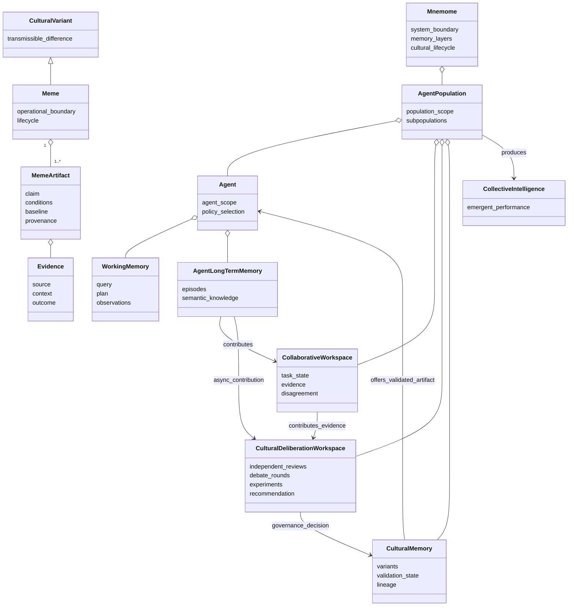
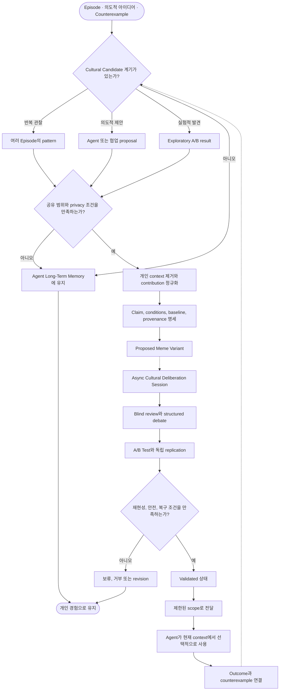

# 01. 개요와 개념 경계

상위 문서: [Cultural Memory & Collective Intelligence](../cultural-memory-hivemind.md)

## 1. 목적

Mnemome은 여러 AI agent가 각자의 경험과 판단을 유지하면서도, 반복적으로 유효성이 확인된 cultural variant를 제한적으로 전달하고 개선할 수 있게 하는 memory architecture 개념이다.

이 설계의 출발점은 “모든 agent가 하나의 memory를 공유하면 더 똑똑해진다”가 아니다. 개인 경험, 협업 근거, population-level cultural knowledge는 소유 범위와 검증 수준이 다르므로 서로 다른 계층과 전이 경계를 가져야 한다.

이 문서는 다음을 상세히 설명한다.

- Mnemome이 해결하는 문제와 해결하지 않는 문제
- 개인 경험이 문화적 지식으로 바뀌기 위한 개념적 경계
- 핵심 객체와 책임의 관계
- 설계 판단에 계속 적용해야 하는 불변조건

---

## 2. 문제 정의

개별 agent는 반복되는 task에서 더 짧은 procedure, 새로운 heuristic, 유용한 tool usage pattern을 발견할 수 있다. 그러나 한 agent의 경험을 즉시 population 전체에 전달하면 다음 위험이 생긴다.

| 위험 | 발생 원인 | 필요한 경계 |
| --- | --- | --- |
| Privacy leakage | 개인 episode와 원문 context가 그대로 전달됨 | Scope 검사와 비식별화 |
| Accidental generalization | 한 번의 성공을 일반 규칙으로 해석함 | 반복 관찰과 독립 검증 |
| Correlated consensus | 같은 source를 본 agent들의 동의를 독립 evidence로 계산함 | Evidence independence 판정 |
| Harmful propagation | 오류나 prompt injection이 빠르게 재사용됨 | 격리, 안전 검사, 회수 |
| Strategy collapse | 인기 있는 하나의 방법으로 조기 수렴함 | Subpopulation과 alternative strategy 보존 |
| Irreversible shortcut | Shortcut 실패 후 원래 절차를 잃음 | Baseline Procedure와 Recovery Policy |
| Lost provenance | 변경 과정에서 원래 근거를 추적할 수 없음 | Lineage와 source 연결 |

Mnemome은 이러한 문제를 하나의 전역 memory가 아니라 **수명이 다른 memory 계층과 검증 가능한 cultural lifecycle**로 다룬다.

---

## 3. 핵심 분석 단위

### 3.1 Agent와 Population

- **Agent:** 자신의 scope, Working Memory, Long-Term Memory와 의사결정 책임을 가진 실행 주체
- **Agent Population:** Cultural Memory를 통해 제한적으로 variant를 교환하는 agent의 집합
- **Agent Subpopulation:** 서로 다른 전략과 evidence source를 일정 기간 유지하는 하위집단

### 3.2 Memory와 Workspace

- **Working Memory:** 현재 task execution을 위한 제한된 작업 기억
- **Agent Long-Term Memory:** Agent 범위의 Episodic Memory와 Semantic Memory
- **Collaborative Workspace:** 현재 협업에 필요한 evidence, decision, disagreement의 조정 공간
- **Cultural Memory:** 검증 가능한 cultural variant의 상태, 근거, lineage와 전달 범위를 관리하는 population-level memory

### 3.3 Cultural object

- **Cultural Variant:** Agent 사이에서 전달될 수 있는 구분 가능한 행동·규칙·procedure의 차이
- **Meme:** 전달, variation, selection의 대상이 되도록 경계가 명시된 cultural variant
- **Meme Artifact:** Meme을 검증하고 재사용할 수 있게 claim, conditions, baseline, provenance로 외재화한 표현
- **Meme Variant:** Parent와 구분되는 revised 또는 recontextualized descendant
- **Meme Lineage:** Parent, descendant, revision, recombination의 관계

---

## 4. 개념 클래스 다이어그램

이 다이어그램은 Cultural Memory가 Agent를 직접 통제하지 않는다는 점을 강조한다. Cultural Memory는 validated artifact를 제안하고, 실제 적용 여부는 현재 context를 가진 Agent가 판단한다.

---

## 5. 정보가 문화적 지식이 되는 절차

### 5.1 활동 다이어그램

### 5.2 단계별 산출물

| 단계 | 입력 | 산출물 | 다음 단계로 넘어가는 조건 |
| --- | --- | --- | --- |
| Episode 정리 | Query, Plan, action, observation | Scoped Episode | Source와 outcome을 추적할 수 있음 |
| Pattern 발견 | 여러 episode | Recurring Pattern | 우연한 한 번의 성공이 아님 |
| 의도적 제안 | Agent 아이디어 또는 협업 disagreement | Cultural Contribution | Claim과 baseline을 검증할 수 있음 |
| Exploratory 실험 | A/B 탐색 결과 | Candidate trigger | 탐색 결과와 confirmatory evidence를 구분함 |
| 일반화 | Pattern과 source context | Generalized Claim | 개인 정보와 불필요한 context 제거 |
| Artifact 명세 | Claim | Proposed Meme Variant | Conditions, baseline, provenance가 있음 |
| 비동기 숙의 | Candidate, blind review, rebuttal | Governance Recommendation | User Response와 분리된 session에서 완료함 |
| 독립 검증 | Candidate와 test cases | Evaluation Evidence | Source와 lineage 독립성을 설명할 수 있음 |
| 검증 승인 | 여러 evaluation | Validated Artifact | 안전 경계와 recovery가 충족됨 |
| 제한적 전달 | Validated Artifact | Local proposal | 현재 Agent가 적용 여부를 결정함 |
| Feedback | Usage outcome | Evidence와 counterexample | 기존 검증을 재평가할 수 있음 |

---

## 6. 설계 불변조건

다음 조건은 이후 구현 방식과 무관하게 유지되어야 한다.

1. Agent Long-Term Memory의 내용은 자동으로 공유되지 않는다.
2. Collaborative Workspace의 합의는 Cultural Memory의 검증 승인을 대체하지 않는다.
3. 동일 source나 lineage에서 나온 판단은 독립 evidence로 중복 계산하지 않는다.
4. Artifact는 적용 조건, 실패 경계, Baseline Procedure와 provenance를 가져야 한다.
5. 검증된 artifact도 Agent의 현재 policy selection을 강제하지 않는다.
6. Revision은 parent를 덮어쓰지 않고 descendant와 lineage를 만든다.
7. Popularity와 사용률은 correctness의 대리값이 아니다.
8. 안전 경계는 효율이나 정확성의 개선으로 상쇄하지 않는다.
9. 실패 시 baseline으로 복귀할 수 있어야 한다.
10. 잘못된 artifact는 descendant와 영향을 함께 추적하고 회수할 수 있어야 한다.
11. 토론과 실험은 User Response 이후 별도의 Cultural Learning Plane에서 진행한다.

---

## 7. 현재 범위

### 포함

- 하나의 분리된 Agent Population
- 여러 Agent Subpopulation
- Baseline Procedure를 가진 shortcut 한 종류
- Proposed, Under Validation, Validated 중심의 최소 lifecycle
- 독립 evidence와 correlated evidence의 구분
- 제한적인 revision과 withdrawal
- Accuracy, Efficiency, Generalization, Safety, Recoverability, Explainability, Strategy Diversity 평가

### 제외

- 신뢰 경계가 다른 population 사이의 무제한 공유
- 원문 대화와 외부 instruction의 직접 전파
- Artifact가 새로운 권한을 부여하는 기능
- 복잡한 recombination의 자동 승인
- 단일 fitness score에 따른 자동 순위화
- 저장소, cache, queue, API 같은 구현 선택

---

## 8. 완료 판단

이 개요가 충분히 구체화되었다고 판단하려면 다음 질문에 모순 없이 답할 수 있어야 한다.

- 어떤 정보가 어느 memory 계층에 속하는가?
- 어떤 조건에서 Knowledge Artifact가 Meme Artifact 후보가 되는가?
- 합의와 독립 검증을 어떻게 구분하는가?
- 실시간 실행과 문화 학습이 latency를 공유하지 않게 하는가?
- 실패와 반례가 success evidence와 같은 수준으로 보존되는가?
- Agent의 독립성과 population-level 학습이 동시에 유지되는가?
