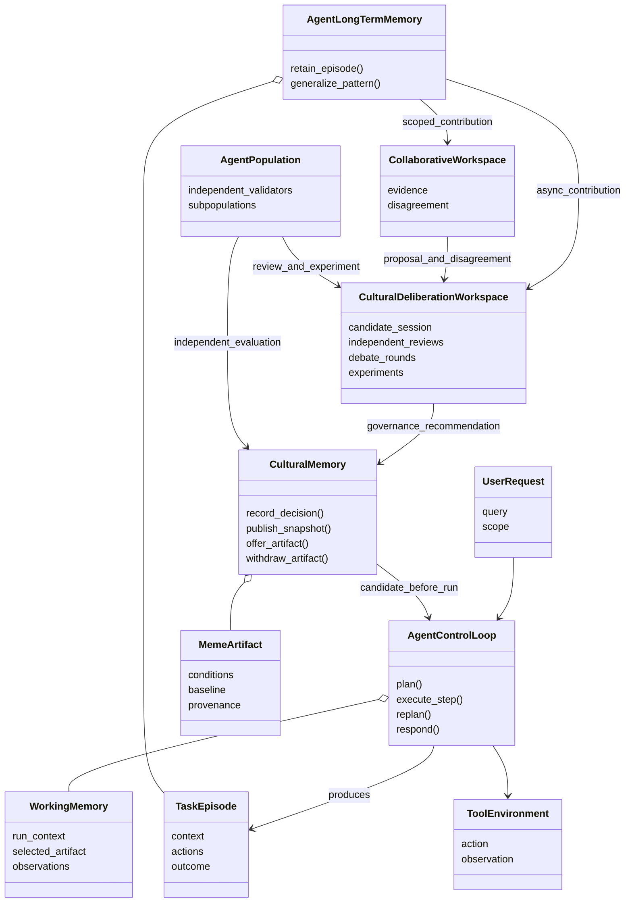
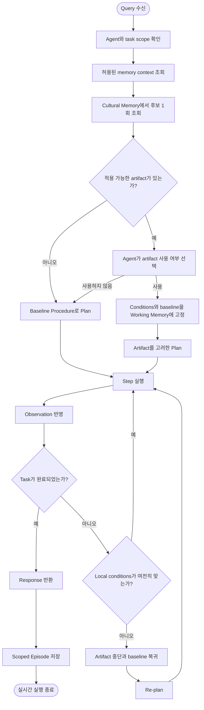
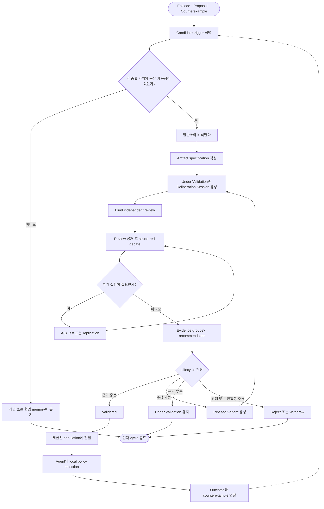

# 02. 전체 시스템과 이중 루프

상위 문서: [Cultural Memory & Collective Intelligence](../cultural-memory-hivemind.md)

## 1. 목적

Mnemome은 속도와 책임이 다른 두 workflow를 분리한다.

- **Online Execution Loop:** 한 번의 Query에 응답하는 실시간 실행
- **Cultural Learning Loop:** 여러 task outcome에서 반복되는 pattern을 독립적으로 검증하고 population에 제한적으로 전달하는 느린 학습

분리의 핵심은 Agent가 Step을 실행할 때마다 Cultural Memory에 접근하지 않도록 하는 것이다. 실행 전에 필요한 artifact와 조건을 Working Memory에 가져오고, loop 안에서는 local condition check만 수행한다.

토론과 A/B Test는 Working Memory나 사용자 요청의 Collaborative Workspace에서 수행하지 않는다. 별도의 **Cultural Deliberation Workspace**가 Cultural Learning Loop 안에서 비동기로 수행한다. 논리 구성요소와 이벤트 계약은 [Cultural Deliberation 시스템 설계](./08-cultural-deliberation-system.md)에서 상세히 설명한다.

---

## 2. 전체 구성요소와 책임

| 구성요소 | 핵심 책임 | 하지 않는 일 |
| --- | --- | --- |
| Agent Control Loop | Query 이해, Plan, action, re-plan, Response | Cultural Memory의 lifecycle 승인 |
| Working Memory | 현재 run context와 선택한 artifact 조건 유지 | Session을 넘는 장기 보존 |
| Tool and Environment | Action 실행과 observation 반환 | Memory 승격 판단 |
| Agent Long-Term Memory | Scoped Episode와 개인 semantic knowledge 보존 | 자동 population 공유 |
| Collaborative Workspace | 협업 상태, evidence, disagreement 연결 | 합의를 진실로 확정 |
| Cultural Deliberation Workspace | 독립 review, 구조화된 토론, 실험과 recommendation | 사용자 Response를 지연하거나 durable truth를 직접 기록 |
| Cultural Memory | Governance decision, variant 상태, lineage, snapshot과 회수 | 토론 실행 또는 Agent의 policy 강제 |
| Agent Population | 독립 평가와 제한적 cultural transmission | 하나의 동일 전략으로 통합 |

---

## 3. 전체 개념 클래스 다이어그램

---

## 4. Online Execution Loop

### 4.1 절차

1. User Query와 execution scope를 확인한다.
2. 관련 Agent Long-Term Memory와 Collaborative Workspace context를 구분해 조회한다.
3. Cultural Memory에서 현재 context에 적용 가능한 validated artifact 후보를 한 번 조회한다.
4. Agent가 applicability, risk, expected benefit를 비교해 사용할 artifact를 선택한다.
5. 선택한 artifact의 conditions, failure boundary, baseline을 Working Memory에 기록한다.
6. Plan을 만들고 Step을 실행한다.
7. 각 observation 뒤에는 Working Memory에 저장된 조건만 다시 확인한다.
8. 조건이 이탈하면 artifact를 중단하고 baseline 또는 새로운 Plan으로 돌아간다.
9. Response 후 task를 Scoped Episode로 정리한다.

### 4.2 활동 다이어그램

### 4.3 Cultural Memory 재접근이 필요한 예외

Step loop 안에서 Cultural Memory 재조회는 기본 경로가 아니다. 다음과 같이 context가 근본적으로 바뀐 경우에만 re-plan의 일부로 허용한다.

- Goal 자체가 변경됨
- Tool capability 또는 permission scope가 변경됨
- 선택한 artifact의 exclusion condition이 발생함
- 기존 후보와 다른 종류의 problem으로 재분류됨
- 안전상 기존 artifact를 더 이상 참조하면 안 됨

단순 observation 갱신이나 같은 Plan 안의 다음 Step 때문에 재조회하지 않는다.

---

## 5. Cultural Learning Loop

### 5.1 절차

1. Task outcome을 source와 scope가 있는 Episode로 보존한다.
2. 반복 Episode, 의도적인 proposal, 협업 disagreement 또는 counterexample에서 Candidate trigger를 만든다.
3. 공유가 허용된 내용만 일반화하고 개인 context를 제거한다.
4. Claim, applicability, exclusion, baseline, recovery, provenance를 명세한다.
5. Proposed Meme Variant를 Under Validation 상태로 격리하고 Deliberation Session을 만든다.
6. Reviewer가 서로의 판단을 보기 전에 independent review를 제출한다.
7. Review 공개 뒤 제한된 debate round에서 반론과 evidence request를 교환한다.
8. 필요한 경우 A/B Test 또는 independent replication을 수행한다.
9. Evaluation Dimensions와 Evidence Group을 정리해 governance recommendation을 만든다.
10. 승인, 제한, 보류, revision, 거부 중 하나를 판단한다.
11. 승인된 artifact를 새 Cultural Snapshot에 반영한다.
12. 실제 사용 결과와 counterexample을 비동기 contribution으로 다시 연결한다.

### 5.2 활동 다이어그램

---

## 6. 두 루프의 연결 계약

| 방향 | 전달 객체 | 동기성 | 제한 |
| --- | --- | --- | --- |
| Cultural Learning → Online Execution | Validated Artifact, conditions, baseline, provenance summary | 실행 준비 시 | Step마다 원격 재조회하지 않음 |
| Online Execution → Agent Long-Term Memory | Scoped Episode, outcome, corrections | Response 이후 | 원문 전체 자동 공유 금지 |
| Agent Long-Term Memory → Cultural Learning | Generalized pattern과 source references | 비실시간 | Privacy와 permission 통과 필요 |
| Online outcome → Cultural Learning | Usage result와 counterexample | 비실시간 | 한 번의 성공으로 승인 상태 변경 금지 |
| Cultural Deliberation → Cultural Memory | Governance decision, evidence groups, unresolved disagreement | 비실시간 | 진행 중인 토론 메시지를 validated knowledge로 저장하지 않음 |

이 계약의 핵심은 **실시간 실행이 문화적 승격을 기다리지 않고, 문화적 검증도 한 task의 latency budget에 종속되지 않는 것**이다.

---

## 7. Re-plan과 Recovery

Recovery는 단순히 artifact를 사용하지 않는 것이 아니라 실행 상태를 안전하게 원래 경로로 되돌리는 절차다.

1. Failure boundary 또는 condition mismatch를 감지한다.
2. Artifact에 의해 추가된 가정과 Step을 식별한다.
3. 더 이상 유효하지 않은 intermediate state를 폐기하거나 격리한다.
4. Baseline Procedure의 마지막 안전 checkpoint로 돌아간다.
5. 새 observation을 반영해 Plan을 다시 만든다.
6. 실패 원인과 recovery outcome을 Episode에 기록한다.
7. Cultural Memory에는 비실시간 feedback으로 전달한다.

---

## 8. 시스템 수준 불변조건

- Online Execution Loop 안의 condition check는 Working Memory에서 수행한다.
- Cultural Memory는 후보를 제공하지만 Plan을 직접 작성하거나 강제하지 않는다.
- Agent의 한 번의 사용 결과가 lifecycle 상태를 직접 바꾸지 않는다.
- Cultural Deliberation은 blind review 이후에만 다른 reviewer의 판단을 공개한다.
- Cultural Learning은 source independence와 lineage correlation을 확인한다.
- 새 decision은 현재 실행 중인 run을 변경하지 않고 다음 Cultural Snapshot부터 반영한다.
- Response 실패와 cultural validation 실패를 같은 상태로 취급하지 않는다.
- 두 루프 모두 provenance와 baseline을 잃지 않는다.
