# 03. 기억 계층 상세

상위 문서: [Cultural Memory & Collective Intelligence](../cultural-memory-hivemind.md)

## 1. 목적

Mnemome은 memory를 저장 위치가 아니라 **수명, 소유 범위, 재사용 목적, 검증 책임**으로 구분한다. 이 문서는 다음 다섯 영역을 상세히 설명한다.

1. Agent Control Loop과 Working Memory
2. Agent Long-Term Memory
3. Collaborative Workspace
4. Cultural Memory
5. 계층 간 전이 경계

상위 계층은 하위 계층보다 무조건 더 정확한 memory가 아니다. 더 넓은 범위에서 재사용되므로 더 많은 일반화, 검증, 책임 추적이 필요한 memory다.

---

## 2. 계층 비교

| 계층 | 소유 범위 | 대표 수명 | 중심 객체 | 기록 기준 | 사용 기준 |
| --- | --- | --- | --- | --- | --- |
| Working Memory | 한 Agent의 한 task execution | 초~분 또는 한 run | Query, Plan, observation, checkpoint | 현재 실행에 필요함 | 같은 run에서 즉시 사용 |
| Agent Long-Term Memory | Agent 또는 user scope | 여러 session | Episode, semantic knowledge, correction | Retention과 scope를 만족함 | 관련성, 최신성, 권한 확인 |
| Collaborative Workspace | Team, tenant 또는 현재 협업 | 협업 기간 | Task state, evidence, proposal, disagreement | 공유 권한과 provenance 확인 | 협업 context로 사용 |
| Cultural Deliberation Workspace | 하나의 Candidate와 review session | 분~일 또는 governance decision까지 | Independent review, argument, experiment, recommendation | Candidate 명세와 참여 조건 충족 | Cultural Learning Plane에서만 사용 |
| Cultural Memory | 허용된 Agent Population | Variant lifecycle | Meme Artifact, evidence, lineage, counterexample | 독립 검증과 안전 경계 | Conditions 확인 후 선택적 사용 |

---

## 3. 전체 개념 클래스 다이어그램

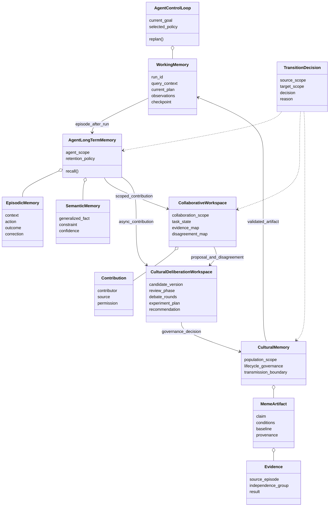

---

## 4. Agent Control Loop과 Working Memory

### 4.1 책임

Working Memory는 현재 task execution에서 Agent가 정보를 유지하고 조작하는 제한된 작업 공간이다.

- Query와 현재 scope 유지
- Plan, current step, pending decision 유지
- 최근 Tool observation과 해석 가능한 결과 유지
- 선택한 Validated Artifact의 conditions와 baseline 유지
- Re-plan을 위한 checkpoint와 failure signal 유지
- Response 이후 Episode로 정리할 외부 검토 가능한 trace 유지

Working Memory는 다음을 하지 않는다.

- Session을 넘어 모든 내용을 자동 보존하지 않는다.
- 비공개 chain-of-thought 수집을 목적으로 하지 않는다.
- Cultural Memory의 최신 상태를 Step마다 조회하지 않는다.
- 한 번의 성공을 semantic 또는 cultural knowledge로 승격하지 않는다.

### 4.2 내부 개념

| 개념 | 내용 |
| --- | --- |
| Run Context | Query, scope, capability, 현재 환경 |
| Plan State | Goal, ordered steps, 현재 위치, dependency |
| Observation Window | 최근 action의 외부 검토 가능한 결과 |
| Selected Artifact | 실행 전에 선택한 validated artifact와 조건 |
| Recovery Checkpoint | Baseline으로 복귀할 수 있는 안전 상태 |
| Outcome Draft | Episode로 정리할 action과 결과 요약 |

### 4.3 활동 다이어그램

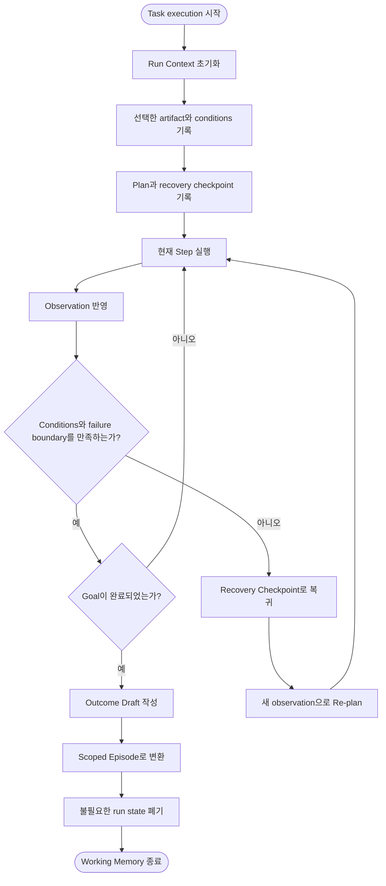

### 4.4 완료 조건

- Response를 만드는 데 필요한 context를 잃지 않았다.
- Artifact 사용 여부와 선택 이유를 설명할 수 있다.
- 실패 시 baseline으로 복귀한 위치를 설명할 수 있다.
- 장기 보존할 Episode와 폐기할 임시 상태가 분리되었다.

---

## 5. Agent Long-Term Memory

### 5.1 책임

Agent Long-Term Memory는 한 Agent 또는 user scope 안에서 session을 넘어 경험과 일반화된 지식을 연결한다.

#### Episodic Memory

- 특정 task의 context, action, observation, outcome
- 성공뿐 아니라 실패, correction, recovery
- Source, timestamp, scope, permission
- 어떤 artifact를 사용했고 결과가 어땠는지

#### Semantic Memory

- 여러 Episode에서 일반화한 사실과 constraint
- Agent 또는 user의 지속적인 preference
- 반복되는 tool behavior와 domain knowledge
- 반례에 의해 수정된 correction

### 5.2 Episode와 Semantic Knowledge의 관계

Episode는 과거에 일어난 사례이고 Semantic Knowledge는 여러 사례에서 추상화된 의미다. Episode 하나를 바로 일반 규칙으로 바꾸지 않는다.

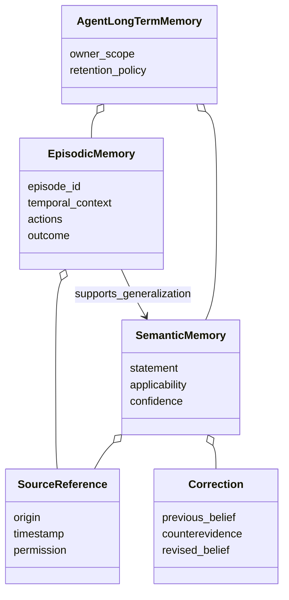

### 5.3 활동 다이어그램

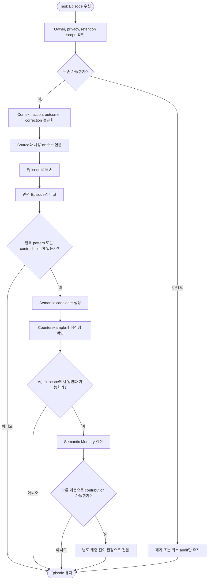

### 5.4 전이 제한

Agent Long-Term Memory의 정보는 다음 경우 공유되지 않는다.

- 특정 사용자나 대화에만 유효함
- 원문에 secret 또는 민감한 정보가 포함됨
- Source와 correction history가 불명확함
- 한 번의 사례뿐이며 일반화 근거가 없음
- 다른 Agent에게 전달할 permission이 없음

---

## 6. Collaborative Workspace

### 6.1 책임

Collaborative Workspace는 여러 Agent가 같은 생각을 갖게 하는 공간이 아니라, 현재 협업에 필요한 상태와 근거를 연결하는 coordination layer다.

- 공동 task state와 dependency
- Agent별 proposal과 근거
- Evidence source와 provenance
- Decision과 decision rationale
- Disagreement와 unresolved issue
- 누가 어떤 전문성 또는 source를 가졌는지에 대한 directory

### 6.2 합의와 독립성

여러 Agent가 합의했더라도 그 합의만으로 Cultural Memory의 검증된 지식으로 승격하지 않는다. Agent들이 같은 source, 실행 결과 또는 Meme Lineage에 의존했다면 이들의 판단은 서로 독립된 evidence가 아니라 하나의 correlated evidence group으로 계산한다.

### 6.3 개념 클래스 다이어그램

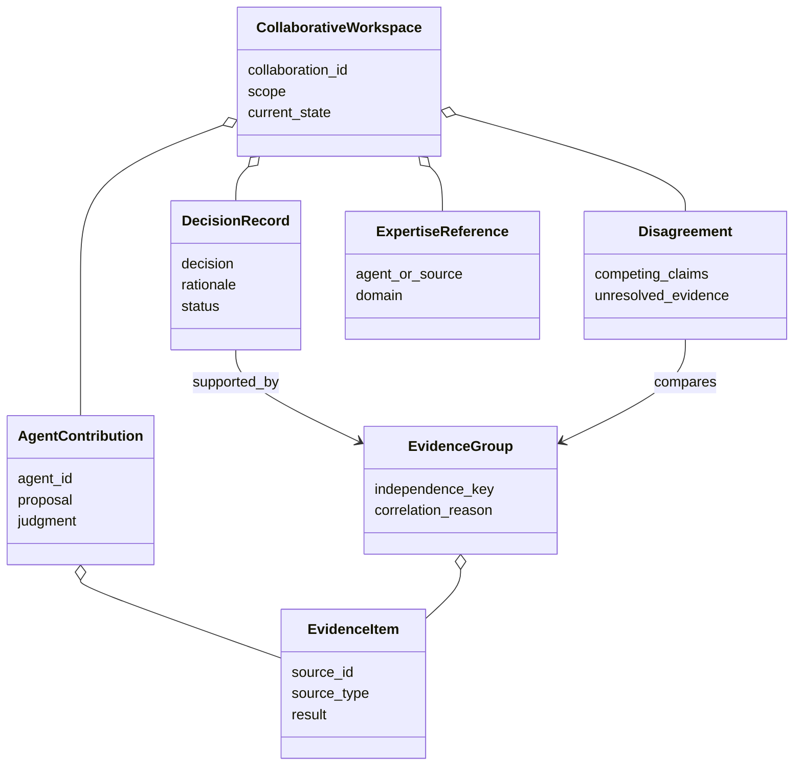

### 6.4 활동 다이어그램

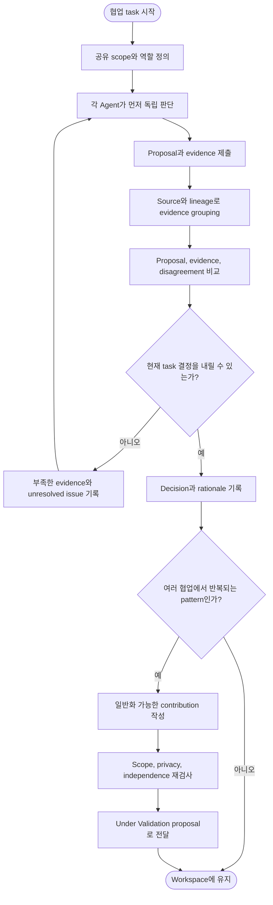

### 6.5 하지 않는 일

- 단순 다수결로 진실을 확정하지 않는다.
- 다른 Agent의 private memory를 복제하지 않는다.
- 같은 source의 반복 인용을 독립 evidence로 계산하지 않는다.
- 현재 task의 임시 결정을 장기 cultural knowledge로 자동 승격하지 않는다.

---

## 7. Cultural Deliberation Workspace

### 7.1 위치와 책임

Cultural Deliberation Workspace는 새로운 장기 memory 계층이 아니다. Cultural Learning Plane에서 Candidate 하나를 평가하기 위해 생성되고 governance decision 이후 닫히는 **비동기 처리 workspace**다.

Working Memory와 분리하는 이유:

- User Response의 latency에 토론 시간을 포함하지 않는다.
- 현재 task의 context와 cultural governance context를 섞지 않는다.
- Reviewer가 충분한 시간과 독립된 context에서 판단할 수 있게 한다.
- A/B Test와 replication이 사용자 요청 수명보다 오래 걸릴 수 있게 한다.

Collaborative Workspace와 분리하는 이유:

- Collaborative Workspace는 현재 사용자 task를 완료하기 위한 협업 공간이다.
- Cultural Deliberation Workspace는 population에 전달할 Candidate의 lifecycle을 판단하기 위한 공간이다.
- 현재 task의 합의와 cultural validation은 서로 다른 종료 조건을 가진다.

### 7.2 개념 클래스 다이어그램

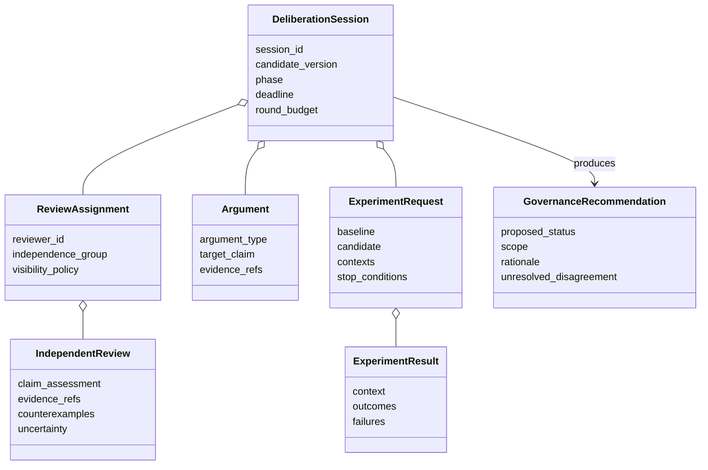

### 7.3 Session phase

| Phase | 허용 활동 | 다른 reviewer 결과 공개 |
| --- | --- | --- |
| Intake | Candidate completeness와 scope 검사 | 해당 없음 |
| Independent Review | 각자 claim, evidence, counterexample 제출 | 공개하지 않음 |
| Review Freeze | 제출 결과와 candidate version 고정 | 아직 공개하지 않음 |
| Structured Debate | Rebuttal, support, evidence request 교환 | 공개함 |
| Experiment | A/B Test와 replication 수행 | 필요한 review context만 공개 |
| Recommendation | Evidence Group과 recommendation 작성 | 최종 비교 가능 |
| Closed | Governance 결과와 archive reference 연결 | 변경 불가 |

Independent Review phase를 먼저 두는 것은 토론 참여자가 다수 의견에 조기 수렴하는 것을 막기 위해서다.

### 7.4 활동 다이어그램

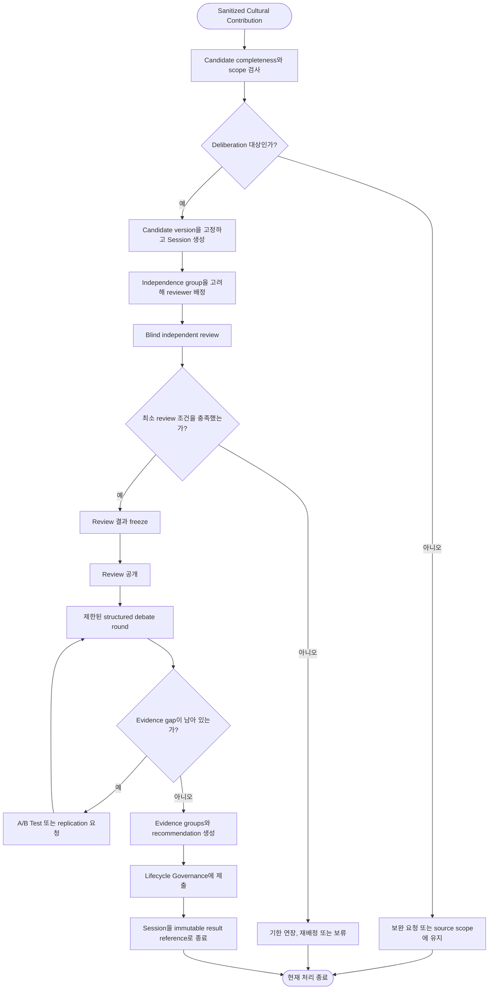

### 7.5 Online Execution과의 경계

- Online Agent는 Deliberation Session을 생성하거나 기다리지 않는다.
- Response 이후 sanitized contribution만 비동기로 제출한다.
- 실행 중에는 pinned Cultural Snapshot과 Working Memory의 conditions만 사용한다.
- 새 governance decision은 다음 snapshot version부터 보인다.
- 긴급 withdrawal은 토론을 동기화하지 않고 별도의 invalidation signal로 처리한다.

논리 컴포넌트, 이벤트, 동시성과 장애 처리는 [Cultural Deliberation 시스템 설계](./08-cultural-deliberation-system.md)에서 다룬다.

---

## 8. Cultural Memory

### 8.1 책임

Cultural Memory는 Deliberation과 Governance가 완료한 결과를 durable하고 versioned한 population memory로 관리한다. 토론을 실행하는 공간이 아니라 decision, evidence reference, lineage와 Online Execution용 snapshot을 보존하는 계층이다.

- Candidate와 immutable version identity
- Governance Decision Record
- Validated Artifact 제공
- Versioned Cultural Snapshot 발행
- Cultural Transmission boundary
- Usage outcome과 counterexample 연결
- Provenance와 Meme Lineage
- Revision, rejection, withdrawal

### 8.2 개념 클래스 다이어그램

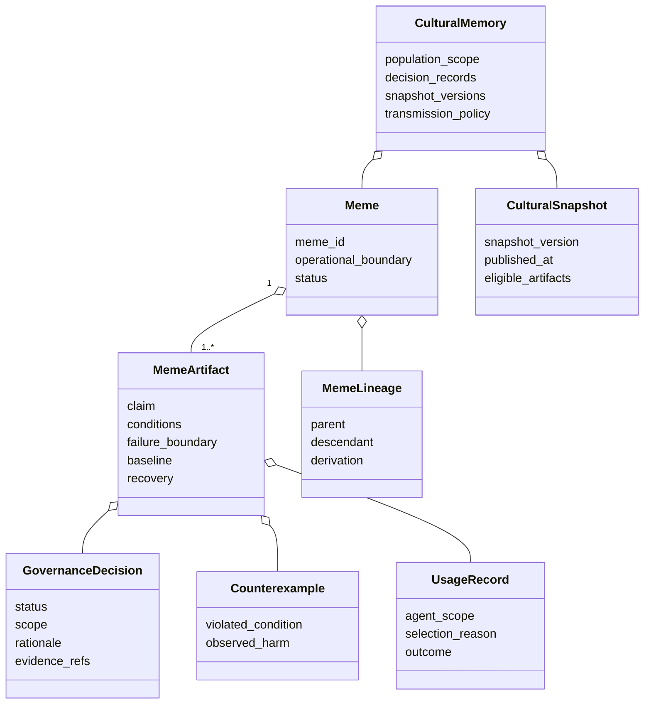

### 8.3 활동 다이어그램

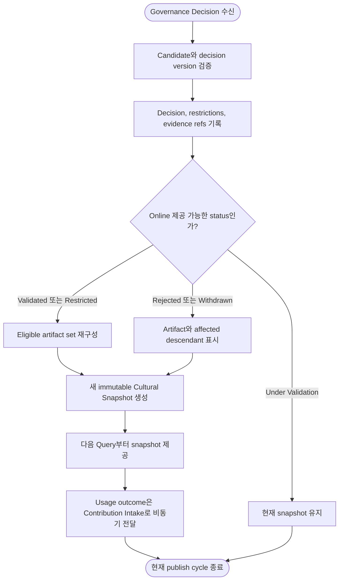

### 8.4 Agent와의 관계

Cultural Memory는 답을 반환하는 reasoning engine이 아니다. 현재 context에 적용 가능한 artifact와 조건을 제공하고, Agent가 이를 local policy proposal로 평가하게 한다.

---

## 9. 계층 전이

### 9.1 전이 계약

| 전이 | 허용되는 내용 | 허용되지 않는 내용 |
| --- | --- | --- |
| Working → Long-Term | Scoped Episode, outcome, correction, source | 임시 scratch state 전체 |
| Long-Term → Workspace | 공유 허용 contribution, evidence reference | Private episode 원문 |
| Long-Term → Deliberation | 일반화된 pattern, 의도적 proposal, conditions, provenance | 원문 private episode, 출처 없는 shortcut |
| Workspace → Deliberation | 반복 협업 pattern, proposal, evidence groups, disagreement | 단순 합의나 다수결 |
| Deliberation → Cultural | Governance decision, evidence references, unresolved disagreement | 진행 중 토론 message, 미완료 review |
| Cultural → Working | Validated Artifact, conditions, failure boundary, baseline | 무조건 실행 명령, 새로운 권한 |

### 9.2 활동 다이어그램

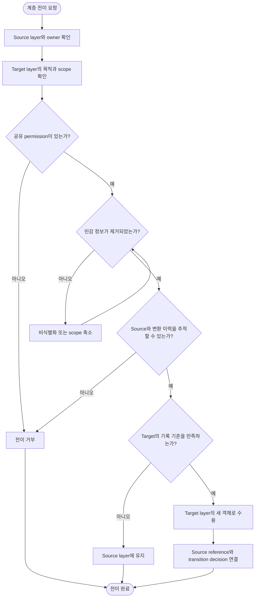

### 9.3 전이의 핵심 원칙

- 전이는 객체의 복사만이 아니라 의미와 책임의 변경이다.
- Source 객체를 삭제하거나 덮어쓰지 않는다.
- Target layer는 source의 검증 상태를 자동 상속하지 않는다.
- Scope가 넓어질수록 더 많은 일반화와 검증을 요구한다.
- Scope가 좁아지더라도 원래 provenance와 restriction을 제거하지 않는다.

---

## 10. 계층 설계 검토 체크리스트

- [ ] 각 정보의 owner와 scope가 명확한가?
- [ ] 현재 task state와 장기 memory가 분리되어 있는가?
- [ ] Episode와 semantic generalization이 구분되는가?
- [ ] Workspace 합의와 independent validation이 구분되는가?
- [ ] Cultural Deliberation이 Online Execution과 분리되어 있는가?
- [ ] Cultural Memory가 Agent의 Plan을 강제하지 않는가?
- [ ] 모든 계층 전이에 provenance가 유지되는가?
- [ ] Target layer가 source의 상태를 자동 상속하지 않는가?
- [ ] 실패와 correction이 성공 기록과 함께 이동하는가?
