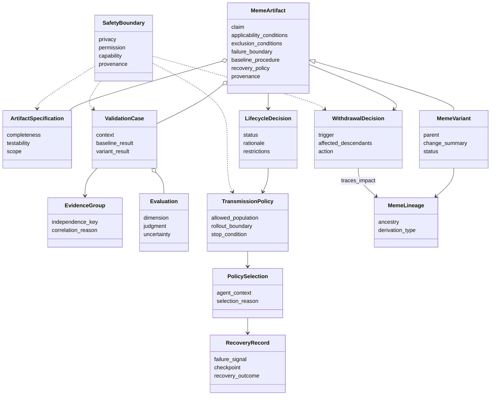
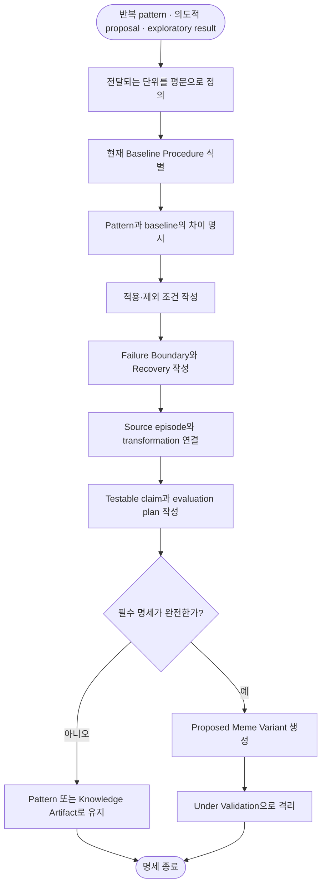
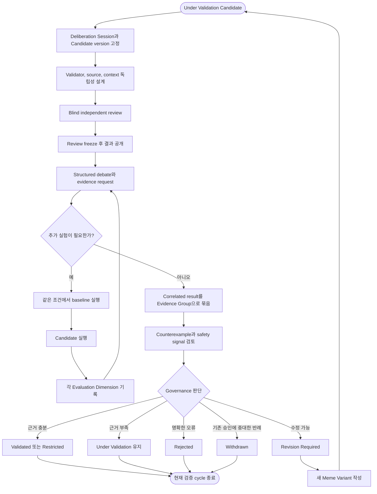
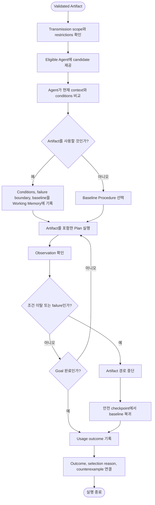
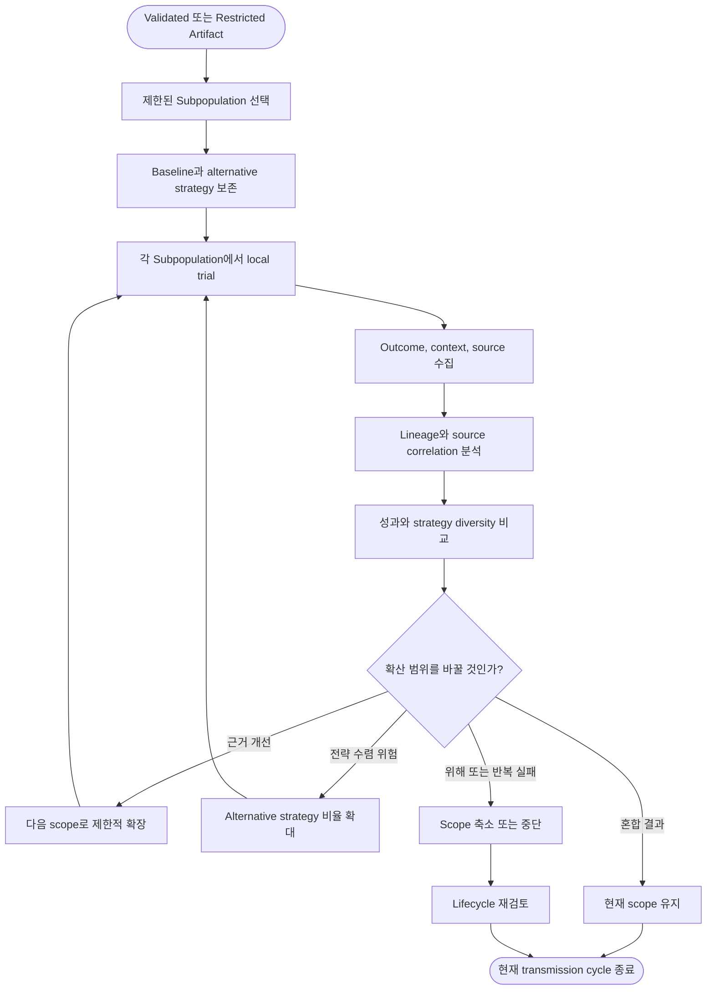
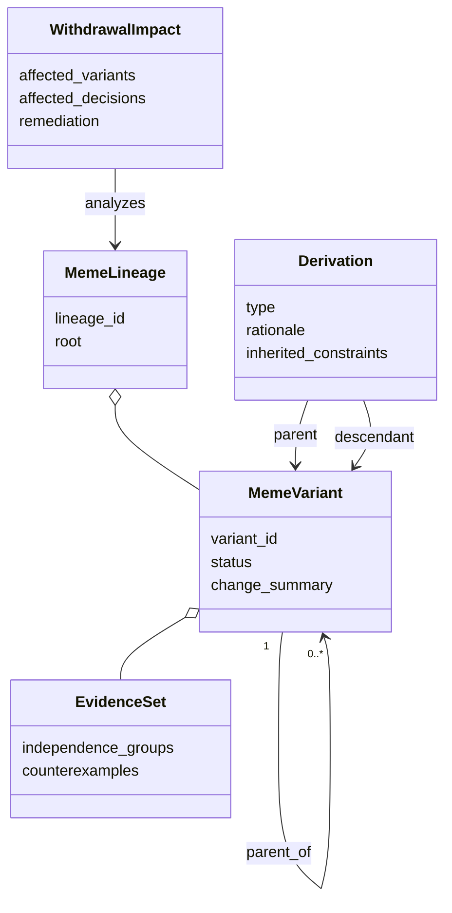
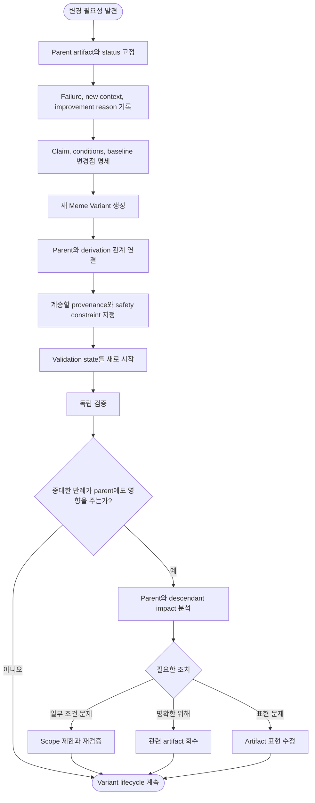
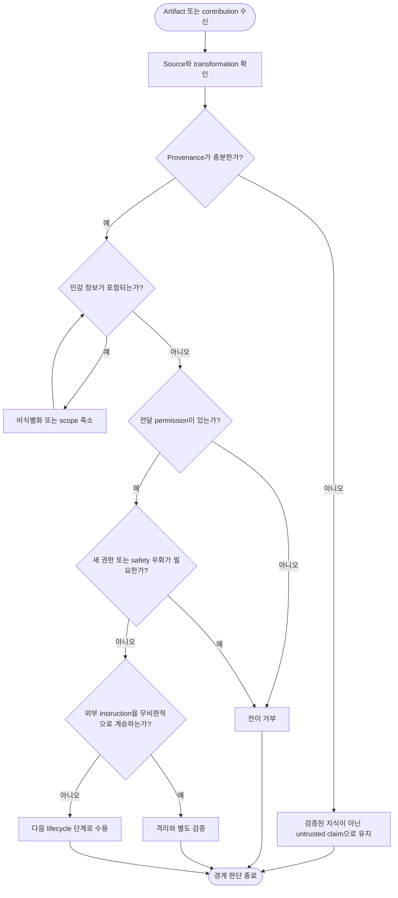
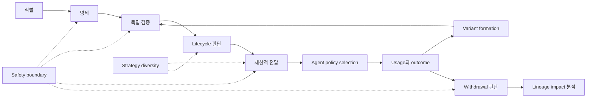

# 04. Cultural Memory 기능 상세

상위 문서: [Cultural Memory & Collective Intelligence](../cultural-memory-hivemind.md)

## 1. 목적

이 문서는 Cultural Memory 계층 안의 여섯 핵심 기능을 상세히 설명한다.

1. Meme Artifact 식별과 명세화
2. 독립 검증과 lifecycle governance
3. Cultural Transmission, policy selection, recovery
4. 통제된 지식 확산과 전략 다양성 보존
5. Variant formation, lineage, withdrawal
6. 안전과 책임 경계

각 기능은 별도 책임을 가지지만 provenance, evidence independence, baseline, scope라는 공통 경계를 공유한다.

---

## 2. 전체 기능 클래스 다이어그램

---

## 3. Meme Artifact 식별과 명세화

### 3.1 식별 기준

모든 Knowledge Artifact가 Meme Artifact는 아니다. 다음 질문에 모두 답할 수 있을 때만 Proposed Meme Variant로 명세한다.

1. 무엇이 다른 Agent에게 전달되는가?
2. Parent 또는 Baseline과 무엇이 다른가?
3. 어느 context에서 유효한가?
4. 어느 context에서는 사용하면 안 되는가?
5. 어떤 observation을 실패로 판단하는가?
6. 실패하면 어떤 procedure로 복귀하는가?
7. 어떤 source episode와 transformation에서 왔는가?
8. 다른 Agent가 같은 기준으로 재현할 수 있는가?

### 3.2 명세 구조

| 필드 | 설명 | 필수 이유 |
| --- | --- | --- |
| Claim | Artifact가 유효하다고 주장하는 내용 | 평가 대상을 고정함 |
| Expanded Form | Shortcut이 압축한 원래 경로 | 의미와 생략된 단계를 설명함 |
| Applicability Conditions | 사용할 수 있는 조건 | 무분별한 일반화를 막음 |
| Exclusion Conditions | 사용하면 안 되는 조건 | 위험한 context를 명시함 |
| Failure Boundary | 실패로 볼 observation | runtime 중 중단 판단을 가능하게 함 |
| Baseline Procedure | Artifact 없이 수행하는 원래 절차 | 비교와 복구 기준을 제공함 |
| Recovery Policy | 실패 후 안전한 복귀 절차 | 비가역적인 shortcut을 막음 |
| Provenance | Source, transformation, authoring context | 책임과 오염 경로를 추적함 |
| Evaluation Plan | 검증할 차원과 test case | popularity 대신 재현 가능한 판단을 만듦 |
| Lineage | Parent, derivation, related variant | 상관 근거와 descendant를 추적함 |

### 3.3 활동 다이어그램

### 3.4 Shortcut 예시

`A → B → C → D → E`를 `A ⇒ E`로 줄이는 shortcut이라면 다음을 명시해야 한다.

- B, C, D를 생략해도 되는 조건
- E가 baseline과 동등한 결과인지 확인하는 관찰
- 생략된 단계가 담당하던 safety check
- Shortcut 실패 시 A 또는 안전 checkpoint에서 baseline으로 돌아가는 절차
- 단축된 step 수 외에 accuracy와 recoverability를 비교할 test

---

## 4. 독립 검증과 Lifecycle Governance

검증과 토론은 Online Execution이 아니라 별도의 Cultural Deliberation Workspace에서 비동기로 수행한다. Reviewer는 blind phase에서 먼저 독립 판단을 제출하고, review freeze 이후에만 서로의 판단을 비교한다. 시스템 컴포넌트와 session protocol은 [Cultural Deliberation 시스템 설계](./08-cultural-deliberation-system.md)를 따른다.

### 4.1 독립성의 단위

Agent 이름이 다르다는 이유만으로 독립 검증이 되지는 않는다. 최소한 다음 상관관계를 확인해야 한다.

- 같은 source episode를 사용했는가?
- 같은 Parent Meme 또는 descendant를 사용했는가?
- 같은 test data 또는 environment를 사용했는가?
- 서로의 결론을 본 뒤 판단했는가?
- 같은 generation process 또는 prompt를 공유했는가?

상관관계가 있으면 결과를 버리지 않고 하나의 Evidence Group으로 묶는다. 독립성은 evidence 개수를 줄이기 위한 벌점이 아니라 확신을 과대평가하지 않기 위한 구조다.

### 4.2 Lifecycle 상태

| 상태 | 의미 | Agent에게 제공 여부 |
| --- | --- | --- |
| Proposed | 명세가 제출되었으나 검토 전 | 제공하지 않음 |
| Under Validation | 격리된 상태에서 평가 중 | 일반 Agent에게 제공하지 않음 |
| Validated | 정의된 scope와 조건 안에서 근거가 충분함 | 조건과 함께 제한 제공 |
| Restricted | 일부 context 또는 subpopulation에만 허용 | 명시된 범위에서만 제공 |
| Revision Required | 문제를 수정한 descendant가 필요함 | 기존 상태에 따라 중단 또는 제한 |
| Rejected | Claim 또는 안전 경계가 부적합함 | 제공하지 않음 |
| Withdrawn | 이전에 제공되었으나 더 이상 사용하면 안 됨 | 신규 사용 중단, 영향 추적 |

### 4.3 활동 다이어그램

### 4.4 판단 원칙

- 하나의 종합 점수만으로 승인하지 않는다.
- Safety와 permission violation은 효율 향상으로 상쇄하지 않는다.
- Generalization evidence가 부족하면 scope를 좁혀 Restricted로 둘 수 있다.
- Negative result와 counterexample을 success evidence와 같은 lineage에 연결한다.
- Parent의 검증 상태를 descendant에 자동 상속하지 않는다.

---

## 5. Cultural Transmission, Policy Selection, Recovery

### 5.1 세 책임의 분리

| 책임 | 주체 | 질문 |
| --- | --- | --- |
| Transmission | Cultural Memory governance | 어느 population과 scope에 artifact를 제공할 수 있는가? |
| Policy Selection | 현재 Agent | 지금 Query와 context에서 사용할 것인가? |
| Recovery | Agent Control Loop | 조건이 깨졌을 때 어떻게 baseline으로 복귀할 것인가? |

Cultural Memory가 Validated로 판단했다고 해서 모든 Agent가 사용해야 하는 것은 아니다. Validation은 정의된 조건 안에서 사용할 자격이고, selection은 현재 context에서의 local decision이다.

### 5.2 활동 다이어그램

### 5.3 Runtime latency 경계

- 후보 retrieval은 실행 준비 시 한 번 수행한다.
- 선택한 artifact의 조건은 Working Memory에 저장한다.
- Step loop에서는 local condition check를 수행한다.
- Usage feedback은 Response 이후 Cultural Learning Loop에 연결한다.
- Goal 또는 capability가 근본적으로 바뀐 re-plan에서만 예외적으로 새 후보를 요청한다.

---

## 6. 통제된 지식 확산과 전략 다양성 보존

### 6.1 목적

검증된 artifact도 population 전체에 즉시 확산하면 conformity bias와 correlated failure가 커질 수 있다. Cultural Transmission은 adoption을 최대화하는 과정이 아니라 **유효성을 재검증하면서 확산 반경을 조절하는 과정**이다.

### 6.2 Subpopulation 설계 원칙

- 서로 다른 strategy와 evidence source를 유지한다.
- 일부 subpopulation은 baseline 또는 alternative variant를 계속 사용한다.
- 같은 lineage의 결과를 여러 subpopulation의 독립 합의로 계산하지 않는다.
- 새 revision은 parent의 popularity를 상속하지 않는다.
- 높은 사용률을 correctness로 해석하지 않는다.

### 6.3 활동 다이어그램

### 6.4 관찰 지표

| 지표 | 해석 |
| --- | --- |
| Independent success rate | 독립 context에서 artifact가 재현되는 정도 |
| Failure concentration | 특정 subpopulation 또는 context에 실패가 몰리는지 |
| Strategy diversity | Alternative strategy가 유지되는지 |
| Recovery success | 실패 후 baseline으로 실제 복귀하는지 |
| Adoption concentration | 특정 source나 lineage에 과도하게 집중되는지 |
| Counterexample coverage | 알려진 실패 경계가 검증 범위에 포함되는지 |

---

## 7. Variant Formation, Lineage, Withdrawal

### 7.1 Variant가 필요한 경우

- Applicability condition을 좁히거나 넓힘
- Failure boundary를 새롭게 발견함
- Baseline Procedure 또는 Recovery Policy를 개선함
- 다른 context에 맞게 재맥락화함
- Parent의 claim 일부를 반례에 맞게 수정함
- 여러 parent의 요소를 recombination함

기존 artifact의 오탈자처럼 의미와 평가 결과에 영향을 주지 않는 수정은 표현 revision으로 처리할 수 있다. Claim, conditions, behavior가 달라지면 새 Meme Variant가 필요하다.

### 7.2 Lineage 관계

### 7.3 활동 다이어그램

### 7.4 Withdrawal 원칙

- Artifact 하나만 숨기고 끝내지 않는다.
- Descendant가 잘못된 claim이나 evidence를 계승했는지 확인한다.
- 해당 artifact를 근거로 내린 lifecycle decision을 재검토한다.
- 이미 실행된 usage record와 outcome은 삭제하지 않고 회수 이유와 연결한다.
- Privacy 삭제 요구와 provenance 보존이 충돌하면 식별 정보를 제거하되 필요한 audit relation을 최소화해 유지한다.

---

## 8. 안전과 책임 경계

### 8.1 경계 종류

| 경계 | 핵심 질문 |
| --- | --- |
| Privacy | 개인 episode나 민감 정보가 population으로 노출되는가? |
| Permission | Source 정보를 다른 scope로 전달할 권한이 있는가? |
| Capability | Artifact가 Agent에게 새로운 권한을 부여하거나 우회하게 하는가? |
| Provenance | Source와 transformation을 추적할 수 있는가? |
| Instruction Integrity | 외부 instruction이 검증 없이 cultural knowledge로 승격되는가? |
| Accountability | 승인, revision, withdrawal의 이유와 책임을 설명할 수 있는가? |

### 8.2 활동 다이어그램

### 8.3 책임 원칙

- Artifact는 기존 Agent와 Tool의 권한 범위를 넓히지 않는다.
- Validation은 permission grant가 아니다.
- 외부 source의 instruction은 evidence일 수 있으나 자동 policy가 아니다.
- Source가 없거나 변환 이력이 끊긴 artifact는 검증된 지식이 아니라 claim으로 취급한다.
- Withdrawal 결정은 이유, 영향 범위, 복구 조치와 함께 기록한다.

---

## 9. 기능 간 통합 절차

어느 한 기능도 단독으로 artifact를 population-level knowledge로 만들 수 없다. 명세, 독립 검증, lifecycle 판단, 안전 경계와 실제 사용 feedback이 연결되어야 한다.

---

## 10. 기능 설계 검토 체크리스트

- [ ] Artifact의 claim과 baseline을 비교할 수 있는가?
- [ ] Conditions, exclusion, failure, recovery가 구분되어 있는가?
- [ ] Evidence의 독립성과 correlation reason을 설명할 수 있는가?
- [ ] Lifecycle 상태마다 Agent 제공 여부가 명확한가?
- [ ] Transmission과 Agent policy selection이 분리되어 있는가?
- [ ] Runtime loop가 Cultural Memory에 Step마다 접근하지 않는가?
- [ ] Subpopulation과 alternative strategy가 유지되는가?
- [ ] Revision이 parent를 덮어쓰지 않는가?
- [ ] Withdrawal이 descendant와 decision impact를 추적하는가?
- [ ] Safety violation이 다른 성과 차원으로 상쇄되지 않는가?
