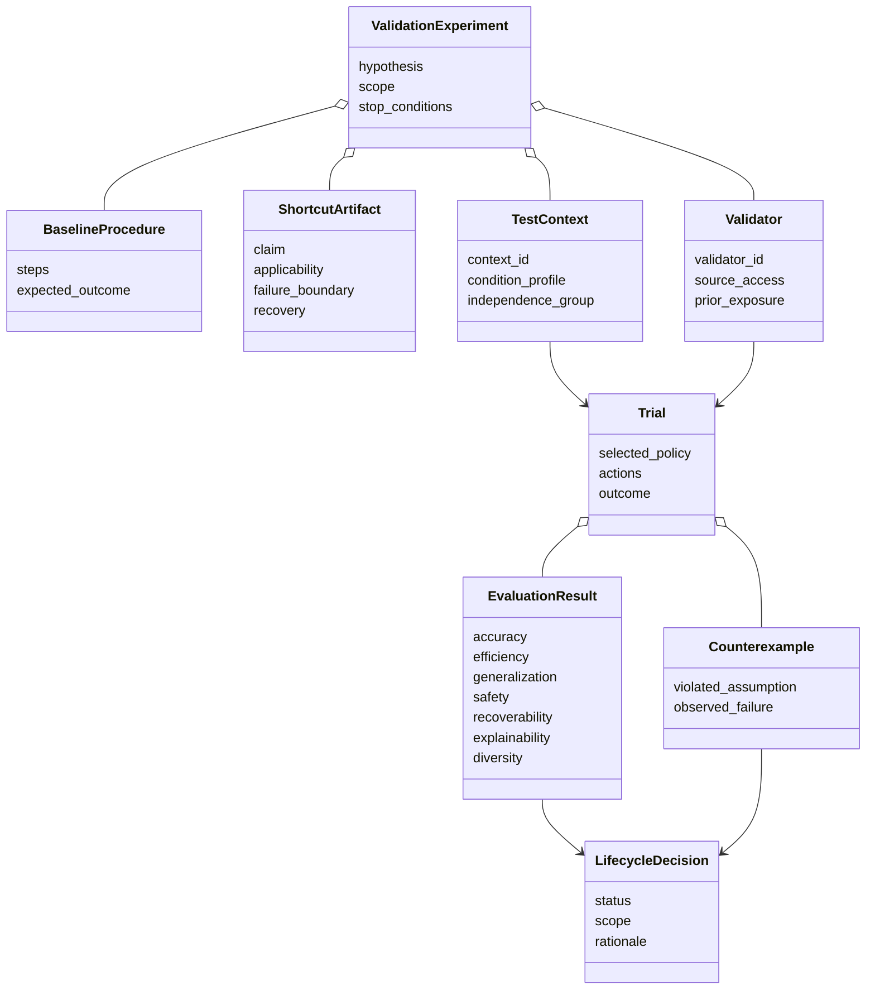
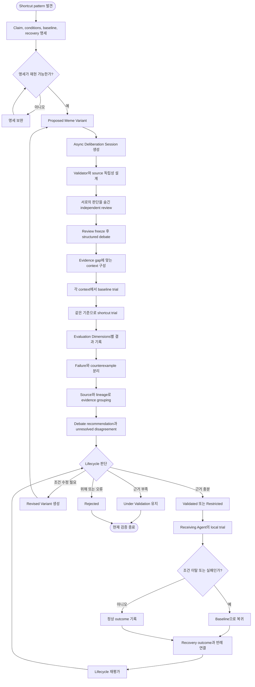

# 05. 개념 검증과 평가

상위 문서: [Cultural Memory & Collective Intelligence](../cultural-memory-hivemind.md)

## 1. 목적

첫 개념 검증은 Mnemome 전체를 한 번에 증명하려 하지 않는다. Baseline Procedure가 있는 shortcut 한 종류를 사용해 다음 가설을 확인한다.

1. Agent의 한 번의 성공이 즉시 population knowledge로 승격되지 않는다.
2. Source와 lineage가 다른 독립 evidence를 구분할 수 있다.
3. Validated Artifact를 사용하면 특정 context에서 baseline보다 효율적이다.
4. Conditions가 맞지 않으면 Agent가 artifact 사용을 중단하고 baseline으로 복귀한다.
5. 실패와 counterexample이 이후 validation과 transmission scope를 바꾼다.
6. 일부 Agent 또는 Subpopulation이 alternative strategy를 유지한다.

검증 대상은 구현 성능이 아니라 **개념 경계와 의사결정 구조의 일관성**이다.

---

## 2. 검증 대상 Shortcut

Baseline Procedure:

`A → B → C → D → E`

검증할 Shortcut:

`A ⇒ E`

Shortcut은 B, C, D가 항상 불필요하다고 주장하지 않는다. 명시된 applicability conditions 안에서만 중간 단계를 생략해도 baseline과 동등한 결과를 얻을 수 있다는 claim이다.

### 2.1 필요한 명세

| 항목 | 검증 질문 |
| --- | --- |
| Claim | 어떤 조건에서 A에서 E로 직접 이동할 수 있는가? |
| Applicability | B, C, D를 생략해도 되는 전제는 무엇인가? |
| Exclusion | 중간 safety 또는 integrity check가 필요한 경우는 무엇인가? |
| Failure Boundary | E가 baseline과 다르다는 것을 어떻게 감지하는가? |
| Baseline | Shortcut을 사용하지 않을 때 정확한 원래 경로는 무엇인가? |
| Recovery | Shortcut 실패 후 어느 checkpoint에서 baseline으로 복귀하는가? |
| Provenance | Shortcut은 어떤 episode와 pattern에서 만들어졌는가? |

---

## 3. 검증 개념 클래스 다이어그램

---

## 4. 검증 집단 구성

### 4.1 역할

| 역할 | 책임 | 독립성 조건 |
| --- | --- | --- |
| Source Agent | Shortcut pattern과 source episode 제공 | Validator로 중복 계산하지 않음 |
| Specification Reviewer | Claim, conditions, baseline의 완전성 확인 | Outcome을 미리 보지 않음 |
| Independent Validator A | 첫 번째 context 집합에서 baseline과 비교 | B와 다른 source/context 사용 |
| Independent Validator B | 별도 context 집합에서 재현 | A의 결론을 먼저 보지 않음 |
| Deliberation Orchestrator | Candidate version, blind review, debate phase와 budget 관리 | Online Execution과 분리된 session에서 동작 |
| Safety Reviewer | Privacy, permission, capability, recovery 검토 | 효율 평가와 별도 판단 가능 |
| Receiving Agent | Validated 후 local policy selection 수행 | Cultural Memory의 결론을 강제 명령으로 해석하지 않음 |
| Governance Reviewer | Evidence group과 lifecycle 상태 판단 | 단순 결과 개수 대신 independence 고려 |

### 4.2 Context 구분

최소한 다음 context가 필요하다.

- Conditions를 명확히 만족하는 positive context
- 일부 condition이 경계값에 있는 boundary context
- Exclusion condition을 만족하는 negative context
- 이전에 보지 못한 independent context
- Tool 또는 environment가 변한 changed context
- Shortcut 실행 중 failure가 발생해 recovery가 필요한 context

---

## 5. 전체 검증 활동 다이어그램

---

## 6. 단계별 검증 절차

### 단계 1 — Baseline 고정

1. A, B, C, D, E 각 단계의 목적을 설명한다.
2. 각 단계가 accuracy, safety, permission에 기여하는지 확인한다.
3. Baseline의 정상 outcome과 알려진 failure를 기록한다.
4. Shortcut이 생략하는 책임을 명시한다.

Baseline을 고정하지 않으면 shortcut이 무엇을 개선하거나 잃었는지 판단할 수 없다.

### 단계 2 — Artifact 명세 검토

1. Claim이 관찰 가능한 outcome으로 표현되었는지 확인한다.
2. Applicability와 exclusion이 서로 모순되지 않는지 확인한다.
3. Failure signal을 runtime에서 감지할 수 있는지 확인한다.
4. Recovery가 실제 baseline checkpoint로 연결되는지 확인한다.
5. Source episode와 transformation을 추적할 수 있는지 확인한다.

### 단계 3 — Independence 설계

1. Validator가 같은 source episode를 공유하는지 확인한다.
2. 같은 Parent Meme 또는 같은 generated data를 사용하는지 확인한다.
3. 서로의 결론을 보기 전 독립 판단을 기록한다.
4. Correlated result는 같은 Evidence Group으로 묶는다.
5. Context independence와 evaluator independence를 따로 기록한다.

### 단계 4 — Baseline 대조 실험

각 context에서 baseline과 shortcut을 같은 평가 기준으로 실행한다. 단순한 step 수뿐 아니라 outcome equivalence와 safety check 손실을 확인한다.

### 단계 5 — Lifecycle 판단

- 모든 context에 일반화되지 않아도 특정 scope에서 충분하면 Restricted로 둘 수 있다.
- Known counterexample이 exclusion으로 명확히 표현되면 조건부 validation이 가능하다.
- Failure boundary가 감지되지 않거나 recovery가 실패하면 validation하지 않는다.
- Safety violation은 다른 장점으로 보상하지 않는다.

### 단계 6 — 제한적 Local Trial

Validation 뒤에도 일부 Receiving Agent에서만 local trial을 수행한다. Agent는 artifact를 선택하지 않을 수 있으며, alternative strategy와 baseline group을 유지한다.

### 단계 7 — Feedback과 재평가

실제 usage outcome은 기존 evidence에 추가되지만 자동으로 status를 변경하지 않는다. 새로운 counterexample은 scope 축소, revision, withdrawal을 촉발할 수 있다.

---

## 7. Evaluation Dimensions

### 7.1 Accuracy

- Shortcut outcome이 baseline의 기대 결과와 동등한가?
- Partial success나 silent failure를 구분할 수 있는가?
- Counterexample에서 오류가 명확히 드러나는가?

### 7.2 Efficiency

- Step 수와 completion time이 줄었는가?
- Recovery가 자주 발생해 평균 비용이 오히려 증가하지 않는가?
- 검증과 condition check 비용까지 포함해도 이점이 있는가?

### 7.3 Generalization

- Source episode와 다른 context에서도 재현되는가?
- 어느 condition에서 효과가 사라지는가?
- Scope를 과도하게 넓혀 설명하지 않았는가?

### 7.4 Safety

- 생략한 단계가 permission, privacy, integrity check를 담당하지 않는가?
- External instruction을 무비판적으로 계승하지 않는가?
- Artifact가 새로운 capability를 부여하지 않는가?

### 7.5 Recoverability

- Failure를 실행 중 감지할 수 있는가?
- 안전 checkpoint로 돌아갈 수 있는가?
- Recovery 뒤 baseline이 정상적으로 완료되는가?

### 7.6 Explainability

- 어떤 Artifact와 version이 선택되었는가?
- 선택 이유와 적용 condition을 설명할 수 있는가?
- Source episode와 validation evidence를 추적할 수 있는가?

### 7.7 Strategy Diversity

- 모든 Agent가 shortcut으로 강제 수렴하지 않는가?
- Baseline과 alternative strategy group이 유지되는가?
- Popularity가 evidence를 대체하지 않는가?

---

## 8. 성공, 보류, 중단 기준

### 성공 기준

- 독립된 positive context에서 baseline과 동등한 accuracy가 재현된다.
- 정의된 조건 안에서 efficiency 개선이 관찰된다.
- Negative context에서 artifact가 선택되지 않거나 즉시 중단된다.
- Failure 발생 시 baseline recovery가 실제로 성공한다.
- Source, evidence group, lineage, selection reason을 추적할 수 있다.
- Baseline과 alternative strategy가 population에 남아 있다.

### 보류 기준

- Positive result는 있으나 context 또는 validator 독립성이 부족하다.
- Applicability boundary가 너무 넓거나 모호하다.
- 일부 evaluation dimension의 evidence가 누락되었다.
- Recovery는 가능하지만 failure signal이 불안정하다.

### 즉시 중단 기준

- Privacy 또는 permission boundary를 침해한다.
- 새로운 권한이나 capability 우회를 요구한다.
- Silent failure를 감지하지 못한다.
- Baseline으로 안전하게 복귀할 수 없다.
- Provenance가 끊겼거나 오염된 source를 분리할 수 없다.

---

## 9. 검증 결과 산출물

| 산출물 | 내용 |
| --- | --- |
| Baseline Specification | 원래 단계, 기대 outcome, safety responsibility |
| Shortcut Artifact | Claim, conditions, failure, recovery, provenance |
| Context Set | Positive, boundary, negative, independent context |
| Independence Map | Validator, source, lineage, data correlation |
| Trial Records | Baseline과 shortcut의 action 및 outcome |
| Evaluation Matrix | Dimension별 result와 uncertainty |
| Counterexample Set | 실패 context, violated assumption, impact |
| Lifecycle Decision | Status, scope, rationale, restrictions |
| Local Trial Report | Agent selection, recovery, diversity outcome |

---

## 10. 검증 완료 체크리스트

- [ ] Baseline의 각 단계가 담당하는 책임을 설명했는가?
- [ ] Shortcut의 claim과 conditions가 재현 가능한가?
- [ ] Positive뿐 아니라 boundary와 negative context가 있는가?
- [ ] Validator, source, lineage independence를 분리했는가?
- [ ] Evaluation Dimension을 단일 score로 숨기지 않았는가?
- [ ] Silent failure와 recovery failure를 검증했는가?
- [ ] Receiving Agent가 artifact를 거부할 수 있는가?
- [ ] Alternative strategy와 baseline group이 유지되는가?
- [ ] Counterexample이 lifecycle 재평가로 연결되는가?
