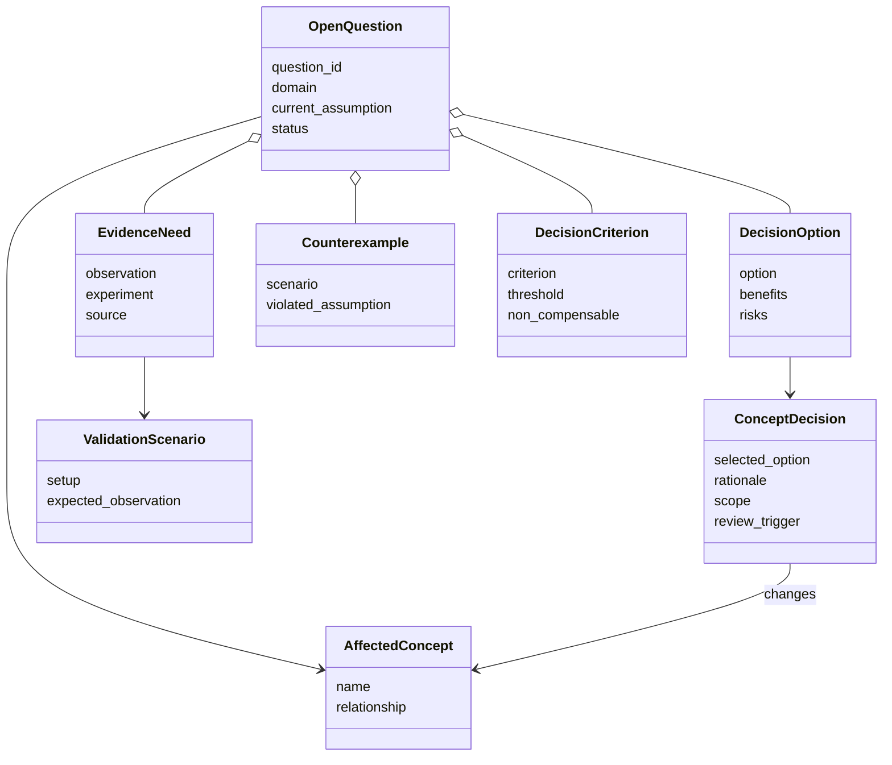
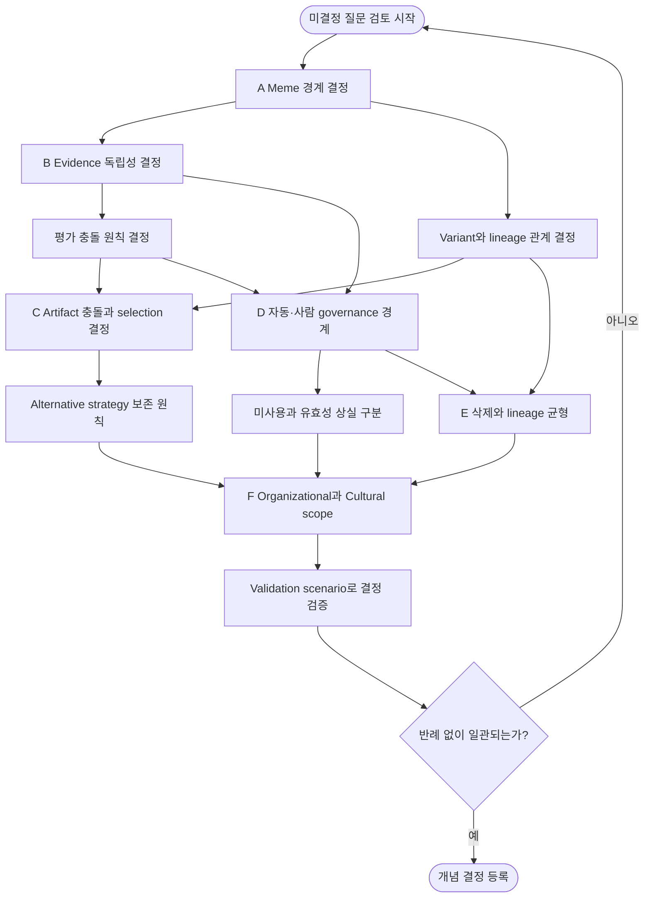
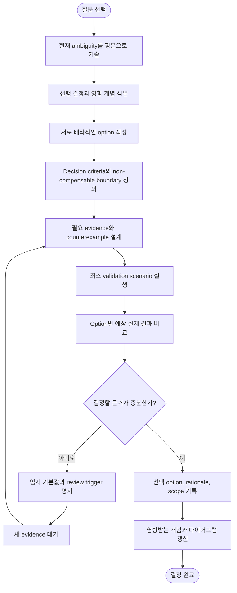

# 06. 미결정 질문과 의사결정

상위 문서: [Cultural Memory & Collective Intelligence](../cultural-memory-hivemind.md)

## 1. 목적

이 문서는 아직 결정되지 않은 질문을 단순 TODO 목록이 아니라 **서로 의존하는 설계 결정**으로 구조화한다. 각 질문에 대해 다음을 명시한다.

- 왜 지금 결정할 수 없는가?
- 어떤 선행 결정이 필요한가?
- 어떤 evidence와 counterexample을 수집해야 하는가?
- 결정 결과가 어떤 개념과 lifecycle에 영향을 주는가?
- 임시 기본값은 무엇인가?

미결정 질문은 구현 편의를 이유로 조기에 닫지 않는다. 반대로 실험할 수 없는 추상적 논쟁으로 남겨두지도 않는다.

---

## 2. 질문 영역

| 영역 | 포함되는 질문 |
| --- | --- |
| A. Meme 경계 | 무엇을 하나의 Meme으로 보는가? Expression과 Variant를 어떻게 구분하는가? Recombination의 parent 책임은 무엇인가? |
| B. Evidence와 평가 | 독립 evidence의 최소 조건은 무엇인가? 평가 차원이 충돌하면 어떻게 판단하는가? |
| C. Selection과 diversity | 적용 범위가 다른 artifact가 충돌하면 무엇을 선택하는가? Alternative strategy를 얼마나 보존하는가? |
| D. Governance와 lifecycle | 자동 판단과 사람 승인의 경계는 무엇인가? 미사용과 유효성 상실을 어떻게 구분하는가? |
| E. Privacy와 accountability | 잊힐 권리와 lineage 추적성을 어떻게 양립시키는가? |
| F. Memory scope | Cultural Memory와 tenant별 Organizational Memory의 전이와 책임은 무엇인가? |

---

## 3. 결정 객체 클래스 다이어그램

---

## 4. A — Meme 경계

### 4.1 무엇을 하나의 Meme으로 볼 것인가?

후보 범위에는 declarative rule, procedural skill, heuristic, policy, workflow가 포함된다. 문제는 이들이 표현 방식이 아니라 **행동과 검증 경계**에 따라 단위가 달라질 수 있다는 점이다.

결정에 필요한 질문:

1. 하나의 claim으로 검증 가능한가?
2. Applicability와 failure boundary가 하나의 단위로 움직이는가?
3. Parent와 descendant의 차이를 일관되게 설명할 수 있는가?
4. Artifact가 여러 표현을 가져도 같은 behavior를 유도하는가?
5. 일부만 withdrawal할 수 있는가, 전체가 함께 움직여야 하는가?

임시 기본값:

> 독립적으로 validation, selection, withdrawal할 필요가 있는 최소 behavior unit을 하나의 Meme으로 본다.

### 4.2 여러 표현과 새로운 Variant를 어떻게 구분하는가?

| 같은 Meme의 다른 표현 | 새로운 Meme Variant |
| --- | --- |
| Claim과 behavior가 동일함 | Claim, condition 또는 behavior가 달라짐 |
| 평가 결과를 그대로 적용할 수 있음 | 별도 validation이 필요함 |
| 문서 형식이나 설명 방식만 다름 | Baseline, failure, recovery가 달라질 수 있음 |
| Lineage 안에서 representation relation | Parent-descendant derivation relation |

결정이 어려운 경계 사례는 prompt wording 변화처럼 표현이 behavior에 영향을 줄 수 있는 경우다. 이때는 결과 equivalence를 검증하기 전까지 Variant로 보수적으로 취급한다.

### 4.3 Recombination의 책임은 어떻게 계승되는가?

두 Parent의 일부를 결합하면 lineage와 failure boundary가 단순 상속되지 않는다.

임시 기본값:

- 모든 parent relation을 보존한다.
- 각 parent에서 가져온 claim과 condition을 표시한다.
- Parent의 validation status를 상속하지 않는다.
- Failure boundary와 safety constraint는 합집합으로 시작한다.
- 상호작용으로 생긴 새로운 failure를 별도 검증한다.

---

## 5. B — Evidence와 평가

### 5.1 독립 evidence의 최소 조건

독립성은 하나의 Boolean이 아니라 여러 축으로 나눌 필요가 있다.

| 독립성 축 | 질문 |
| --- | --- |
| Source independence | 같은 episode, 문서, observation을 사용했는가? |
| Lineage independence | 같은 Parent 또는 descendant artifact에 의존했는가? |
| Context independence | 서로 다른 task와 environment에서 관찰했는가? |
| Evaluator independence | 서로의 결론을 보기 전에 판단했는가? |
| Generation independence | 같은 prompt, model process, generated test를 공유했는가? |

미결정 사항은 어느 축을 validation의 필수 조건으로 둘지, 어떤 조합을 하나의 Evidence Group으로 계산할지다.

임시 기본값:

- 완전 독립을 요구하지 않는다.
- 각 축의 correlation을 명시하고 같은 원인으로 묶이는 결과를 한 group으로 계산한다.
- 최소 두 개의 source/context independence group이 없으면 population-level validation을 보류한다.

### 5.2 평가 차원이 충돌할 때의 판단

예를 들어 shortcut이 더 빠르지만 recoverability가 낮을 수 있다. 단일 weighted score는 이러한 충돌을 숨긴다.

먼저 결정해야 할 것:

1. 다른 차원의 이익으로 상쇄할 수 없는 non-compensable boundary는 무엇인가?
2. Scope를 제한해 trade-off를 허용할 수 있는가?
3. Agent가 local context에 맞게 선택할 수 있는 차원은 무엇인가?
4. Governance가 사전에 금지해야 하는 차원은 무엇인가?

임시 기본값:

- Permission, privacy, capability violation은 상쇄할 수 없다.
- Accuracy와 recoverability가 minimum boundary를 통과한 뒤 efficiency를 비교한다.
- Generalization이 부족하면 reject보다 Restricted scope를 먼저 검토한다.

---

## 6. C — Selection과 Diversity

### 6.1 적용 범위가 다른 artifact의 충돌

충돌 유형:

- 넓은 scope의 일반 artifact와 좁은 scope의 특수 artifact
- Accuracy가 높은 artifact와 efficiency가 높은 artifact
- 최신 revision과 더 많은 evidence를 가진 parent
- 서로 다른 subpopulation에서 검증된 local variant

임시 selection order:

1. Safety와 capability boundary를 만족한다.
2. 현재 context가 applicability 안에 포함된다.
3. 더 구체적인 scope의 artifact를 우선 검토한다.
4. Evidence independence와 recency를 비교한다.
5. Agent가 현재 목표 차원에 맞게 선택한다.
6. 충돌을 resolution 없이 숨기지 않고 selection reason을 기록한다.

### 6.2 Alternative strategy 보존 기간

오래 사용되지 않았다는 이유만으로 alternative를 즉시 제거하면 cultural drift와 conformity bias를 구분할 수 없다.

결정에 필요한 evidence:

- Environment 변화 빈도
- Alternative가 유효했던 context의 재발 가능성
- 유지 비용
- Strategy diversity 감소가 collective outcome에 미치는 영향
- Archived strategy를 다시 검증하는 비용

임시 기본값:

- `사용 빈도 0`을 `유효성 0`으로 해석하지 않는다.
- Active delivery를 중단해도 lineage와 validation evidence는 Archive한다.
- Environment change 또는 current strategy failure가 발생하면 archived alternative를 재평가한다.

---

## 7. D — Governance와 Lifecycle

### 7.1 자동 판단과 사람 승인의 경계

자동화하기 적합한 활동:

- Specification completeness 검사
- Source와 lineage correlation 탐지
- Baseline과 variant 결과 비교
- Known condition과 runtime context matching
- 이미 정의된 stop condition 적용

사람 승인을 우선 검토할 활동:

- 새로운 권한 또는 책임 범위와 관련된 판단
- Privacy 삭제와 accountability의 충돌
- Safety boundary 정의 변경
- 서로 다른 stakeholder에게 위해가 분배되는 결정
- Population scope를 크게 확장하는 결정

미결정 사항은 위험 수준과 scope에 따라 승인 주체를 어떻게 조절할지다.

### 7.2 미사용과 유효성 상실의 구분

| 현상 | 가능한 원인 | 필요한 판단 |
| --- | --- | --- |
| 사용량 감소 | Context가 발생하지 않음 | 유효성 변화로 보지 않음 |
| 사용량 감소 | 더 좋은 variant가 선택됨 | 대체 관계 기록 |
| 성공률 감소 | Environment 변화 | 재검증 또는 scope 축소 |
| 선택률 감소 | Conformity 또는 prestige 변화 | 품질 판단과 분리 |
| Counterexample 증가 | Claim 또는 condition 오류 | Revision 또는 withdrawal |

임시 기본값은 usage frequency와 validation status를 별도 상태로 유지하는 것이다.

---

## 8. E — Privacy와 Accountability

### 8.1 잊힐 권리와 Lineage 추적성

완전한 lineage는 source를 추적하는 데 유용하지만 개인 식별 정보 보존과 충돌할 수 있다.

분리해야 할 정보:

- 개인을 식별하는 source content
- Artifact가 어떤 transformation을 거쳤다는 relation
- Validation decision에 사용된 evidence group
- 삭제 후에도 필요한 최소 audit event

임시 기본값:

1. 개인 원문과 식별자는 삭제 또는 비식별화할 수 있어야 한다.
2. 삭제된 source를 복원할 수 있는 content hash나 간접 식별 정보도 검토한다.
3. Lineage에는 `source removed by policy`라는 transition fact와 영향 범위만 최소 보존한다.
4. Source가 없어 재검증할 수 없으면 해당 artifact의 status와 confidence를 재평가한다.

---

## 9. F — Cultural Memory와 Organizational Memory

### 9.1 책임 경계

| 질문 | Organizational Memory | Cultural Memory |
| --- | --- | --- |
| 누가 소유하는가? | 특정 tenant 또는 조직 | 허용된 Agent Population governance |
| 무엇을 보존하는가? | 조직의 지식과 기록 | 전달·변이·선택되는 cultural artifact |
| 무엇이 핵심인가? | Acquisition, retention, retrieval | Validation, transmission, lineage |
| 경계를 넘을 때? | 조직 승인과 재맥락화 | 새 population에서 재검증 |

미결정 사항:

- 조직이 만든 artifact의 intellectual ownership을 population이 어떻게 존중하는가?
- 조직 scope의 validation을 population scope에서 어느 정도 evidence로 인정하는가?
- Population에서 withdrawal된 artifact를 조직이 계속 유지할 수 있는가?
- 서로 다른 retention policy가 lineage에 어떤 영향을 주는가?

임시 기본값:

- 같은 artifact를 참조해도 각 memory가 별도 status와 책임을 가진다.
- 조직 밖 transmission은 새 transition decision과 재검증을 요구한다.
- 더 제한적인 privacy, permission, withdrawal 조건을 우선 적용한다.

---

## 10. 질문 간 의존성 활동 다이어그램

---

## 11. 개별 질문 결정 절차

---

## 12. 결정 기록 형식

| 항목 | 내용 |
| --- | --- |
| Question | 해결하려는 ambiguity |
| Context | 현재 scope와 왜 결정이 필요한지 |
| Options | 검토한 대안 |
| Decision Criteria | 비교 기준과 안전 경계 |
| Evidence | 사용한 실험, 사례, source |
| Counterexamples | 선택을 뒤집을 수 있는 사례 |
| Decision | 선택한 option과 적용 scope |
| Consequences | 장점, 비용, 포기한 대안 |
| Review Trigger | 언제 다시 검토할지 |
| Affected Documents | 갱신해야 할 정의와 다이어그램 |

---

## 13. 우선순위

먼저 결정할 질문:

1. Meme의 최소 경계
2. Evidence independence의 표현 방식
3. Non-compensable safety boundary
4. Artifact conflict의 local selection 원칙
5. Variant와 representation 구분

이 결정들이 있어야 lifecycle, diversity, withdrawal, memory scope의 구체적인 검증 시나리오를 만들 수 있다.
