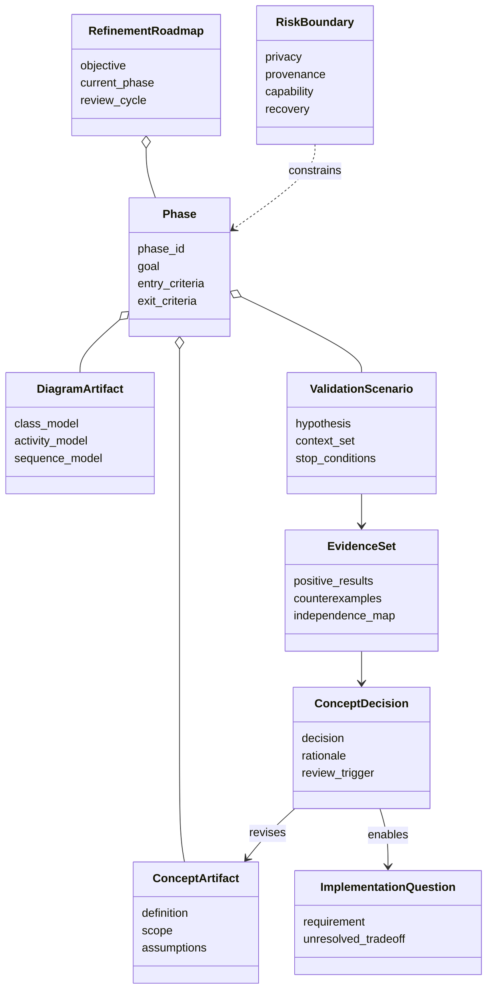
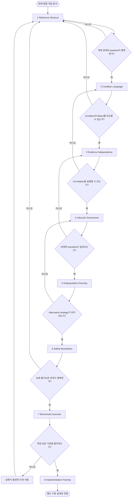
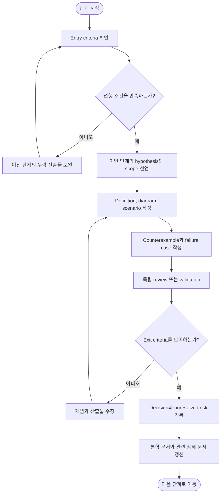

# 07. 컨셉 고도화 로드맵

상위 문서: [Cultural Memory & Collective Intelligence](../cultural-memory-hivemind.md)

## 1. 목적

이 문서는 Mnemome의 개념을 구현 선택으로 너무 빨리 고정하지 않고, 검증 가능한 순서로 구체화하는 로드맵을 정의한다. 각 단계는 문서 작성 자체가 아니라 다음 단계의 판단에 필요한 산출물과 evidence를 만드는 과정이다.

로드맵은 다음 원칙을 따른다.

- 가장 작은 shortcut 한 종류에서 시작한다.
- 객체 경계와 실패 의미를 먼저 고정한다.
- 독립성, lifecycle, safety를 implementation보다 먼저 검증한다.
- 반례가 나오면 이전 단계의 개념을 수정한다.
- 구현 방식은 개념과 계약이 안정된 뒤 별도 문서에서 다룬다.

---

## 2. 로드맵 산출물 클래스 다이어그램

---

## 3. 단계 개요

| 단계 | 목표 | 핵심 산출물 |
| --- | --- | --- |
| 1. Reference Shortcut | 하나의 Meme과 Artifact 경계를 고정 | Baseline, shortcut specification, examples |
| 2. Condition Language | 적용·제외·실패·복구를 일관되게 표현 | Condition vocabulary와 decision table |
| 3. Evidence Independence | 독립·상관 evidence를 구분 | Independence axes와 Evidence Group 규칙 |
| 4. Lifecycle Governance | 승인·보류·revision·withdrawal 판단 | State definitions와 transition criteria |
| 5. Subpopulation Diversity | 독립 탐색과 제한적 transmission 설계 | Subpopulation roles와 diversity metrics |
| 6. Safety Boundaries | Privacy, provenance, capability 충돌 검증 | Threat scenarios와 non-compensable rules |
| 7. Benchmark Scenario | End-to-end 개념을 재현 가능하게 평가 | Context set, evaluation matrix, stop criteria |
| 8. Implementation Framing | 안정된 개념을 구현 요구사항으로 변환 | Conceptual contracts와 implementation questions |

---

## 4. 단계 1 — Reference Shortcut 고정

### 목표

`A → B → C → D → E`를 `A ⇒ E`로 줄이는 shortcut 한 종류를 기준 사례로 고정한다.

### 필요한 작업

1. Baseline 각 단계의 목적과 safety responsibility를 설명한다.
2. Shortcut이 생략하는 단계와 가정을 표시한다.
3. Claim, applicability, exclusion, failure, recovery를 작성한다.
4. Source episode와 일반화 과정을 연결한다.
5. 같은 Meme의 표현과 새로운 Variant의 예시를 만든다.

### 산출물

- Baseline Procedure
- Proposed Meme Variant
- Meme Artifact Specification
- Positive example과 counterexample
- Parent가 있는 경우 초기 Meme Lineage

### 종료 조건

- 독립된 독자가 artifact만 보고 baseline과 차이를 설명할 수 있다.
- 실패와 recovery가 관찰 가능한 언어로 정의되어 있다.
- 어떤 변경이 새 Variant를 요구하는지 예시로 구분할 수 있다.

---

## 5. 단계 2 — Condition Language 정의

### 목표

Artifact마다 제각각인 자연어 조건을 비교 가능한 공통 개념으로 정리한다. 특정 표현 언어나 schema를 결정하는 단계는 아니다.

### 구분할 조건

| 종류 | 질문 |
| --- | --- |
| Applicability | 어느 context에서 사용 가능한가? |
| Exclusion | 어떤 context에서는 사용하면 안 되는가? |
| Preconditions | 실행 전에 이미 참이어야 하는 것은 무엇인가? |
| Invariants | 실행 중 계속 유지되어야 하는 것은 무엇인가? |
| Failure Signals | 무엇을 실패로 관찰하는가? |
| Stop Conditions | 언제 artifact 경로를 중단하는가? |
| Recovery Preconditions | 어느 checkpoint로 안전하게 돌아갈 수 있는가? |

### 종료 조건

- 같은 context를 두 artifact의 condition과 비교할 수 있다.
- Condition mismatch와 execution failure를 구분할 수 있다.
- Runtime에서 local check가 가능한 조건과 governance review가 필요한 조건이 분리된다.

---

## 6. 단계 3 — Evidence Independence 정의

### 목표

Agent 수와 evidence 수를 혼동하지 않고 source, lineage, context, evaluator, generation independence를 표현한다.

### 필요한 작업

1. Independence axes를 정의한다.
2. Correlated Evidence Group의 grouping rule을 만든다.
3. 완전 독립이 불가능한 경우 uncertainty를 표현한다.
4. Independent validation의 최소 기준을 가설로 세운다.
5. 같은 source를 본 여러 Agent와 다른 context의 같은 Agent를 비교한다.

### 종료 조건

- 겉으로 여러 결과가 실제로 몇 개의 evidence group인지 설명할 수 있다.
- 어떤 correlation이 validation을 보류하게 하는지 명시되어 있다.
- Negative evidence도 같은 독립성 규칙을 적용받는다.

---

## 7. 단계 4 — Lifecycle Governance 구체화

### 목표

Proposed, Under Validation, Validated, Restricted, Revision Required, Rejected, Withdrawn의 의미와 transition 기준을 고정한다.

### 필요한 작업

- 각 상태에서 Agent에게 artifact를 제공할 수 있는지 결정
- Transition을 일으키는 evidence와 counterexample 정의
- 자동 판단과 사람 승인 경계 설정
- Descendant가 parent 상태를 상속하지 않는 규칙 확인
- Withdrawal impact analysis 절차 설계

### 종료 조건

- 같은 evidence set에 대해 reviewer가 같은 transition 후보를 제시할 수 있다.
- 상태와 popularity, usage frequency가 분리되어 있다.
- Revision과 withdrawal이 lineage에 미치는 영향이 설명된다.

---

## 8. 단계 5 — Subpopulation과 Strategy Diversity

### 목표

검증된 artifact가 population 전체를 하나의 전략으로 수렴시키지 않도록 독립 탐색과 제한적 transmission의 최소 조건을 정한다.

### 필요한 작업

1. Subpopulation을 나누는 기준을 정의한다.
2. Baseline과 alternative strategy를 유지할 비율 또는 역할을 정한다.
3. Transmission scope 확장·유지·축소 조건을 만든다.
4. Conformity bias, prestige bias, cultural drift의 관찰 신호를 정한다.
5. Strategy diversity가 실제 collective outcome에 기여하는지 검증한다.

### 종료 조건

- Artifact adoption이 높아져도 alternative strategy가 사라지지 않는다.
- 같은 lineage의 결과를 독립 합의로 세지 않는다.
- Usage frequency와 validation quality를 구분한다.

---

## 9. 단계 6 — Safety Boundary 검증

### 목표

Privacy, provenance, permission, capability, instruction integrity가 충돌하는 사례를 수집하고 상쇄할 수 없는 boundary를 고정한다.

### 필수 사례

- Source episode에 개인 정보가 포함된 유용한 pattern
- Permission이 없는 조직 knowledge의 population transmission
- 출처가 끊긴 높은 성능의 shortcut
- 외부 instruction에서 유도된 cultural proposal
- Artifact가 현재 Agent 권한 밖 action을 요구하는 경우
- Source 삭제 요청이 lineage 재현성을 손상하는 경우

### 종료 조건

- 어떤 safety violation도 efficiency나 popularity로 상쇄되지 않는다.
- 비식별화 후에도 재식별 위험과 provenance 필요성을 함께 검토한다.
- Artifact validation과 capability grant가 분리되어 있다.

---

## 10. 단계 7 — Benchmark Scenario 설계

### 목표

이전 단계에서 정한 개념을 재현 가능한 하나의 end-to-end scenario로 평가한다.

### Benchmark 구성

- Reference Baseline과 Shortcut
- Positive, boundary, negative, changed context
- Source와 lineage가 다른 validator
- Baseline group과 alternative strategy group
- Runtime condition failure와 recovery case
- 새로운 counterexample에 따른 lifecycle 재평가

### 종료 조건

- Accuracy, Efficiency, Generalization, Safety, Recoverability, Explainability, Strategy Diversity를 분리해 관찰할 수 있다.
- Independent evidence와 correlated evidence를 재현 가능하게 구분한다.
- 실패 후 baseline recovery가 실제로 검증된다.
- Validation 결과가 transmission scope와 lifecycle state에 연결된다.

---

## 11. 단계 8 — Implementation Framing

### 목표

개념이 안정된 뒤에만 구현 요구사항을 별도 문서로 변환한다. 이 단계에서도 특정 기술을 즉시 선택하기보다 구현이 만족해야 할 contract를 먼저 정의한다.

### 선행 조건

- Reference Shortcut의 객체 경계가 안정됨
- Condition language가 비교 가능함
- Evidence independence와 lifecycle decision이 정의됨
- Safety boundary와 withdrawal procedure가 있음
- Benchmark에서 concept-level success criteria를 통과함

### 산출물

- Concept object contract
- Lifecycle transition contract
- Query-time latency contract
- Provenance and lineage requirements
- Privacy and permission requirements
- Validation and benchmark requirements
- 아직 비교해야 할 implementation alternatives

이 문서의 현재 범위는 단계 7까지이며, 단계 8의 기술 선택은 별도 문서에서 다룬다.

---

## 12. 전체 고도화 활동 다이어그램

---

## 13. 단계 진행 절차

---

## 14. 진행 상태 기록 형식

| 항목 | 설명 |
| --- | --- |
| Phase | 현재 단계 |
| Objective | 이번 cycle에서 검증할 목표 |
| Entry Evidence | 시작 조건을 충족한 근거 |
| Produced Artifacts | 정의, 다이어그램, scenario, evidence |
| Counterexamples | 발견한 반례와 영향 |
| Decisions | 확정한 개념과 scope |
| Unresolved Risks | 다음 단계로 가져가는 위험 |
| Exit Assessment | 종료 조건 충족 여부 |
| Next Review Trigger | 언제 이전 결정을 다시 검토할지 |

---

## 15. 로드맵 완료 기준

컨셉 고도화가 구현 검토 단계로 넘어가려면 다음이 가능해야 한다.

- 하나의 Meme, Artifact, Variant, Lineage 경계를 예시로 설명한다.
- Conditions와 failure/recovery를 일관된 방식으로 비교한다.
- Evidence independence와 correlation을 기록한다.
- Lifecycle transition의 이유를 재현한다.
- Transmission과 local policy selection을 분리한다.
- Baseline과 alternative strategy가 유지된다.
- Privacy, provenance, permission, capability boundary가 정의된다.
- Benchmark에서 성공뿐 아니라 failure와 withdrawal을 검증한다.
- 구현 기술을 언급하지 않고도 시스템 책임과 contract를 설명할 수 있다.
