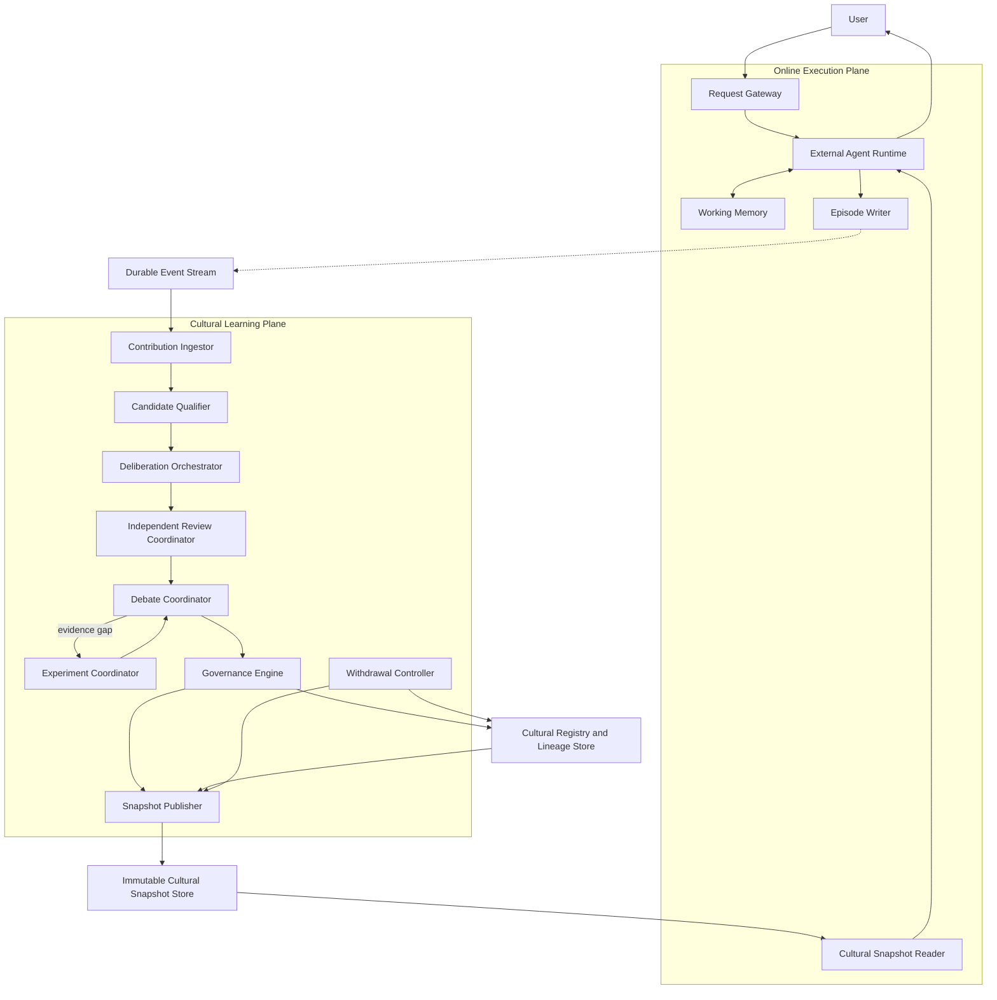
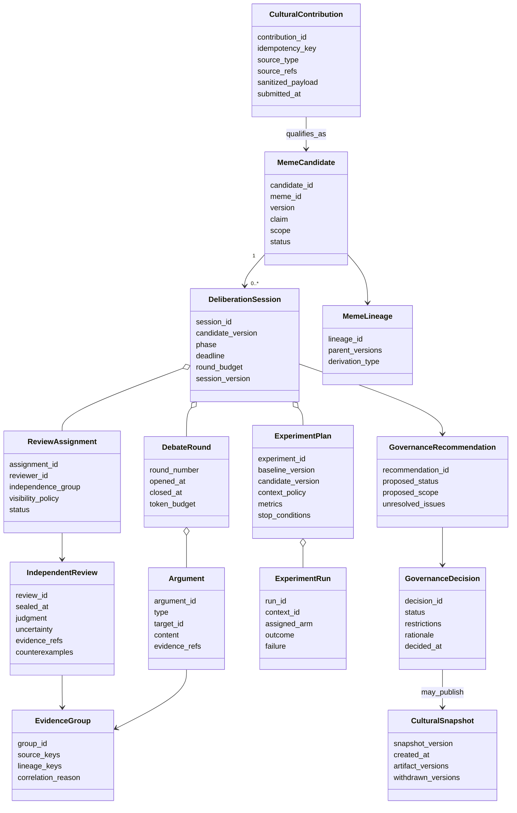
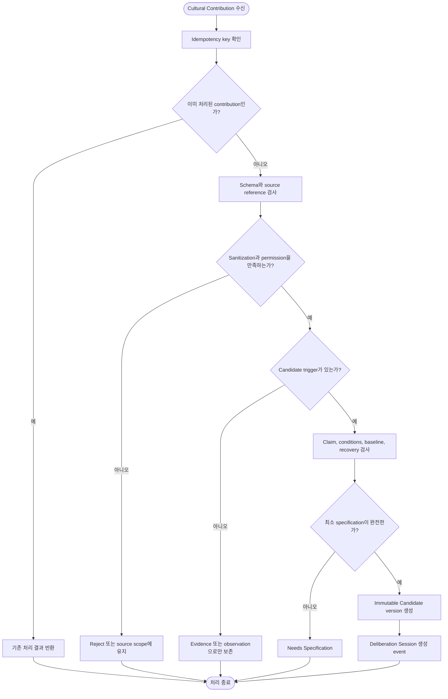
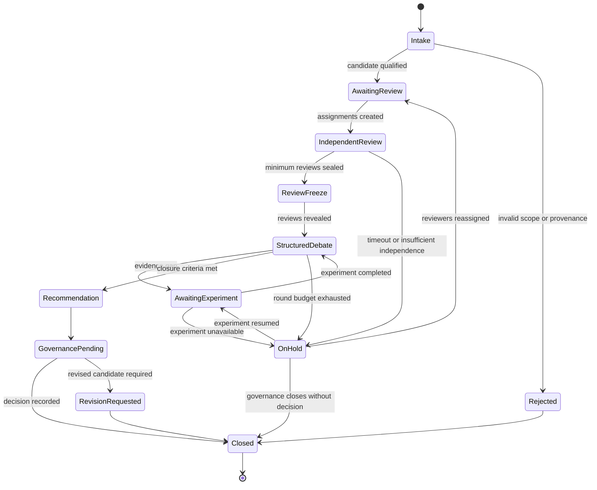
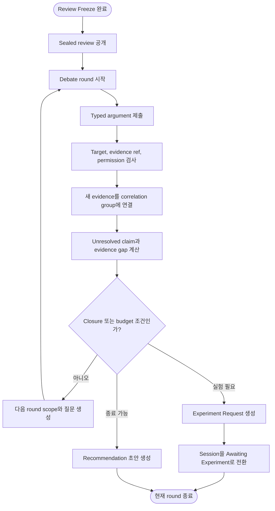
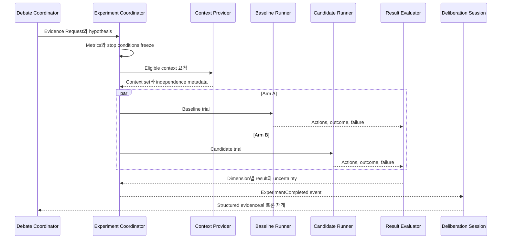
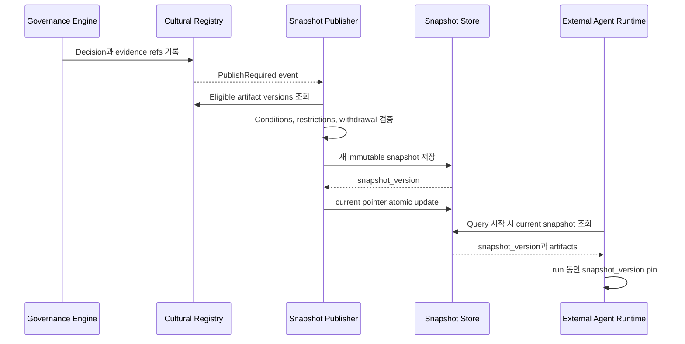
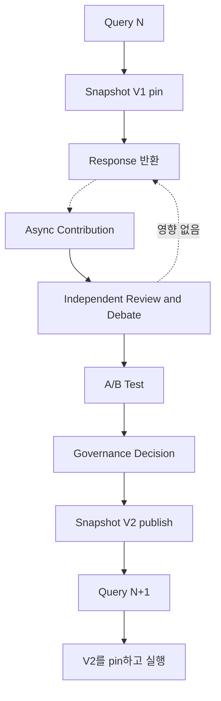

# 08. Cultural Deliberation 시스템 설계

상위 문서: [Cultural Memory & Collective Intelligence](../cultural-memory-hivemind.md)

관련 문서:

- [02. 전체 시스템과 이중 루프](./02-system-architecture-and-workflows.md)
- [03. 기억 계층 상세](./03-memory-layers.md)
- [04. Cultural Memory 기능 상세](./04-cultural-memory-functions.md)
- [05. 개념 검증과 평가](./05-concept-validation.md)

## 1. 목적

이 문서는 Cultural Deliberation을 사용자 Query의 실시간 추론에서 분리해 구현하는 시스템 구조를 정의한다. 목표는 여러 Agent의 독립 review, 구조화된 토론, A/B Test와 governance를 수행하면서도 Online Execution latency를 증가시키지 않는 것이다.

구현의 핵심 경계는 다음과 같다.

> Online Execution Plane은 이미 발행된 Cultural Snapshot만 읽는다. Candidate 생성, 토론, 실험, lifecycle 판단과 snapshot 갱신은 별도의 Cultural Learning Plane에서 비동기로 수행한다.

이 문서는 특정 database, message broker, cache 제품을 선택하지 않는다. 대신 구현이 만족해야 할 논리 컴포넌트, 데이터 contract, 상태 전이, consistency와 failure handling을 정의한다.

여기서 `Agent Runtime`은 Mnemome이 제공하는 실행기가 아니라 외부 Agent다. Mnemome은 `AgentEnvironment`와 `DeliberationEnvironment` 같은 interface wrapper로 context, assignment, phase, visibility와 command를 제공한다. Review/Argument 내용은 외부 Reviewer Agent나 사람이 생성하며, 내부 LLM은 immutable input과 versioned rubric을 평가하는 bounded Judge로만 동작한다.

---

## 2. 목표와 비목표

### 목표

- User Response critical path에서 토론과 실험 제거
- Response 이후 contribution을 유실 없이 비동기 전달
- Reviewer가 다른 판단을 보기 전에 independent review 제출
- 제한된 round와 resource budget을 가진 structured debate
- Baseline 대조 A/B Test와 independent replication 연계
- 모든 decision의 provenance, evidence group과 lineage 보존
- 새 decision을 immutable Cultural Snapshot으로 발행
- 실행 중인 run이 snapshot 변경에 흔들리지 않도록 version pinning
- 중복 이벤트, worker failure, timeout에서 안전한 재처리
- 긴급 withdrawal을 일반 deliberation과 분리

### 비목표

- User Query마다 multi-agent debate 수행
- 모든 Episode를 자동 Candidate로 변환
- Agent의 private Working Memory 또는 원문 대화 공유
- 합의율이나 다수결만으로 lifecycle 결정
- Cultural Memory가 Online Agent의 Plan을 직접 통제
- 하나의 대규모 synchronous transaction으로 전체 workflow 처리

---

## 3. 실행 Plane 분리

### 3.1 전체 시스템 구성도



### 3.2 Latency 경계

Online request가 기다리는 작업:

1. 현재 scope에 맞는 Cultural Snapshot read
2. Artifact candidate filtering
3. Agent의 local policy selection
4. Working Memory에 snapshot version과 conditions 기록

Online request가 기다리지 않는 작업:

- Contribution qualification
- Candidate specification review
- Reviewer assignment
- Independent review
- Debate round
- A/B Test와 replication
- Governance decision
- 새 snapshot publication

Episode Writer는 Response 생성과 분리된 post-response 단계로 동작할 수 있다. Contribution 제출 실패는 User Response를 실패시키지 않으며 재시도 가능한 pending state로 남긴다.

---

## 4. 논리 컴포넌트

| 컴포넌트 | 입력 | 출력 | 핵심 책임 |
| --- | --- | --- | --- |
| Cultural Snapshot Reader | Agent scope, context, snapshot version | Eligible Artifact candidates | Online read-only access와 filtering |
| Episode Writer | Run outcome, source refs, selected artifact | Scoped Episode event | Response 이후 episode 정리 |
| Contribution Ingestor | Episode pattern, proposal, counterexample, workspace contribution | Normalized Cultural Contribution | Idempotency, schema와 source boundary 검사 |
| Candidate Qualifier | Cultural Contribution | Rejected, Needs Specification 또는 Candidate | 공유 가능성, novelty, 최소 specification 판단 |
| Deliberation Orchestrator | Candidate version | Deliberation Session | Session lifecycle, phase, deadline, budget 조정 |
| Independent Review Coordinator | Session, reviewer pool | Review assignments와 sealed reviews | Independence group과 blind review 보장 |
| Debate Coordinator | Frozen reviews, candidate version | Arguments, evidence requests, unresolved issues | Review 공개와 제한된 debate round 수행 |
| Experiment Coordinator | Experiment request | Experiment results | Baseline 대조, context assignment, stop condition 적용 |
| Governance Engine | Evidence groups, recommendations, constraints | Lifecycle Decision | 승인, 제한, 보류, revision, reject, withdrawal 판단 |
| Cultural Registry and Lineage Store | Candidate, decision, evidence refs | Versioned cultural records | Durable source of truth와 immutable lineage |
| Snapshot Publisher | Registry state, prior snapshot | New Cultural Snapshot | Eligible set 구성과 atomic publication |
| Withdrawal Controller | Critical counterexample 또는 safety signal | Invalidation decision과 snapshot update | 긴급 사용 중단과 impact analysis |

컴포넌트는 하나의 process로 구현할 수도 있고 독립 service로 분리할 수도 있다. 중요한 것은 책임과 transaction boundary를 유지하는 것이다.

---

## 5. 데이터 모델

### 5.1 클래스 다이어그램



### 5.2 Identity와 version

- `contribution_id`: 한 번 제출된 contribution의 논리적 identity
- `candidate_id`: 하나의 검증 대상 identity
- `meme_id`: 여러 variant와 artifact 표현을 묶는 cultural identity
- `version`: Candidate 또는 Artifact의 immutable version
- `session_id`: 특정 Candidate version을 평가하는 deliberation run
- `snapshot_version`: Online Execution이 pinning하는 문화 상태 version

Candidate 내용이 변경되면 같은 session을 수정하지 않고 새 Candidate version 또는 새 session을 만든다. Review 중 Candidate가 바뀌면 기존 review는 새 version의 독립 evidence로 자동 사용하지 않는다.

---

## 6. Candidate 유입 경로

Candidate는 반복 Episode만으로 만들어지지 않는다.

| 유입 경로 | 예시 | Qualifier가 확인할 사항 |
| --- | --- | --- |
| Observational | 여러 Episode에서 반복된 shortcut | 반복성, source correlation, 일반화 가능성 |
| Deliberative | Agent가 의도적으로 제안한 새 procedure | Claim, baseline, testability |
| Experimental | Exploratory A/B Test에서 발견된 차이 | 실험 설계, multiple testing, scope |
| Adversarial | Counterexample 또는 safety review | 영향 artifact와 lineage |
| Collaborative | 여러 task의 disagreement에서 나온 proposal | 단순 합의가 아닌 evidence와 독립성 |

### 6.1 Candidate qualification 활동



---

## 7. Deliberation Session 상태 기계



### 7.1 상태 전이 규칙

- Candidate version이 고정되어야 `IndependentReview`로 이동한다.
- 최소 독립성 조건을 충족한 sealed review가 있어야 `ReviewFreeze`로 이동한다.
- Freeze 이전에는 reviewer에게 다른 review의 내용과 집계 결과를 공개하지 않는다.
- Debate는 무제한 반복하지 않고 round, time, token, experiment budget으로 제한한다.
- Closure criteria가 충족되지 않으면 `OnHold`로 이동하며 합의를 강제하지 않는다.
- `Closed` session은 수정하지 않는다. 추가 evidence가 생기면 후속 session을 연다.

---

## 8. Independent Review 구현

### 8.1 Reviewer assignment

Reviewer selection은 다음 constraint를 고려한다.

- Source episode와의 독립성
- Meme Lineage와의 독립성
- Test context와 environment의 차이
- 이전 deliberation 참여 여부
- Domain capability와 permission
- 같은 reviewer group에 대한 과도한 집중 방지

Assignment는 최적화 문제가 될 수 있지만 첫 구현에서는 명시적 constraint filtering과 diversity-aware sampling으로 충분하다.

### 8.2 Blind visibility

Independent Review phase에서 reviewer가 볼 수 있는 것:

- Candidate version
- Baseline Procedure
- Applicability와 exclusion conditions
- 평가해야 할 dimension
- 검증에 필요한 source reference의 최소 범위

볼 수 없는 것:

- 다른 reviewer의 judgment
- 현재 찬성·반대 수
- Candidate popularity
- 예상 governance decision
- Source Agent의 prestige 정보 중 평가에 불필요한 항목

Review submission은 `sealed_at` 이후 수정하지 않는다. 정정이 필요하면 원본을 남기고 amendment를 추가한다.

---

## 9. Structured Debate 구현

### 9.1 Debate protocol

토론은 자유 형식 chat이 아니라 typed argument를 교환하는 bounded protocol로 구현한다.

| Argument type | 의미 |
| --- | --- |
| Support | Claim 또는 condition을 지지하는 근거 |
| Rebuttal | 특정 argument나 evidence 해석을 반박 |
| Counterexample | Claim이 실패하는 context 제시 |
| Clarification | 용어, condition, outcome 정의 요청 |
| Evidence Request | 부족한 실험 또는 source 요청 |
| Scope Proposal | Applicability를 좁히거나 넓히는 제안 |
| Revision Proposal | 새 Candidate version이 필요한 변경 제안 |

각 Argument는 target, author, round, evidence refs와 provenance를 가진다. 단순 찬반 메시지나 동일한 주장의 반복은 새로운 evidence로 계산하지 않는다.

### 9.2 Round 실행 활동



### 9.3 Closure criteria

다음 중 하나로 Debate phase를 닫는다.

- 필수 claim에 필요한 evidence가 충족됨
- 합의는 없지만 unresolved disagreement와 option이 충분히 구조화됨
- 안전상 즉시 reject 또는 withdrawal 검토가 필요함
- 새 Candidate version이 필요해 현재 version 평가를 중단함
- Round, time 또는 resource budget이 소진됨
- 필요한 실험을 현재 수행할 수 없어 On Hold가 됨

토론 종료는 합의 달성을 의미하지 않는다. Recommendation은 minority objection과 unresolved issue를 함께 보존한다.

---

## 10. A/B Test와 Experiment Coordinator

### 10.1 역할

Experiment Coordinator는 토론 중 제기된 검증 가능한 차이를 controlled experiment로 변환한다.

- A: Baseline Procedure 또는 기존 validated version
- B: Candidate version
- Context policy: random assignment, matched context 또는 predefined test set
- Metrics: Accuracy, Efficiency, Generalization, Safety, Recoverability
- Stop conditions: 위해 신호, failure threshold, sample budget, timeout
- Independence metadata: data source, environment, evaluator, generation process

### 10.2 Exploratory와 confirmatory 구분

- Exploratory test는 Candidate와 condition을 발견하거나 수정한다.
- Confirmatory test는 미리 고정된 hypothesis와 metric을 검증한다.
- Exploratory 결과를 같은 data로 confirmatory evidence처럼 재사용하지 않는다.
- Multiple candidate를 비교했다면 selection 과정과 uncertainty를 기록한다.

### 10.3 실험 sequence



Safety risk가 있는 경우 실제 traffic A/B Test보다 simulation, sandbox, red-team 또는 shadow evaluation을 먼저 사용한다. 안전 경계를 통과하지 않은 Candidate를 넓은 population에 배정하지 않는다.

---

## 11. Governance와 Snapshot Publication

### 11.1 Governance input

- Candidate specification과 immutable version
- Independent reviews
- Typed arguments와 evidence refs
- Evidence independence groups
- Experiment plans와 results
- Counterexamples와 safety signals
- Unresolved disagreement
- Suggested scope와 restrictions

### 11.2 Decision output

- Lifecycle status
- Applicability scope와 restrictions
- Decision rationale
- 사용한 evidence group
- 반대 의견과 uncertainty
- Review trigger와 expiration condition
- Parent·descendant impact

### 11.3 Snapshot publication

Snapshot Publisher는 Cultural Registry의 최신 row를 매번 Online에 직접 노출하지 않는다. Governance decision을 반영한 **immutable snapshot**을 만든 뒤 atomic하게 current version pointer를 갱신한다.



### 11.4 Consistency model

- Online run은 시작 시 snapshot version을 pin하고 종료할 때까지 바꾸지 않는다.
- 새 decision은 새 run부터 반영되는 eventual publication 모델을 사용한다.
- Artifact retrieval 결과에는 snapshot version과 artifact version을 포함한다.
- Usage outcome은 실제 사용한 snapshot과 artifact version을 참조한다.
- Snapshot publication이 실패하면 이전 snapshot이 계속 serving된다.

긴급 withdrawal은 예외다. Safety-critical invalidation은 current snapshot pointer를 즉시 새 version으로 바꾸고, 실행 중 run에는 별도 stop-use signal을 보낼 수 있다. 이 신호는 새로운 토론을 요청하는 것이 아니라 이미 결정된 invalidation을 전달한다.

---

## 12. 이벤트 계약

### 12.1 핵심 event

| Event | Producer | Consumer | 필수 식별자 |
| --- | --- | --- | --- |
| EpisodeRecorded | Episode Writer | Contribution Ingestor | episode_id, run_id |
| CulturalContributionSubmitted | Contribution Ingestor | Candidate Qualifier | contribution_id, idempotency_key |
| CandidateQualified | Candidate Qualifier | Deliberation Orchestrator | candidate_id, version |
| DeliberationOpened | Orchestrator | Review Coordinator | session_id, candidate_version |
| ReviewAssigned | Review Coordinator | Reviewer Agent | assignment_id, session_id |
| IndependentReviewSealed | Reviewer Agent | Orchestrator | review_id, assignment_id |
| ReviewPhaseFrozen | Orchestrator | Debate Coordinator | session_id, session_version |
| DebateRoundClosed | Debate Coordinator | Orchestrator | session_id, round_number |
| ExperimentRequested | Debate Coordinator | Experiment Coordinator | experiment_id, candidate_version |
| ExperimentCompleted | Experiment Coordinator | Deliberation Session | experiment_id, result_version |
| RecommendationSubmitted | Orchestrator | Governance Engine | recommendation_id, session_id |
| GovernanceDecisionRecorded | Governance Engine | Registry, Publisher | decision_id, candidate_version |
| CulturalSnapshotPublished | Snapshot Publisher | Online Snapshot Reader | snapshot_version |
| ArtifactWithdrawalIssued | Withdrawal Controller | Registry, Publisher, Online invalidation | artifact_version, decision_id |

### 12.2 공통 event envelope

```text
event_id
event_type
occurred_at
producer
correlation_id
causation_id
aggregate_id
aggregate_version
idempotency_key
actor_scope
payload_reference
schema_version
```

Payload가 크거나 민감하면 event에는 reference와 integrity metadata만 포함하고 내용은 접근 제어된 durable store에 둔다.

---

## 13. Command와 Query 경계

### Command 예시

- SubmitCulturalContribution
- QualifyCandidate
- OpenDeliberation
- AssignReviewers
- SealIndependentReview
- FreezeReviewPhase
- OpenDebateRound
- RequestExperiment
- SubmitRecommendation
- RecordGovernanceDecision
- PublishCulturalSnapshot
- WithdrawArtifact

### Query 예시

- GetEligibleArtifactsForContext
- GetPinnedSnapshot
- GetCandidateVersion
- GetDeliberationStatus
- GetEvidenceGroups
- GetLineageImpact
- GetGovernanceDecision

Online Execution에는 `GetEligibleArtifactsForContext`와 `GetPinnedSnapshot`만 노출하는 것이 기본이다. Deliberation command는 Online Agent의 normal request handler에서 호출하지 않는다.

---

## 14. 동시성, 중복과 Idempotency

### 14.1 예상되는 경쟁 조건

- 같은 Episode pattern에서 여러 Candidate가 동시에 생성됨
- 같은 Candidate version에 두 Session이 열림
- Review completion event가 중복 전달됨
- Debate round 종료와 Experiment result가 동시에 도착함
- Governance decision 직전에 새로운 counterexample이 도착함
- Snapshot publish 도중 withdrawal decision이 발생함

### 14.2 처리 원칙

- 모든 command는 idempotency key를 가진다.
- Aggregate는 monotonic version을 가지며 optimistic concurrency로 갱신한다.
- Candidate version당 active deliberation session 수를 policy로 제한한다.
- Event consumer는 at-least-once delivery를 전제로 중복을 무해하게 처리한다.
- State transition은 expected current phase를 함께 검사한다.
- 늦게 도착한 result는 버리지 않고 evidence로 보존하되 닫힌 session을 수정하지 않는다.
- Closed session 이후 새 evidence는 follow-up session 또는 withdrawal review를 연다.
- Snapshot은 content/version을 먼저 완성한 뒤 pointer만 atomic하게 교체한다.

Exactly-once delivery에 의존하지 않는다. Business-level idempotency와 immutable event reference로 결과를 안정화한다.

---

## 15. Scheduling과 Resource Budget

모든 Candidate가 같은 우선순위로 토론되면 learning plane이 과부하될 수 있다.

### 15.1 Scheduling 신호

- Safety severity
- 현재 artifact의 사용 범위
- Counterexample의 재현성
- Candidate novelty
- Expected impact
- Evidence completeness
- Review와 experiment cost
- 오래 대기한 시간

Popularity만으로 우선순위를 정하지 않는다. 널리 사용되는 artifact의 safety counterexample는 높게 평가할 수 있지만 단순 사용률은 truth signal이 아니다.

### 15.2 Session budget

- 최대 reviewer 수
- 최소 independence group 수
- Debate round 수
- Agent별 token 또는 action budget
- Experiment case 수
- Session deadline
- Retry와 reassignment 횟수

Budget을 소진하면 억지로 decision을 만들지 않고 `OnHold` 또는 `Under Validation`로 종료할 수 있다.

---

## 16. 장애 처리

| 장애 | 시스템 동작 |
| --- | --- |
| Contribution consumer 중단 | Event offset 또는 pending record에서 재시작 |
| 중복 contribution | Idempotency key로 기존 결과 반환 |
| Reviewer timeout | Assignment 만료 후 재배정, 기존 late review는 별도 evidence로 수용 |
| Reviewer 부분 실패 | Minimum review 조건 미충족 시 OnHold |
| Debate worker 중단 | Session version과 round checkpoint에서 재개 |
| Experiment 실패 | Failure를 result로 기록하고 재시도 또는 OnHold 판단 |
| Governance Engine 중단 | Recommendation은 pending 유지, Online snapshot 영향 없음 |
| Registry 기록 실패 | Decision publication 중단, 이전 snapshot 유지 |
| Snapshot 생성 실패 | Current pointer 변경 금지, 재시도 |
| 잘못된 snapshot 발견 | 이전 immutable version으로 pointer rollback 후 incident review |
| Critical unsafe artifact | Withdrawal Controller가 새 snapshot과 invalidation signal 발행 |

실패가 발생해도 Online Execution은 마지막으로 정상 발행된 snapshot을 읽는다. Learning Plane 장애가 User Response 장애로 전파되지 않는 것이 핵심이다.

---

## 17. Security와 Privacy

### 17.1 Trust boundary

- Working Memory와 raw Episode는 기본적으로 Agent scope 안에 있다.
- Cultural Contribution은 별도 sanitizer와 permission check를 통과한다.
- Reviewer는 필요한 최소 source reference만 본다.
- Blind review phase의 visibility policy를 server-side access control로 강제한다.
- Debate argument와 experiment result도 provenance와 actor scope를 가진다.
- External instruction과 retrieved content는 trusted policy가 아니라 untrusted evidence로 표시한다.

### 17.2 위협과 대응

| 위협 | 대응 |
| --- | --- |
| Prompt injection이 Candidate로 승격 | Source trust 표시, instruction/content 분리, sandbox validation |
| Reviewer 간 정보 누출 | Phase 기반 visibility와 sealed review |
| 동일 actor의 다중 identity | Reviewer identity와 independence group 검사 |
| Evidence popularity manipulation | Source/lineage grouping과 frequency-quality 분리 |
| Sensitive source 노출 | Sanitized contribution, scoped reference, redaction |
| Malicious experiment | Capability boundary, sandbox, stop condition |
| Unauthorized snapshot publish | Governance decision verification과 publisher authorization |
| Lineage poisoning | Immutable parent refs와 signature/integrity metadata |

---

## 18. Observability

### 18.1 Online metric

- `cultural_snapshot_read_latency`
- `artifact_candidate_count_per_request`
- `snapshot_version_age`
- `artifact_selection_rate`
- `runtime_condition_failure_rate`
- `baseline_recovery_success_rate`

### 18.2 Learning Plane metric

- `contribution_ingest_lag`
- `candidate_qualification_rate`
- `deliberation_queue_age`
- `independent_review_completion_time`
- `reviewer_reassignment_rate`
- `debate_round_count`
- `experiment_completion_time`
- `session_on_hold_rate`
- `governance_decision_latency`
- `snapshot_publish_latency`
- `withdrawal_propagation_latency`

### 18.3 Quality와 diversity metric

- Evidence independence group 수
- Correlated evidence 비율
- Counterexample coverage
- Minority objection 보존률
- Subpopulation별 artifact adoption concentration
- Parent와 descendant의 validation overlap
- Alternative strategy retention

### 18.4 Traceability

하나의 Online usage outcome에서 다음 경로를 추적할 수 있어야 한다.

`run_id → snapshot_version → artifact_version → governance_decision → recommendation → deliberation_session → reviews/arguments/experiments → source contributions`

반대 방향으로도 source contribution이 어떤 Candidate, decision, snapshot과 usage에 영향을 주었는지 확인할 수 있어야 한다.

---

## 19. Scaling과 Partitioning

초기에는 하나의 logical service로 구현할 수 있지만 다음 partition key를 유지하면 확장하기 쉽다.

- Population 또는 tenant scope
- Candidate/Meme identity
- Deliberation Session
- Experiment
- Snapshot channel

같은 Candidate version의 phase transition은 한 logical owner가 직렬화하고, reviewer execution과 experiment run은 병렬화할 수 있다. 서로 다른 Candidate session은 독립적으로 처리한다.

Cross-population transmission은 단순 record 복사가 아니다. Source population의 decision을 evidence로 참조하되 target population에서 새 Candidate version과 deliberation을 시작한다.

---

## 20. Test strategy

### 20.1 Unit test

- Candidate qualification rule
- Session phase transition
- Blind visibility policy
- Evidence grouping
- Debate closure criteria
- Governance decision validation
- Snapshot assembly와 filtering
- Idempotency와 version conflict

### 20.2 Contract test

- Event schema version compatibility
- Command idempotency
- Consumer retry와 duplicate handling
- Snapshot Reader와 Publisher contract
- Withdrawal signal contract

### 20.3 Integration test

- Episode에서 Candidate와 Session 생성
- Review seal 전 정보 비공개
- Review freeze 후 Debate 시작
- Experiment result 뒤 Recommendation 생성
- Decision 뒤 snapshot publish
- 새 Query는 새 snapshot, 실행 중 run은 pinned snapshot 사용

### 20.4 Failure injection test

- Review worker crash
- Duplicate event
- Out-of-order event
- Governance 기록 직전 crash
- Snapshot store write failure
- Current pointer update failure
- Critical withdrawal 중 concurrent publish

### 20.5 End-to-end acceptance



Acceptance criteria:

- Query N의 Response는 Deliberation 완료를 기다리지 않는다.
- Query N은 시작 시 pin한 V1으로 끝까지 실행한다.
- Deliberation과 decision이 완료된 뒤 V2가 발행된다.
- Query N+1부터 V2가 보인다.
- Duplicate event와 worker restart가 있어도 decision과 snapshot이 중복 생성되지 않는다.
- Withdrawal은 새 snapshot과 명시적 invalidation으로 추적된다.

---

## 21. 단계별 구현 순서

### 단계 1 — Plane 분리

- Online snapshot read contract
- Post-response Episode/Contribution contract
- Learning Plane이 중단되어도 Online이 동작하는 failure isolation

### 단계 2 — Candidate와 Session

- Immutable Candidate version
- Deliberation Session state machine
- Idempotent event 처리

### 단계 3 — Independent Review

- Reviewer assignment
- Blind visibility
- Sealed review와 review freeze

### 단계 4 — Structured Debate

- Typed argument
- Round와 budget
- Evidence gap과 closure criteria

### 단계 5 — Experiment

- Baseline/Candidate arm
- Context assignment
- Stop condition과 evaluation result

### 단계 6 — Governance와 Snapshot

- Decision contract
- Registry와 lineage
- Immutable snapshot publication과 version pinning

### 단계 7 — Withdrawal와 운영 안정성

- Descendant impact
- Critical invalidation
- Observability, failure injection, recovery drill

---

## 22. 아직 결정할 구현 질문

1. Candidate version당 active session을 하나로 제한할 것인가?
2. Minimum reviewer와 independence group 기준을 scope별로 어떻게 정할 것인가?
3. Debate round budget을 누가 설정하고 언제 연장할 수 있는가?
4. Governance Engine의 자동 판단과 사람 승인을 어떻게 조합할 것인가?
5. Experiment context를 실제 traffic, shadow, sandbox 중 어떻게 선택할 것인가?
6. Snapshot을 population, tenant, capability scope별로 어떻게 나눌 것인가?
7. Critical withdrawal signal이 실행 중인 run에 어떤 강도로 개입할 것인가?
8. Raw source 삭제 후 lineage와 audit reference를 어디까지 유지할 것인가?
9. Cross-population Candidate를 새 evidence로 받아들이는 contract는 무엇인가?
10. Deliberation artifact의 retention과 redaction 기준은 무엇인가?

---

## 23. 핵심 불변조건

1. Online Execution은 Deliberation을 시작하거나 기다리지 않는다.
2. Working Memory에는 pinned snapshot과 선택한 artifact 조건만 들어간다.
3. Cultural Contribution은 Response 이후 비동기로 제출된다.
4. Independent Review가 freeze되기 전 다른 reviewer의 판단을 공개하지 않는다.
5. Debate는 typed argument와 bounded round로 실행한다.
6. A/B Test 결과 하나가 자동으로 lifecycle status를 바꾸지 않는다.
7. Governance Decision과 Cultural Memory record를 구분한다.
8. Cultural Snapshot은 immutable version으로 발행한다.
9. 실행 중 run은 snapshot version을 바꾸지 않는다.
10. Learning Plane 장애는 마지막 정상 snapshot을 사용하는 Online Plane으로 전파되지 않는다.
11. Critical withdrawal은 토론이 아니라 별도 invalidation 경로로 처리한다.
12. 모든 상태 전이와 event 처리는 idempotent하게 재시도할 수 있어야 한다.
