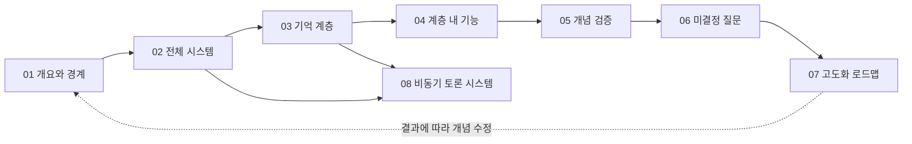

# Mnemome Cultural Memory 상세 설계 문서

이 디렉터리는 [Cultural Memory & Collective Intelligence 통합 문서](../cultural-memory-hivemind.md)의 각 최상위 장을 독립적으로 확장한다. 통합 문서는 전체 개념과 관계를 빠르게 파악하기 위한 기준 문서이고, 아래 문서는 각 영역의 책임, 절차, 개념 클래스와 활동 흐름을 상세히 설명한다.

## 문서 구성

| 통합 문서의 장 | 상세 문서 | 확장 범위 |
| --- | --- | --- |
| 1. 개요 | [01. 개요와 개념 경계](./01-overview-and-boundaries.md) | 문제 정의, 범위, 핵심 개념, 설계 불변조건 |
| 2. 전체 구성도와 시퀀스 | [02. 전체 시스템과 이중 루프](./02-system-architecture-and-workflows.md) | 전체 객체 관계, 실시간 실행, 느린 문화 학습, latency 경계 |
| 3. 계층별 구성도와 시퀀스 | [03. 기억 계층 상세](./03-memory-layers.md) | Working, Long-Term, Collaborative, Cultural Memory와 계층 전이 |
| 4. 계층 내 기능별 구성도와 시퀀스 | [04. Cultural Memory 기능 상세](./04-cultural-memory-functions.md) | Artifact 명세, 검증, 전달, 다양성, lineage, 안전 |
| 5. 개념 검증 시나리오 | [05. 개념 검증과 평가](./05-concept-validation.md) | Shortcut 사례, 실험 절차, 평가 차원, 성공·중단 기준 |
| 6. 아직 결정하지 않은 개념 질문 | [06. 미결정 질문과 의사결정](./06-open-concept-questions.md) | 질문 간 의존성, 결정 절차, 필요한 evidence |
| 7. 다음 컨셉 고도화 순서 | [07. 컨셉 고도화 로드맵](./07-concept-refinement-roadmap.md) | 단계별 산출물, 진입·종료 조건, 피드백 루프 |
| 횡단 관심사: 비동기 토론 | [08. Cultural Deliberation 시스템 설계](./08-cultural-deliberation-system.md) | 실행 plane 분리, 컴포넌트, 데이터 모델, 이벤트, 동시성, 장애와 관측성 |

## 읽는 순서

처음 읽는 경우 `01 → 02 → 03 → 04 → 05` 순서를 권장한다. 비동기 토론을 구현 관점에서 검토할 때는 `02 → 03 → 08` 순서로 읽는다. `06`과 `07`은 설계 결정을 진행하거나 다음 검증 범위를 정할 때 사용한다.

## 문서 간 일관성 규칙

1. 통합 문서의 용어와 상태명을 기준으로 사용한다.
2. 일반 상세 문서는 구현 기술을 결정하지 않는다. `08` 문서는 토론 경계를 구현 가능한 논리 컴포넌트와 contract 수준으로 구체화하되 특정 제품은 고정하지 않는다.
3. 클래스 다이어그램은 구현 클래스가 아니라 개념 객체와 책임을 나타낸다.
4. 활동 다이어그램은 logical procedure다. 시스템 문서에서 event stream, durable store, API boundary를 사용하더라도 특정 제품 선택과 동일시하지 않는다.
5. 상세 문서에서 개념이 변경되면 통합 문서의 요약과 다이어그램도 함께 갱신한다.
