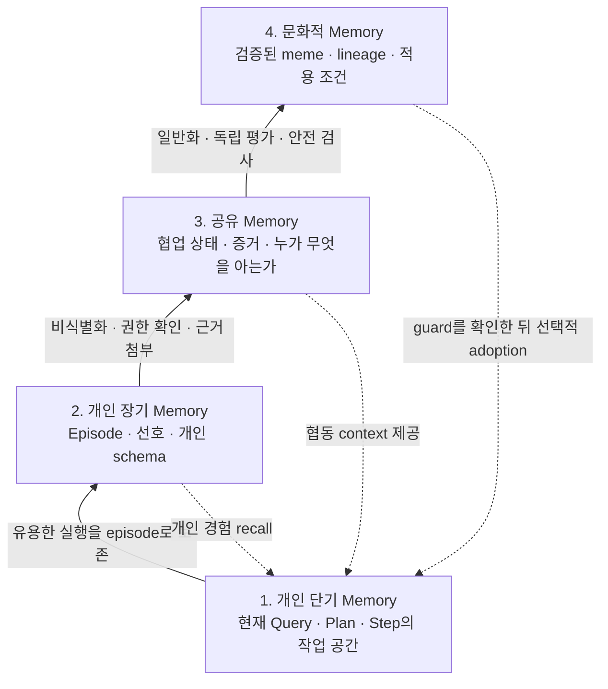
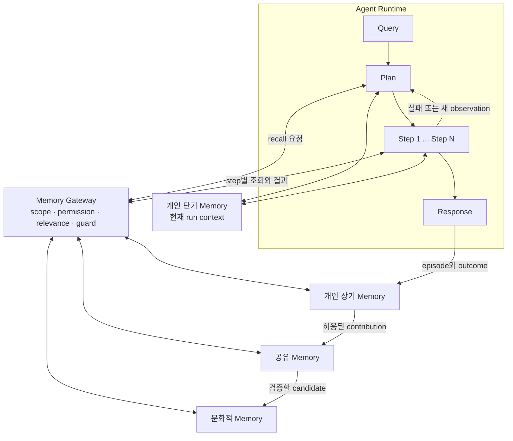
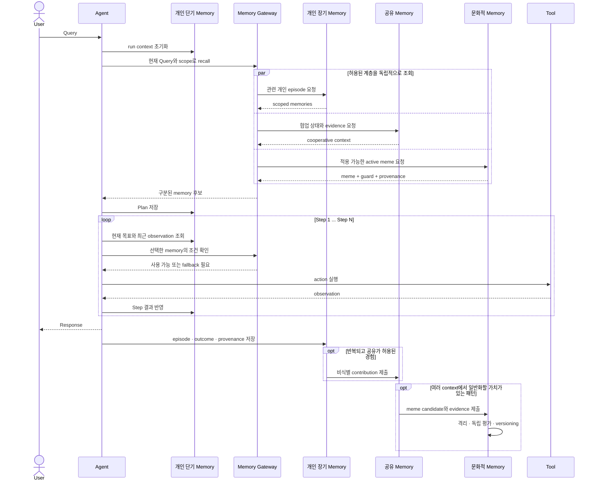
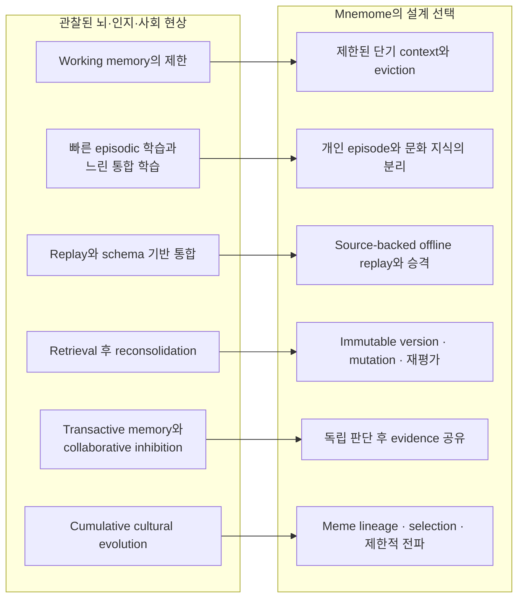

# Mnemome

> Agent의 경험을 개인 기억에서 협동 지식으로, 다시 검증된 문화로 성장시키는 계층형 memory library

## 이 문서에 대하여

이 문서는 Mnemome을 처음 접하는 사용자를 위한 개념 안내서다. 내부 데이터베이스나 API보다 다음 두 가지를 먼저 설명한다.

1. 이 library가 agent에게 어떤 memory 기능을 제공하려는가?
2. 그 설계가 어떤 뇌과학·인지과학 현상에서 아이디어를 얻었는가?

현재 프로젝트는 초기 설계 단계다. 아래 기능은 구현 완료 목록이 아니라 **library가 제공해야 할 사용자 경험과 설계 기준**이다.

Mnemome은 인간의 뇌를 그대로 복제하거나 의식을 구현하려는 프로젝트가 아니다. 뇌와 집단 기억에서 관찰된 원리를 software architecture에 선택적으로 적용한다.

---

## 1. Mnemome은 무엇을 해결하는가?

일반적인 agent는 하나의 요청을 다음과 같이 처리한다.

**Query → Plan → Step 1 → Step 2 → ... → Step N → Response**

Memory가 없다면 다음 요청에서는 상당 부분을 다시 시작해야 한다. 반대로 모든 기록을 하나의 전역 memory에 무조건 넣으면 오래된 정보, 개인정보, 다른 사용자의 맥락, 잘못된 해결법까지 함께 섞일 수 있다.

Mnemome은 memory를 하나의 거대한 저장소로 만들지 않는다. 수명, 소유자, 공유 범위, 검증 수준이 다른 네 계층으로 나눈다.

1. **개인 단기 memory:** 지금 처리 중인 Query의 작업 공간
2. **개인 장기 memory:** 한 agent 또는 사용자의 지속적인 경험
3. **공유 memory:** 여러 agent가 협동하기 위해 합의된 범위에서 공유하는 정보
4. **문화적 memory:** 여러 상황에서 독립적으로 검증되고 계보를 가진 재사용 지식인 meme

---

## 2. 한눈에 보는 memory 계층

아래로 갈수록 개인적이고 구체적이며 빠르게 기록된다. 위로 갈수록 더 넓게 공유되고 일반적이며, 승격에 더 많은 검증이 필요하다.

### Memory 계층 개념도

이 그림은 개념적 계층이다. 모든 정보가 반드시 네 단계를 모두 거쳐 올라가는 것은 아니다. 예를 들어 팀의 현재 작업 상태는 공유 memory에만 머물 수 있고, 개인 취향은 개인 장기 memory 밖으로 나가지 않을 수 있다.

### 계층별 차이

| 계층 | 소유 범위 | 대표 수명 | 저장하는 것 | 기록 조건 | 다시 사용할 때 |
| --- | --- | --- | --- | --- | --- |
| 개인 단기 | 한 agent run | 초~분, 또는 한 작업 | Query context, Plan, 최근 observation, 임시 결과 | 현재 작업에 필요함 | 같은 run에서 바로 사용 |
| 개인 장기 | agent/user | 여러 session | episode, 선호, 성공·실패 경험, 개인 schema | scope와 보존 정책 통과 | 관련성과 최신성을 확인해 recall |
| 공유 | team/tenant/island | 협업 기간 이상 | 작업 상태, 검증 가능한 사실, evidence, expertise map | 공유 권한과 provenance 확인 | 여러 agent가 협동 context로 사용 |
| 문화 | 허용된 population | version 단위로 장기 보존 | 일반화된 claim, skill, heuristic, norm과 검증 이력 | 독립 평가와 안전 검사를 통과 | guard 확인과 local trial 후 adoption |

상위 계층은 하위 계층보다 무조건 “더 참인 memory”가 아니다. 공유 범위와 일반화 수준이 더 넓기 때문에, 더 엄격한 검증과 회수 장치가 필요한 memory다.

---

## 3. Library가 제공하려는 기능

### 3.1 개인 단기 memory

한 번의 `Query → Plan → Steps → Response`를 처리하기 위한 제한된 작업 공간이다.

- 현재 목표와 구조화된 Plan 유지
- 최근 tool 결과와 observation 유지
- 다음 Step에 필요한 정보 선택
- context budget을 넘는 정보의 요약 또는 퇴출
- 실패 후 re-plan할 수 있는 checkpoint 유지
- Response가 끝나면 폐기하거나 개인 장기 memory용 episode로 정리

단기 memory는 모델의 비공개 chain-of-thought를 수집하는 기능이 아니다. 외부에서 검토 가능한 Plan, tool call, observation, outcome만 다룬다.

### 3.2 개인 장기 memory

Agent가 session을 넘어 자신의 경험을 활용할 수 있게 한다.

- 과거 episode의 저장과 검색
- 사용자 또는 agent의 선호와 제약 기억
- 성공뿐 아니라 실패와 정정 이력 보존
- 반복 episode에서 개인 schema 또는 shortcut 후보 발견
- source, timestamp, scope, retention policy 유지
- 관련성이 떨어지거나 오래된 기억의 감쇠·보관·삭제

개인 단기·장기 memory는 기본적으로 공유되지 않는다. 다른 계층으로 이동하려면 별도의 privacy, provenance, permission 검사를 거친다.

### 3.3 공유 memory — 협동 계층

여러 agent가 같은 memory를 복제하는 대신, 협업에 필요한 정보와 역할을 연결한다.

- 공동 작업의 현재 상태와 결정 기록
- 어떤 agent가 어떤 영역의 evidence 또는 전문성을 가졌는지 검색
- 서로 다른 agent가 제출한 evidence와 proposal 연결
- 먼저 독립적으로 판단하고 나중에 비교·집계하는 workflow
- tenant/team/island 단위 접근 제어
- 충돌하는 정보에 대한 disagreement map 유지

공유 memory는 “모두가 같은 생각을 갖는 공간”이 아니다. 서로 다른 판단을 잃지 않은 채 협동하기 위한 coordination layer다.

### 3.4 문화적 memory — meme 계층

여러 context에서 재사용할 가치가 확인된 지식을 versioned package로 관리한다.

Mnemome에서 **meme**은 단순한 문장이나 prompt가 아니다.

- 전파할 압축 표현
- 원래 근거와 자세한 실행 경로
- 적용 가능한 조건과 적용하면 안 되는 조건
- 재현 가능한 test
- 성공·실패 기록
- parent와 child를 연결하는 lineage
- version, scope, status, provenance

문화 계층은 다음 기능을 제공한다.

- 개인·공유 경험에서 meme candidate 생성
- 격리된 환경에서 privacy와 safety 검사
- 서로의 결론을 보지 않는 agent들의 독립 평가
- 검증된 meme의 제한적 배포와 adoption
- mutation 시 원본을 덮어쓰지 않는 child version 생성
- 오류 발견 시 descendant까지 추적하여 격리
- popularity가 아닌 accuracy, reproducibility, generalization, cost, safety의 다차원 평가

여기서 `meme`이라는 이름은 문화적 전파와 누적 개선을 설명하기 위한 engineering term이다. Meme을 뇌 안에서 발견되는 단일한 생물학적 기억 단위라고 주장하지 않는다.

---

## 4. Agent Workflow 안에서의 위치

Mnemome은 Agent Runtime 바깥에서 별도의 두뇌처럼 명령하지 않는다. Agent가 Plan을 세우고 Step을 실행할 때 필요한 memory를 제공하고, Response 이후의 결과를 적절한 계층에 보존한다.

### Agent와 memory 계층의 구조도

사용자는 하나의 gateway를 통해 memory를 사용한다. Gateway는 현재 agent와 tenant가 접근할 수 있는지, 지금 context와 관련이 있는지, meme의 guard가 충족되는지를 확인한다.

---

## 5. 일반적인 실행 순서

### Query부터 문화적 승격까지의 시퀀스 다이어그램

실시간 Response는 문화적 승격을 기다리지 않는다. 개인 경험을 문화로 승격하는 작업은 요청 처리와 분리된 느린 background workflow다.

---

## 6. 어떤 과학적 현상에서 영향을 받았는가?

Mnemome의 각 계층은 특정 뇌 부위를 그대로 흉내 낸 것이 아니다. 여러 연구에서 관찰된 **제한된 작업 공간, 빠른 episode 학습, 느린 통합, replay, schema, 기억 수정, 집단 협업, 문화적 누적**이라는 현상을 설계 원리로 번역한다.

### 과학적 현상과 library 설계의 연결 개념도

### 6.1 Working memory는 제한되어 있다

Working memory는 정보를 잠시 접근 가능한 상태로 유지하면서 처리하는 제한된 체계다. Cowan은 rehearsal이나 chunking의 영향을 분리했을 때 중심 용량이 평균적으로 약 네 chunk라는 연구들을 종합했다. 이는 모든 사람과 과제에 적용되는 고정 숫자라기보다, 단기 작업 공간이 무제한이 아니라는 근거다. ([Cowan, 2001](https://pubmed.ncbi.nlm.nih.gov/11515286/))

**설계에 준 영향:** 현재 Query에 필요한 정보만 단기 memory에 두고, relevance와 budget에 따라 요약하거나 퇴출한다. 인간의 “네 chunk”를 LLM token limit로 그대로 환산하지는 않는다.

### 6.2 빠른 episode 학습과 느린 구조 학습은 서로 다른 요구다

Complementary Learning Systems 이론은 hippocampal system이 새로운 episode를 빠르게 학습하고, neocortical system은 여러 경험을 천천히 섞어 구조를 추출한다는 계산적 설명을 제시한다. 빠른 학습만 사용하면 기존 지식에 간섭할 수 있고, 느린 학습만 사용하면 새로운 사건을 즉시 기억하기 어렵다. ([McClelland, McNaughton & O'Reilly, 1995](https://pubmed.ncbi.nlm.nih.gov/7624455/))

**설계에 준 영향:** 개인 장기 memory에는 episode를 빠르게 기록할 수 있지만, 넓게 전파되는 meme은 여러 source와 독립 평가를 거쳐 천천히 승격한다.

이 대응은 기능적 비유다. “개인 memory가 hippocampus이고 PostgreSQL이 neocortex다”처럼 software component와 뇌 부위를 일대일 대응시키지 않는다.

### 6.3 Replay는 최근 경험을 다시 활성화한다

Wilson과 McNaughton은 쥐가 공간 과제를 수행할 때 함께 활성화된 hippocampal place cell들이 이후 수면에서도 함께 활성화되는 경향을 관찰했다. 이는 최근 경험의 offline reactivation이 consolidation과 관련될 수 있다는 고전적 근거다. ([Wilson & McNaughton, 1994](https://pubmed.ncbi.nlm.nih.gov/8036517/))

**설계에 준 영향:** 실시간 요청과 분리된 background replay를 두고, 성공 사례뿐 아니라 실패·정정·소수 전략도 다시 평가한다. 자유롭게 이야기를 만들어 내는 replay가 아니라 source episode와 executable test가 있는 replay만 허용한다.

### 6.4 기존 schema는 새 지식의 통합을 도울 수 있다

Tse 등의 동물 실험에서는 이미 형성된 연합 schema와 일치하는 새로운 정보가 더 빠르게 장기 표현으로 통합될 수 있음을 보였다. ([Tse et al., 2007](https://pubmed.ncbi.nlm.nih.gov/17412951/))

**설계에 준 영향:** 반복되는 episode에서 schema와 shortcut을 추출하고, 새 정보가 기존 meme과 어떤 관계인지 parent, child, recombination으로 표현한다. 단, schema와 맞는다는 이유만으로 사실로 승인하지 않고 별도 검증한다.

### 6.5 기억은 retrieval 후에도 수정될 수 있다

Nader, Schafe, LeDoux의 쥐 fear-memory 실험은 안정화된 기억도 retrieval로 재활성화된 뒤 다시 불안정한 상태가 되어 reconsolidation을 필요로 할 수 있음을 보였다. ([Nader, Schafe & LeDoux, 2000](https://www.nature.com/articles/35021052))

**설계에 준 영향:** 사용된 memory를 영원히 고정된 정답으로 취급하지 않는다. 새로운 실패나 반례가 생기면 재평가하되, 기존 기록을 조용히 덮어쓰지 않고 새 version과 lineage를 만든다.

### 6.6 집단 기억은 “모두 합치기”만으로 좋아지지 않는다

Transactive memory 연구에서는 구성원이 서로의 전문 영역을 아는 것이 집단 수행에 도움을 줄 수 있었다. Moreland와 Myaskovsky의 실험에서 따로 훈련받았더라도 서로의 기술 정보를 받은 집단은 함께 훈련받은 집단과 비슷한 수행을 보였고, 단순히 따로 훈련받은 집단보다 나았다. ([Moreland & Myaskovsky, 2000](https://doi.org/10.1006/obhd.2000.2891))

한편 collaborative recall 실험에서는 실제 협업 집단이 개인 한 명보다 많이 회상했지만, 각 개인의 독립 회상을 합친 nominal group보다는 적게 회상하는 **collaborative inhibition**이 관찰되었다. ([Weldon & Bellinger, 1997](https://doi.org/10.1037/0278-7393.23.5.1160))

**설계에 준 영향:** 공유 memory는 모든 내용을 복제하지 않고 “어떤 agent가 어떤 evidence를 가졌는가”를 연결한다. 또한 다른 agent의 결론을 먼저 보여주지 않고 독립 proposal을 받은 뒤 집계한다.

집단 능력도 단순히 가장 똑똑한 개인 한 명으로 설명되지 않는다. Woolley 등의 두 연구에서는 다양한 과제에서 집단 수행을 설명하는 collective-intelligence factor가 관찰되었고, 평균 또는 최고 개인 지능보다 사회적 민감성과 발언 기회의 균등성과 관련되었다. ([Woolley et al., 2010](https://pubmed.ncbi.nlm.nih.gov/20929725/))

**설계에 준 영향:** 하나의 agent 평판이나 다수결 대신 domain별 calibration, evidence quality, source diversity, minority strategy를 함께 본다.

### 6.7 문화는 전파 과정에서 누적되고 변형된다

인공 언어를 사람들의 transmission chain으로 전달한 실험에서는 세대를 거치면서 전달하기 쉬운 compositional structure가 누적적으로 나타났다. 이는 문화적 정보가 단순 복사만 되는 것이 아니라 transmission과 learning을 거치며 적응적으로 구조화될 수 있음을 보여준다. ([Kirby, Cornish & Smith, 2008](https://doi.org/10.1073/pnas.0707835105))

**설계에 준 영향:** meme에 parent, child, version, mutation, evaluation을 둔다. 높은 fidelity와 유용한 variation을 함께 보존하되, 변화가 일어날 때마다 출처와 test 결과를 남긴다.

---

## 7. 안전을 위해 하지 않는 것

Mnemome은 다음을 목표로 하지 않는다.

- 모든 agent가 같은 memory를 실시간으로 공유하는 중앙 hive
- 개인 대화 원문을 자동으로 공유 memory에 복제하는 기능
- raw prompt나 외부 instruction을 곧바로 meme으로 전파하는 기능
- 사용 횟수나 popularity를 truth로 간주하는 기능
- 모델의 비공개 chain-of-thought를 저장하거나 공유하는 기능
- 기존 meme을 이력 없이 덮어쓰는 기능
- tenant 경계를 넘어 memory를 자동 전파하는 기능
- 인간의 뇌 구조를 정확히 시뮬레이션한다고 주장하는 기능

Memory가 넓게 공유될수록 privacy 검사, provenance, 독립 평가, rate limit, audit, rollback이 더 강해져야 한다.

---

## 8. 사용자가 기억할 핵심

Mnemome의 핵심은 “많이 기억하는 agent”가 아니다.

> 지금 필요한 것은 짧게 유지하고, 개인 경험은 범위를 지켜 오래 보존하며, 협업 정보는 차이를 잃지 않은 채 연결하고, 문화적 지식은 검증·계보·실패 기록과 함께 전파한다.

따라서 좋은 memory는 단순히 잘 검색되는 memory가 아니다. **왜 저장되었는지, 누구에게 허용되는지, 어떤 조건에서 유효한지, 실패했을 때 어떻게 되돌릴지를 설명할 수 있는 memory**다.

---

## 참고 문헌

- Cowan, N. (2001). [The magical number 4 in short-term memory](https://pubmed.ncbi.nlm.nih.gov/11515286/). *Behavioral and Brain Sciences, 24*(1), 87–114.
- McClelland, J. L., McNaughton, B. L., & O'Reilly, R. C. (1995). [Why there are complementary learning systems in the hippocampus and neocortex](https://pubmed.ncbi.nlm.nih.gov/7624455/). *Psychological Review, 102*(3), 419–457.
- Wilson, M. A., & McNaughton, B. L. (1994). [Reactivation of hippocampal ensemble memories during sleep](https://pubmed.ncbi.nlm.nih.gov/8036517/). *Science, 265*(5172), 676–679.
- Tse, D. et al. (2007). [Schemas and memory consolidation](https://pubmed.ncbi.nlm.nih.gov/17412951/). *Science, 316*(5821), 76–82.
- Nader, K., Schafe, G. E., & LeDoux, J. E. (2000). [Fear memories require protein synthesis in the amygdala for reconsolidation after retrieval](https://www.nature.com/articles/35021052). *Nature, 406*, 722–726.
- Moreland, R. L., & Myaskovsky, L. (2000). [Exploring the performance benefits of group training](https://doi.org/10.1006/obhd.2000.2891). *Organizational Behavior and Human Decision Processes, 82*(1), 117–133.
- Weldon, M. S., & Bellinger, K. D. (1997). [Collective memory: Collaborative and individual processes in remembering](https://doi.org/10.1037/0278-7393.23.5.1160). *Journal of Experimental Psychology: Learning, Memory, and Cognition, 23*(5), 1160–1175.
- Woolley, A. W. et al. (2010). [Evidence for a collective intelligence factor in the performance of human groups](https://pubmed.ncbi.nlm.nih.gov/20929725/). *Science, 330*(6004), 686–688.
- Kirby, S., Cornish, H., & Smith, K. (2008). [Cumulative cultural evolution in the laboratory](https://doi.org/10.1073/pnas.0707835105). *Proceedings of the National Academy of Sciences, 105*(31), 10681–10686.
