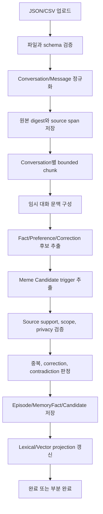

# 과거 대화 JSON/CSV 비동기 메모리 배치 수집 설계

## 1. 결론

과거 대화 목록을 JSON 또는 CSV로 업로드하고, 대화를 작은 단위로 나누어 비동기로 처리하면서
장기 기억, 선호 사항과 Meme 후보를 추출하는 기능은 현재 Mnemome 구조에 추가할 수 있다.

현재 구현에는 다음 기반이 이미 있다.

- `fact`, `preference`, `episode`, `conversation` 종류의 영속 메모리
- 각 메모리가 원문 어디에서 파생되었는지 나타내는 `SourceRef`
- 장기 기억 recall, correction, suppression API
- `DRAFT`, `PUBLISHED`, `WITHDRAWN` 상태를 갖는 Cultural Artifact
- SQLite 기반 파일럿 저장소와 domain outbox
- AgentRun event를 재생하는 SSE endpoint와 Playground의 누적 단계 표시 UI

반면 다음 기능은 아직 없다.

- 업로드 파일과 schema mapping
- 배치 작업, 대화별 작업 항목과 단계별 checkpoint
- 재시작 후 이어서 처리하는 durable worker
- 실시간 배치 진행률 stream
- 추출 결과의 중복·충돌 검증과 사용자 검토 화면
- Meme Candidate와 심의·승격 lifecycle의 실제 구현

따라서 이 기능은 기존 `AgentRun`을 파일 처리 작업으로 재사용하지 않고, 별도의
`MemoryImportJob` aggregate와 worker workflow로 추가한다.

---

## 2. 목표와 비목표

### 목표

- JSON/CSV 파일을 업로드하면 즉시 `202 Accepted`와 `job_id`를 반환한다.
- 대화 전체를 한 번에 LLM에 전달하지 않고 conversation과 chunk 단위로 처리한다.
- 처리 단계, 누적 처리량, 오류와 부분 성공 상태를 durable하게 저장한다.
- 새로고침, 연결 해제와 API process 재시작 이후에도 상태 조회와 재개가 가능하다.
- Conversation/Episode, Fact, Preference와 Meme Candidate를 source span과 함께 저장한다.
- 동일 파일과 동일 대화의 재처리가 중복 기억을 만들지 않도록 idempotent하게 처리한다.
- 작업 취소, 재시도, 실패 항목 확인과 결과 검토를 지원한다.
- 기존 memory API와 외부 Agent/Mnemome 책임 경계를 유지한다.

### 비목표

- 업로드한 모든 문장을 장기 기억으로 저장하기
- 과거 대화를 현재 AgentRun의 Working Memory로 영속화하기
- 추출된 Meme을 자동으로 active Cultural Snapshot에 게시하기
- Mnemome이 일반 사용자 응답이나 Agent plan을 생성하기
- 초기 SQLite 파일럿에서 다중 replica와 분산 worker를 완성하기
- 임의 CSV 형식을 사용자 확인 없이 추측하여 바로 저장하기

---

## 3. 메모리 계층 해석

과거 대화 import에서 화면에 `단기 메모리 작업 중`이라고 표시하면, 현재 Run에만 존재하는
Working Memory를 영속 저장하는 것으로 오해할 수 있다. 실제 pipeline은 다음처럼 구분한다.

| 단계 | 의미 | 영속 결과 |
| --- | --- | --- |
| 대화 문맥 분석 | 한 conversation 또는 chunk 안에서 발화 관계와 문맥을 임시로 구성 | worker checkpoint만 저장 |
| Conversation/Episode 저장 | 원본 대화와 사건 단위를 provenance와 함께 보존 | Long-Term Memory source |
| Fact 추출 | 이후 recall에 사용할 검증 가능한 사실 후보 추출 | `MemoryFact(kind="fact")` |
| Preference 추출 | 반복 적용할 명시적·지속적 선호 후보 추출 | `MemoryFact(kind="preference")` |
| Meme 후보 추출 | 여러 Episode에서 반복되는 절차·제약·실패 패턴 추출 | Candidate/DRAFT, 자동 게시 금지 |

따라서 사용자 표시 문구는 `단기 메모리 작업 중`보다 `대화 문맥 분석 중`을 기본으로 한다.
필요하면 보조 설명으로 `현재 대화 묶음의 임시 문맥을 구성하고 있습니다`를 표시한다.

---

## 4. 사용자 여정과 상태 표시

### 4.1 기본 여정

1. 사용자가 JSON 또는 CSV 파일을 선택한다.
2. 서버가 파일 크기, 형식과 digest를 검증한다.
3. schema를 자동 인식하거나 필드 mapping preview를 반환한다.
4. 사용자가 mapping과 import policy를 확인한다.
5. 서버가 durable job을 생성하고 `202 Accepted`를 반환한다.
6. worker가 대화별로 정규화, 추출, 검증과 저장을 수행한다.
7. UI는 polling 또는 SSE로 누적 상태를 표시한다.
8. 완료 후 생성·중복·보류·실패 결과와 provenance를 보여준다.
9. 사용자는 보류된 Preference/Meme Candidate를 검토, 승인, 수정 또는 폐기한다.

### 4.2 권장 사용자 표시 단계

```text
업로드 완료
데이터 검증 중
대화 정규화 중
대화 문맥 분석 중
장기 메모리 추출 중
선호 사항 추출·검증 중
Meme 후보 추출 중
중복·충돌 검사 중
저장 및 인덱싱 중
완료 / 부분 완료 / 실패 / 취소됨
```

각 단계는 단순 spinner만 표시하지 않고 다음 누적 값을 함께 제공한다.

- 전체 conversation 수와 완료 conversation 수
- 전체 message 수와 정규화된 message 수
- 생성, 중복, 충돌, 보류, 실패한 memory candidate 수
- 현재 단계와 마지막 성공 checkpoint 시각
- 재시도 횟수와 실패 항목 수
- 취소 요청 여부

처리 속도가 안정적으로 측정되기 전에는 부정확한 ETA를 표시하지 않는다. 대신
`320개 대화 중 127개 처리`처럼 확인 가능한 진행량을 우선한다.

### 4.3 내부 상태

```text
UPLOADED
VALIDATING
AWAITING_MAPPING
QUEUED
NORMALIZING
BUILDING_CONTEXT
EXTRACTING_MEMORIES
EXTRACTING_PREFERENCES
EXTRACTING_MEME_CANDIDATES
VALIDATING_CANDIDATES
PERSISTING
COMPLETED
PARTIALLY_COMPLETED
FAILED
CANCEL_REQUESTED
CANCELLED
```

표시 문구와 내부 enum을 분리해 API contract 변경 없이 다국어 UI를 제공한다.

---

## 5. 입력 계약

### 5.1 권장 CSV

CSV는 한 row를 한 message로 해석한다.

| 필드 | 필수 | 설명 |
| --- | --- | --- |
| `conversation_id` | 예 | 같은 대화를 묶는 안정적인 ID |
| `message_id` | 권장 | source와 재처리 중복 제거에 사용하는 ID |
| `role` | 예 | `user`, `assistant`, `system`, `tool` 등 |
| `content` | 예 | 발화 원문 |
| `timestamp` | 권장 | ISO 8601 또는 mapping에서 지정한 형식 |
| `title` | 아니오 | 대화 제목 |
| `metadata` | 아니오 | JSON object 또는 별도 mapping 대상 |

`message_id`가 없으면 정규화된
`conversation_id + role + timestamp + content digest`로 deterministic ID를 만든다.

### 5.2 권장 JSON

```json
{
  "version": "conversation-export-v1",
  "conversations": [
    {
      "id": "conversation-001",
      "title": "프로젝트 논의",
      "messages": [
        {
          "id": "message-001",
          "role": "user",
          "content": "앞으로 보고서는 한국어로 작성해 줘.",
          "timestamp": "2026-07-22T09:00:00+09:00"
        }
      ]
    }
  ]
}
```

실제 export 형식이 다를 수 있으므로 parser는 provider adapter와 사용자 mapping을 지원한다.
자동 감지가 실패하거나 필드 의미가 모호하면 저장 작업을 시작하지 않고 `AWAITING_MAPPING`으로 둔다.

### 5.3 파일 검증

- 허용 MIME type과 확장자 확인
- 압축 해제 크기, row/message 수와 message 길이 제한
- UTF-8/UTF-8-SIG 처리와 encoding 오류 보고
- CSV formula injection 문자를 export 화면에서 안전하게 처리
- JSON depth와 object 크기 제한
- binary, 실행 파일과 path traversal 거부
- 원본 digest와 schema version 기록
- tenant별 upload, storage와 동시 작업 quota 적용

---

## 6. Domain model

### 6.1 MemoryImportJob

```text
job_id
tenant_id
principal_id
status
stage
source_document_id
mapping_version
policy_version
total_conversations
processed_conversations
total_messages
processed_messages
created_candidates
duplicate_candidates
conflicting_candidates
failed_items
cancel_requested_at
last_checkpoint_at
failure
created_at
updated_at
version
```

### 6.2 SourceDocument

```text
source_document_id
tenant_id
content_digest
media_type
original_filename
object_locator
size_bytes
schema_version
classification
retention_policy_id
created_at
```

대형 원문은 object storage에 저장하고 DB에는 immutable locator와 digest만 둔다. SQLite 파일럿은
명시적으로 제한된 upload 디렉터리를 사용할 수 있지만, DB blob에 전체 파일을 넣지 않는다.

### 6.3 MemoryImportItem

conversation 단위로 상태를 분리한다.

```text
item_id
job_id
tenant_id
source_conversation_id
source_digest
status
attempt
message_count
checkpoint
failure_code
failure_detail
started_at
completed_at
```

### 6.4 ExtractionCandidate

```text
candidate_id
job_id
item_id
tenant_id
candidate_type
statement
confidence
source_refs
source_support
scope
classification
decision
duplicate_of
conflicts_with
extractor_version
created_at
```

`candidate_type`은 초기에는 `fact`, `preference`, `correction`, `meme`를 지원한다.
LLM output은 곧바로 MemoryFact가 아니라 Candidate로 저장하고 source support, scope와 중복 검사를
통과한 결과만 영속 기억으로 승격한다.

### 6.5 MemoryImportEvent

```text
event_id
job_id
tenant_id
sequence
event_type
stage
progress
payload
occurred_at
```

동일 job 안에서는 증가하는 `sequence`를 보장한다. SSE reconnect는 `Last-Event-ID` 이후 event부터
재생하고, replay가 끝나도 terminal state 전까지 새 event를 tail한다.

---

## 7. 처리 pipeline

### 7.1 전체 흐름



### 7.2 Chunking

- 기본 작업 단위는 conversation이다.
- 긴 conversation은 message boundary를 보존해 bounded chunk로 나눈다.
- 인접 chunk에는 제한된 overlap 또는 이전 chunk의 source-grounded summary만 전달한다.
- 전체 업로드 원문을 한 LLM request에 넣지 않는다.
- chunk summary도 source span을 잃지 않도록 원 message ID를 유지한다.
- prompt 안의 사용자 대화는 instruction이 아니라 untrusted data로 구분한다.

### 7.3 Memory extraction

Memory enrichment용 모델은 다음 typed output만 반환한다.

- candidate type
- statement 또는 preference condition/action
- confidence
- supporting message IDs와 span
- temporal scope와 지속성
- contradiction 또는 correction 대상 후보
- 저장하지 말아야 하는 이유

모델은 일반 사용자 답변, plan, tool 실행 또는 Cultural Snapshot 게시 결정을 수행하지 않는다.
schema invalid, source 없는 주장과 scope 불명확 결과는 자동 저장하지 않는다.

### 7.4 Preference 판정

다음과 같은 지속 의도가 확인될 때만 Preference 후보로 분류한다.

- `앞으로`, `항상`, `다음부터`처럼 지속성이 명시된 사용자 지시
- 여러 대화에서 반복되고 서로 모순되지 않는 선택
- 적용 조건과 행동을 source로 복원할 수 있는 규칙

일회성 요청, assistant가 추측한 취향, 민감정보와 과거에 철회된 선호는 자동 활성화하지 않는다.
새 후보가 기존 Preference와 충돌하면 `conflicting` 또는 `correction`으로 보류한다.

### 7.5 Meme Candidate 판정

Meme은 개인 선호의 다른 이름이 아니다. 여러 Episode에서 관찰되는 재사용 가능한 절차, 제약,
실패 경계와 복구 방법을 표현한다.

Candidate에 필요한 최소 정보:

- claim
- applicability condition
- baseline 또는 비교 대상
- failure boundary
- recovery
- provenance와 독립 evidence key

같은 source의 반복 표현을 여러 독립 근거로 세지 않는다. import 결과는 Candidate 또는 DRAFT까지만
만들며, deliberation/evaluation/governance를 거치지 않은 Meme을 publish하거나 active snapshot에 넣지 않는다.

---

## 8. API 초안

### 8.1 Upload와 mapping preview

```http
POST /v1/memory-imports:preview
Content-Type: multipart/form-data
```

응답:

```json
{
  "source_document_id": "src_...",
  "detected_format": "csv",
  "mapping": {
    "conversation_id": "conversation_id",
    "message_id": "message_id",
    "role": "role",
    "content": "content",
    "timestamp": "timestamp"
  },
  "sample": [],
  "warnings": []
}
```

### 8.2 Job 생성

```http
POST /v1/memory-imports
Content-Type: application/json
Idempotency-Key: <caller-generated-key>
```

```json
{
  "source_document_id": "src_...",
  "mapping": {},
  "policy": {
    "store_conversations": true,
    "extract_facts": true,
    "extract_preferences": true,
    "extract_meme_candidates": true,
    "preference_review": "conflicts_only",
    "meme_review": "always"
  }
}
```

응답은 `202 Accepted`와 `job_id`, 현재 상태, status/event URL을 반환한다.

### 8.3 조회와 제어

```http
GET  /v1/memory-imports/{job_id}
GET  /v1/memory-imports/{job_id}/events
GET  /v1/memory-imports/{job_id}/results
GET  /v1/memory-imports/{job_id}/errors
POST /v1/memory-imports/{job_id}:cancel
POST /v1/memory-imports/{job_id}:retry-failed
```

`results`는 cursor pagination을 사용한다. 원문 전체나 민감한 source span을 기본 목록 응답에 넣지 않는다.

---

## 9. Worker와 재시작 복구

### 9.1 SQLite 파일럿

초기 단일 replica profile은 다음 구조로 구현할 수 있다.

1. API transaction이 `MemoryImportJob(QUEUED)`와 outbox event를 먼저 저장한다.
2. API process 안의 단일 worker task가 lease 가능한 job을 claim한다.
3. worker는 conversation 단위 transaction과 checkpoint를 기록한다.
4. process 재시작 시 `QUEUED` 또는 lease가 만료된 processing job을 재개한다.
5. 각 candidate write는 source digest 기반 idempotency key를 가진다.
6. 취소 요청은 conversation/chunk 경계에서 협력적으로 적용한다.

단순 `FastAPI BackgroundTasks`만 사용하면 process 종료 시 실행 상태가 사라질 수 있으므로 사용하지 않는다.
worker task는 실행 수단일 뿐이고, authoritative 상태는 SQLite에 둔다.

### 9.2 Production profile

- PostgreSQL job/outbox가 authoritative source
- object storage에 immutable 원본 저장
- workload/tenant별 durable queue
- worker claim lease와 fencing token
- at-least-once delivery와 idempotent effect
- tenant별 concurrency, token, storage와 비용 quota
- extraction, embedding, Meme evaluation queue 분리
- API replica와 worker 독립 배포

---

## 10. 중복, 충돌과 재처리

### 동일 파일

`tenant_id + content_digest + mapping_version + policy_version`이 같으면 기존 job/result를 반환하거나
명시적으로 재처리 여부를 묻는다.

### 동일 대화

`source_conversation_id`와 normalized content digest로 duplicate item을 찾는다. 동일 source에서 파생된
candidate를 다시 실행하더라도 동일 deterministic candidate key를 사용한다.

### 유사 기억

- exact normalized statement match
- lexical/vector similarity
- 같은 subject와 scope
- temporal overlap
- source independence
- contradiction/correction relation

단순히 문장이 비슷하다는 이유로 기존 Fact를 덮어쓰지 않는다. 새 근거가 correction이면 기존 Fact를
`SUPERSEDED`로 전환할지 사용자 검토가 필요한지 policy로 결정한다.

### 부분 실패

한 conversation의 parse 또는 extraction 실패가 전체 job을 실패시키지 않는다. 성공 item은 commit하고
실패 item은 오류 코드, attempt와 checkpoint를 남긴다. 성공 item이 하나라도 있고 실패 item이 있으면
job은 `PARTIALLY_COMPLETED`가 된다.

---

## 11. Privacy와 보안

- tenant와 principal authorization을 upload, job, result와 source 조회마다 다시 확인한다.
- 원본 대화는 untrusted content이며 prompt instruction으로 실행하지 않는다.
- system prompt 탈취, tool 호출 유도와 memory poisoning 패턴을 검사하고 provenance와 함께 격리한다.
- PII/credential/sensitive category 탐지 후 redaction 또는 review policy를 적용한다.
- raw source, derived memory와 audit metadata에 서로 다른 retention policy를 적용할 수 있게 한다.
- source deletion 시 연결된 Fact, Preference, Candidate와 index projection을 provenance-aware하게 처리한다.
- 파일명은 표시용 metadata로만 사용하고 server path로 사용하지 않는다.
- log에는 원문 message, token, credential과 전체 extracted statement를 기본적으로 남기지 않는다.
- Meme 후보는 tenant/population scope를 넘겨 자동 공유하지 않는다.

---

## 12. Observability

### Metric

- `memory_import_jobs_total{status}`
- `memory_import_items_total{status}`
- `memory_import_stage_duration_seconds{stage}`
- `memory_import_messages_processed_total`
- `memory_import_candidates_total{type,decision}`
- `memory_import_retry_total{reason}`
- `memory_import_queue_lag_seconds`
- `memory_import_llm_tokens_total{processor}`

### Structured log

`tenant_id`, `job_id`, `item_id`, `stage`, `attempt`, `extractor_version`, `error_code`를 포함하되
대화 원문과 민감한 source span은 제외한다.

### Trace

upload request, job claim, conversation normalization, bounded extraction, validation, persistence와 index event를
하나의 trace lineage로 연결한다.

---

## 13. 구현 단계

### Phase 1: Durable import skeleton

- `MemoryImportJob`, `MemoryImportItem`, `MemoryImportEvent`, store port 추가
- SQLite migration과 in-memory adapter 구현
- JSON/CSV preview와 mapping validation
- job 생성, 상태 조회, 취소 API
- 재시작 복구 가능한 단일 worker
- polling 기반 진행률 UI

Exit criteria:

- LLM 없이도 1,000개 message를 정규화하고 conversation memory로 저장한다.
- process 재시작 후 같은 job을 이어서 처리한다.
- 동일 파일 재요청이 중복 conversation을 만들지 않는다.

### Phase 2: Long-Term Memory extraction

- typed `MemoryEnrichmentProcessor` port
- Fact/Preference/Correction candidate와 source span
- conversation별 bounded extraction과 retry budget
- exact/semantic duplicate와 contradiction 검사
- 결과·오류·검토 API

Exit criteria:

- 모든 저장된 derived memory가 유효한 source ref를 가진다.
- 잘못된 schema와 source 없는 결과가 자동 저장되지 않는다.
- 부분 실패 job을 실패 item만 재시도할 수 있다.

### Phase 3: Live progress UI

- import event replay + live tail SSE
- 누적 단계 상태와 reconnect
- 새로고침 후 job 복원
- mapping preview, 결과 검토와 conflict resolution UI

Exit criteria:

- `Last-Event-ID` reconnect에서 event 누락·중복 효과가 없다.
- 완료된 단계가 화면에서 다시 pending으로 돌아가지 않는다.
- mobile 화면에서도 현재 단계와 누적 처리량을 확인할 수 있다.

### Phase 4: Meme Candidate와 production worker

- 명시적인 Meme Candidate aggregate
- evidence independence, condition, baseline, failure와 recovery 검증
- deliberation/evaluation/governance 연결
- PostgreSQL/object storage/distributed worker adapter
- tenant quota, backpressure와 operational runbook

Exit criteria:

- import만으로 Candidate가 publish되지 않는다.
- source부터 Candidate와 최종 Artifact까지 lineage를 추적할 수 있다.
- worker 중복 실행과 lease 만료에서도 결과 effect는 idempotent하다.

---

## 14. 테스트 전략

### Unit

- CSV/JSON schema mapping과 normalization
- deterministic digest/ID
- state transition과 취소
- chunk boundary와 source span
- duplicate/conflict 판정
- Preference 지속성 판정 contract

### Integration

- SQLite job/item/event transaction
- process restart와 expired lease recovery
- partial failure와 retry-failed
- same-file and same-conversation idempotency
- derived memory provenance와 suppression/deletion propagation

### API contract

- tenant isolation과 role authorization
- upload size/type/schema 오류
- `202`, status, pagination, cancel과 error envelope
- SSE replay, live tail과 reconnect

### Security

- prompt injection이 포함된 대화
- formula injection CSV
- zip bomb, excessive JSON depth와 oversized message
- credential/PII redaction
- cross-tenant job/source ID 접근

### Acceptance

1. JSON/CSV를 업로드하면 API가 빠르게 `job_id`를 반환한다.
2. UI에서 요청한 단계와 누적 처리량을 볼 수 있다.
3. 대용량 파일도 conversation/chunk 단위로 처리한다.
4. 서버 재시작 후 작업이 유실되지 않는다.
5. 생성된 Fact와 Preference에서 원 message를 추적할 수 있다.
6. 동일 파일 재업로드가 기억을 중복 생성하지 않는다.
7. 실패한 conversation만 별도로 확인하고 재시도할 수 있다.
8. Meme 결과는 Candidate/DRAFT로 남고 자동 게시되지 않는다.

---

## 15. 권장 MVP 범위

첫 구현은 다음 범위로 제한한다.

- JSON/CSV upload와 mapping preview
- conversation/message normalization
- SQLite durable job/item/event
- 단일 재시작 복구 worker
- Conversation/Episode, Fact와 Preference 후보 추출
- exact duplicate와 conflict 보류
- polling 상태 조회와 단계별 진행률 UI
- 취소, 부분 성공, 실패 항목 재시도
- Meme은 source가 연결된 Candidate/DRAFT 생성까지만 지원

실시간 SSE, semantic deduplication, vector index, 분산 worker와 Meme deliberation은 MVP의 저장·재시작·
provenance contract가 검증된 뒤 확장한다.
