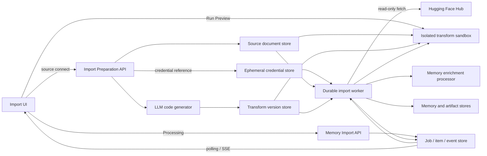
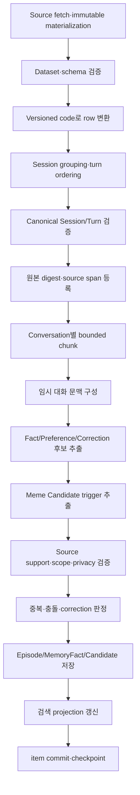
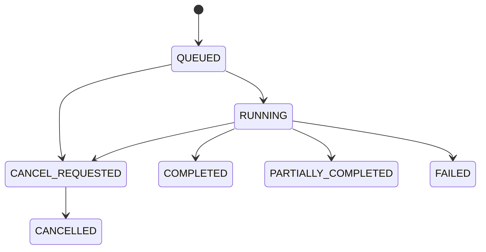

# 정규화된 멀티턴 대화 비동기 메모리 수집 설계

## 1. 요약

Mnemome에 local upload 또는 Hugging Face Hub dataset을 연결하고, sample row를 이용해 session 변환을
미리 확인한 뒤 장기 기억을 생성하는 비동기 배치 기능을 추가한다. 준비 단계에서는 LLM이 editable
transform code를 생성하고 UI가 `[원본 샘플] [변환 코드] [결과 미리보기]`를 제공한다. 이 단계에서는
sample만 격리된 sandbox에서 실행하며 메모리를 저장하지 않는다.

사용자가 `Processing`을 누르면 선택한 source revision과 transform code version을 고정한 durable job을
만들고 `202 Accepted`와 `job_id`를 반환한다. worker는 source를 immutable snapshot으로 확보하고 전체
row를 `sessionId + conversation[]` 구조로 변환한 뒤 session/chunk 단위로 Fact, Preference, Correction과
Meme 후보를 추출한다.

이 기능은 기존 `AgentRun`을 재사용하지 않는다. `AgentRun`은 현재 상호작용의 실행 기록이고,
과거 대화 가져오기는 재시작 복구, 부분 실패, 재처리와 검토가 필요한 별도 배치 수명주기를 갖기 때문이다.
따라서 `MemoryImportJob` aggregate와 전용 worker workflow를 추가한다.

### 현재 기반과 새로 필요한 요소

| 활용할 기존 기반 | 새로 구현할 요소 |
| --- | --- |
| `fact`, `preference`, `episode`, `conversation` 영속 메모리 | 정규화된 입력 schema 검증과 원본 보관 |
| 파생 위치를 나타내는 `SourceRef` | batch job, session item과 checkpoint |
| recall, correction과 suppression API | 재시작 복구가 가능한 durable worker |
| `DRAFT`, `PUBLISHED`, `WITHDRAWN` Cultural Artifact | 추출 결과의 중복·충돌 검증과 검토 흐름 |
| SQLite 저장소와 domain outbox | import 진행률 조회와 event stream |
| AgentRun event replay SSE와 누적 단계 UI | Hugging Face source adapter와 임시 credential 관리 |
|  | LLM code generation, preview sandbox와 transform versioning |
|  | Meme Candidate와 심의·승격 lifecycle |

### 핵심 결정

| 항목 | 결정 |
| --- | --- |
| 실행 모델 | API와 분리된 durable asynchronous job |
| 입력 source | local JSON/JSONL upload 또는 Hugging Face dataset |
| 준비/실행 경계 | sample preview는 side-effect 없음, `Processing`부터 durable import job 생성 |
| 변환 모델 | row별 `SessionFragment` 생성 후 `sessionId`별 grouping/finalization |
| 코드 관리 | LLM 생성 code도 사용자 code와 동일하게 version/digest/runtime을 고정 |
| 코드 실행 | API process가 아닌 network-disabled sandbox에서 preview와 production 모두 실행 |
| 기본 작업 단위 | session, 긴 대화는 발화 경계를 보존한 bounded chunk |
| 외부 source 고정 | 요청 revision을 commit SHA로 resolve한 뒤 immutable snapshot으로 materialize |
| 저장 방식 | LLM 결과를 먼저 `ExtractionCandidate`로 저장한 뒤 검증·중복 검사 후 승격 |
| 출처 추적 | 모든 파생 기억은 원 `sessionId`, `message_index`와 span을 가리키는 `SourceRef` 필수 |
| 중복 방지 | dataset, session, candidate 수준의 deterministic key 사용 |
| 실패 처리 | session별 commit, 일부 실패는 `PARTIALLY_COMPLETED` |
| 진행률 | MVP는 polling, 이후 event replay와 live-tail SSE 추가 |
| Preference | 지속성이 확인된 항목만 저장하고 충돌·수정 후보는 검토 보류 |
| Meme | Candidate/DRAFT까지만 생성하며 자동 publish 금지 |
| 초기 저장소 | SQLite + 제한된 파일 저장소 + 단일 복구 가능 worker |
| Hugging Face token | public dataset은 생략, private/gated dataset은 만료되는 encrypted credential reference 사용 |
| 운영 확장 | PostgreSQL + object storage + durable queue + 분산 worker |

### MVP와 후속 범위

| MVP | 후속 확장 |
| --- | --- |
| canonical session schema와 JSON/JSONL adapter | Parquet 등 입력 adapter 확대 |
| public/private Hugging Face dataset adapter | OAuth/token exchange와 조직용 credential 연동 |
| sample, LLM code generation과 3-pane preview | 고급 transform template/library |
| sandboxed transform과 code versioning | distributed transform executor |
| SQLite durable job/item/checkpoint | PostgreSQL과 분산 worker |
| polling 기반 진행률 | replay 가능한 SSE |
| Fact/Preference/Correction 후보 | 정교한 Meme 심의·승격 workflow |
| exact duplicate와 명시적 충돌 보류 | semantic deduplication과 vector index |
| 취소, 부분 성공, 실패 항목 재시도 | tenant별 queue 분리와 고급 backpressure |

---

## 2. 목표, 비목표와 불변 조건

### 2.1 목표

- 검증된 source와 transform version의 `Processing` 요청에 빠르게 `job_id`를 반환한다.
- public, private와 gated Hugging Face dataset을 같은 pipeline으로 가져올 수 있다.
- sample row와 입력 schema를 바탕으로 LLM이 session 변환 code를 제안한다.
- 사용자가 code를 수정하고 sample 결과를 반복 실행한 뒤 전체 처리를 명시적으로 시작한다.
- 전체 dataset을 한 번에 LLM에 전달하지 않고 session/chunk 단위로 처리한다.
- 상태, 누적 처리량, 오류와 checkpoint를 durable하게 저장한다.
- 새로고침, 연결 해제와 API process 재시작 후에도 상태 조회와 재개가 가능하다.
- Conversation/Episode, Fact, Preference와 Meme Candidate를 source span과 함께 저장한다.
- 동일 입력의 재처리가 중복 기억이나 중복 side effect를 만들지 않게 한다.
- 작업 취소, 실패 항목 재시도와 결과 검토를 지원한다.
- 기존 memory API와 외부 Agent/Mnemome 책임 경계를 유지한다.

### 2.2 비목표

- 업로드한 모든 문장을 장기 기억으로 저장하기
- 과거 대화를 현재 `AgentRun`의 Working Memory로 영속화하기
- 추출된 Meme을 active Cultural Snapshot에 자동 게시하기
- Mnemome이 일반 사용자 응답, Agent plan 또는 tool 실행을 생성하기
- 초기 SQLite 버전에서 다중 replica와 분산 worker까지 완성하기
- 임의 provider export 형식을 core worker가 직접 추측하거나 mapping하기
- Hugging Face dataset의 custom code 또는 외부 download script를 실행하기
- preview 실행만으로 전체 dataset을 변환하거나 메모리를 저장하기

### 2.3 반드시 지켜야 할 불변 조건

1. 파생된 기억은 하나 이상의 유효한 `SourceRef`를 가져야 한다.
2. source가 없거나 typed schema 검증에 실패한 LLM 결과는 활성 기억이 될 수 없다.
3. 하나의 session 실패가 이미 성공한 session을 rollback하지 않는다.
4. 동일 idempotency key의 재실행은 동일한 최종 effect를 만든다.
5. 취소와 재시도는 session 또는 chunk checkpoint 경계에서만 상태를 변경한다.
6. Meme import 결과는 심의 없이 `PUBLISHED` 상태가 될 수 없다.
7. raw source와 민감한 span은 목록 API, log와 event payload에 기본 포함하지 않는다.
8. preview run은 sample source 밖의 데이터, network, credential과 memory store에 접근할 수 없다.
9. production job은 시작 시 선택한 transform code digest를 고정하며 이후 editor 변경의 영향을 받지 않는다.
10. 모든 canonical turn은 sandbox가 위조할 수 없는 raw source row lineage를 가져야 한다.

---

## 3. 사용자 흐름과 진행률

### 3.1 사용자 흐름

1. 사용자가 local upload 또는 Hugging Face dataset을 source로 선택한다.
2. Hugging Face source라면 `repo_id`, config, split, revision과 필요한 경우 read token을 입력한다.
3. 서버가 source schema와 제한된 sample row를 읽어 `ImportPreparation`을 만든다.
4. LLM이 input schema, sample과 사용자 설명을 바탕으로 transform code 초안을 생성한다.
5. UI가 원본 sample, code editor와 변환 결과를 한 화면에 보여준다.
6. 사용자는 code를 수정하고 `Run Preview`로 sample 실행을 반복한다.
7. preview가 canonical schema와 품질 검사를 통과하면 `Processing` 버튼을 활성화한다.
8. 사용자가 `Processing`을 누르면 source revision과 transform version을 고정해 `MemoryImportJob`을 만든다.
9. API는 `202 Accepted`와 `job_id`를 반환한다.
10. worker가 전체 source를 materialize하고 transform/grouping/validation을 수행한다.
11. worker가 session별로 chunking, memory extraction, 검증과 저장을 수행한다.
12. 완료 후 생성, 중복, 충돌, 보류와 실패 결과를 provenance와 함께 보여준다.

### 3.2 Preview 화면

```text
┌────────────────────┬────────────────────────┬────────────────────┐
│ 원본 sample        │ 변환 code              │ 결과 preview       │
│ raw row + schema   │ editable editor        │ canonical sessions │
│ row 0..N           │ revision / diagnostics │ warnings / diff    │
└────────────────────┴────────────────────────┴────────────────────┘
                 [Run Preview]  [Processing]
```

- 원본 panel은 sample fingerprint, row index와 잘린 field 여부를 표시한다.
- code panel은 LLM 생성 여부, code revision, runtime version과 정적 분석 오류를 표시한다.
- 결과 panel은 완성된 session 몇 개, turn 순서, validation warning과 raw-row lineage를 표시한다.
- `Run Preview`는 새 `PreviewRun`을 만들 뿐 job이나 memory write를 만들지 않는다.
- code가 변경되면 이전 preview는 stale로 표시하고 `Processing`을 다시 비활성화한다.
- `Processing` 전에는 선택된 source revision, code digest, 예상 row/session 수와 비용 상한을 확인한다.

화면에 표시하고 LLM에 제공하는 sample은 기본적으로 source의 deterministic head window를 사용한다.
별도의 더 큰 bounded profile window에서는 원문을 보관하지 않고 field type, null/unique 비율, candidate
session key 중복률과 list 길이 같은 통계만 계산한다. session이 여러 row에 걸쳐 있으면 결과에
`sample_partial=true`를 표시한다. 사용자는 head 크기 또는 sample seed를 바꿔 다시 확인할 수 있다.

### 3.3 Processing 상태 표시

```text
source 연결 완료
원본 데이터 가져오는 중
전체 데이터 변환 중
session 구성·정렬 중
데이터 검증 중
대화 정규화 중
대화 문맥 분석 중
장기 메모리 추출 중
선호 사항 추출·검증 중
Meme 후보 추출 중
중복·충돌 검사 중
저장 및 인덱싱 중
완료 / 부분 완료 / 실패 / 취소됨
```

`단기 메모리 작업 중`이라는 문구는 사용하지 않는다. 이 단계는 Working Memory를 저장하는 것이 아니라
현재 chunk의 발화 관계와 문맥을 임시로 구성하는 작업이므로 `대화 문맥 분석 중`으로 표시한다.

각 단계에는 spinner뿐 아니라 다음 누적 값을 함께 제공한다.

- 전체/변환 완료 raw row 수와 제외·오류 row 수
- emitted fragment 수와 구성된 session 수
- 전체/완료 session 수
- 전체/정규화 완료 turn 수
- 생성, 중복, 충돌, 보류와 실패 candidate 수
- 현재 단계와 마지막 성공 checkpoint 시각
- 재시도 횟수와 실패 item 수
- 취소 요청 여부

처리 속도가 충분히 안정화되기 전에는 ETA를 제공하지 않는다. `320개 session 중 127개 처리`처럼
서버가 확인할 수 있는 진행량을 우선한다.

---

## 4. 입력 계약

### 4.1 Canonical output schema

transform/grouping이 완료된 dataset의 한 record는 하나의 멀티턴 session이어야 한다.

```yaml
- name: sessionId
  dtype: string
- name: conversation
  list:
    - name: content
      dtype: string
    - name: role
      dtype: string
    - name: timestamp
      dtype: string
```

| 필드 | 조건 | 의미 |
| --- | --- | --- |
| `sessionId` | 필수, non-empty, 결과 안에서 unique | session과 `MemoryImportItem`의 source ID |
| `conversation` | 필수, non-empty list | 시간 순서가 보존된 멀티턴 발화 목록 |
| `conversation[].content` | 필수 string | 발화 원문 |
| `conversation[].role` | 필수, non-empty string | `user`, `assistant`, `system`, `tool` 등 발화 주체 |
| `conversation[].timestamp` | 필수 string | 원본 발화 시각. 정렬 key로 사용하지 않음 |

`conversation`의 배열 순서가 authoritative turn order다. worker는 `timestamp`를 기준으로 발화를
재정렬하지 않는다. timestamp는 temporal scope 판정과 표시를 위한 metadata로만 사용하며, 인식 가능한
형식은 ISO 8601로 정규화하되 원본 문자열도 provenance에 보존한다.

### 4.2 이미 canonical인 local upload 예시

source가 이미 canonical schema라면 identity transform을 사용한다. local MVP transport는 JSON array 또는
session당 한 줄인 JSONL을 사용한다. 다음은 JSON array 예시다.

```json
[
  {
    "sessionId": "session-001",
    "conversation": [
      {
        "content": "앞으로 보고서는 한국어로 작성해 줘.",
        "role": "user",
        "timestamp": "2026-07-22T09:00:00+09:00"
      },
      {
        "content": "알겠습니다. 이후 보고서는 한국어로 작성하겠습니다.",
        "role": "assistant",
        "timestamp": "2026-07-22T09:00:02+09:00"
      }
    ]
  }
]
```

CSV나 provider 원본처럼 canonical 구조가 아닌 source는 transform code가 `SessionFragment`로 변환한다.
Parquet처럼 list/struct를 보존하는 형식은 source adapter가 raw row와 schema를 preview service에 제공한다.

### 4.3 Message identity와 provenance

canonical output에 `messageId`가 없으므로 배열 index를 포함한 deterministic ID를 만든다.

```text
message_id = sha256(
  input_schema_version
  + sessionId
  + message_index
  + normalized_role
  + timestamp
  + content_digest
)
```

`SourceRef`는 최소한 다음 위치 정보를 가진다.

```text
source_document_id
transform_version_id
sessionId
message_index
start_char
end_char
raw_row_refs
```

`start_char`와 `end_char`는 canonical turn content 기준이며 `raw_row_refs`가 원본 row로 이어진다. session
digest는 `sessionId`와 순서가 보존된 전체 conversation의 canonical representation으로 계산한다. 따라서
동일 source/code로 재처리하면 같은 item key가 생성되고, 발화 내용·순서·transform version이 바뀌면 새
source version으로 구분된다.

### 4.4 Source와 canonical output 검증

- 허용 media type, 파일 크기와 실제 content signature 확인
- source 형식별 문법, depth, record 수와 message 길이 제한
- UTF-8/UTF-8-SIG 처리와 encoding 오류 보고
- fragment의 `sessionId` 누락과 빈 값 거부
- `conversation` 누락, 빈 list와 잘못된 element type 거부
- 각 발화의 `content`, `role`, `timestamp` type 확인
- 알려진 role alias는 canonical role로 정규화하고 지원하지 않는 role은 명시적 오류 처리
- timestamp parse 실패는 policy에 따라 warning 또는 item failure로 처리하되 순서를 변경하지 않음
- binary, 실행 파일, path traversal과 zip bomb 거부
- 원본 digest와 `input_schema_version` 기록
- tenant별 upload, storage, 동시 작업과 비용 quota 적용

source 자체가 깨졌거나 transform을 실행할 수 없으면 job 전체를 `FAILED` 처리한다. 동일 `sessionId`를
가진 fragment는 의도적으로 하나의 session으로 합친다. grouping 이후 개별 canonical session만 유효하지
않으면 해당 item을 `FAILED`로 남기고 나머지 session을 계속 처리한다.

### 4.5 Hugging Face Hub source

Hugging Face source는 dataset의 실제 Parquet, JSON 또는 Arrow row와 feature schema를 preview/transform
service에 제공한다. 원본 row가 4.1과 달라도 transform/grouping 결과가 canonical output schema를
만족하면 처리할 수 있다.

요청 필드는 다음과 같다.

| 필드 | 필수 여부 | 설명 |
| --- | --- | --- |
| `repo_id` | 필수 | `namespace/dataset-name` 형태의 Hub dataset ID |
| `config` | 조건부 | config가 여러 개인 dataset에서는 필수 |
| `split` | 필수 | 가져올 split. MVP는 요청당 하나만 허용 |
| `revision` | 선택 | branch, tag 또는 commit SHA. 기본값은 `main` |
| `credential_ref` | 조건부 | private/gated dataset 접근용 임시 credential reference |
| `streaming` | 선택 | 큰 dataset을 점진적으로 materialize할지 여부. 기본값 `true` |

worker의 fetch 절차는 다음과 같다.

1. Hub metadata를 조회해 dataset 존재 여부, 접근 권한, config, split과 예상 크기를 확인한다.
2. 요청 revision을 commit SHA로 resolve하고 `SourceDocument.resolved_revision`에 기록한다.
3. `load_dataset(repo_id, config, split=split, revision=sha, token=token, streaming=true)`와 동등한
   read-only adapter로 row를 순회한다. public source에는 implicit login을 막기 위해 token 사용을
   명시적으로 비활성화한다.
4. 각 raw row를 안전하게 decode하면서 제한된 크기의 immutable shard로 source store에 저장한다.
5. shard digest와 전체 source digest를 계산하고 quota를 확인한다.
6. materialization이 끝나면 credential을 즉시 폐기하고 full transform을 시작한다.

private dataset은 token이 필요하고, gated dataset은 token 소유 계정이 해당 dataset 접근 승인을 이미
받아야 한다. public dataset은 token 없이도 동작해야 한다. 운영 환경에서는 dataset 하나에만 read 권한이
있는 Hugging Face fine-grained token을 권장한다.

재현성과 안전성을 위해 다음 제약을 적용한다.

- branch 이름만 provenance에 남기지 않고 실제 resolved commit SHA를 저장한다.
- dataset repository의 data file만 읽고 arbitrary custom code, remote dataset script와 tool을 실행하지 않는다.
- `repo_id`는 Hub dataset 식별자로만 받고 임의 URL이나 filesystem path를 허용하지 않는다.
- 추출 전에 source를 내부 immutable shard로 materialize해 Hub 변경과 일시적 장애로부터 분리한다.
- record, byte, request 시간과 redirect에 quota를 적용하고 허용된 Hub endpoint로만 egress한다.
- Hub의 `401`, `403`, `404`, `429`를 내부 오류 코드로 구분하며 token 값은 오류에 포함하지 않는다.

### 4.6 Source layout 자동 판별

source profiler와 LLM은 schema, sample과 bounded 통계를 이용해 다음 layout 후보를 제안한다.

| Layout | 관찰 예시 | 변환 방식 |
| --- | --- | --- |
| `SESSION_PER_ROW` | session key가 unique이고 한 row에 turn list가 있음 | row 하나를 fragment 하나로 변환 |
| `TURN_PER_ROW` | 같은 session key가 반복되고 row마다 scalar content/role이 있음 | row마다 한 turn을 emit한 뒤 grouping |
| `SESSION_FRAGMENT_PER_ROW` | 같은 session key가 반복되고 각 row에 여러 turn이 있음 | row별 turn list를 emit한 뒤 merge |
| `REUSED_SESSION_ID_SUSPECTED` | 같은 ID 안에서 turn index reset 또는 명시적 thread 경계가 반복됨 | composite key 제안 후 사용자 확인 |
| `MIXED_OR_AMBIGUOUS` | 위 형태가 섞이거나 sample 근거가 부족함 | 사용자 확인 및 더 큰 preview 요구 |

판별 근거에는 다음 항목을 사용한다.

- candidate session ID field의 null 비율, distinct 수와 반복률
- nested list/struct field의 존재와 평균·최대 길이
- content, role, timestamp로 보이는 scalar/list field 조합
- turn index, sequence 또는 정렬 가능한 candidate field의 존재와 중복률
- 동일 session ID row가 연속 또는 비연속으로 나타나는지 여부
- 같은 session ID 안의 turn index reset, 시작 marker, thread/episode field와 비정상적으로 큰 시간 간격

UI는 `감지된 layout`, confidence, session key, turn field, order key와 근거를 보여주고 사용자가 override할
수 있게 한다. confidence가 낮거나 multi-row session에 신뢰할 order key가 없으면 `Processing`을 기본적으로
차단하고 더 큰 sample, 사용자 mapping 또는 명시적 확인을 요구한다. head sample에서 session ID가 모두
unique하다는 사실만으로 `SESSION_PER_ROW`를 확정하지 않는다.

layout 판별 결과는 code generation을 돕는 hint일 뿐 execution branch가 아니다. runtime은 모든 형태에
대해 항상 `SessionFragment emit → sessionId grouping → turn ordering → canonical validation`을 수행한다.
따라서 한 row에 session 전체가 있으면 group size가 1이고, 같은 session ID가 여러 row에 있으면 모두
하나로 합쳐지며, 각 row가 여러 turn을 가진 혼합 형태도 같은 finalizer를 사용한다.

단, raw session ID가 서로 다른 논리적 session에서 재사용된 것으로 의심되면 그대로 grouping하지 않는다.
thread ID, episode ID, 날짜 bucket처럼 row 자체에서 복원 가능한 경계가 있으면 LLM이
`raw_session_id + boundary_field` 형태의 composite `sessionId` code를 제안한다. 명시적 경계가 없고 시간
간격이나 대화 패턴만으로 추정해야 한다면 자동 분할하지 않고 `REUSED_SESSION_ID_SUSPECTED`로 preview를
차단한다. 사용자가 segmentation 규칙과 결과를 확인한 뒤에만 Processing할 수 있다.

full Processing 단계에서는 전체 fragment 분포로 layout을 다시 검증한다. sample 예상과 다르면 job을
조용히 계속하지 않고 warning/error policy를 적용한다. 같은 session ID가 source 여러 위치에 흩어져 있어도
hash partition으로 모으므로 인접 row일 필요는 없다.

### 4.7 Transform code와 `SessionFragment` 계약

MVP는 allowlisted helper만 사용할 수 있는 제한된 Python transform을 지원한다. 사용자 code는 raw row
하나를 0개 이상의 `SessionFragment`로 변환하는 순수 함수만 정의한다.

```python
def transform(row, ctx):
    return {
        "sessionId": str(row["dialogue_id"]),
        "conversation": [
            {
                "content": row["text"],
                "role": normalize_role(row["speaker"]),
                "timestamp": row["created_at"],
                "_order": row["turn_index"],
            }
        ],
    }
```

허용하는 반환값은 `None`, fragment 하나 또는 fragment list다. `None`은 해당 row를 제외한다.
`ctx`는 read-only `row_index`, `source_partition`과 allowlisted helper만 제공하며 credential, filesystem,
network, memory store와 다른 row에 접근할 수 없다. import, global mutable state와 nondeterministic clock/random은
허용하지 않는다.

finalizer는 다음 규칙으로 canonical session을 만든다.

1. 모든 fragment를 `sessionId`로 grouping한다.
2. fragment의 `conversation` 목록을 합친다.
3. `_order`가 있으면 같은 session의 모든 turn에 존재하고 값이 unique여야 한다.
4. `_order`가 없고 adapter가 row order의 안정성을 보장한 경우에만 source row ordinal과 fragment 내부
   index를 fallback으로 사용한다. 그렇지 않으면 `SESSION_ORDER_UNCERTAIN`으로 중단한다.
5. timestamp를 정렬 key로 사용하지 않는다.
6. `_order` 같은 transform 전용 metadata를 제거한 뒤 4.1 schema를 검증한다.

timestamp 순서를 사용하려면 code가 timestamp를 명시적으로 정규화해 `_order`로 반환해야 한다. 이 결정은
preview code와 결과에 드러나야 하며 runtime이 암묵적으로 적용하지 않는다.

runtime은 code 반환값과 별도로 각 emitted turn에 다음 raw lineage를 강제로 부착한다. code는 이 값을
설정하거나 덮어쓸 수 없다.

```text
source_document_id
source_shard_id
raw_row_index
raw_row_digest
optional_source_field_path
```

최종 memory provenance는 `Memory SourceRef → canonical turn/span → raw row lineage`의 두 단계로 추적한다.
content를 조합하거나 정제한 경우에도 최소한 어떤 raw row에서 파생됐는지 확인할 수 있다.

LLM에는 source schema, 제한된 sample, canonical output contract, 사용자의 자연어 설명과 허용 API만
제공한다. LLM output은 설명문이 아니라 versioned transform code 초안으로 저장하며, 실행 전 정적 검사와
sample preview를 반드시 통과해야 한다. 이미 canonical인 source에는 identity transform을 생성한다.

---

## 5. 시스템 설계

### 5.1 전체 흐름



### 5.2 처리 pipeline



### 5.3 상태와 처리 단계 분리

`status`는 job의 수명주기이고 `stage`는 실행 중인 세부 처리 위치다. 두 개를 하나의 enum으로 섞지 않는다.

Job status:

```text
QUEUED
RUNNING
CANCEL_REQUESTED
COMPLETED
PARTIALLY_COMPLETED
FAILED
CANCELLED
```

Item status:

```text
PENDING
RUNNING
SUCCEEDED
FAILED
SKIPPED_DUPLICATE
CANCELLED
```

Processing stage:

```text
FETCHING_SOURCE
VALIDATING
TRANSFORMING_ROWS
GROUPING_SESSIONS
NORMALIZING
BUILDING_CONTEXT
EXTRACTING_MEMORIES
EXTRACTING_PREFERENCES
EXTRACTING_MEME_CANDIDATES
VALIDATING_CANDIDATES
PERSISTING
INDEXING
```

주요 전이는 다음과 같다.



`ImportPreparation`은 `DRAFT`, `GENERATING_CODE`, `PREVIEW_READY`, `PREVIEW_FAILED`, `EXPIRED` 상태를 가진다.
이는 memory import job 상태와 분리한다. `Processing`은 가장 최근에 성공한 preview와 동일한 source revision,
code digest와 runtime version일 때만 허용한다.

local upload 저장 또는 Hugging Face fetch는 `FETCHING_SOURCE`, raw schema 검증은 `VALIDATING`, 전체 변환은
`TRANSFORMING_ROWS`, session 조립은 `GROUPING_SESSIONS`에서 수행한다. 따라서 대용량 입력도 API request나
preview에서 전부 scan하지 않는다.

### 5.4 Transform sandbox

Python 문법 제한이나 allowlist만으로는 보안 경계가 되지 않는다. preview와 production transform은
API/worker process 밖의 동일한 sandbox runtime에서 실행한다.

- rootless container 또는 microVM 수준의 process/filesystem 격리
- network 완전 차단과 credential/environment variable 미주입
- read-only code/input mount와 job별 ephemeral output directory
- CPU, wall-clock, memory, process 수, open file, input/output byte 제한
- seccomp와 capability drop, host path/socket mount 금지
- 허용 runtime/helper version 고정과 dependency install 금지
- stdout/stderr 크기 제한 및 secret pattern redaction
- timeout, OOM과 abnormal exit를 구조화된 transform 오류로 변환
- 같은 sample을 두 번 실행해 output digest가 같은지 확인하는 determinism check

sandbox는 canonical fragment만 반환할 수 있고 DB, object store, Hub와 memory API에 직접 접근하지 못한다.
worker가 검증된 input batch를 전달하고 결과를 다시 받아 저장하는 구조로 유지한다.

---

## 6. Domain model

### 6.1 `SourceDocument`

| 필드 | 설명 |
| --- | --- |
| `source_document_id` | 원본 식별자 |
| `tenant_id`, `principal_id` | 소유권과 접근 제어 범위 |
| `content_digest` | 동일 dataset 판정용 digest |
| `source_type` | `LOCAL_UPLOAD` 또는 `HUGGINGFACE_DATASET` |
| `media_type`, `original_filename`, `size_bytes` | local 또는 materialized snapshot metadata |
| `object_locator` | immutable 원본 위치 |
| `input_schema_version`, `classification` | parser와 보안 분류 |
| `external_repo_id`, `external_config`, `external_split` | Hugging Face source selector |
| `requested_revision`, `resolved_revision` | 요청 revision과 실제 commit SHA |
| `raw_schema`, `sample_fingerprint` | code generation과 preview 입력 metadata |
| `retention_policy_id` | 원본 보존 정책 |
| `created_at` | 생성 시각 |

대형 원문은 object storage에 저장하고 DB에는 locator와 digest만 둔다. SQLite 파일럿은 접근 범위가
제한된 upload 디렉터리를 사용할 수 있지만 전체 파일을 DB blob으로 저장하지 않는다.

### 6.2 `ImportPreparation`

```text
preparation_id, tenant_id, principal_id
source_document_id, credential_ref
status, sample_spec, sample_fingerprint, source_profile
detected_layout, layout_confidence, layout_override
session_key_hint, turn_field_hints, order_key_hint
active_transform_version_id, latest_preview_run_id
created_at, updated_at, expires_at
```

preparation은 사용자의 편집 session이다. memory를 생성하지 않으며 `Processing` 시점에 immutable job
입력으로 snapshot된다.

### 6.3 `TransformationVersion`

```text
transform_version_id, preparation_id, parent_version_id
language, source_code, code_digest
runtime_version, contract_version
created_by, generation_model, generation_prompt_version
static_analysis, created_at
```

사용자가 editor를 변경할 때마다 새 immutable version을 만든다. 기존 version을 덮어쓰지 않는다.
`created_by`는 `LLM` 또는 `USER`를 구분하고, production job은 ID뿐 아니라 code digest도 함께 검증한다.

### 6.4 `PreviewRun`

```text
preview_run_id, preparation_id, transform_version_id
sample_fingerprint, status
input_row_count, emitted_fragment_count
output_session_count, output_turn_count
output_digest, diagnostics, warnings
started_at, completed_at, expires_at
```

preview 결과는 sample만 포함하는 단기 artifact다. raw/result payload는 민감정보 보존 정책과 짧은 TTL을
적용하고, durable audit에는 fingerprint, code digest와 진단 요약만 남긴다.

### 6.5 `ImportCredential`

Hugging Face token 원문은 `SourceDocument`, `MemoryImportJob`, event 또는 log에 저장하지 않는다.

```text
credential_id, tenant_id, principal_id
provider, encrypted_secret
purpose, expires_at, consumed_at
created_at
```

SQLite pilot은 DB 밖의 key로 token을 authenticated encryption해 짧은 TTL의 scoped credential로 저장하고
`credential_ref`만 preparation/job에 연결한다. credential은 같은 tenant와 principal의 한 preparation과
거기서 생성된 job에서만 sample/profile/full fetch에 사용할 수 있다. production에서는 secret manager를
사용한다. credential은 full source materialization 완료, preparation/job 취소·실패 또는 TTL 만료 중
가장 먼저 발생한 시점에 폐기한다.

### 6.6 `MemoryImportJob`

```text
job_id, tenant_id, principal_id
status, stage
source_document_id, credential_ref
transform_version_id, transform_code_digest, sandbox_runtime_version
input_schema_version, policy_version
total_raw_rows, transformed_raw_rows
total_sessions, processed_sessions
total_turns, processed_turns
created_candidates, duplicate_candidates
conflicting_candidates, pending_review_candidates, failed_items
cancel_requested_at, last_checkpoint_at
failure_code, failure_detail
created_at, updated_at, version
```

### 6.7 `MemoryImportItem`

session 하나의 처리와 재시도 경계를 나타낸다.

```text
item_id, job_id, tenant_id
source_session_id, source_digest, raw_row_refs
status, stage, attempt, message_count
checkpoint, lease_owner, lease_expires_at, fencing_token
failure_code, failure_detail
started_at, completed_at
```

### 6.8 `ExtractionCandidate`

```text
candidate_id, deterministic_key
job_id, item_id, tenant_id
candidate_type, statement, structured_value
confidence, source_refs, source_support
scope, temporal_validity, classification
decision, duplicate_of, conflicts_with
extractor_version, created_at, decided_at
```

초기 `candidate_type`은 `fact`, `preference`, `correction`, `meme`를 지원한다. `decision`은 최소한
`PENDING`, `ACCEPTED`, `DUPLICATE`, `CONFLICTING`, `REJECTED`를 구분한다.

### 6.9 `MemoryImportEvent`

```text
event_id, job_id, tenant_id
sequence, event_type, stage
progress, payload, occurred_at
```

동일 job 안에서 `sequence`는 단조 증가해야 한다. SSE reconnect 시 `Last-Event-ID` 이후 event를 replay한 뒤
terminal state가 될 때까지 새 event를 tail한다. UI는 sequence 기준으로 중복 event를 무시한다.

---

## 7. 추출과 저장 규칙

### 7.1 Chunking

- session을 기본 작업 단위로 사용한다.
- 긴 `conversation` list는 배열 순서와 발화 경계를 보존해 제한된 크기의 chunk로 나눈다.
- 인접 chunk에는 제한된 overlap 또는 이전 chunk의 source-grounded summary만 전달한다.
- summary도 원 `sessionId`, `message_index`와 span의 연결을 유지한다.
- 전체 업로드 원문을 하나의 LLM request에 넣지 않는다.
- prompt 안의 과거 대화는 instruction이 아니라 untrusted data로 명확히 구분한다.

### 7.2 Typed extraction

Memory enrichment processor는 다음 typed output만 반환한다.

- candidate type
- statement 또는 preference의 condition/action
- confidence
- supporting message ID와 span
- temporal scope와 지속성
- contradiction 또는 correction 대상
- 저장하지 않아야 하는 사유

processor는 사용자에게 보낼 답변, plan, tool 실행 또는 Cultural Snapshot 게시 결정을 생성하지 않는다.
schema-invalid 결과, source 없는 주장, scope가 불명확한 결과는 자동 승격하지 않는다.

### 7.3 Candidate 승격 정책

| Candidate | 자동 처리 | 검토가 필요한 경우 |
| --- | --- | --- |
| Fact | source·scope·privacy 검증과 중복 검사 통과 시 저장 가능 | 기존 사실과 충돌하거나 민감 분류인 경우 |
| Preference | 명시적 지속성 또는 반복 근거가 있고 충돌이 없을 때 저장 가능 | correction, 충돌, 낮은 지속성, 민감 분류 |
| Correction | 자동 overwrite 금지 | 기존 기억을 `SUPERSEDED` 처리하기 전 검토 또는 명시적 policy 필요 |
| Meme | Candidate/DRAFT 생성만 가능 | 모든 승격·게시 단계 |

### 7.4 Preference 판정

다음 중 하나를 source로 확인할 수 있을 때만 Preference 후보로 분류한다.

- `앞으로`, `항상`, `다음부터`처럼 지속성이 명시된 사용자 지시
- 여러 독립 대화에서 반복되고 서로 모순되지 않는 선택
- 적용 조건과 행동을 원문으로 복원할 수 있는 규칙

일회성 요청, assistant가 추측한 취향, 민감정보와 철회된 선호는 자동 활성화하지 않는다.

### 7.5 Meme Candidate 판정

Meme은 개인 선호의 다른 이름이 아니다. 여러 Episode에서 관찰되는 재사용 가능한 절차, 제약,
실패 경계와 복구 방법을 표현한다. Candidate에는 최소한 다음 정보가 필요하다.

- claim과 applicability condition
- baseline 또는 비교 대상
- failure boundary와 recovery
- provenance와 독립 evidence key

같은 source의 반복 표현은 여러 독립 근거로 세지 않는다. import workflow는 Candidate 또는 DRAFT까지만
만들며 deliberation, evaluation과 governance를 거치지 않은 Meme을 publish하지 않는다.

---

## 8. 중복, 충돌과 재처리

### 8.1 Idempotency key

| 수준 | key |
| --- | --- |
| Request | `tenant_id + caller_idempotency_key` |
| Local source | `tenant_id + content_digest + input_schema_version` |
| Hugging Face source | `tenant_id + repo_id + resolved_commit_sha + config + split + content_digest` |
| Preview | `source_revision + sample_fingerprint + code_digest + sandbox_runtime_version` |
| Job result | `source_key + code_digest + sandbox_runtime_version + policy_version + extractor_version` |
| Item | `tenant_id + source_key + code_digest + sessionId + ordered_conversation_digest` |
| Candidate | `tenant_id + item_key + candidate_type + normalized_statement + scope` |

동일 Job key가 요청되면 기존 job/result를 반환한다. 의도적인 재추출은 새 `extractor_version` 또는
명시적 reprocess policy로 구분하며, 기존 기억을 조용히 덮어쓰지 않는다.

production이 시작된 뒤 editor에서 code를 바꿔도 실행 중 job에는 반영하지 않는다. 새 code version으로
다시 preview한 뒤 별도 job을 만들어야 한다.

### 8.2 유사 기억 판정

다음 신호를 함께 사용한다.

- exact normalized statement match
- lexical/vector similarity
- 동일 subject와 scope
- temporal overlap
- source independence
- contradiction/correction relation

MVP는 exact match와 명시적 relation 판정부터 구현한다. 문장이 비슷하다는 이유만으로 기존 Fact를
overwrite하지 않는다.

### 8.3 부분 실패와 재시도

- item은 session 단위 transaction으로 commit한다.
- 성공 item은 유지하고 실패 item에는 오류 코드, attempt와 checkpoint를 기록한다.
- 성공 item이 하나 이상이고 실패 item도 있으면 job은 `PARTIALLY_COMPLETED`가 된다.
- `retry-failed`는 실패 item만 새 attempt로 실행한다.
- candidate write와 index projection은 at-least-once 실행되어도 같은 effect를 내야 한다.

full transform/grouping/validation은 memory extraction보다 먼저 완료한다. 기본 `strict` policy에서는
transform exception, invalid fragment 또는 session order conflict가 하나라도 있으면 memory를 하나도
저장하지 않고 job을 실패시킨다. 의도적인 row 제외는 exception 대신 `None`을 반환하도록 code에 명시한다.

---

## 9. API 초안

### 9.1 Hugging Face credential 등록

public dataset에는 이 단계가 필요 없다. private/gated dataset을 가져올 때만 token을 등록한다.

```http
POST /v1/memory-import-credentials/huggingface
Content-Type: application/json
Cache-Control: no-store
```

```json
{
  "token": "hf_..."
}
```

```json
{
  "credential_ref": "mic_...",
  "expires_at": "2026-07-22T12:00:00+09:00"
}
```

이 endpoint의 request body는 access log, tracing, error reporting과 audit payload에서 반드시 redaction한다.
응답은 token을 다시 반환하지 않는다. UI는 token을 password field로 받고 browser storage나 URL에 저장하지
않으며 credential 등록이 끝나면 입력값을 지운다.

### 9.2 Import preparation 생성

Local upload:

```http
POST /v1/memory-import-preparations
Content-Type: multipart/form-data
```

multipart field:

```json
{
  "dataset": "<source file>",
  "sample": {"strategy": "head", "row_count": 50, "profile_row_count": 1000}
}
```

Hugging Face source:

```http
POST /v1/memory-import-preparations
Content-Type: application/json
```

```json
{
  "source": {
    "type": "huggingface",
    "repo_id": "organization/conversation-dataset",
    "config": "default",
    "split": "train",
    "revision": "main",
    "credential_ref": "mic_...",
    "streaming": true
  },
  "sample": {"strategy": "head", "row_count": 50, "profile_row_count": 1000}
}
```

`credential_ref`는 생략 가능하다. public dataset에 불필요한 token을 요구하거나 서버 환경의 전역
Hugging Face token, CLI login 또는 공유 cache의 credential을 암묵적으로 사용하지 않는다.

preparation 응답은 `preparation_id`, resolved source revision, raw schema, sample fingerprint, layout 후보,
confidence, session/turn/order field hint와 sample 조회 URL을 반환한다. 이 시점에는 `MemoryImportJob`과
memory write가 없다.

### 9.3 LLM transform 생성

```http
POST /v1/memory-import-preparations/{preparation_id}:generate-transform
Content-Type: application/json
```

```json
{
  "instructions": "dialogue_id로 묶고 turn_index 순서로 대화를 구성해 줘",
  "layout_override": "AUTO",
  "run_preview": true
}
```

LLM에는 sample과 schema만 전달한다. `run_preview=true`이면 생성 code가 정적 검사를 통과한 경우 같은
sample로 sandbox preview까지 실행한다. 응답은 `transform_version_id`, source code, diagnostics와
`preview_run_id`를 반환한다.

### 9.4 Code 수정과 preview

사용자 수정은 기존 version의 overwrite가 아니라 새 version 생성이다.

```http
POST /v1/memory-import-preparations/{preparation_id}/transform-versions
Content-Type: application/json
```

```json
{
  "parent_version_id": "mtv_...",
  "source_code": "def transform(row, ctx): ..."
}
```

```http
POST /v1/memory-import-preparations/{preparation_id}/previews
Content-Type: application/json
```

```json
{
  "transform_version_id": "mtv_...",
  "sample": {"strategy": "head", "row_count": 50}
}
```

preview 응답은 다음 세 panel을 구성할 수 있는 데이터를 반환한다.

```text
original: raw rows + schema + sample fingerprint
code: transform version + source code + static diagnostics
result: finalized sessions + lineage + validation warnings
```

preview payload에는 `sample_partial`, dropped row 수, transform error 수, emitted fragment 수, session/turn 수와
output digest를 포함한다. row별 오류는 원문 전체 대신 row index, field path와 안전한 오류 메시지를 반환한다.

### 9.5 Processing 시작

```http
POST /v1/memory-import-preparations/{preparation_id}:process
Content-Type: application/json
Idempotency-Key: <caller-generated-key>
```

```json
{
  "transform_version_id": "mtv_...",
  "preview_run_id": "mpr_...",
  "policy": {
    "store_conversations": true,
    "extract_facts": true,
    "extract_preferences": true,
    "extract_meme_candidates": true,
    "preference_review": "conflicts_only",
    "meme_review": "always"
  }
}
```

서버는 preview의 source revision, sample fingerprint, code digest와 runtime version이 현재 preparation과
일치하고 preview가 성공했는지 확인한다. 통과하면 immutable job snapshot을 만들고 다음 `202`를 반환한다.

```json
{
  "job_id": "mij_...",
  "status": "QUEUED",
  "status_url": "/v1/memory-imports/mij_...",
  "events_url": "/v1/memory-imports/mij_.../events"
}
```

### 9.6 Job 조회와 제어

```http
GET  /v1/memory-imports/{job_id}
GET  /v1/memory-imports/{job_id}/events
GET  /v1/memory-imports/{job_id}/results
GET  /v1/memory-imports/{job_id}/errors
POST /v1/memory-imports/{job_id}:cancel
POST /v1/memory-imports/{job_id}:retry-failed
POST /v1/memory-imports/{job_id}:retry-source
```

`results`와 `errors`는 cursor pagination을 사용한다. 원문 전체와 민감한 source span은 목록 응답에
포함하지 않고, 별도 권한 검사를 거치는 상세 endpoint에서만 제공한다.

`retry-source`는 만료되거나 교체된 token 때문에 fetch가 실패한 경우 새 `credential_ref`를 받아
`FETCHING_SOURCE` 단계부터 재시도한다. 이미 materialization이 완료되었다면 credential을 다시 받지 않는다.

Hugging Face adapter는 최소한 다음 오류 코드를 구분한다.

| 오류 코드 | 의미 |
| --- | --- |
| `HF_AUTH_REQUIRED` | private/gated source에 credential이 없음 |
| `HF_CREDENTIAL_EXPIRED` | fetch 전에 credential TTL 만료 |
| `HF_ACCESS_DENIED` | token에 권한이 없거나 gated 접근 미승인 |
| `HF_DATASET_NOT_FOUND` | repo, revision, config 또는 split을 찾을 수 없음 |
| `HF_SOURCE_SCHEMA_UNREADABLE` | Hub source feature/row schema를 읽을 수 없음 |
| `HF_RATE_LIMITED` | Hub rate limit 응답 |
| `HF_FETCH_FAILED` | 재시도 후에도 source fetch 실패 |
| `SOURCE_QUOTA_EXCEEDED` | byte, record 또는 시간 quota 초과 |
| `TRANSFORM_STATIC_REJECTED` | 허용하지 않는 syntax/import/API 사용 |
| `TRANSFORM_TIMEOUT` | preview 또는 production sandbox 시간 초과 |
| `TRANSFORM_RESOURCE_EXCEEDED` | memory, process 또는 output quota 초과 |
| `TRANSFORM_NONDETERMINISTIC` | 동일 sample 반복 실행 결과가 다름 |
| `TRANSFORM_OUTPUT_INVALID` | fragment 또는 canonical output schema 불일치 |
| `SOURCE_LAYOUT_MISMATCH` | full dataset 분포가 preview에서 선택한 layout과 크게 다름 |
| `SESSION_ORDER_UNCERTAIN` | multi-row session의 신뢰할 turn 순서를 결정할 수 없음 |
| `SESSION_ORDER_CONFLICT` | 같은 session의 `_order` 누락, type 불일치, 중복 |
| `SESSION_ID_REUSE_SUSPECTED` | 서로 다른 논리적 session이 같은 raw ID를 공유할 가능성 |

---

## 10. Worker와 재시작 복구

### 10.1 SQLite 파일럿

1. API transaction이 `MemoryImportJob(QUEUED)`와 outbox event를 함께 저장한다.
2. 단일 worker loop가 lease 가능한 job을 claim하고 source materialization을 시작한다.
3. Hugging Face source는 credential을 복호화해 fetch에만 사용하고 shard별 checkpoint를 기록한다.
4. worker는 job에 고정된 code digest/runtime을 검증하고 raw batch를 sandbox에 전달한다.
5. transform fragment를 session hash partition으로 저장하고 전체 변환 후 grouping/finalization한다.
6. strict validation을 통과한 canonical session으로 item을 만든 뒤 memory extraction을 시작한다.
7. session 단위 transaction으로 memory 결과와 checkpoint를 기록한다.
8. process 재시작 시 미완료 source/transform shard, `QUEUED` item과 만료된 `RUNNING` item을 다시 claim한다.
9. fencing token으로 만료된 worker의 늦은 write를 거부한다.
10. source shard, transform partition, candidate와 projection update는 deterministic key를 사용한다.
11. 취소 요청은 현재 fetch/transform shard 또는 extraction chunk 이후 checkpoint에서 반영한다.

`FastAPI BackgroundTasks`만으로는 process 종료 후 실행 상태를 복구할 수 없으므로 job 실행의
authoritative source로 사용하지 않는다. worker task는 실행 수단일 뿐이며 상태는 SQLite에 둔다.

### 10.2 Production profile

- PostgreSQL job/outbox를 authoritative source로 사용
- immutable 원본은 object storage에 저장
- Hugging Face token은 secret manager의 TTL credential로 저장
- workload/tenant별 durable queue와 concurrency limit
- worker claim lease, heartbeat와 fencing token
- at-least-once delivery + idempotent effect
- extraction, embedding과 Meme evaluation queue 분리
- tenant별 token, storage, 비용 quota와 backpressure
- API replica와 worker 독립 배포

---

## 11. Privacy와 보안

- upload, job, result와 source 조회마다 tenant와 principal authorization을 확인한다.
- Hugging Face token은 TLS로만 받고 평문 DB, job payload, event, log와 trace에 남기지 않는다.
- token은 provider가 지정된 `ImportCredential`로만 사용하고 다른 outbound request에 전달하지 않는다.
- public dataset 접근에 서버 전역 token이나 다른 사용자의 credential을 fallback으로 사용하지 않는다.
- fine-grained read token을 권장하고 materialization 완료 즉시 token을 폐기한다.
- Hugging Face cache와 임시 파일은 job/tenant별로 격리하고 materialization 후 안전하게 정리한다.
- custom dataset code, arbitrary URL, 외부 download script와 `trust_remote_code` 실행을 허용하지 않는다.
- transform code는 사용자/LLM 생성 여부와 관계없이 untrusted code로 취급한다.
- code generation LLM에는 credential을 절대 전달하지 않고, raw sample은 명시된 redaction/consent 정책을 적용한다.
- 원문을 외부 LLM에 보낼 수 없는 tenant는 schema, profile 통계와 사용자가 작성한 설명만으로 code를 생성한다.
- sample, preview output과 transform code는 access-controlled artifact로 저장하고 짧은 retention을 적용한다.
- 원본 대화는 untrusted content로 취급하며 prompt instruction으로 실행하지 않는다.
- prompt injection, system prompt 탈취, tool 호출 유도와 memory poisoning 패턴을 탐지·격리한다.
- PII, credential과 sensitive category 탐지 후 redaction 또는 review policy를 적용한다.
- raw source, derived memory와 audit metadata에 서로 다른 retention policy를 적용할 수 있어야 한다.
- source 삭제 시 연결된 Fact, Preference, Candidate와 index projection을 provenance-aware하게 처리한다.
- 파일명은 표시용 metadata로만 사용하고 server path로 사용하지 않는다.
- log와 event에는 원문 message, credential과 전체 extracted statement를 기본 기록하지 않는다.
- Meme 후보는 tenant/population scope 밖으로 자동 공유하지 않는다.

---

## 12. Observability

### Metric

- `memory_import_jobs_total{status}`
- `memory_import_preparations_total{status}`
- `memory_import_preview_runs_total{status}`
- `memory_import_layout_detected_total{layout}`
- `memory_import_transform_rows_total{decision}`
- `memory_import_transform_failures_total{reason}`
- `memory_import_items_total{status}`
- `memory_import_stage_duration_seconds{stage}`
- `memory_import_source_fetch_bytes_total{provider}`
- `memory_import_source_fetch_failures_total{provider,reason}`
- `memory_import_turns_processed_total`
- `memory_import_candidates_total{type,decision}`
- `memory_import_retry_total{reason}`
- `memory_import_queue_lag_seconds`
- `memory_import_llm_tokens_total{processor}`

### Log와 trace

structured log에는 `tenant_id`, `preparation_id`, `transform_version_id`, `code_digest`, `job_id`, `item_id`,
`stage`, `attempt`, `extractor_version`, `error_code`를 포함하되 source code, sample, 대화 원문과 민감한 span은
제외한다. preparation, preview, Processing, source fetch, transform/grouping, bounded extraction, validation,
persistence와 index event는 하나의 trace lineage로 연결한다.

---

## 13. 구현 순서

### Phase 1. Import Studio와 local preview

- `SourceDocument`, `ImportPreparation`, `TransformationVersion`, `PreviewRun` 저장소
- local source schema/sample reader와 bounded source profiler
- layout 후보, session/turn/order field hint와 confidence 계산
- LLM transform code generation contract
- 격리된 transform sandbox와 static/determinism 검사
- `[원본] [code] [결과]` editor와 `Run Preview`

완료 조건:

- LLM이 sample로 editable transform code 초안을 생성한다.
- user edit마다 immutable code version이 생성된다.
- preview는 sample만 실행하며 memory 또는 import job을 만들지 않는다.
- 1 row/session, 1 row/turn과 multi-turn fragment row를 같은 finalizer로 preview한다.
- sandbox에서 network, filesystem, credential과 memory store에 접근할 수 없다.

### Phase 2. Durable full transform

- `MemoryImportJob`, `MemoryImportItem`, `MemoryImportEvent`와 store port
- `Processing` endpoint와 source/code/runtime immutable snapshot
- raw batch transform, hash-partition grouping과 canonical session finalization
- source/transform/grouping checkpoint와 재시작 복구
- strict transform validation, deterministic effect와 polling 진행률

완료 조건:

- `Processing` 전에는 memory write가 없고 이후에만 전체 transform과 적재가 시작된다.
- 같은 session ID가 여러 비연속 row에 있어도 하나의 순서 있는 session으로 구성된다.
- 한 row가 여러 turn을 가지면서 session ID도 반복되는 혼합 형태를 처리한다.
- preview와 production은 동일 code digest와 sandbox runtime에서 같은 sample output을 만든다.
- process 재시작 후 마지막 transform/grouping checkpoint부터 이어 처리한다.

### Phase 3. Hugging Face source adapter

- `ImportCredential` store와 application-level envelope encryption
- Hugging Face credential 등록과 source job API
- repo/config/split/revision preflight와 commit SHA resolve
- streaming source materialization, shard digest와 fetch checkpoint
- source profile/sample, transform input과 source quota
- token redaction, expiry, cleanup과 `retry-source`
- `datasets`/`huggingface_hub`는 별도 optional dependency로 격리

완료 조건:

- public dataset을 token 없이 가져올 수 있다.
- fine-grained read token으로 private/gated dataset을 가져올 수 있다.
- DB, log, event와 trace에 token 평문이 남지 않는다.
- `main`을 요청해도 provenance에는 실제 commit SHA가 기록된다.
- fetch 중 재시작해도 완료한 shard 이후부터 이어서 materialize한다.
- arbitrary raw schema도 transform을 거쳐 canonical session으로 만들 수 있다.

### Phase 4. Long-Term Memory extraction

- typed `MemoryEnrichmentProcessor` port
- Fact/Preference/Correction candidate와 source span
- bounded extraction과 item별 retry budget
- exact duplicate와 contradiction 검사
- 결과, 오류와 검토 API

완료 조건:

- 모든 파생 기억이 유효한 source ref를 가진다.
- schema-invalid 또는 source 없는 결과가 자동 저장되지 않는다.
- 부분 실패 job에서 실패 item만 재시도할 수 있다.

### Phase 5. Live progress와 검토 UI

- import event replay + live-tail SSE
- `Last-Event-ID` reconnect와 sequence 기반 deduplication
- 새로고침 후 job 복원
- 입력 오류, 결과 검토와 conflict resolution UI

완료 조건:

- reconnect 시 event 누락이나 중복 effect가 없다.
- 완료된 단계가 화면에서 다시 pending으로 돌아가지 않는다.
- mobile에서도 현재 단계와 누적 처리량을 확인할 수 있다.

### Phase 6. Meme과 production worker

- 명시적 Meme Candidate aggregate
- evidence independence, condition, baseline, failure와 recovery 검증
- deliberation/evaluation/governance 연결
- PostgreSQL, object storage와 distributed worker adapter
- tenant quota, backpressure와 operational runbook

완료 조건:

- import만으로 Meme Candidate가 publish되지 않는다.
- source부터 Candidate와 최종 Artifact까지 lineage를 추적할 수 있다.
- worker 중복 실행과 lease 만료에도 결과 effect가 idempotent하다.

---

## 14. 테스트와 인수 기준

### 14.1 필수 테스트

| 구분 | 검증 항목 |
| --- | --- |
| Unit | layout profiling, fragment grouping/order, canonical schema, code/version digest, state transition, duplicate/conflict |
| Integration | preview/production parity, sandbox, SQLite transaction, transform/Hub checkpoint, retry, idempotency, lineage |
| API | preparation, code generation/edit, preview, process, local/Hub source, token redaction, pagination, cancel |
| Streaming | event sequence, replay, live tail, reconnect와 terminal state |
| Security | sandbox escape/network/fork/output bomb, token leak, cross-tenant access, arbitrary URL/code, prompt injection, PII |

### 14.2 인수 기준

1. source를 연결하면 `[원본 sample] [LLM 생성 code] [session 결과]`를 한 화면에서 볼 수 있다.
2. 사용자가 code를 수정하고 `Run Preview`를 누르면 새 version의 sample 결과가 표시된다.
3. preview 실행은 memory와 `MemoryImportJob`을 생성하지 않는다.
4. 1 row에 session 전체가 있는 source를 자동 판별하고 canonical session으로 만든다.
5. 같은 session ID가 여러 row에 반복되는 source를 자동 판별하고 하나의 session으로 grouping한다.
6. 반복 row 각각이 여러 turn을 가진 혼합 source도 같은 finalizer로 처리한다.
7. layout confidence, turn order가 불명확하거나 raw session ID 재사용이 의심되면 사용자 확인 없이 처리하지 않는다.
8. `Processing`을 누르면 검증된 source/code version으로 `202`와 `job_id`를 반환한다.
9. production은 job 시작 후 editor 변경의 영향을 받지 않는다.
10. public Hugging Face dataset은 repo/config/split/revision으로 가져올 수 있다.
11. private/gated dataset token 평문은 영속 데이터나 log에 남지 않는다.
12. provenance에는 Hub commit SHA, code digest, canonical turn과 raw row lineage가 기록된다.
13. UI에서 source fetch, transform/grouping과 memory extraction 진행량을 확인할 수 있다.
14. 서버 재시작 후 마지막 checkpoint부터 재개된다.
15. 동일 source/code/policy 재요청과 item 재시도가 중복 기억을 생성하지 않는다.
16. 실패 session만 조회하고 재시도할 수 있다.
17. Meme 결과는 Candidate/DRAFT로 남고 자동 게시되지 않는다.

---

## 15. 구현 전 확정할 항목

다음 항목은 코드 작업을 시작하기 전에 명시적인 product/domain 결정을 내려야 한다.

1. Fact와 Preference의 기본 자동 승인 기준 및 confidence threshold
2. 민감정보 분류별 저장, redaction과 review 정책
3. raw source, 파생 기억과 audit event의 기본 retention 기간
4. source 삭제 시 파생 기억을 삭제, suppress 또는 provenance만 제거할지에 대한 정책
5. 동일 dataset의 새 extractor version 재실행 UX와 기존 결과 versioning 방식
6. SQLite MVP의 dataset 크기, turn 수, 동시 job과 LLM 비용 상한
7. Correction 승인 주체와 기존 Fact의 `SUPERSEDED` 전환 규칙
8. Hugging Face credential TTL과 최대 fetch 재시도 시간
9. 허용할 Hub dataset 형식, endpoint와 materialization byte 상한
10. gated dataset의 license/terms 확인 책임과 audit 정책
11. 지원할 transform language, runtime version과 helper API 범위
12. sandbox 구현 방식(container/microVM)과 preview/production 자원 상한
13. raw sample을 code generation LLM에 보낼 때 redaction, 동의와 data residency 정책
14. layout confidence threshold와 `SESSION_ORDER_UNCERTAIN` 사용자 확인 정책
15. full transform 오류의 strict/quarantine 정책과 최대 output expansion ratio
16. transform code, sample과 preview payload의 retention 기간

---

## 16. 참고 자료

- [Hugging Face Datasets: Hub dataset loading, revision과 streaming](https://huggingface.co/docs/datasets/en/loading)
- [Hugging Face Datasets: `load_dataset`의 token, revision과 streaming 계약](https://huggingface.co/docs/datasets/package_reference/loading_methods)
- [Hugging Face Hub: User Access Token과 fine-grained token 권장사항](https://huggingface.co/docs/hub/en/security-tokens)
- [Hugging Face Hub: dataset metadata와 revision 조회](https://huggingface.co/docs/huggingface_hub/main/en/package_reference/hf_api)
