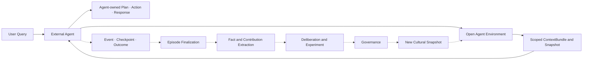

# 00. 설계 목표와 범위

## 1. 제품 정의

Mnemome은 사용자와 Agent가 memory를 안전하게 축적하고, 여러 Agent가 협업하며, 검증된 cultural knowledge를 다음 task에서 재사용하도록 돕는 software platform이다. Managed multi-tenant online service를 기본 제품으로 제공하면서, 동일한 Core를 library, full on-premises와 hybrid 형태로도 배포한다.

서비스는 네 가지 memory capability를 제공한다.

1. **Working Memory:** 한 번의 run을 위한 context, plan, observation과 checkpoint
2. **Long-Term Memory:** Agent/user scope의 episode와 provenance-linked semantic knowledge
3. **Multi-Agent Workspace:** 여러 Agent가 task state, evidence, decision과 disagreement를 공유하는 공간
4. **Cultural Memory:** 검증된 Meme Artifact, conditions, evidence, lineage와 snapshot

Cultural Deliberation은 memory 계층이 아니라 Cultural Memory를 변경하기 위한 비동기 validation process다. Mnemome은 Agent 자체나 Agent inference를 제공하지 않으며, 외부 Agent가 이 기능을 사용할 Environment/Protocol을 제공한다.

---

## 2. 설계 목표

### G1. 낮은 Online latency

외부 Agent의 User Query 처리는 토론, A/B Test, 장기 compaction이나 cultural governance를 기다리지 않아야 한다. Agent Environment는 Run 시작 시 필요한 memory와 Cultural Snapshot을 반환하고 session 동안 pinned state를 유지한다.

### G2. Scope와 소유권 보존

모든 객체는 tenant, user, agent, workspace, population 중 적절한 owner scope를 가져야 한다. Scope가 넓어지는 전이는 자동 복사가 아니라 별도 policy decision이다.

### G3. Provenance와 reversibility

요약·일반화·revision은 source를 파괴하지 않는다. Derived fact와 Meme Artifact는 source reference, transformation과 lineage를 통해 원래 근거로 확장할 수 있어야 한다.

### G4. 독립성 보존

Multi-Agent 합의와 다수결을 truth로 취급하지 않는다. Source, lineage, context, evaluator correlation을 Evidence Group으로 표현한다.

### G5. 안전한 cultural learning

Candidate는 blind review, structured deliberation, experiment와 governance를 거쳐야 한다. Validated Artifact도 현재 Agent의 선택을 강제하거나 권한을 확대하지 않는다.

### G6. 운영 가능성

모든 async workflow는 idempotent하고 재시도 가능해야 한다. Latency, backlog, data lineage, privacy action, withdrawal을 추적할 수 있어야 한다.

### G7. 점진적 확장

초기에는 modular monolith와 worker로 시작할 수 있어야 하며, 논리 service contract를 유지한 채 병목 모듈만 독립 배포할 수 있어야 한다.

### G8. 배포 독립성과 내장 가능성

Domain lifecycle은 network, cloud와 특정 infrastructure에 독립적인 Core Library에 있어야 한다. 고객은 Working/Long-Term Memory 같은 일부 기능만 기존 application에 내장하거나, 전체 service를 외부 control plane 없이 온프레미스로 운영할 수 있어야 한다.

---

## 3. 범위

### 포함

- Multi-tenant identity와 access boundary
- Agent registration과 capability profile
- Agent Environment SDK/API, ContextBundle과 interaction event protocol
- 외부 Agent Run의 observation, checkpoint와 outcome 기록
- Run-scoped Working Memory와 recovery checkpoint
- Episode 저장, fact extraction, source expansion과 hybrid recall
- Multi-Agent Workspace, evidence와 disagreement tracking
- Cultural Contribution, Meme Artifact lifecycle와 lineage
- 비동기 Independent Review, Structured Debate와 A/B Test
- Governance Decision과 immutable Cultural Snapshot
- Privacy, retention, deletion, audit와 export
- API, SDK, webhook와 operator/admin surface
- Embedded Core SDK와 storage, Agent connector, evaluation adapter contract
- SaaS, full on-premises, hybrid와 air-gapped deployment profile
- Canonical export/import와 profile 간 data portability

### 초기 범위에서 제외

- 자체 foundation model 학습 또는 serving
- 사용자 요청에 응답하는 Agent, Agent loop, planning 또는 general-purpose inference
- Agent가 사용하는 tool의 선택·호출·side effect 실행
- 범용 tool marketplace
- 신뢰 관계가 없는 population 사이의 자동 cultural exchange
- Meme이 임의 코드를 직접 실행하도록 하는 기능
- 자동 권한 상승 또는 cross-tenant access grant
- 완전 자율적인 high-risk governance
- 모든 graph query를 위한 별도 graph database
- 대규모 실사용 traffic에 위험한 Candidate를 바로 노출하는 A/B Test

---

## 4. 품질 속성 우선순위

| 우선순위 | 속성 | 설계 영향 |
| --- | --- | --- |
| 1 | Tenant isolation | 모든 key, query, event와 cache에 tenant scope 포함 |
| 2 | Safety and privacy | 최소 공개, redaction, capability boundary, audit |
| 3 | Correctness and provenance | Immutable version, source refs, lineage, decision record |
| 4 | Online availability | Learning Plane 장애와 Online Plane 격리 |
| 5 | Recoverability | Baseline checkpoint, event replay, snapshot rollback |
| 6 | Explainability | Retrieval, selection과 governance trace 유지 |
| 7 | Performance | Snapshot serving, hybrid index, cache와 async processing |
| 8 | Portability | Library-first Core, 교체 가능한 adapter, offline operation |
| 9 | Evolvability | Module boundary, schema version과 migration |

---

## 5. 핵심 불변조건

1. Working Memory는 run scope를 벗어나 자동 재사용되지 않는다.
2. Long-Term Memory의 raw episode는 자동으로 Workspace나 Cultural Memory에 공개되지 않는다.
3. Derived knowledge는 최소 하나의 source reference 또는 명시적인 source-unavailable 상태를 가진다.
4. Workspace 합의는 Cultural validation을 대체하지 않는다.
5. Cultural Deliberation은 Online request critical path에 들어가지 않는다.
6. Reviewer는 independent review freeze 전 다른 reviewer의 판단을 보지 않는다.
7. Candidate, Artifact, Governance Decision과 Snapshot은 immutable version으로 추적한다.
8. Run은 시작 시 pin한 Cultural Snapshot version을 종료까지 유지한다.
9. Safety-critical withdrawal 외에는 실행 중 snapshot을 바꾸지 않는다.
10. Artifact validation은 capability grant가 아니다.
11. Revision은 parent를 덮어쓰지 않고 new version과 lineage edge를 만든다.
12. Event consumer는 at-least-once delivery와 duplicate event를 견딘다.
13. Cache, vector index와 graph projection은 authoritative store에서 재생성 가능해야 한다.
14. 삭제 또는 redaction은 derived artifact와 영향 범위를 함께 재평가한다.
15. Core domain은 SaaS endpoint, 특정 cloud SDK나 process-global configuration에 의존하지 않는다.
16. Embedded, on-prem, hybrid와 SaaS는 동일 lifecycle contract와 conformance test를 사용한다.
17. 외부 management plane 장애나 license endpoint 단절이 on-prem data read/export를 막지 않는다.
18. Mnemome은 외부 Agent의 Plan, inference, tool action 또는 최종 Response를 생성하지 않는다.
19. 내부 LLM Judge는 immutable input, versioned rubric과 typed output을 가진 bounded evaluator이며 Governance 권한을 갖지 않는다.

---

## 6. Fast Path와 Slow Path

- Fast Path는 user-visible latency를 결정한다.
- Slow Path는 eventual learning과 governance를 담당한다.
- 두 path는 durable event와 immutable version으로 연결한다.
- Slow Path가 중단되어도 Fast Path는 마지막 정상 snapshot으로 동작한다.

---

## 7. 성공 기준

- User Query가 cultural deliberation backlog와 무관하게 처리된다.
- 외부 Agent가 SDK/API로 context를 받고 Mnemome의 inference 없이 outcome을 기록할 수 있다.
- 같은 tenant와 scope에서 memory recall이 재현 가능하고 source를 설명할 수 있다.
- Cross-tenant data leakage test가 통과한다.
- Run failure가 baseline checkpoint로 복구되고 기록된다.
- Workspace에서 evidence와 disagreement가 손실되지 않는다.
- 같은 source의 여러 Agent 의견이 독립 evidence로 중복 집계되지 않는다.
- Candidate가 blind review와 governance 없이 published snapshot에 들어가지 않는다.
- Snapshot 또는 worker 장애에서 이전 정상 state로 복구할 수 있다.
- 사용자 삭제 요청이 raw와 derived data impact까지 추적된다.
- Core Library를 network 없이 실행하고 service API와 같은 domain conformance suite를 통과한다.
- Full on-prem profile이 외부 control plane 없이 Run, recall, Workspace와 Cultural Snapshot을 제공한다.
