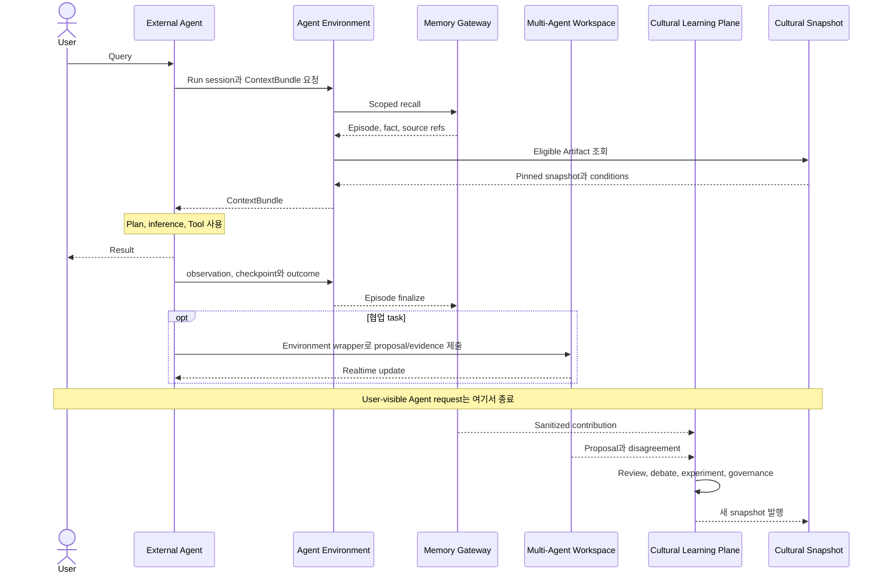

# 01. 요구사항과 Use Case

## 1. Actor와 역할

| Actor | 목적 | 대표 권한 |
| --- | --- | --- |
| End User | Agent에게 Query하고 자신의 memory를 관리 | Run 생성, 본인 memory 조회·삭제 |
| Agent Integrator | 외부 Agent를 Mnemome interface에 연결 | Agent descriptor, callback/pull mode, data scope 설정 |
| Workspace Member | 여러 Agent와 협업 | Workspace read/write, contribution 제출 |
| Workspace Admin | Workspace membership과 policy 관리 | Member, visibility, retention 관리 |
| Cultural Reviewer | Candidate 독립 검토와 토론 참여 | Assigned review와 argument 제출 |
| Experiment Operator | 승인된 validation experiment 운영 | Experiment plan 실행·중단 |
| Governance Approver | Lifecycle decision 승인 | Validate, restrict, reject, withdraw |
| Tenant Admin | Tenant policy와 audit 관리 | Tenant-wide policy, export, deletion |
| Platform Operator | 서비스 운영 | Health, incident, migration; tenant content 접근은 제한 |
| Customer Site Operator | 온프레미스 설치와 고객 관리 infrastructure 운영 | 설치, upgrade, backup, local telemetry |
| Host Application | Embedded Library를 포함하는 고객 software | 명시적 tenant/security context로 Core use case 호출 |
| External Agent Runtime | plan, inference, tool 사용과 사용자 응답 수행 | 허용된 Environment API와 assignment 접근 |
| Internal Evaluator | 제한된 rubric 기반 품질 평가 | 배정된 EvaluationBundle만 조회하고 typed result 제출 |

한 사용자가 여러 역할을 가질 수 있지만 authorization check는 각 action과 resource scope에 대해 수행한다.

---

## 2. 주요 Use Case

### UC-01 외부 Agent 실행 지원

1. User가 외부 Agent에 Query를 제출한다.
2. Agent가 Mnemome의 `AgentEnvironment`를 열고 identity와 scope를 제시한다.
3. Mnemome이 Working Memory를 만들고 Long-Term Memory와 Cultural Snapshot으로 ContextBundle을 반환한다.
4. 외부 Agent가 자체 Plan, inference와 Tool action을 실행한다.
5. Agent는 필요한 observation, Artifact usage, checkpoint와 outcome을 Mnemome에 제출한다.
6. Agent가 User에게 Response를 반환한다.
7. Mnemome은 완료된 session을 Episode로 비동기 정리한다.

### UC-02 과거 경험 recall

1. Agent가 현재 Query와 scope로 recall을 요청한다.
2. Memory service가 metadata filter, lexical/vector search를 수행한다.
3. Result를 source scope와 relevance로 rerank한다.
4. Fact, Episode summary와 source references를 구분해 반환한다.
5. 필요하면 원래 source span을 확장한다.

### UC-03 Multi-Agent Workspace 협업

1. User 또는 Agent가 Workspace task를 만든다.
2. 여러 Agent가 먼저 독립 proposal을 제출할 수 있다.
3. Workspace가 evidence, decision, disagreement를 연결한다.
4. Member에게 realtime update를 전달한다.
5. 공유 가능한 반복 pattern은 Cultural Contribution 후보가 된다.

### UC-04 Cultural Candidate 제출

1. Episode pattern, 직접 proposal, counterexample 또는 exploratory experiment가 trigger가 된다.
2. Contribution을 sanitize하고 permission을 확인한다.
3. Claim, conditions, baseline, recovery와 provenance를 검증한다.
4. Immutable Candidate version을 만든다.
5. Deliberation Session을 비동기로 시작한다.

### UC-05 Cultural Deliberation

1. 독립성이 다른 Reviewer를 배정한다.
2. 외부 Reviewer Agent 또는 사람이 `DeliberationEnvironment`를 통해 다른 판단을 보기 전에 sealed review를 제출한다.
3. Review를 freeze하고 공개한다.
4. Typed argument 기반 bounded debate를 수행한다.
5. Evidence gap이 있으면 A/B Test 또는 replication을 요청한다.
6. Recommendation, minority objection과 unresolved issue를 만든다.
7. 필요한 의미 기반 평가는 versioned rubric의 LLM Judge 등 내부 Evaluator에 배정한다.

### UC-06 Governance와 snapshot 발행

1. Governance가 recommendation과 evidence group을 검토한다.
2. Validate, restrict, hold, revise, reject 또는 withdraw를 결정한다.
3. Decision과 lineage를 durable하게 기록한다.
4. Eligible Artifact set으로 새 immutable snapshot을 만든다.
5. 다음 run부터 새 snapshot을 사용한다.

### UC-07 Memory 삭제와 영향 분석

1. User 또는 Admin이 삭제·redaction을 요청한다.
2. Ownership과 policy를 확인한다.
3. Raw episode와 source span을 삭제하거나 비식별화한다.
4. Derived fact, Workspace evidence, Candidate와 Meme lineage 영향을 찾는다.
5. 재검증, restrict 또는 withdrawal이 필요한 artifact를 표시한다.
6. Audit에는 복원 불가능한 최소 transition fact만 남긴다.

### UC-08 기존 제품에 기능 내장

1. 개발자가 `mnemome-core`와 필요한 adapter를 application에 설치한다.
2. Host가 identity, tenant/security context와 provider를 주입한다.
3. Working Memory, recall, Cultural Snapshot 또는 Environment wrapper 같은 필요한 use case만 호출한다.
4. Core가 service mode와 같은 invariant와 event를 적용한다.
5. 필요해지면 canonical export를 사용해 full service로 이전한다.

### UC-09 온프레미스 전체 설치

1. Site Operator가 signed offline bundle과 SBOM을 검증한다.
2. 고객 OIDC, PostgreSQL, Valkey, object storage와 선택적 local LLM Judge endpoint를 연결한다.
3. Preflight와 migration dry-run을 수행한다.
4. 외부 network를 차단한 상태에서 E2E conformance test를 실행한다.
5. 고객 환경의 observability, backup과 upgrade 정책으로 운영한다.

---

## 3. 기능 요구사항

### Identity와 tenant

- FR-IAM-01: 모든 resource는 tenant scope를 가져야 한다.
- FR-IAM-02: User, service account와 Agent identity를 구분해야 한다.
- FR-IAM-03: Role과 attribute 기반 authorization을 지원해야 한다.
- FR-IAM-04: Capability grant와 cultural validation을 별도 policy로 관리해야 한다.

### Working Memory와 run

- FR-RUN-01: 외부 Agent Run session 생성, 협력적 cancel signal, expiry와 event stream을 지원해야 한다.
- FR-RUN-02: Working Memory는 run별 TTL과 context budget을 가져야 한다.
- FR-RUN-03: Agent가 제출한 inspectable plan reference, observation, selected Artifact와 checkpoint를 기록해야 한다.
- FR-RUN-04: Run 시작 시 Cultural Snapshot version을 pin해야 한다.
- FR-RUN-05: 비공개 chain-of-thought 저장을 요구하지 않아야 한다.
- FR-RUN-06: Mnemome이 Plan, model inference, Tool 실행 또는 최종 Response를 생성하지 않아야 한다.
- FR-RUN-07: `AgentEnvironment`가 ContextBundle 조회와 event/checkpoint/outcome 제출을 제공해야 한다.

### Long-Term Memory

- FR-LTM-01: Episode, semantic fact, preference와 correction을 구분해야 한다.
- FR-LTM-02: Derived fact는 source span과 transformation을 가져야 한다.
- FR-LTM-03: Metadata, lexical, vector 기반 hybrid recall을 지원해야 한다.
- FR-LTM-04: Source expansion과 contradiction/supersession을 지원해야 한다.
- FR-LTM-05: Retention, deletion, export와 re-index를 지원해야 한다.

### Workspace

- FR-WS-01: Workspace member, task state, proposal, evidence, decision과 disagreement를 관리해야 한다.
- FR-WS-02: Optimistic concurrency와 realtime update를 지원해야 한다.
- FR-WS-03: Evidence source와 correlation group을 표시해야 한다.
- FR-WS-04: Workspace 합의를 cultural validation으로 자동 승격하지 않아야 한다.

### Cultural Memory

- FR-CM-01: Meme, Artifact, Variant, Lineage와 lifecycle status를 관리해야 한다.
- FR-CM-02: Artifact는 claim, conditions, baseline, failure, recovery와 provenance를 가져야 한다.
- FR-CM-03: Blind review, structured debate와 experiment를 지원해야 한다.
- FR-CM-04: Evidence Group과 Evaluation Dimension을 분리해 저장해야 한다.
- FR-CM-05: Governance Decision과 immutable snapshot을 발행해야 한다.
- FR-CM-06: Withdrawal과 descendant impact analysis를 지원해야 한다.
- FR-CM-07: `DeliberationEnvironment`가 assignment, sealed review, round visibility와 typed argument operation을 제공해야 한다.
- FR-CM-08: Rule, metric, human과 LLM Judge를 공통 EvaluationResult로 수용해야 한다.

### Audit와 운영

- FR-OPS-01: 모든 privileged action과 lifecycle transition을 audit해야 한다.
- FR-OPS-02: Event replay와 idempotent retry를 지원해야 한다.
- FR-OPS-03: Tenant별 usage와 cost를 관측해야 한다.
- FR-OPS-04: Data export, deletion job과 legal hold를 지원해야 한다.

### Packaging과 deployment portability

- FR-PORT-01: Domain lifecycle과 policy는 network/framework에 독립적인 Core Library로 제공해야 한다.
- FR-PORT-02: Embedded와 service mode가 동일 use case와 conformance suite를 사용해야 한다.
- FR-PORT-03: Storage, Agent connector, evaluation executor, identity, event와 telemetry는 adapter로 교체할 수 있어야 한다.
- FR-PORT-04: Full on-prem profile은 mandatory external control plane 없이 동작해야 한다.
- FR-PORT-05: Air-gapped install, offline upgrade/rollback과 local support bundle을 지원해야 한다.
- FR-PORT-06: Deployment profile 간 provenance와 policy를 보존하는 export/import를 지원해야 한다.

---

## 4. 비기능 요구사항

| ID | 요구사항 |
| --- | --- |
| NFR-01 | Online API는 Cultural Learning Plane 장애 시에도 마지막 정상 snapshot으로 동작해야 한다. |
| NFR-02 | Tenant scope가 없는 data access query와 event는 거부되어야 한다. |
| NFR-03 | Public command는 idempotency key를 지원해야 한다. |
| NFR-04 | 모든 durable entity와 event는 schema/version migration이 가능해야 한다. |
| NFR-05 | Sensitive content는 transit와 rest에서 암호화되어야 한다. |
| NFR-06 | Data deletion이 derived object에 미치는 영향을 추적해야 한다. |
| NFR-07 | Snapshot publication 실패 시 이전 snapshot을 계속 제공해야 한다. |
| NFR-08 | Worker가 중단되어도 durable backlog에서 재개해야 한다. |
| NFR-09 | Retrieval result는 source와 score breakdown을 설명할 수 있어야 한다. |
| NFR-10 | LLM Judge/provider 교체가 EvaluationResult와 domain schema를 변경하지 않아야 한다. |
| NFR-11 | Core Library는 global network client나 특정 cloud SDK에 의존하지 않아야 한다. |
| NFR-12 | On-prem service는 외부 network 단절 상태에서도 정상 request와 data export를 처리해야 한다. |
| NFR-13 | 지원 adapter는 공통 compatibility test를 통과해야 한다. |

---

## 5. 사용자 여정 다이어그램

---

## 6. Acceptance scenario

### Scenario A — 정상 run

- User가 Query를 제출한다.
- Run은 snapshot V12를 pin한다.
- Artifact M7을 조건부 선택한다.
- 모든 Step에서 local condition check를 통과한다.
- 외부 Agent의 Response와 Mnemome의 Episode가 각각 생성된다.
- Episode finalization 실패가 Response 성공을 취소하지 않는다.

### Scenario B — Artifact failure와 recovery

- Run이 M7을 선택한다.
- 외부 Agent 실행 중 exclusion condition이 발생한다.
- Agent가 Working Memory checkpoint와 baseline reference를 읽어 자체 recovery를 수행한다.
- Agent가 baseline 결과로 Response를 완료한다.
- Failure와 recovery outcome이 M7 version과 연결된다.

### Scenario C — Async cultural learning

- 여러 Episode 또는 직접 proposal에서 Candidate C3가 생성된다.
- Review와 debate가 수 분 이상 걸려도 Online 요청은 정상 처리된다.
- Governance가 C3를 Restricted로 승인한다.
- Snapshot V13이 발행된다.
- 이미 V12를 pin한 Agent session은 V12로 끝나고 다음 session부터 V13을 사용한다.

### Scenario D — Tenant deletion

- User가 Episode 삭제를 요청한다.
- 삭제된 source에 의존한 Fact와 Candidate가 표시된다.
- Cross-tenant 또는 population artifact는 재검증 대상으로 전환된다.
- Audit에는 content 없이 deletion decision과 impact만 남는다.
