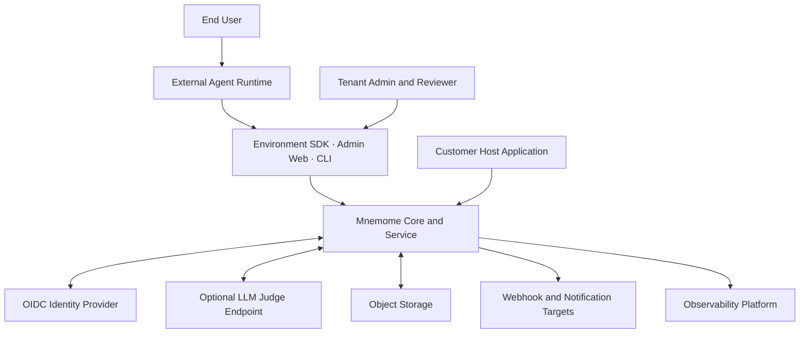
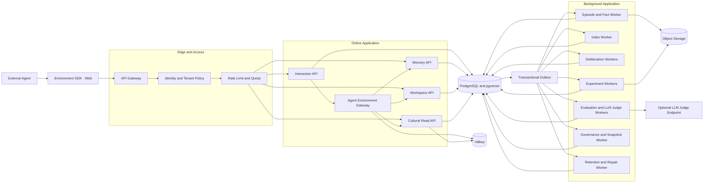

# 02. 시스템 컨텍스트와 컨테이너

## 1. System Context

### 외부 시스템 계약

| 시스템 | Mnemome이 신뢰하는 것 | 신뢰하지 않는 것 |
| --- | --- | --- |
| Identity Provider | 서명과 issuer/audience가 검증된 identity claim | Client가 직접 보낸 role 또는 tenant claim |
| External Agent Runtime | 인증된 identity와 protocol 준수 | Agent가 제출한 claim, observation 또는 outcome의 사실성 |
| LLM Judge Endpoint | transport와 configured model identity | Judge 출력의 정확성, 독립성 또는 Governance 권한 |
| Object Storage | Object integrity와 access policy | Object content 자체의 안전성 |
| Webhook Target | 등록된 endpoint와 secret | Delivery 성공 후 외부 처리 결과 |
| Host Application | 주입된 port contract와 security context | Host가 넘긴 tenant/role 값을 검증 없이 신뢰하지 않음 |

---

## 2. Container 구조

---

## 3. Trust Boundary

### Boundary A — Public client

- 모든 request를 인증하고 tenant context를 server-side에서 결정한다.
- Client가 보낸 owner ID를 authorization 근거로 사용하지 않는다.
- Idempotency, rate limit, input size와 schema를 검증한다.

### Boundary B — External Agent와 Environment

- Mnemome은 Agent의 Plan, model call, tool action을 실행하지 않는다.
- Agent가 제출한 Tool output과 observation은 untrusted source다.
- Agent identity와 assignment scope는 Environment method마다 검증한다.
- External instruction을 memory policy나 Cultural Artifact로 자동 승격하지 않는다.

### Boundary C — Internal Evaluator

- Rule/Metric/LLM Judge는 immutable EvaluationBundle과 versioned rubric만 받는다.
- Judge 결과는 typed evidence이며 Governance Decision이 아니다.
- LLM Judge endpoint에는 허용된 tenant/classification의 최소 content만 전달한다.

### Boundary D — Private memory와 shared scope

- Long-Term Memory에서 Workspace/Cultural Contribution으로 이동할 때 redaction과 permission check를 수행한다.
- Source content 대신 최소 evidence reference를 전달할 수 있어야 한다.

### Boundary E — Deliberation과 published culture

- Deliberation output은 recommendation이다.
- Governance Decision과 Snapshot Publisher만 published Cultural Snapshot을 변경한다.

### Boundary F — Operator

- Operator access는 service health와 encrypted metadata 중심으로 제한한다.
- Tenant content access는 break-glass, approval, audit와 time limit를 요구한다.

---

## 4. Deployment unit 전략

논리 container가 처음부터 각각의 network service일 필요는 없다.

### Embedded profile

- `mnemome-core`: host process 안에서 domain/use case 실행
- 선택한 repository, Agent connector와 evaluation adapter
- background job은 host scheduler 또는 선택적 Mnemome worker가 실행
- HTTP, OIDC와 UI는 host가 소유할 수 있음

### 초기 production

- `api`: Gateway 뒤의 Interaction, Memory, Workspace, Cultural Read API
- `worker`: Episode, index, deliberation, evaluation, experiment와 governance handler
- `scheduler`: timeout, retention, snapshot과 repair job
- `web`: 관리 및 사용자 UI
- Managed PostgreSQL, Valkey, object storage

동일 unit은 고객 관리 PostgreSQL/Valkey/object storage를 사용해 full on-premises로도 배포할 수 있다. Hybrid에서는 data plane을 고객 환경에 유지하고 signed release metadata와 opt-in support 같은 management 기능만 외부와 연결한다.

### 분리 기준

| 병목 또는 위험 | 우선 분리할 unit |
| --- | --- |
| Agent session/event ingest concurrency | Interaction Gateway |
| Retrieval QPS와 index 부하 | Memory Read Service |
| Workspace realtime connection | Workspace Gateway |
| Deliberation backlog | Deliberation Worker pool |
| Experiment resource isolation | Experiment Runner |
| LLM Judge GPU/endpoint 부하 | Evaluation Worker pool |
| Snapshot availability | Cultural Read/Snapshot Service |

분리 후에도 동일 domain event와 API contract를 유지한다.

---

## 5. Network policy

- Public ingress는 API Gateway와 Web만 허용한다.
- Worker와 database는 private network에서만 접근한다.
- Evaluation Worker는 허용된 LLM Judge endpoint egress만 별도 allowlist로 제한한다.
- Cultural Read path는 read-only credential 또는 별도 read model을 사용한다.
- Object Storage는 short-lived signed access를 사용한다.
- Outbound webhook은 destination allowlist, DNS/IP 재검증과 timeout을 적용한다.
- On-prem profile은 outbound deny-by-default와 local/no-LLM Judge mode만으로도 시작할 수 있어야 한다.
