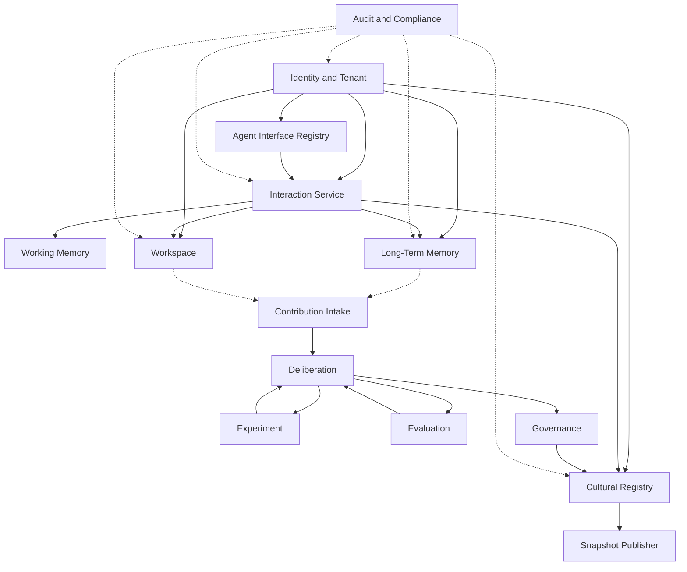
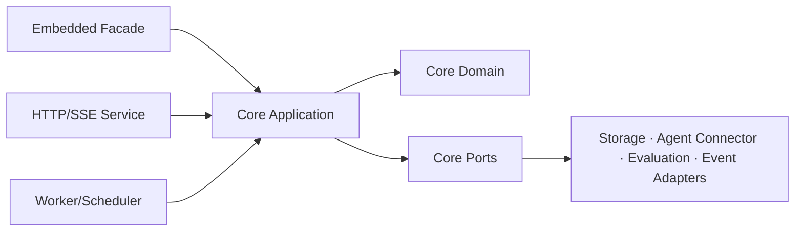
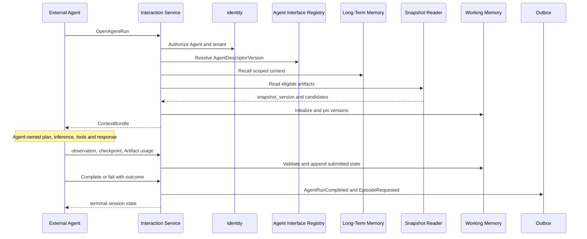
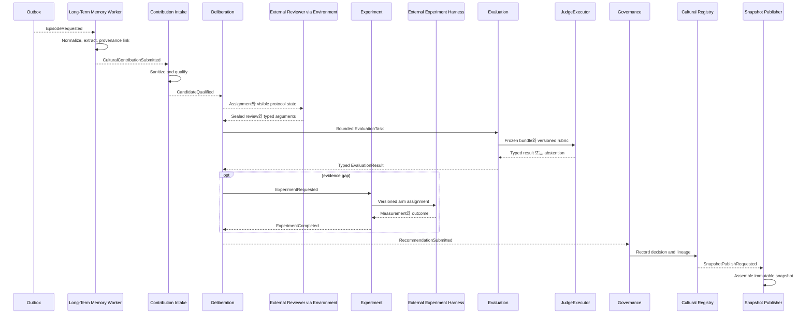

# 03. 서비스와 모듈 아키텍처

## 1. Architecture style

Mnemome은 다음을 결합한다.

- Domain-oriented modular architecture
- Command/Query responsibility separation
- Event-driven slow path
- Immutable version과 append-only audit
- Adapter를 통한 Agent connector, internal evaluator, storage와 broker 교체
- Library-first Core와 선택적 service shell

초기에는 modular monolith로 배포할 수 있지만 module 간 직접 table mutation을 금지한다. 다른 module의 state 변경은 application service 또는 domain event contract를 통한다.

SaaS API와 on-prem worker는 별도 domain 구현이 아니라 동일 `mnemome-core` use case를 호출한다. Core는 FastAPI, 특정 DB driver, broker, Kubernetes나 cloud SDK에 의존하지 않는다.

---

## 2. 논리 서비스

| Service | 주요 책임 | Owns |
| --- | --- | --- |
| Identity and Tenant | Principal, role, tenant policy, quota | Tenant, Membership, Policy |
| Agent Interface Registry | 외부 Agent identity, endpoint mode, protocol capability, population membership | Agent, AgentDescriptorVersion |
| Interaction Service | 외부 AgentRun session, ContextBundle, event ingest, cooperative cancellation | AgentRun, AgentEvent |
| Working Memory | Agent가 제출한 run context, observation, checkpoint와 budget metadata | WorkingContext |
| Long-Term Memory | Episode, fact, source, transformation, recall | Episode, MemoryFact, SourceRef |
| Workspace | Multi-agent task state, proposal, evidence, decision, disagreement | Workspace aggregates |
| Cultural Registry | Meme, Artifact, Variant, lineage, decision, snapshot metadata | Cultural aggregates |
| Contribution Intake | Sanitization, qualification, candidate creation | Contribution, Candidate |
| Deliberation | Review assignment, sealed review, argument, session | DeliberationSession |
| Experiment | Plan, arm assignment, execution result | Experiment aggregates |
| Evaluation | Rule/Metric/Human/LLM Judge task와 typed result | EvaluationTask, JudgeRun, EvaluationResult |
| Governance | Lifecycle decision, restrictions, approval workflow | GovernanceDecision |
| Snapshot Publisher | Eligible set assembly, immutable publication, invalidation | CulturalSnapshot |
| Audit and Compliance | Audit event, export, deletion, legal hold | AuditEvent, PrivacyJob |

---

## 3. Module dependency

실선은 synchronous application dependency 또는 owned command를, 점선은 event/observation dependency를 뜻한다.

---

## 4. Layering

각 service/module은 다음 layer를 가진다.

### Interface layer

- HTTP/SSE/WebSocket handler
- Event consumer/producer
- Input schema validation
- Authentication context extraction

### Application layer

- Use case orchestration
- Transaction boundary
- Authorization decision 호출
- Idempotency와 outbox 작성

### Domain layer

- Aggregate와 invariant
- Value object와 lifecycle transition
- Domain event 생성
- Storage/framework에 독립적

### Infrastructure layer

- Repository implementation
- PostgreSQL, Valkey, object storage adapter
- External Agent connector와 bounded Evaluation executor adapter
- Metrics, trace와 clock/ID provider

### Packaging boundary

- Domain/Application/Port는 library package다.
- Interface와 Infrastructure는 교체 가능한 package다.
- Host application은 embedded facade 또는 직접 typed use case를 사용한다.
- Service shell은 identity, tenant routing, distributed lease, API와 worker lifecycle을 추가한다.

---

## 5. Fast Path module flow

Critical path에는 Deliberation, Experiment, Governance와 snapshot build가 없다.

---

## 6. Slow Path module flow

---

## 7. Repository ownership rule

- Module은 자신의 aggregate table만 write한다.
- Cross-module read는 public query service 또는 denormalized read model을 사용한다.
- Foreign key를 사용할 수 있지만 다른 module의 lifecycle을 database cascade로 실행하지 않는다.
- Deletion과 withdrawal처럼 여러 module에 걸친 operation은 saga/process manager로 조정한다.
- Outbox event는 source transaction과 함께 commit한다.

---

## 8. Extension point

| Extension | Interface |
| --- | --- |
| External Agent connector | `AgentConnector.notify_assignment/cancel()`; pull mode도 지원 |
| Internal evaluator | `JudgeExecutor.evaluate()`; Rule/Metric/Human/LLM adapter |
| Embedding provider | `EmbeddingAdapter.embed()` with model version |
| Reranker | `Reranker.rank()` |
| Event transport | `EventPublisher` and `EventConsumer` |
| Object storage | `BlobStore` |
| Policy engine | `AuthorizationPolicy.evaluate()` |
| Experiment harness connector | `ExperimentConnector.dispatch/collect_result()` |
| Notification | `NotificationSink.send()` |
| Identity context | `PrincipalContextProvider.resolve()` |
| Telemetry | `TelemetrySink.emit()` |
| Clock/ID | deterministic `Clock` and `IdGenerator` |

Evaluation adapter output에는 judge kind, model/executor version, rubric version과 request correlation을 포함한다. Agent connector는 Agent inference content를 생성하지 않는다.

모든 adapter는 capability를 선언하고 공통 conformance test를 통과해야 한다. 세부 packaging과 profile은 [Library Embedding과 On-Premises](./18-library-embedding-and-on-premises.md)를 따른다.
