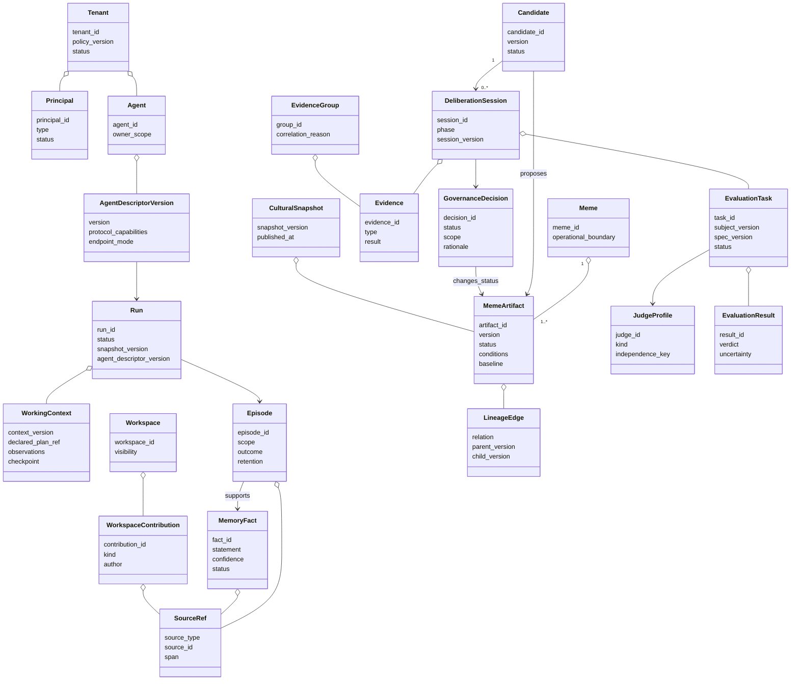
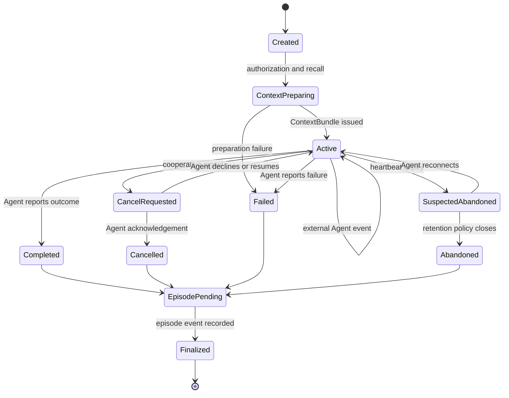
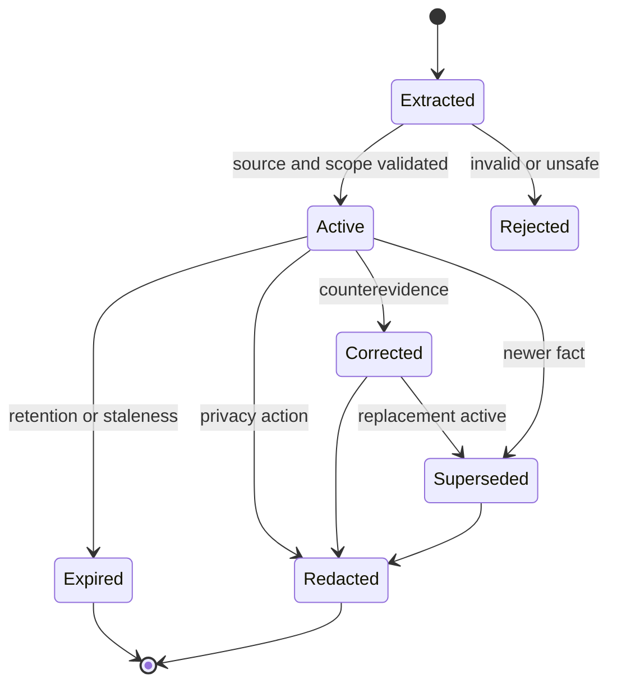
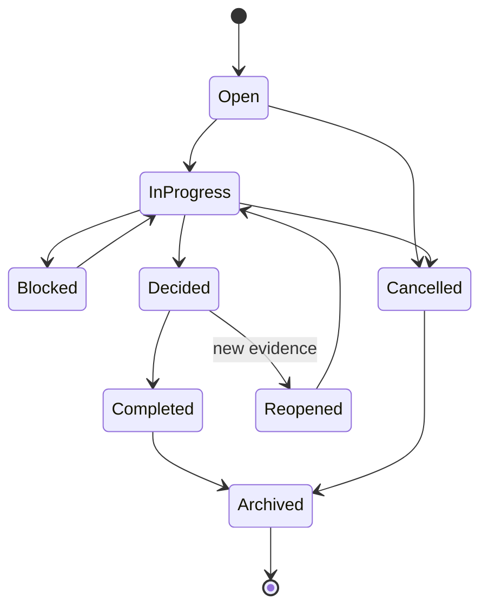
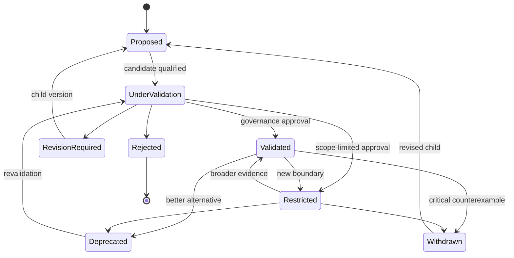

# 04. 도메인 모델과 Lifecycle

## 1. Bounded Context

| Context | Aggregate root | 핵심 invariant |
| --- | --- | --- |
| Identity | Tenant, Principal | Principal의 tenant membership 없이 tenant resource 접근 불가 |
| Agent Interface | Agent, AgentDescriptorVersion | 외부 Agent descriptor와 protocol capability는 versioned |
| Interaction | AgentRun | Mnemome은 외부 실행을 관찰하며 inference를 수행하지 않음 |
| Working Memory | WorkingContext | Run과 snapshot version이 고정됨 |
| Long-Term Memory | Episode, MemoryFact | Derived fact는 source와 transformation을 가짐 |
| Workspace | Workspace, WorkspaceTask | Member와 visibility policy 없이 contribution 불가 |
| Culture | Meme, MemeArtifact, CulturalSnapshot | Published version은 immutable |
| Deliberation | Candidate, DeliberationSession | Review freeze 전 peer review 비공개 |
| Experiment | ExperimentPlan | Metric과 stop condition freeze 후 arm 실행 |
| Evaluation | EvaluationTask | Subject, rubric, input과 evaluator version을 고정한 뒤 실행 |
| Governance | GovernanceDecision | Decision은 Candidate version과 evidence set을 고정 참조 |
| Compliance | PrivacyRequest | 삭제와 derived impact가 완료되어야 terminal state |

---

## 2. 핵심 클래스 다이어그램

---

## 3. Entity와 Value Object

### Entity

시간에 따라 상태가 바뀌며 identity로 추적한다.

- Tenant, Principal, Agent, Run
- Episode, MemoryFact
- Workspace, WorkspaceTask, Contribution
- Meme, MemeArtifact, Candidate
- DeliberationSession, ReviewAssignment
- ExperimentPlan, GovernanceDecision
- EvaluationSpec, EvaluationTask, JudgeProfile, EvaluationResult
- CulturalSnapshot, PrivacyRequest

### Value Object

값 전체로 동등성을 판단하며 가능한 한 immutable하게 둔다.

- Scope: tenant/user/agent/workspace/population
- CapabilitySet
- ApplicabilityCondition
- FailureBoundary
- BaselineProcedure
- RecoveryPolicy
- SourceSpan
- EvidenceIndependenceKey
- EvaluationDimensionResult
- RetentionPolicy
- SnapshotVersion

---

## 4. 외부 AgentRun lifecycle

`Completed`, `Cancelled`, `Failed`, `Abandoned`는 session terminal state다. Mnemome의 cancel은 협력적 signal이며 외부 process 종료를 보장하지 않는다. Episode finalization 실패는 외부 Agent가 이미 반환한 Response를 취소하지 않는다.

---

## 5. Memory fact lifecycle

Fact relation:

- `SUPPORTED_BY`: Fact → SourceRef
- `CONTRADICTS`: Fact ↔ Fact
- `SUPERSEDES`: New Fact → Old Fact
- `REFINES`: Specific Fact → General Fact
- `DERIVED_FROM`: Fact → Episode/Fact set

---

## 6. Workspace task lifecycle

Workspace Decision은 cultural truth가 아니다. `Decided`는 현재 workspace task의 coordination outcome일 뿐이다.

---

## 7. Cultural lifecycle

Status 변경은 existing row overwrite가 아니라 decision append와 new current status projection으로 표현한다.

---

## 8. Aggregate transaction boundary

| Command | Transaction 안에서 변경 | Event |
| --- | --- | --- |
| OpenAgentRun | AgentRun, ContextBundle, initial event, outbox | AgentRunOpened |
| AppendAgentEvent | RunEvent, WorkingContext version | AgentEventRecorded |
| CompleteAgentRun | AgentRun terminal state, outbox | AgentRunCompleted |
| FinalizeEpisode | Episode, SourceRef, outbox | EpisodeRecorded |
| SubmitWorkspaceContribution | Contribution, EvidenceRef, outbox | WorkspaceContributionSubmitted |
| QualifyCandidate | Candidate version, outbox | CandidateQualified |
| SealReview | IndependentReview, assignment state, outbox | IndependentReviewSealed |
| RecordEvaluationResult | JudgeRun, EvaluationResult, outbox | EvaluationResultRecorded |
| RecordGovernanceDecision | Decision, artifact status projection, lineage, outbox | GovernanceDecisionRecorded |
| PublishSnapshot | Snapshot metadata, current pointer, outbox | CulturalSnapshotPublished |

Cross-aggregate action은 event-driven process manager로 이어간다.
