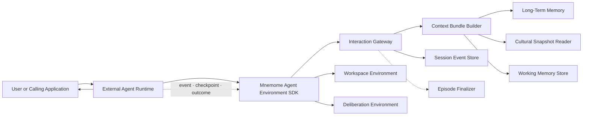
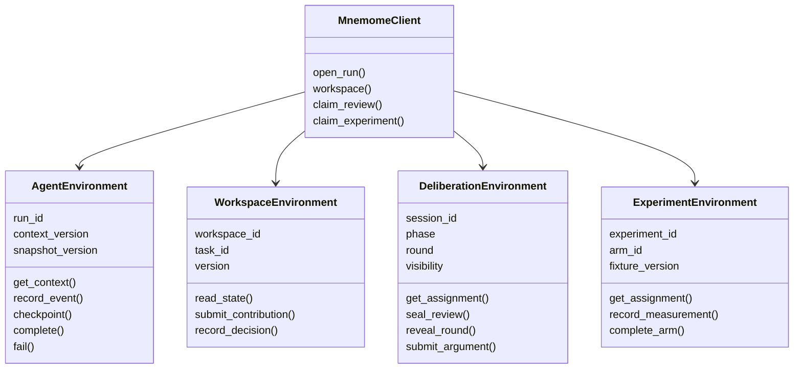
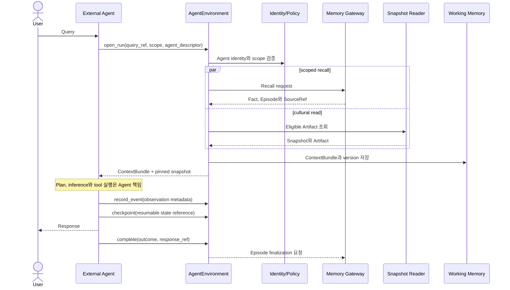

# 05. Agent Environment와 Working Memory

## 1. 서비스 경계

Mnemome은 Agent를 제공하거나 Agent의 추론을 실행하지 않는다. Agent는 고객 application, 외부 Agent platform 또는 별도 process에서 동작한다.

Mnemome이 제공하는 것은 외부 Agent가 다음 기능을 일관된 protocol로 사용할 수 있게 하는 **Agent Environment**다.

- 실행 세션과 scope 생성
- Long-Term Memory recall
- Cultural Snapshot과 적용 가능한 Artifact 제공
- Run-scoped Working Memory와 checkpoint
- observation, outcome과 provenance 수집
- Workspace/Deliberation/Experiment 참여 interface
- session event와 audit stream

이 문서에서 `Run`은 외부 Agent 실행을 나타내는 관찰·기록 단위다. Mnemome이 실행을 소유한다는 뜻이 아니다.

### Mnemome이 하지 않는 것

- 사용자 질문에 대한 최종 응답 생성
- Plan 또는 chain-of-thought 생성
- Agent model 선택과 inference 실행
- Agent tool 선택, 호출 또는 side effect 보상
- 자유 형식 토론 발언이나 review 내용 생성
- 외부 Agent process의 장애 복구 또는 강제 취소

선택적 embedding, indexing, fact extraction은 memory enrichment processor이며 Agent reasoning과 분리한다. 고객은 구조화된 memory를 직접 제출하거나 해당 processor adapter를 교체할 수 있다.

---

## 2. 구성 요소



`Interaction Gateway`는 Agent가 보낸 protocol command를 검증하고 저장한다. Agent loop를 orchestrate하지 않는다.

---

## 3. Interface object

SDK는 endpoint를 나열하는 얇은 client보다 상태와 허용된 operation을 함께 표현하는 interface object를 제공한다.



### Interface object의 역할

- 인증된 tenant, Agent와 assignment scope를 보존한다.
- 현재 version, phase와 deadline을 보존한다.
- 현재 상태에서 허용되지 않는 method를 client와 server 양쪽에서 거부한다.
- idempotency key와 optimistic version을 자동 전달한다.
- sealed review 같은 visibility rule을 method 수준으로 강제한다.
- polling, webhook 또는 stream transport 차이를 숨긴다.

Interface object는 추론 주체가 아니다. 내용 생성은 호출하는 외부 Agent 또는 사람이 담당한다.

---

## 4. AgentRun 시작과 종료



Mnemome은 Agent와 User 사이의 응답 transport를 proxy할 필요가 없다. 제품 통합상 필요한 경우 session event stream을 제공할 수 있지만 response token을 생성하거나 해석하지 않는다.

---

## 5. ContextBundle

외부 Agent에 반환하는 context는 다음 구조를 기준으로 한다.

```text
run_id
tenant_scope
principal_scope
agent_descriptor_version
context_version
query_ref or permitted_query_content
memory_items[]
cultural_artifacts[]
workspace_context
pinned_snapshot_version
source_refs[]
usage_policy
retention_policy
expires_at
```

### 규칙

- `memory_items`와 `cultural_artifacts`는 content, applicability, provenance와 visibility를 구분한다.
- Artifact는 명령이 아니라 조건부 procedure suggestion이다.
- Agent가 Artifact를 실제로 사용했는지는 `artifact.used` event로 명시한다.
- ContextBundle은 signed digest 또는 immutable version으로 재현할 수 있어야 한다.
- query content를 Mnemome에 보내지 않는 privacy mode에서는 opaque `query_ref`와 caller-supplied retrieval key를 사용할 수 있다.

---

## 6. WorkingContext

```text
run_id
tenant_id
principal_id
agent_id
agent_descriptor_version
context_version
goal_summary
declared_plan_ref
observations[]
memory_refs[]
selected_artifacts[]
pinned_snapshot_version
checkpoint_ref
budget_metadata
created_at
expires_at
```

Working Memory에는 외부 Agent가 제출한 inspectable state만 저장한다. Agent 내부 hidden state나 chain-of-thought 제출을 요구하지 않는다.

### 저장하지 않는 것

- 비공개 chain-of-thought와 hidden activation
- 불필요한 raw token stream
- Agent credential 또는 tool secret
- 다른 tenant/user의 context
- Cultural Deliberation message 전체의 복사본

---

## 7. Agent event protocol

외부 Agent는 필요한 수준의 event를 선택해 제출한다.

| Event | 의미 | 필수 여부 |
| --- | --- | --- |
| `run.opened` | session과 context 생성 | Server 생성 |
| `agent.plan.declared` | 외부 공개 가능한 plan reference | 선택 |
| `agent.action.declared` | action 종류와 target metadata | 선택 |
| `agent.observation.recorded` | observation 또는 SourceRef 추가 | 선택 |
| `artifact.used` | Artifact version을 실제 적용 | 적용했다면 필수 |
| `artifact.rejected` | 조건 불일치 또는 선택하지 않은 이유 | 선택 |
| `agent.checkpoint.recorded` | host가 재개 가능한 state reference | 선택 |
| `agent.outcome.recorded` | outcome과 evaluation signal | 완료 시 필수 |
| `run.completed` | 정상 종료 | Terminal |
| `run.failed` | 외부 Agent가 실패 보고 | Terminal |
| `run.abandoned` | heartbeat/expiry 후 종료 | Server 결정 가능 |

Mnemome은 `plan.declared`를 근거로 다음 step을 지시하지 않는다. event는 provenance와 evaluation을 위한 observation이다.

---

## 8. Context compaction과 source expansion

- Source turn을 삭제하지 않고 WorkingContext용 derived summary를 만들 수 있다.
- Summary는 `source_turn_ids` 또는 SourceRef set을 가진다.
- Agent가 세부 정보가 필요하면 `expand_source()`로 원래 permitted source를 조회한다.
- Compaction은 Mnemome에 제출된 context만 줄이며 외부 Agent의 private state를 다루지 않는다.
- Agent가 자체 compaction을 수행하면 source mapping을 함께 제출해야 provenance 품질을 보장할 수 있다.

---

## 9. Durable state와 resume

### Hot state

- Valkey에 run별 WorkingContext와 TTL 저장
- atomic compare-and-set 또는 version check
- 대형 observation은 immutable object/reference로 분리

### Durable trace

- AgentRun, submitted event, checkpoint reference와 terminal outcome은 PostgreSQL에 기록
- 모든 ephemeral update를 durable하게 복제할 필요는 없음
- durable event의 content/retention은 tenant policy를 따른다.

### Resume의 의미

Mnemome은 마지막 checkpoint와 ContextBundle version을 반환한다. 실제 Agent process 복구, model state 복원과 side effect reconciliation은 외부 Agent host의 책임이다. Mnemome은 checkpoint를 실행하거나 Agent를 대신하지 않는다.

---

## 10. Session stream과 cancellation

Mnemome stream은 저장된 session state의 변화만 전달한다.

- `run.opened`
- `context.updated`
- `checkpoint.recorded`
- `workspace.updated`
- `run.completed`
- `run.failed`
- `run.abandoned`

`cancel_requested`는 외부 Agent에 전달하는 협력적 signal이다. Mnemome은 외부 process를 강제 종료했다고 보장하지 않는다. Agent가 acknowledgement나 terminal outcome을 제출할 때까지 상태를 구분한다.

---

## 11. 성능 budget

Mnemome이 책임지는 latency는 다음과 같다.

| 구간 | 주요 비용 |
| --- | --- |
| Auth와 session 생성 | identity, tenant, quota |
| Context preparation | memory recall, snapshot read, policy filter |
| Event ingestion | schema, authorization, append/checkpoint |
| Source expansion | provenance traversal과 object read |
| Finalization | 사용자 응답 이후 Episode 비동기 생성 |

Agent inference, model first token, Agent tool execution과 사용자 response latency는 Mnemome 서비스 SLO에서 분리한다. 다만 외부 Agent가 제출한 측정값을 end-to-end telemetry로 보관할 수 있다.

---

## 12. 실패 처리

| 실패 | Mnemome 동작 | 외부 Agent 선택 |
| --- | --- | --- |
| Recall 실패 | degraded/empty context와 명시적 warning | 계속 또는 중단 |
| Snapshot read 실패 | last-known-good 또는 baseline-only | 계속 또는 중단 |
| Working store 실패 | durable context만 반환하거나 session 실패 | host policy로 재시도 |
| Event 중복 | idempotency key로 기존 결과 반환 | 계속 |
| Version conflict | 최신 version과 conflict 반환 | merge/re-read |
| Agent heartbeat 만료 | `SuspectedAbandoned` 표시 | resume/close |
| Episode finalization 실패 | backlog 재시도 | Agent outcome 유지 |
