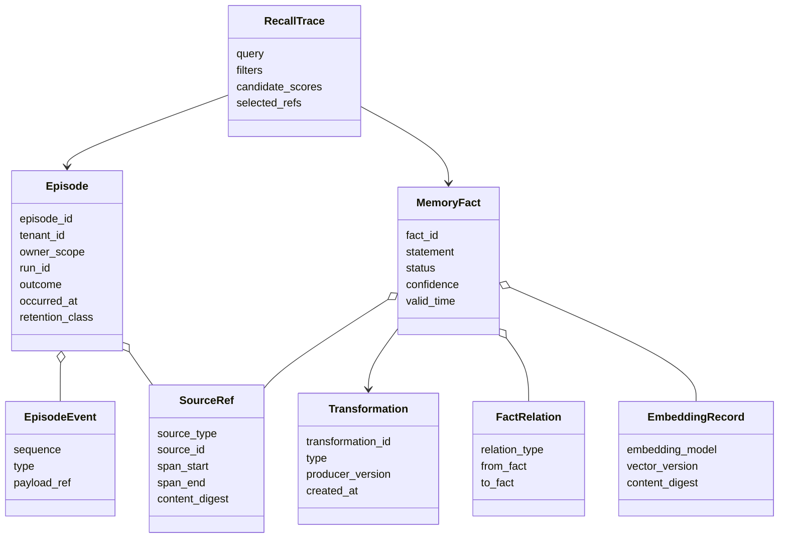
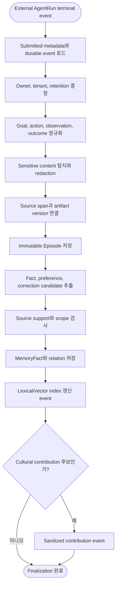
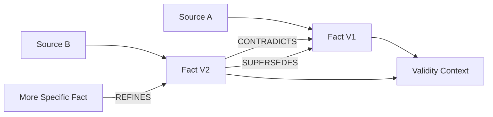
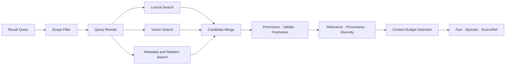

# 06. Long-Term Memory와 Retrieval

## 1. 목적과 경계

Long-Term Memory는 Agent 또는 user scope에서 session을 넘어 경험과 일반화된 지식을 재사용하게 한다.

### 저장 대상

- Task Episode와 terminal outcome
- 외부 검토 가능한 action과 observation
- Source-linked semantic fact
- Preference, constraint와 correction
- 사용한 Cultural Artifact version과 outcome
- Retention, privacy와 permission metadata

### 저장하지 않는 대상

- 비공개 chain-of-thought
- 출처 없이 생성된 확정 사실
- 다른 tenant의 memory
- 필요하지 않은 secret과 원문 credential
- 자동으로 population에 공유되는 cultural knowledge

---

## 2. Memory 구조

---

## 3. Episode finalization

Episode 저장과 fact extraction을 분리할 수 있다. Episode는 먼저 durable하게 기록하고 extraction failure는 재시도한다. Fact extraction에 LLM을 사용할 경우 이는 source-grounded `MemoryEnrichmentProcessor`의 bounded job이며 Agent 응답이나 Plan을 생성하지 않는다. 외부 Agent가 구조화된 Fact를 직접 제출하는 경로도 지원한다.

---

## 4. Provenance model

### SourceRef

SourceRef는 derived knowledge가 어디에서 왔는지 가리킨다.

- User input 또는 외부 Agent response span
- 외부 Agent가 제출한 Tool request/observation
- External document object와 fragment
- Workspace contribution
- Cultural Artifact version
- 다른 MemoryFact

### Transformation

- Extraction
- Summarization
- Generalization
- Correction
- Merge
- Redaction
- Source expansion

### 규칙

1. Derived Fact는 하나 이상의 SourceRef를 가진다.
2. Source가 없는 경우 `source_unavailable` reason을 명시하고 낮은 trust로 취급한다.
3. Summary가 원문을 대체하지 않는다.
4. 여러 source가 하나의 fact를 지지하거나 한 source가 여러 fact를 지지할 수 있다.
5. Source 삭제 시 dependent fact를 impact analysis 대상으로 표시한다.

---

## 5. Fact conflict와 correction

- Conflict를 즉시 overwrite하지 않는다.
- Valid time, context와 source quality를 비교한다.
- Current projection은 선택된 Fact를 가리키지만 history를 삭제하지 않는다.
- Retrieval은 unresolved contradiction을 숨기지 않고 표시할 수 있어야 한다.

---

## 6. Recall pipeline

### 6.1 단계

1. Query, tenant, principal, agent와 purpose를 받는다.
2. Authorization과 retention filter를 적용한다.
3. Query를 lexical/vector/subquery로 rewrite한다.
4. Episode, Fact, Preference index에서 후보를 병렬 검색한다.
5. Metadata, scope, freshness, validity로 filter한다.
6. Relevance, source quality, contradiction과 diversity를 rerank한다.
7. Context budget에 맞춰 결과를 선택한다.
8. Fact와 source reference를 구분해 반환한다.
9. RecallTrace를 기록한다.

### 6.2 다이어그램

### 6.3 Score breakdown

Result는 하나의 opaque score만 제공하지 않는다.

- lexical relevance
- vector similarity
- scope match
- temporal relevance
- source quality
- contradiction penalty
- diversity contribution
- final rank reason

---

## 7. Source expansion

Working Context에 compacted fact만 들어갔더라도 Agent가 세부 근거를 필요로 할 수 있다.

1. `fact_id` 또는 `source_ref_id`로 expansion을 요청한다.
2. Authorization을 다시 확인한다.
3. 원래 source span 또는 larger context window를 읽는다.
4. Redaction policy를 적용한다.
5. Expanded source와 fact relation을 함께 반환한다.

Source expansion은 provenance가 실제로 사용 가능한지를 검증하는 기능이다.

---

## 8. Indexing

### PostgreSQL

- Owner/scope, time, status, relation query
- Full-text index
- pgvector embedding index
- SourceRef와 transformation relation

### Object storage

- 대형 raw document
- 외부 Agent가 제출한 대형 Tool output
- Export bundle
- 삭제·retention policy가 별도로 필요한 blob

### Index version

- Embedding model/version
- Chunking strategy/version
- Content digest
- Indexed at
- Source visibility version

Model 변경 시 shadow re-index 후 read alias를 전환한다.

---

## 9. Retention과 deletion

| 상태 | 동작 |
| --- | --- |
| Active | Recall 가능 |
| Archived | 기본 recall 제외, 명시 요청 시 가능 |
| Expired | Content 삭제 대기, metadata 최소화 |
| Redacted | Sensitive span 제거, derived impact 표시 |
| Deleted | Content 복원 불가, 허용된 audit transition만 유지 |
| LegalHold | 자동 만료·삭제 중지, 접근은 여전히 제한 |

Deletion process는 Episode → SourceRef → MemoryFact → Workspace/Candidate dependency를 탐색한다.

---

## 10. API responsibility

- `RecordEpisode`
- `ExtractMemoryFacts`
- `RecallMemory`
- `ExpandSource`
- `CorrectFact`
- `ArchiveMemory`
- `DeleteMemory`
- `ReindexMemory`

Public client는 extraction internals보다 Episode 조회, fact correction, recall과 deletion 중심 API를 사용한다. `ExtractMemoryFacts`는 내부 processor/custom adapter용이며 일반 Agent inference endpoint가 아니다.
