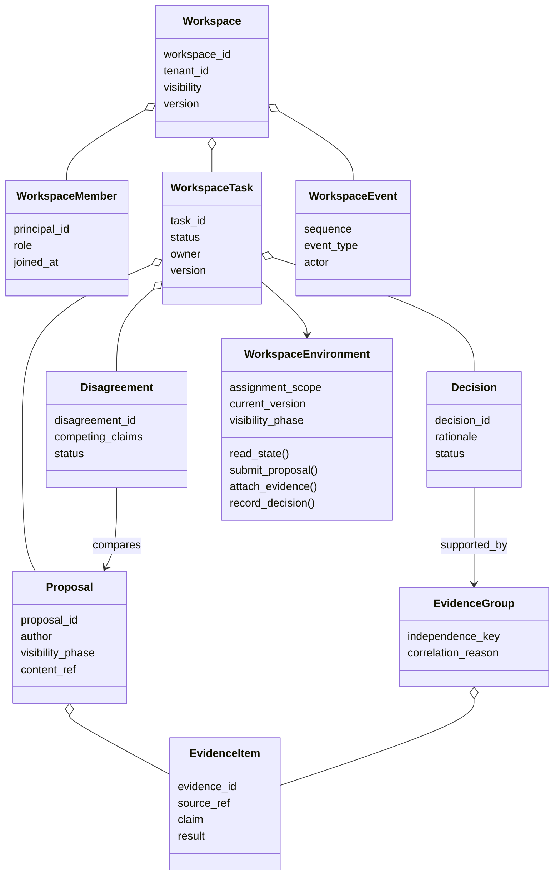
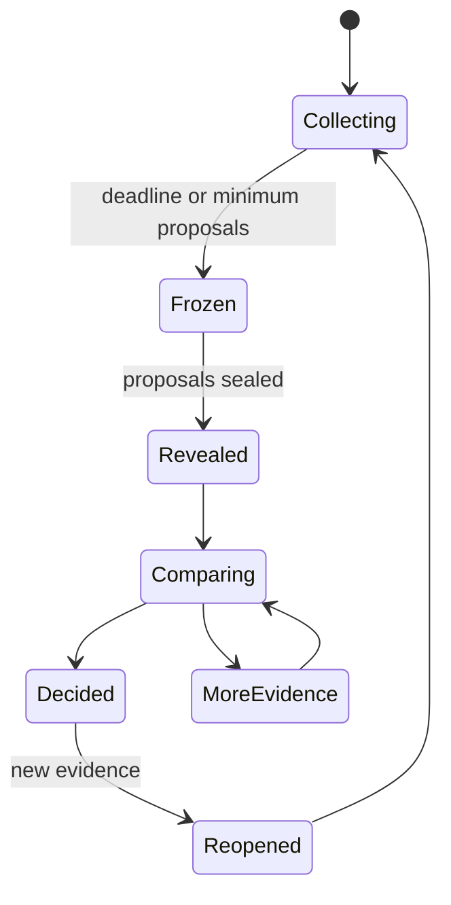
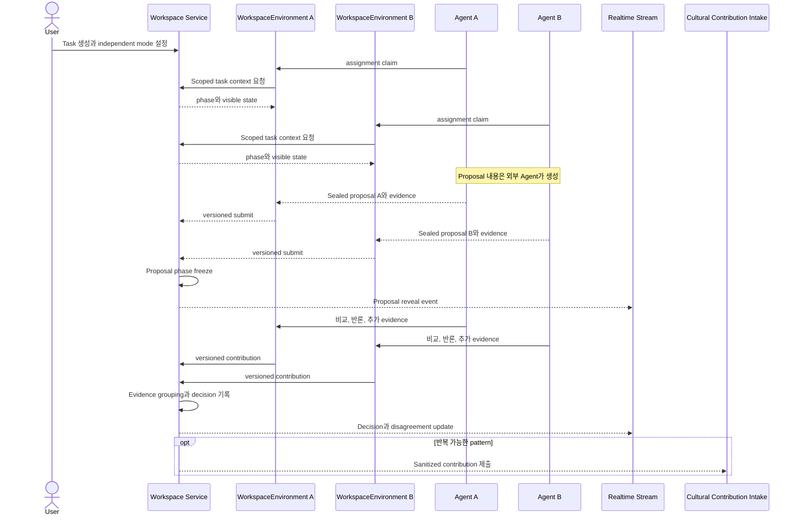

# 07. Multi-Agent Workspace

## 1. 목적

Multi-Agent Workspace는 여러 Agent와 사용자가 현재 협업에 필요한 task state, evidence, proposal, decision과 disagreement를 공유하는 bounded context다.

Agent는 Mnemome 밖에서 실행된다. Workspace는 Agent를 생성하거나 추론시키지 않고, `WorkspaceEnvironment`를 통해 task state와 허용된 command를 제공한다.

Workspace는 다음이 아니다.

- 모든 Agent memory의 복제본
- 다수결로 truth를 확정하는 장소
- Cultural Memory의 published knowledge
- User Query마다 반드시 거치는 global coordination layer

---

## 2. 핵심 기능

- Workspace와 membership 관리
- Task, dependency와 status
- Independent proposal mode
- Evidence와 source reference
- Decision과 rationale
- Disagreement와 unresolved issue
- Expertise/ownership directory
- Realtime update와 cursor replay
- Cultural Contribution 제출

---

## 3. 도메인 모델

---

## 4. Independent proposal mode

협업 초기에 다른 Agent의 의견을 먼저 보면 anchoring과 conformity가 발생할 수 있다.

- `Collecting`: 본인 proposal만 볼 수 있거나 peer proposal을 숨긴다.
- `Frozen`: 제출을 versioned record로 고정한다.
- `Revealed`: 비교 가능한 범위에서 공개한다.
- 이후 debate는 workspace task 해결을 위한 것이며 Cultural Deliberation과 구분한다.

---

## 5. Collaboration sequence

---

## 6. Realtime consistency

초기 구현은 CRDT보다 append-only event와 optimistic concurrency를 사용한다.

- Workspace와 Task는 integer version을 가진다.
- Mutation request는 `expected_version`을 포함한다.
- Conflict 시 server는 current version과 conflict detail을 반환한다.
- Realtime client는 event sequence cursor로 update를 적용한다.
- Reconnect 시 cursor 이후 event를 replay하거나 snapshot을 다시 읽는다.
- Large content는 immutable object/reference로 저장한다.

동시에 동일 text를 편집하는 rich collaborative editor가 필요해질 때만 CRDT를 별도 subcomponent로 도입한다.

---

## 7. Evidence independence

Workspace가 유지할 correlation key:

- source episode/document
- parent Meme Artifact
- model/prompt generation batch
- test dataset/environment
- submitting principal/Agent group

여러 contribution이 같은 key에 의존하면 하나의 Evidence Group으로 묶는다. Group 수는 decision quality의 입력일 뿐 자동 truth score가 아니다.

---

## 8. Permission model

| Role | Read | Contribute | Decide | Manage member | Submit culture |
| --- | --- | --- | --- | --- | --- |
| Viewer | 허용 범위 | 아니오 | 아니오 | 아니오 | 아니오 |
| Contributor | 예 | 예 | 아니오 | 아니오 | 조건부 |
| Decision Maker | 예 | 예 | 예 | 아니오 | 조건부 |
| Workspace Admin | 예 | 예 | 예 | 예 | 예 |
| Agent Member | capability scope | task scope | policy에 따름 | 아니오 | policy에 따름 |

Visibility는 Workspace 전체뿐 아니라 task, proposal, evidence item에 더 좁게 설정할 수 있다.

---

## 9. Cultural Contribution boundary

Workspace content를 Cultural Learning Plane으로 전달하기 전:

1. Workspace permission과 tenant policy 확인
2. Private member content와 secret 제거
3. Task-specific identifier 일반화
4. Source와 evidence group reference 유지
5. Decision뿐 아니라 disagreement와 counterexample 포함
6. Claim, condition과 baseline 초안 작성
7. Contribution submitter와 transformation audit 기록

Workspace Decision status를 Cultural Validated status로 매핑하지 않는다.

---

## 10. Workspace API capability

- Workspace create/read/archive
- Membership and role management
- Task create/update/complete/reopen
- Proposal submit/freeze/reveal
- Evidence attach/group
- Decision record/supersede
- Disagreement open/resolve
- Event stream and replay
- Cultural Contribution draft/submit
- `WorkspaceEnvironment` create/restore와 assignment claim

---

## 11. Failure handling

- Duplicate contribution: client idempotency key로 기존 result 반환
- Version conflict: 자동 overwrite 금지, merge/retry 정보 반환
- Stream disconnect: cursor replay
- Member removal: future access 차단, 기존 authored record는 provenance로 유지
- Source deletion: EvidenceItem redaction과 affected decision 표시
- Contribution submission failure: Workspace state 유지, retryable job
