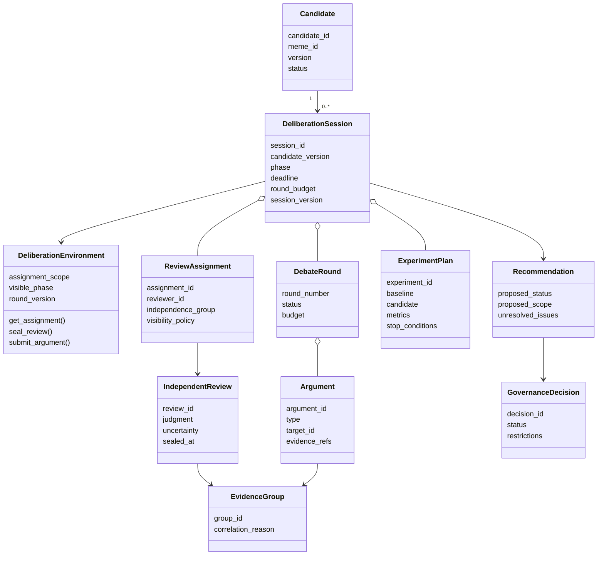
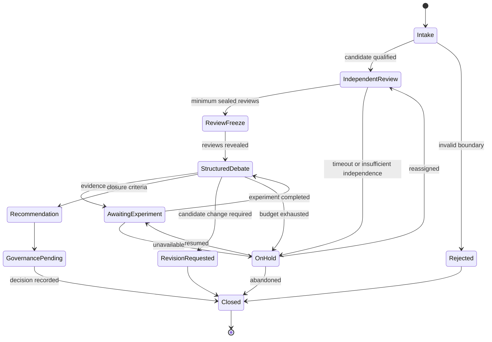
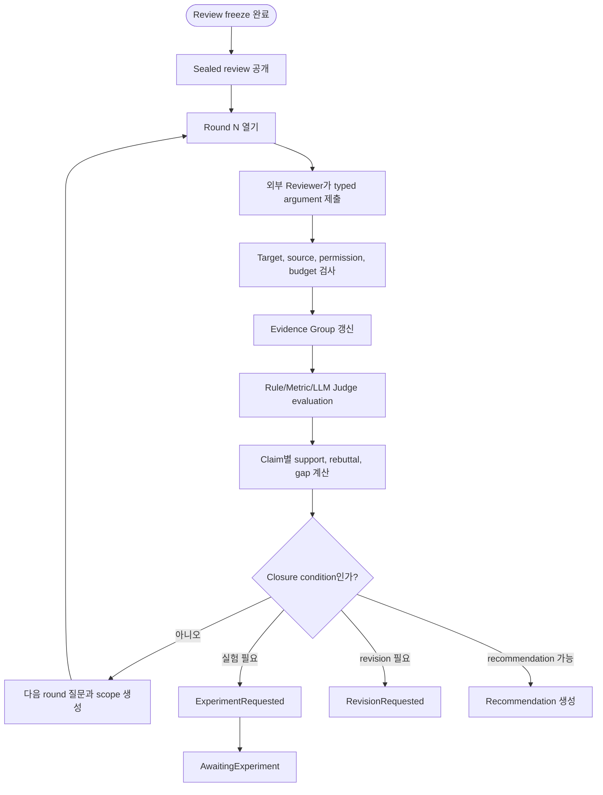

# 08. Cultural Memory와 Deliberation

## 1. 책임 분리

### Cultural Memory

- Meme, Artifact, Variant와 Lineage의 durable registry
- Governance Decision과 Evaluation summary
- Validated/Restricted Artifact set
- Immutable Cultural Snapshot
- Withdrawal, deprecation과 descendant impact

### Cultural Deliberation

- Candidate qualification 이후의 비동기 검증 session
- Independent blind review
- Structured Debate
- A/B Test와 replication 요청
- Evidence grouping
- Governance Recommendation
- 외부 Reviewer Agent를 위한 DeliberationEnvironment
- Rule, Metric, Human과 LLM Judge를 위한 bounded EvaluationTask

Cultural Deliberation은 장기 memory 계층이 아니다. 하나의 Candidate version을 평가하고 종료되는 process/workspace다.

Mnemome은 토론의 상태, 참가 권한, blind visibility, round, argument schema와 evidence graph를 관리한다. Review와 Argument의 내용을 생성하는 것은 외부 Reviewer Agent 또는 사람이다. 내부 LLM Judge는 고정된 rubric으로 제한된 평가만 수행한다.

---

## 2. Cultural Deliberation의 정식 정의

> **Cultural Deliberation**은 하나의 immutable Candidate version에 대해 독립 검토가 완료된 이후, 둘 이상의 Reviewer Agent 또는 독립 Evidence Group이 근거를 참조하는 typed argument를 제한된 round 안에서 교환하여 claim의 지지 근거, 반례, 적용 범위, evidence gap과 unresolved disagreement를 식별하고 Governance Recommendation을 생성하는 비동기 검증 활동이다.

### 2.1 성립 조건

다음 조건을 모두 만족해야 Cultural Deliberation으로 본다.

1. Candidate version과 Baseline Procedure가 고정되어 있다.
2. 최소 둘 이상의 외부 Reviewer 또는 독립 Evidence Group이 있다. 내부 Judge 호출 수만으로 이 조건을 충족하지 않는다.
3. Reviewer는 토론 전에 sealed independent review를 제출한다.
4. Review freeze 전에는 다른 reviewer의 판단과 집계를 볼 수 없다.
5. 모든 발언은 정의된 Argument Type과 target을 가진다.
6. Evidence를 주장하면 SourceRef 또는 ExperimentRef를 연결한다.
7. Round, deadline, token/action 또는 experiment budget이 제한된다.
8. Minority objection과 unresolved disagreement를 결과에 보존한다.
9. 목표는 합의가 아니라 검증 가능한 Governance Recommendation이다.

### 2.2 입력

- Candidate ID와 immutable version
- Claim, applicability, exclusion과 failure boundary
- Baseline Procedure와 Recovery Policy
- Provenance와 source visibility policy
- Evaluation Dimensions
- Reviewer independence constraints
- Session budget과 closure criteria

### 2.3 출력

- Sealed Independent Reviews
- Typed Argument graph
- Evidence와 Evidence Group
- Counterexample과 evidence gap
- Experiment request/result
- Minority objection와 unresolved issue
- Governance Recommendation
- Session completion reason와 audit trail

### 2.4 토론으로 보지 않는 것

- 자유 형식 Agent chat
- User Query를 처리하기 위한 realtime collaboration
- 단순 찬반 투표 또는 다수결
- A/B Test 자체
- Governance의 최종 승인
- 동일 source의 주장을 여러 Agent가 반복하는 행위
- Candidate version이 계속 바뀌는 비정형 brainstorming

---

## 3. 전체 component

```mermaid
flowchart LR
    Sources["Episode · Proposal · Workspace · Counterexample"]
    Reviewer["External Reviewer Agent or Human"]
    DelibEnv["DeliberationEnvironment"]
    Intake["Contribution Intake"]
    Candidate["Candidate Registry"]
    Orchestrator["Deliberation Orchestrator"]
    Review["Independent Review Coordinator"]
    Debate["Structured Debate Coordinator"]
    Evaluation["Evaluation Service"]
    Judge["Rule · Metric · LLM Judge"]
    Experiment["Experiment Coordinator"]
    ExperimentEnv["ExperimentEnvironment"]
    Harness["External Experiment Harness"]
    Governance["Governance Engine"]
    Cultural["Cultural Registry"]
    Publisher["Snapshot Publisher"]
    Online["Online Snapshot Reader"]

    Sources -.-> Intake --> Candidate --> Orchestrator
    Reviewer --> DelibEnv --> Orchestrator
    Orchestrator --> Review --> Debate
    Debate --> Evaluation --> Judge
    Debate -->|"evidence gap"| Experiment --> Debate
    Experiment --> ExperimentEnv --> Harness
    Debate --> Governance --> Cultural --> Publisher --> Online
```



---

## 4. Candidate source

| Source | Candidate trigger | 주의점 |
| --- | --- | --- |
| Episode pattern | 반복된 success/failure | 같은 source의 반복을 독립 evidence로 세지 않음 |
| Direct proposal | Agent가 설계한 procedure | 반복 Episode가 없어도 testable하면 허용 |
| Workspace | 반복 coordination pattern 또는 disagreement | Workspace 합의를 validation으로 사용하지 않음 |
| Exploratory A/B | 성능 차이 발견 | 같은 data로 confirmatory evidence를 주장하지 않음 |
| Counterexample | Existing Artifact failure | 영향 lineage와 withdrawal urgency 확인 |

Candidate가 되려면 claim, condition, baseline, failure, recovery, provenance가 최소한 명세되어야 한다.

---

## 5. Session data model



### 5.1 DeliberationEnvironment wrapper

`DeliberationEnvironment`는 외부 Reviewer Agent나 사람이 protocol에 참여하도록 제공하는 상태형 interface object다.

| Method | 허용 phase | 동작 |
| --- | --- | --- |
| `get_assignment()` | IndependentReview | Candidate, rubric, permitted Evidence만 반환 |
| `seal_review()` | IndependentReview | review digest와 content를 비공개 저장 |
| `get_revealed_reviews()` | ReviewFreeze 이후 | visibility policy가 허용한 review 반환 |
| `get_round()` | StructuredDebate | 현재 question, argument graph와 budget 반환 |
| `submit_argument()` | Open round | typed argument와 EvidenceRef 검증 후 저장 |
| `request_evidence()` | Open round | EvidenceRequest 생성; 직접 검색/추론하지 않음 |
| `acknowledge_close()` | Closing | participant acknowledgement 기록 |

Wrapper는 `session_id`, assignment, current phase, round/version과 idempotency context를 보존한다. Mnemome SDK와 HTTP API가 같은 domain command를 호출한다.

---

## 6. Session state



---

## 7. Argument protocol

| Type | 의미 | 필수 target |
| --- | --- | --- |
| Support | Claim/condition 지지 | Claim 또는 Argument |
| Rebuttal | 주장이나 evidence 해석 반박 | Argument |
| Counterexample | 실패 context 제시 | Claim 또는 condition |
| Clarification | 의미 또는 경계 질문 | Claim/condition |
| EvidenceRequest | 부족한 source 또는 test 요청 | Claim/Argument |
| ScopeProposal | Applicability 변경 제안 | Candidate version |
| RevisionProposal | 새 version이 필요한 변경 | Candidate version |

Argument는 `author`, `round`, `target_id`, `content`, `evidence_refs`, `created_at`과 integrity digest를 가진다.

---

## 8. Debate round algorithm



### Closure condition

- 필수 claim에 필요한 evidence가 충족됨
- 합의는 없지만 disagreement가 충분히 구조화됨
- Critical safety issue로 즉시 reject/withdraw review 필요
- Candidate content를 바꿔야 해 새 version이 필요함
- Round/time/token/experiment budget 소진
- 필요한 experiment가 현재 불가능함

---

## 9. A/B Test

### Experiment rule

- A는 Baseline 또는 existing validated version이다.
- B는 immutable Candidate version이다.
- Metric과 stop condition을 arm 실행 전에 freeze한다.
- Context assignment와 exclusion을 기록한다.
- Safety boundary를 통과하지 못한 Candidate는 live traffic에 배정하지 않는다.
- Result는 dimension별로 저장하며 단일 score로만 판단하지 않는다.
- Exploratory와 confirmatory test를 구분한다.

### Evaluation Dimensions

- Accuracy
- Efficiency
- Generalization
- Safety
- Recoverability
- Explainability
- Strategy Diversity impact

### 실행 전략

1. Deterministic fixture
2. Simulation 또는 sandbox
3. Shadow evaluation
4. 제한된 synthetic/consented traffic
5. Governance가 승인한 scope에서만 controlled exposure

Experiment Coordinator는 arm과 fixture를 배정하고 결과를 수집한다. 실제 Agent 실행은 외부 `ExperimentEnvironment`/harness가 수행한다. Mnemome 내부 LLM Judge는 결과를 versioned rubric으로 평가할 수 있지만 Candidate arm을 실행하는 Agent가 아니다.

---

## 10. Governance

### Input

- Candidate specification
- Independent reviews
- Argument graph
- Evidence Group과 independence metadata
- Experiment result
- Counterexample와 safety signal
- Minority objection와 unresolved issue

### Decision

- Validated
- Restricted
- Under Validation 유지
- Revision Required
- Rejected
- Deprecated
- Withdrawn

### Rule

- Governance Decision은 recommendation과 분리된 immutable record다.
- Non-compensable safety boundary는 다른 metric으로 상쇄하지 않는다.
- Parent status는 child version에 자동 상속되지 않는다.
- Decision에는 scope, rationale, evidence refs, approver와 review trigger가 있어야 한다.

---

## 11. Cultural Snapshot

Snapshot은 특정 시점에 외부 Agent가 `AgentEnvironment`를 통해 읽을 수 있는 Artifact set이다.

```text
snapshot_version
population_id
policy_version
artifact_versions[]
withdrawn_versions[]
created_at
content_digest
previous_snapshot_version
```

### Publication

1. Governance Decision commit
2. Eligible Artifact query
3. Condition/restriction consistency check
4. Immutable snapshot content 생성
5. Snapshot 저장
6. Current pointer atomic 전환
7. Publish event와 cache warm-up

AgentRun session은 시작 시 version을 pin한다. 일반 update는 활성 session에 반영하지 않는다.

---

## 12. Withdrawal

Critical counterexample가 발견되면:

1. Artifact version과 severity를 확인한다.
2. Parent/descendant와 dependent decision을 탐색한다.
3. Governance 또는 emergency policy로 withdrawal decision을 기록한다.
4. 새 snapshot에서 artifact를 제외한다.
5. Current pointer를 전환한다.
6. 필요하면 active Agent session에 `stop-use` invalidation을 전달한다.
7. 이미 발생한 usage와 impact를 추적한다.

`stop-use`는 새로운 토론을 시작하는 명령이 아니라 이미 승인된 invalidation 전달이다.

---

## 13. Agent interaction boundary

- AgentEnvironment는 published snapshot만 읽는다.
- Candidate, review와 debate endpoint를 interaction handler가 호출하지 않는다.
- 외부 Agent가 사용 결과를 outcome/contribution event로 보낸다.
- Deliberation backlog와 failure는 외부 Agent의 User Response를 실패시키지 않는다.
- Snapshot read 실패 시 last-known-good 또는 baseline-only mode를 사용한다.
- LLM Judge는 slow path에서만 동작하며 AgentEnvironment의 context 반환을 기다리게 하지 않는다.

---

## 14. Audit와 trace

다음 양방향 trace가 가능해야 한다.

`external agent run → snapshot → artifact → governance decision → recommendation → deliberation session → review/argument/evaluation/experiment → contribution/source`

`source → fact/contribution → candidate → decision → snapshot → affected run`
