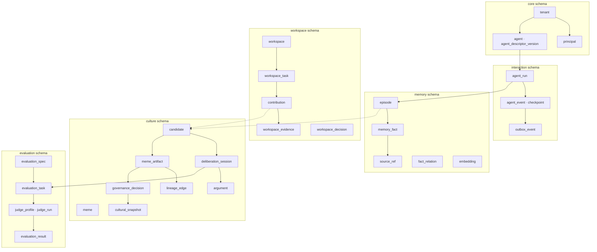
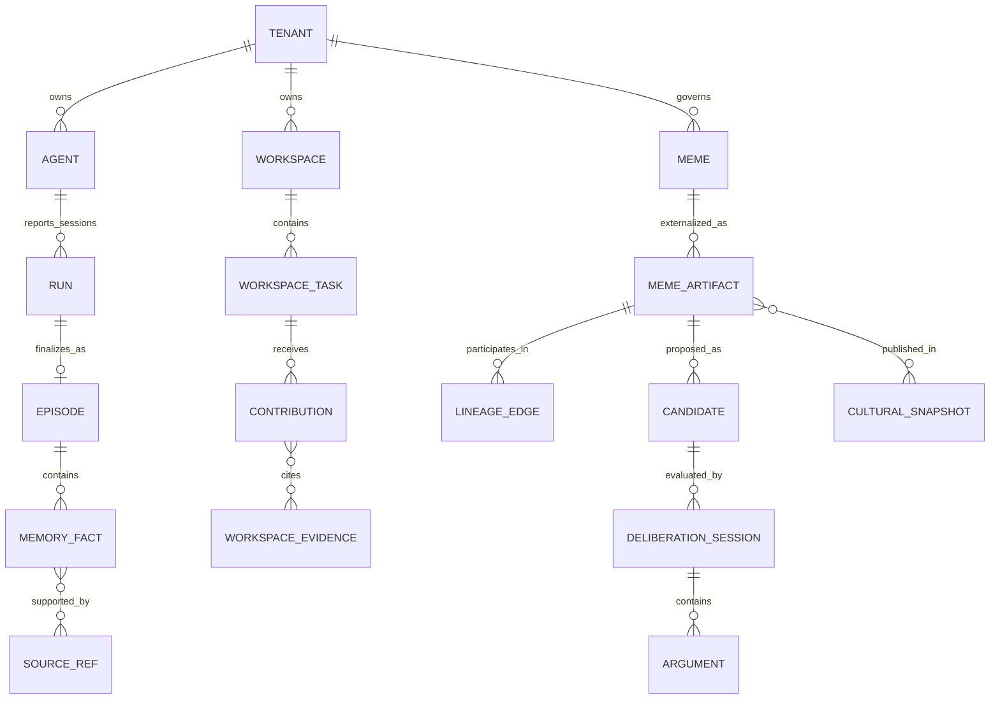
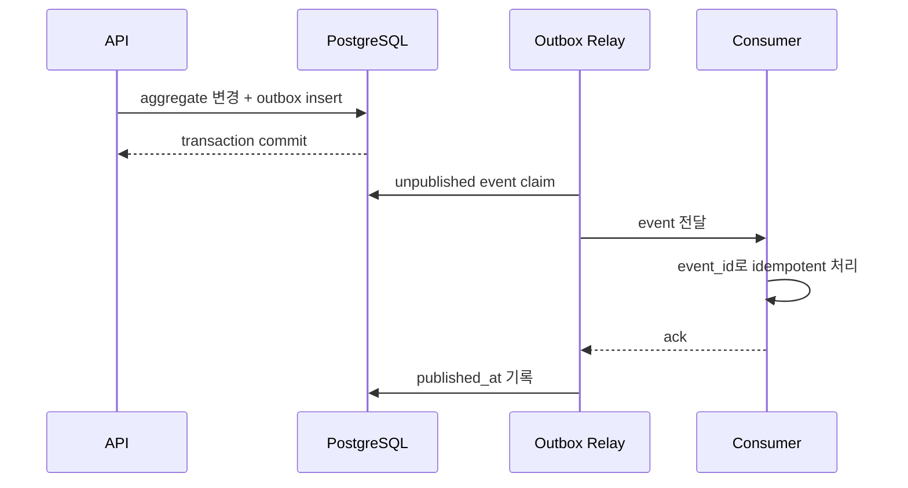

# 09. 데이터와 저장 구조

## 1. 저장 원칙

Mnemome의 데이터 구조는 기억의 종류가 아니라 **일관성, 수명, 접근 패턴과 복구 가능성**에 따라 나눈다.

1. PostgreSQL이 모든 durable domain state의 authoritative source다.
2. Valkey는 TTL state, lease, rate limit과 재생성 가능한 serving cache에만 사용한다.
3. 원문, 대형 artifact와 export는 object storage에 저장하고 DB에는 immutable locator와 digest를 둔다.
4. Vector index와 search projection은 원본이 아니며 재구축할 수 있어야 한다.
5. 모든 장기 기억과 문화 객체는 `tenant_id`, provenance, visibility와 retention policy를 가진다.
6. 외부 event 발행은 domain write와 같은 transaction에 기록한 outbox에서 시작한다.
7. Lineage는 초기에는 relational edge로 표현한다. graph database는 측정된 필요가 생길 때 projection으로 추가한다.

---

## 2. 저장소별 책임

| 저장소 | 저장 대상 | 금지 대상 | 복구 기준 |
| --- | --- | --- | --- |
| PostgreSQL | Run metadata, Episode, Fact, Workspace, Meme, lineage, governance, audit metadata | 대형 binary, 초고빈도 임시 token buffer | PITR와 backup |
| pgvector | MemoryFact, Artifact와 query embedding | 원문 또는 유일한 retrieval 근거 | DB 원본에서 재생성 |
| Valkey | WorkingContext, run checkpoint cache, active Cultural Snapshot, lease, idempotency short cache | 유일한 장기 기록, governance decision | DB/object storage에서 재생성 |
| Object Storage | Source payload, artifact body, export, experiment bundle | mutable aggregate state | versioning, digest, lifecycle rule |
| Search projection | keyword/facet read model | source of truth | event replay 또는 batch rebuild |

---

## 3. 논리 schema



### 3.1 공통 column

Durable table은 특별한 이유가 없는 한 다음 column을 가진다.

```text
id, tenant_id, created_at, created_by,
updated_at, version, classification,
visibility_scope, retention_policy_id
```

- 외부에 노출하는 ID는 UUID/ULID 계열의 불투명 ID로 한다.
- `version`은 optimistic concurrency control에 사용한다.
- `classification`은 public, internal, confidential, restricted 같은 data class를 나타낸다.
- soft delete가 필요한 객체는 `deleted_at`을 사용하되, privacy erasure가 soft delete로 끝나서는 안 된다.

---

## 4. 핵심 관계



### 4.1 SourceRef

`SourceRef`는 원문을 중복 저장하는 범용 blob이 아니라 provenance edge다.

필수 속성:

- `source_type`: run event, tool output, user input, document, experiment 등
- `source_id`와 선택적 `source_version`
- `content_locator`: DB row, object URI 또는 외부 locator
- `content_digest`: 변경 검출용 hash
- `observed_at`과 `recorded_at`
- `visibility_scope`와 `redaction_policy`

### 4.2 LineageEdge

`parent_artifact_id`, `child_artifact_id`, `relation_type`, `justification_ref`를 가진다. `relation_type`은 `DERIVED_FROM`, `REVISES`, `SPECIALIZES`, `COMBINES`, `CONTRADICTS`를 기본으로 한다. 자기 자신을 향하는 edge와 cycle을 허용할지는 relation별 constraint로 통제한다.

---

## 5. Valkey keyspace

| Key pattern | 값 | TTL/정책 |
| --- | --- | --- |
| `wm:{tenant}:{run}` | WorkingContext snapshot | run 종료 후 짧은 grace period |
| `run-lease:{tenant}:{run}` | owner와 fencing token | heartbeat 기반 갱신 |
| `culture:{tenant}:{scope}:active` | snapshot ID와 manifest digest | 새 snapshot publish 시 교체 |
| `culture-object:{snapshot}:{artifact}` | serving payload | bounded TTL + lazy load |
| `idem:{tenant}:{principal}:{key}` | 응답 digest 또는 operation ID | API 정책에 따른 TTL |
| `rate:{tenant}:{bucket}` | token bucket state | 짧은 TTL |

규칙:

- key에는 PII나 query 원문을 넣지 않는다.
- cache miss는 정상 경로다.
- lease에는 monotonic fencing token을 포함해 만료된 worker의 write를 거부한다.
- bulk eviction이 service correctness를 깨뜨리지 않아야 한다.

---

## 6. Vector와 hybrid retrieval

Embedding row는 대상의 현재 version에 종속된다.

```text
embedding_id
tenant_id
subject_type
subject_id
subject_version
model_id
dimension
vector
content_digest
created_at
```

Retrieval은 다음 projection을 결합한다.

1. tenant/visibility/retention filter
2. lexical rank
3. vector similarity
4. recency와 salience
5. provenance quality와 conflict penalty
6. context budget에 맞춘 rerank

Embedding model 변경은 in-place overwrite가 아니라 새 `model_id` projection 생성으로 처리한다.

---

## 7. Transaction과 event 발행



- Aggregate write와 outbox insert는 한 transaction이다.
- Consumer는 at-least-once delivery를 전제로 한다.
- Outbox row는 partition/retention 정책으로 관리한다.
- 느린 consumer 때문에 source transaction이 지연되지 않는다.

---

## 8. Multi-tenancy와 isolation

- 모든 tenant-owned row에 `tenant_id NOT NULL`을 둔다.
- PostgreSQL Row-Level Security를 defense in depth로 사용한다.
- application connection은 request마다 검증된 tenant context를 transaction local setting으로 전달한다.
- unique key와 foreign key에는 tenant boundary를 포함한다.
- object path는 `tenant/{tenant_id}/...` namespace를 사용하고 signed URL도 tenant authorization 뒤에 발급한다.
- cross-tenant culture가 필요하면 복사나 암묵적 조회가 아니라 별도의 federation/publishing 계약을 사용한다.

---

## 9. Retention, deletion과 backup

| Data | 기본 보존 원칙 | 삭제 방식 |
| --- | --- | --- |
| WorkingContext | 짧은 TTL | expiry + durable checkpoint policy |
| Run event | tenant policy | partition drop 또는 targeted erasure |
| Episode/Fact | user/tenant policy | provenance-aware erasure와 reindex |
| Workspace | workspace lifecycle | archive 후 policy-driven purge |
| Cultural Artifact | governance + legal policy | withdraw 우선, 필요 시 cryptographic/physical erasure |
| Evaluation bundle/result | subject와 decision retention에 연동 | source erasure 시 redact/re-evaluate |
| Audit | 법적·보안 정책 | 별도 retention과 제한된 접근 |

Backup은 암호화하고 tenant deletion이 backup retention을 무기한 우회하지 않도록 expiry를 둔다. 복구 훈련은 PostgreSQL PITR, object version restore, cache/index rebuild를 함께 검증한다.

---

## 10. Schema migration 원칙

1. Expand: nullable column/table/index를 먼저 추가한다.
2. Migrate: dual-read 또는 backfill로 데이터를 채운다.
3. Switch: application read/write를 새 schema로 전환한다.
4. Contract: 구 worker와 API가 제거된 뒤 old column을 삭제한다.

대형 index와 backfill은 online transaction과 분리하고, progress checkpoint와 cancel path를 제공한다.
