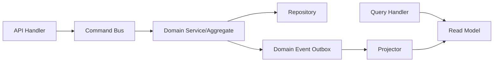

# 10. API와 Event Contract

## 1. Contract 원칙

- 외부 API는 resource-oriented HTTP와 명시적 version을 사용한다.
- AgentRun API는 ContextBundle 응답과 session state SSE stream을 지원한다.
- 비동기 작업은 `202 Accepted`와 operation resource를 반환한다.
- 모든 mutation은 idempotency와 optimistic concurrency 중 하나 이상을 지원한다.
- 내부 module은 command/query/event를 구분한다.
- Event는 이미 발생한 사실이며 명령처럼 이름 짓지 않는다.
- 저장 내부 구조를 public contract로 노출하지 않는다.

기본 prefix는 `/v1`이며 breaking change만 major version을 올린다.

---

## 2. 공통 HTTP 규약

### 2.1 Header

| Header | 용도 |
| --- | --- |
| `Authorization` | OIDC access token |
| `Idempotency-Key` | 안전한 mutation 재시도 |
| `If-Match` | resource version 기반 동시성 제어 |
| `X-Request-Id` | client correlation; 없으면 server가 생성 |
| `traceparent` | distributed trace 전파 |

Tenant는 client가 임의 header로 선택하지 않는다. 검증된 token claim과 server-side membership에서 결정한다.

### 2.2 Error envelope

```json
{
  "error": {
    "code": "VERSION_CONFLICT",
    "message": "The resource changed after it was read.",
    "request_id": "req_01...",
    "retryable": false,
    "details": {
      "current_version": 8
    }
  }
}
```

오류 메시지에는 secret, Agent credential, Judge endpoint credential, 원문 memory나 다른 tenant 식별자를 넣지 않는다.

---

## 3. Public API surface

### 3.1 Agent Environment와 Run session

| Method | Path | 책임 |
| --- | --- | --- |
| `POST` | `/v1/agents` | 외부 Agent descriptor 등록 |
| `POST` | `/v1/agents/{agent_id}/versions` | immutable protocol/capability descriptor 생성 |
| `POST` | `/v1/runs` | AgentRun session을 열고 ContextBundle 생성 |
| `GET` | `/v1/runs/{run_id}` | 상태, pinned snapshot, outcome 조회 |
| `POST` | `/v1/runs/{run_id}/agent-events` | 외부 Agent observation/usage event 제출 |
| `POST` | `/v1/runs/{run_id}/checkpoints` | host-resumable checkpoint reference 저장 |
| `POST` | `/v1/runs/{run_id}:complete` | outcome과 response reference로 session 완료 |
| `POST` | `/v1/runs/{run_id}:fail` | 외부 Agent failure 기록 |
| `GET` | `/v1/runs/{run_id}/events` | Mnemome session state SSE stream/재연결 |
| `POST` | `/v1/runs/{run_id}:request-cancel` | 외부 Agent에 협력적 취소 signal 기록/전달 |
| `GET` | `/v1/runs/{run_id}/trace` | 권한이 있는 provenance/execution trace 조회 |

`/v1/agents`는 외부 Agent의 descriptor와 접속 metadata만 등록한다. Agent process, model 또는 Tool을 배포하지 않는다.

Run 시작 예시:

```json
{
  "agent_id": "agt_01...",
  "agent_descriptor_version": 12,
  "context_request": {
    "query_ref": "host-query-774",
    "retrieval_text": "지난 장애 원인과 재발 방지책",
    "store_query_content": false
  },
  "workspace_id": "wsp_01...",
  "memory_policy": {
    "recall": true,
    "write_episode": true,
    "cultural_scope": "team/default"
  }
}
```

응답에는 `run_id`, `status`, `ContextBundle`, `cultural_snapshot_id`, `stream_url`이 포함된다. Mnemome은 최종 사용자 Response를 반환하지 않는다.

### 3.2 Long-Term Memory

| Method | Path | 책임 |
| --- | --- | --- |
| `GET` | `/v1/memories:recall` | 조건과 query로 fact/episode recall |
| `GET` | `/v1/memory-facts/{id}` | fact와 source provenance 조회 |
| `POST` | `/v1/memory-facts/{id}:correct` | 원본을 지우지 않는 correction 생성 |
| `POST` | `/v1/memory-facts/{id}:suppress` | retrieval 제외 요청 |
| `POST` | `/v1/privacy/erasure-requests` | 삭제 workflow 시작 |

### 3.3 Multi-Agent Workspace

| Method | Path | 책임 |
| --- | --- | --- |
| `POST` | `/v1/workspaces` | workspace 생성 |
| `POST` | `/v1/workspaces/{id}/tasks` | task 생성/할당 |
| `POST` | `/v1/workspace-tasks/{id}/contributions` | 독립 proposal/evidence 제출 |
| `POST` | `/v1/workspace-tasks/{id}/decisions` | decision과 rationale 기록 |
| `GET` | `/v1/workspaces/{id}/events` | workspace SSE/WebSocket feed |
| `POST` | `/v1/contributions/{id}:nominate` | Cultural Candidate intake로 명시적 전달 |

### 3.4 Cultural Memory와 Deliberation

| Method | Path | 책임 |
| --- | --- | --- |
| `GET` | `/v1/cultural-snapshots/active` | scope별 active immutable snapshot 조회 |
| `GET` | `/v1/meme-artifacts/{id}` | artifact, applicability, lineage 조회 |
| `POST` | `/v1/cultural-candidates` | testable Candidate version 제출 |
| `POST` | `/v1/candidates/{id}/deliberations` | 비동기 deliberation 시작 |
| `POST` | `/v1/review-assignments/{id}/reviews` | sealed independent review 제출 |
| `POST` | `/v1/deliberations/{id}/arguments` | typed argument 제출 |
| `GET` | `/v1/review-assignments/{id}/environment` | 현재 phase/visibility의 DeliberationEnvironment state 조회 |
| `POST` | `/v1/deliberations/{id}/experiment-requests` | 실험 요청 |
| `POST` | `/v1/governance-decisions` | 권한 있는 최종 결정 기록 |
| `POST` | `/v1/meme-artifacts/{id}:withdraw` | withdrawal workflow 시작 |

### 3.5 Evaluation과 LLM Judge

| Method | Path | 책임 |
| --- | --- | --- |
| `POST` | `/v1/evaluation-tasks` | immutable subject/rubric으로 bounded task 생성 |
| `GET` | `/v1/evaluation-tasks/{id}` | task, assignment와 aggregate 조회 |
| `POST` | `/v1/evaluation-assignments/{id}:execute` | 허용된 내부 Judge 실행 요청 |
| `POST` | `/v1/evaluation-assignments/{id}/results` | Human/custom evaluator result 제출 |
| `GET` | `/v1/evaluation-tasks/{id}/results` | 개별 result, disagreement와 aggregate 조회 |

이 API는 권한 있는 worker/reviewer용이다. LLM Judge가 사용자 Query를 받아 일반 응답을 생성하는 endpoint가 아니다.

### 3.6 Environment wrapper serialization

원격 SDK는 다음 resource를 typed interface object로 복원한다.

```json
{
  "environment_type": "deliberation",
  "environment_id": "denv_01...",
  "subject": {
    "type": "deliberation_session",
    "id": "dls_01...",
    "version": 7
  },
  "assignment_id": "ras_01...",
  "phase": "STRUCTURED_DEBATE",
  "state_version": 11,
  "permitted_actions": ["read_round", "submit_argument"],
  "links": {
    "self": "/v1/review-assignments/ras_01.../environment",
    "submit_argument": "/v1/deliberations/dls_01.../arguments"
  },
  "expires_at": "2026-07-22T00:00:00Z"
}
```

| Wrapper | 생성/복원 endpoint | 주요 command |
| --- | --- | --- |
| `AgentEnvironment` | `POST /v1/runs`, `GET /v1/runs/{id}/environment` | context, event, checkpoint, complete |
| `WorkspaceEnvironment` | `GET /v1/workspace-assignments/{id}/environment` | proposal, evidence, decision |
| `DeliberationEnvironment` | `GET /v1/review-assignments/{id}/environment` | seal review, read round, argument |
| `ExperimentEnvironment` | `GET /v1/experiment-assignments/{id}/environment` | fixture, measurement, outcome |

`permitted_actions`는 UX hint일 뿐 최종 authorization이 아니다. Server는 각 command에서 tenant, assignment, phase와 version을 다시 검사한다. SDK object는 content 생성이나 inference를 수행하지 않는다.

---

## 4. AgentRun session streaming contract

SSE event는 `id`, `event`, `data`를 가진다. client는 `Last-Event-ID`로 재연결할 수 있다.

```text
id: 42
event: checkpoint.recorded
data: {"run_id":"run_01...","context_version":4,"checkpoint_ref":"obj_01..."}
```

기본 event:

- `run.opened`
- `context.prepared`
- `agent.event.recorded`
- `checkpoint.recorded`
- `cancel.requested`
- `run.completed`
- `run.failed`
- `run.abandoned`

Stream은 Mnemome이 보유한 session state를 전달한다. 외부 Agent의 token stream이나 chain-of-thought를 proxy하지 않는다.

---

## 5. Internal command와 query



Command 예:

- `OpenAgentRun`
- `AppendAgentEvent`
- `RecordAgentCheckpoint`
- `CompleteAgentRun`
- `FinalizeEpisode`
- `SubmitContribution`
- `OpenDeliberation`
- `CreateEvaluationTask`
- `RecordEvaluationResult`
- `RecordGovernanceDecision`
- `PublishCulturalSnapshot`

Query 예:

- `PrepareEffectiveContext`
- `GetAgentEnvironmentState`
- `RecallMemoryFacts`
- `GetWorkspaceState`
- `ResolveActiveCulturalSnapshot`
- `TraceArtifactProvenance`

Command handler는 aggregate invariant를 보장하며 query handler는 mutation을 수행하지 않는다.

---

## 6. Event envelope

```json
{
  "event_id": "evt_01...",
  "event_type": "culture.snapshot.published.v1",
  "occurred_at": "2026-07-21T00:00:00Z",
  "producer": "cultural-registry",
  "tenant_id": "ten_01...",
  "aggregate": {
    "type": "cultural_snapshot",
    "id": "csp_01...",
    "version": 5
  },
  "correlation_id": "run_or_operation_id",
  "causation_id": "evt_00...",
  "classification": "internal",
  "schema_version": 1,
  "payload": {}
}
```

Payload에는 대형 원문 대신 권한 검사 가능한 resource reference를 둔다.

---

## 7. Domain event catalog

| Context | Event | 주요 consumer |
| --- | --- | --- |
| Interaction | `agent.run.opened.v1` | Session projector |
| Interaction | `agent.run.completed.v1` | Episode finalizer, usage meter |
| Memory | `memory.episode.finalized.v1` | Indexer, candidate intake |
| Memory | `memory.fact.corrected.v1` | Indexer, lineage impact analyzer |
| Workspace | `workspace.contribution.submitted.v1` | Workspace projector |
| Workspace | `workspace.contribution.nominated.v1` | Candidate intake |
| Culture | `culture.candidate.qualified.v1` | Deliberation orchestrator |
| Culture | `culture.deliberation.closed.v1` | Governance queue |
| Culture | `culture.experiment.completed.v1` | Deliberation orchestrator |
| Evaluation | `evaluation.result.recorded.v1` | Deliberation aggregator, audit |
| Culture | `culture.governance.decided.v1` | Registry, audit |
| Culture | `culture.snapshot.published.v1` | Snapshot cache warmer, Agent Environment |
| Culture | `culture.artifact.withdrawn.v1` | Impact analyzer, snapshot publisher |
| Privacy | `privacy.erasure.requested.v1` | Erasure orchestrator |

---

## 8. Idempotency와 concurrency

- 같은 `Idempotency-Key`, tenant, principal, operation의 재요청은 동일 결과를 반환한다.
- key 재사용 시 body digest가 다르면 `409 IDEMPOTENCY_CONFLICT`를 반환한다.
- Workspace, Candidate와 Governance mutation은 `If-Match` 또는 expected version을 요구한다.
- Event consumer는 `event_id` 처리 기록이나 자연 idempotent upsert를 사용한다.
- Agent event는 caller event ID로 중복을 제거한다. Evaluation Judge 실행은 별도 `attempt`를 가지며 retry 결과를 덮어쓰지 않는다.

---

## 9. Compatibility와 schema 관리

1. 기존 field 의미를 바꾸지 않는다.
2. optional field 추가는 허용한다.
3. enum consumer는 unknown value를 안전하게 처리한다.
4. event payload 제거는 새 major event type에서만 한다.
5. producer와 consumer contract test를 CI에서 실행한다.
6. deprecation에는 종료 시점과 migration guide를 제공한다.

Webhook을 제공할 경우 event envelope의 subset을 서명해 전송하며 delivery secret rotation, replay protection과 retry policy를 제공한다.
