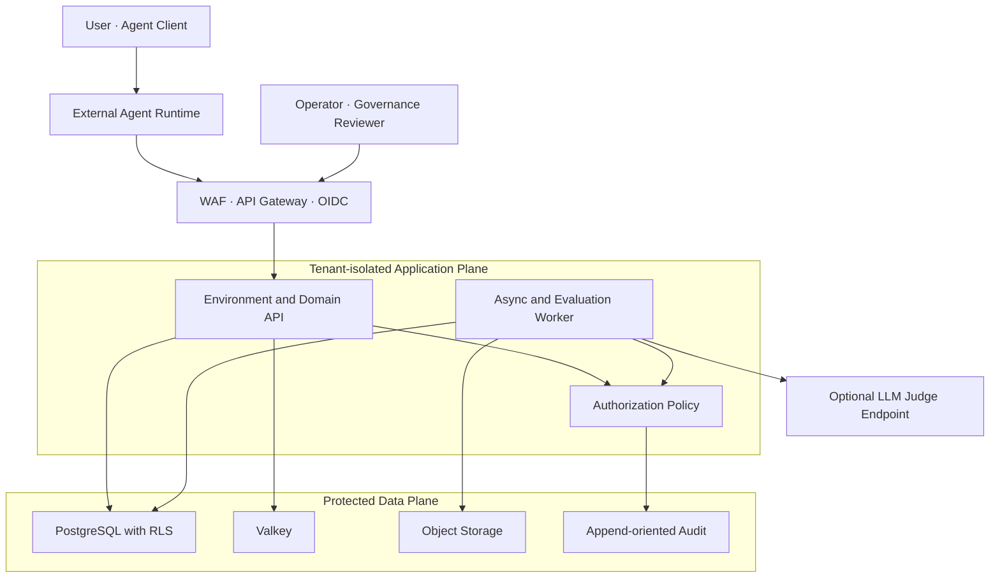
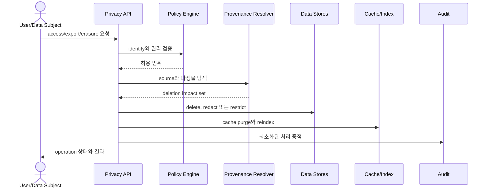

# 11. 보안·Privacy·Governance

## 1. 보호 대상과 기본 가정

주요 보호 대상은 사용자 query, 외부 Agent가 제출한 observation/tool output, Working Context, Episode/Fact, Workspace contribution, Cultural Artifact, Judge input/output, credential, governance decision과 audit record다.

다음 구성요소는 신뢰하지 않는 입력을 생성할 수 있다.

- 사용자와 외부 문서
- 다른 Agent의 contribution
- 외부 Agent가 제출한 model/tool observation과 outcome
- 내부 Rule/Metric/LLM Judge의 출력
- Cultural Artifact 자체

따라서 기억되었거나 문화적으로 승인되었다는 사실만으로 명령 실행 권한을 부여하지 않는다.

---

## 2. Trust boundary

---

## 3. Authentication과 authorization

### 3.1 Authentication

- 사용자와 operator는 OIDC Authorization Code + PKCE를 사용한다.
- machine client는 workload identity 또는 제한된 service credential을 사용한다.
- access token은 짧은 수명으로 유지하고 audience, issuer, signature, expiry를 검증한다.
- 장기 provider credential은 secret manager에서 주입하며 DB나 log에 저장하지 않는다.

### 3.2 Authorization

RBAC와 ABAC를 결합한다.

| Role 예 | 허용 범위 |
| --- | --- |
| Tenant Owner | tenant policy, membership, billing |
| Agent Integrator | Agent descriptor와 test session 관리 |
| Workspace Member | 할당된 Workspace 접근 |
| Memory Steward | memory correction, retention 관리 |
| Reviewer | 배정된 sealed review와 argument 제출 |
| Governor | governance decision과 restriction 승인 |
| Auditor | 제한된 read-only audit 접근 |

ABAC 입력에는 tenant, resource owner, workspace membership, data classification, purpose, visibility scope, retention 상태와 requested action을 포함한다.

`allow = role_permission AND tenant_match AND scope_match AND purpose_allowed`를 기본으로 하며 명시되지 않은 접근은 거부한다.

---

## 4. Tenant와 population isolation

- 인증된 principal이 속한 tenant만 application context로 설정한다.
- 모든 durable query는 tenant predicate와 RLS를 통과한다.
- cache key, object prefix, metric label과 background job에도 tenant를 포함한다.
- cross-tenant retrieval은 기본적으로 금지한다.
- 여러 tenant가 Cultural Population을 공유하는 federation 기능은 별도 consent, export/import provenance와 governance domain을 요구한다.
- service account는 필요한 schema/action만 허용하고 superuser connection을 application에 사용하지 않는다.

---

## 5. Memory-specific threat control

| 위협 | 통제 |
| --- | --- |
| Prompt injection이 memory로 고착 | input/output를 instruction과 evidence로 구분, source trust 기록, promotion 검증 |
| Sensitive data가 다른 context에 recall | scope filter를 similarity search 전에 적용, field-level redaction |
| 잘못된 기억이 correction 뒤에도 사용 | supersession edge, active filter, cache/index invalidation |
| 삭제된 source가 summary에 잔존 | reverse provenance로 파생물 탐색, recompact/reindex |
| Cultural Artifact가 외부 Agent 권한 확대 | Artifact는 procedure suggestion일 뿐; Mnemome과 Agent host의 capability policy가 별도 authorize |
| 다수 Agent가 같은 source를 독립 증거처럼 제출 | Evidence Group correlation과 source lineage 검사 |
| 철회 Artifact가 cache에 남음 | snapshot generation bump, denylist hot path, cache purge |

---

## 6. External Agent와 Internal Judge 격리

### External Agent

1. Agent는 workload identity로 AgentEnvironment에 접근한다.
2. Agent가 제출한 plan reference, tool output과 outcome은 untrusted statement로 저장한다.
3. Mnemome은 Agent의 Tool credential을 받아 대신 실행하지 않는다.
4. ContextBundle은 scope와 visibility로 필터링하고 content digest를 포함한다.
5. cancel은 협력적 signal이며 외부 process가 종료되었다고 가장하지 않는다.

### Internal LLM Judge

1. Judge에는 policy-filtered EvaluationBundle과 versioned rubric만 전달한다.
2. provider별 data processing policy, retention과 region을 tenant 설정에 연결한다.
3. Judge의 Tool access는 기본 금지하고 필요한 경우 read-only EvidenceResolver만 명시적으로 허용한다.
4. Evidence content는 instruction이 아닌 quoted data로 격리한다.
5. Judge result는 typed evidence일 뿐 Governance 권한을 갖지 않는다.
6. 네트워크 egress는 승인된 evaluation endpoint 단위로 제한한다.

---

## 7. Privacy lifecycle

### 7.1 목적과 consent

- memory write와 cultural contribution은 서로 다른 목적이다.
- `write_episode=true`가 cultural sharing consent를 뜻하지 않는다.
- Workspace contribution을 Candidate로 전환할 때 visibility와 sharing policy를 다시 검사한다.
- 개인 데이터가 제거된 파생 artifact라도 재식별 가능성과 license를 평가한다.

### 7.2 삭제 의미

- retrieval suppression: 검색 결과에서 즉시 제외
- logical deletion: 일반 접근 차단
- physical erasure: 원문/파생물/serving projection 제거
- cultural withdrawal: Artifact 사용 중지와 descendant impact 표시

법적 보존 의무 때문에 즉시 삭제할 수 없는 경우 접근을 제한하고 근거와 종료 시점을 기록한다.

---

## 8. Encryption과 secret

- 전송 구간은 TLS를 사용한다.
- DB, backup, object와 cache는 저장 시 암호화한다.
- tenant별 강한 분리가 필요한 경우 envelope encryption과 tenant-scoped data key를 지원한다.
- object digest와 selected audit event에 integrity verification을 적용한다.
- key rotation은 기존 데이터 decrypt와 신규 key encrypt가 공존하는 migration 절차를 갖는다.
- secret은 로그, event payload, trace attribute, exception response에 포함하지 않는다.

---

## 9. Cultural governance control

- Reviewer 배정과 Governance 승인 권한을 분리할 수 있어야 한다.
- blind review freeze 전에는 다른 review와 집계 결과를 공개하지 않는다.
- Candidate/Artifact version은 review 시작 뒤 변경할 수 없다.
- 최종 Decision에는 actor, policy version, evidence set, minority objection과 restriction을 기록한다.
- `VALIDATED`는 모든 context에서 안전하다는 뜻이 아니다. applicability와 exclusion이 AgentEnvironment filter에 포함된다.
- emergency withdrawal은 신속히 serving을 막되 사후 review와 audit를 요구한다.

---

## 10. Audit

감사 대상:

- authentication, membership와 privileged role 변경
- memory export, correction, suppression과 erasure
- restricted source 조회
- Workspace decision과 Candidate nomination
- review reveal, argument, experiment와 Governance Decision
- EvaluationTask, LLM Judge attempt, rubric/model version과 result
- snapshot publish와 Artifact withdrawal
- policy override, break-glass와 secret management event

Audit record는 `who`, `what`, `resource`, `tenant`, `purpose`, `when`, `result`, `policy_version`, `correlation_id`를 포함한다. 원문 content는 가능한 저장하지 않는다.

---

## 11. Break-glass와 incident response

- break-glass는 시간 제한, 사유 입력, step-up authentication과 즉시 알림을 요구한다.
- incident 시 tenant/session/token/artifact 단위로 격리할 수 있어야 한다.
- leaked Artifact는 hot denylist로 즉시 차단하고 새 snapshot을 publish한다.
- forensic export는 별도 권한과 immutable manifest를 가진다.
- 사후 분석에서 발견된 잘못된 memory/culture는 provenance를 통해 영향 Run과 descendant를 추적한다.

---

## 12. 보안 검증 gate

- tenant escape와 IDOR test
- RLS policy test와 privileged connection 검토
- external Agent event injection과 Judge prompt-injection adversarial test
- secret/PII log scan
- dependency, image와 IaC scan
- deletion propagation integration test
- signed object URL expiry와 path isolation test
- governance separation-of-duty test
- backup restore 후 encryption/authorization 재검증
