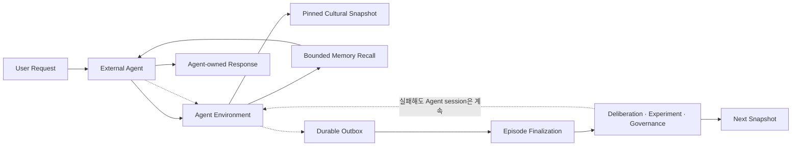
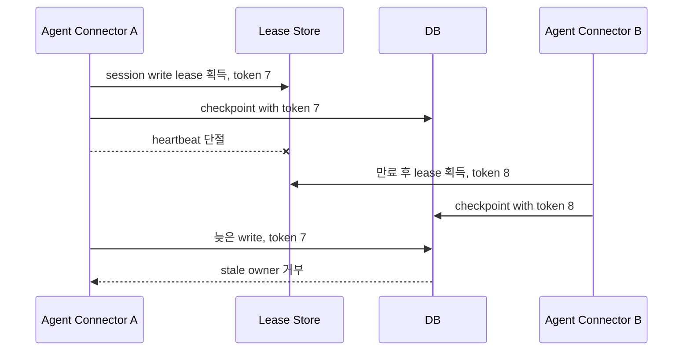

# 12. 신뢰성·Consistency·확장성

## 1. 신뢰성 목표

초기 목표치는 production traffic과 비용을 측정한 뒤 확정해야 하는 `Provisional` 값이다.

| 사용자 여정 | 지표 | 초기 목표 |
| --- | --- | --- |
| API control plane | 월간 availability | 99.9% |
| Active Cultural Snapshot 조회 | 월간 availability | 99.95% |
| AgentRun session 생성 | p95 server latency | 300 ms 이하, 외부 Agent 실행 제외 |
| Effective Context 준비 | p95 latency | 500 ms 이하, cold index 제외 |
| Workspace mutation 반영 | p95 projection lag | 2초 이하 |
| Culture event 처리 | p95 processing lag | 60초 이하 |
| 철회 Artifact 차단 | p99 propagation | 60초 이하 |

RPO/RTO 초기 목표:

- PostgreSQL: RPO 5분 이하, RTO 60분 이하
- Object Storage: versioning 기반 RPO 15분 이하, RTO 4시간 이하
- Valkey/Search projection: RPO 허용, RTO 30분 이내 재구축

---

## 2. Fast path와 slow path의 장애 격리

격리 원칙:

- Deliberation, evaluation, experiment와 snapshot publish 실패는 ContextBundle 반환 latency를 늘리지 않는다.
- AgentRun은 시작 시 선택한 Cultural Snapshot을 종료까지 pin한다.
- culture cache가 없으면 DB manifest 또는 policy가 허용한 no-culture context를 반환한다.
- episode finalization이 늦어져도 외부 Agent의 사용자 response에는 영향을 주지 않는다. durable 기록 상태는 별도로 노출한다.

---

## 3. Consistency model

| 데이터 | write consistency | read consistency | 이유 |
| --- | --- | --- | --- |
| AgentRun state | 단일 aggregate strong | writer read-after-write | session 상태와 terminal 전이 |
| WorkingContext | versioned append + checkpoint | session-local strong | 제출 event/checkpoint 일관성 |
| Episode/Fact | transaction strong | index는 eventual | durable provenance |
| Workspace task/decision | optimistic concurrency | aggregate strong, feed eventual | 협업 충돌 방지 |
| Contribution feed | append-only | eventual | fan-out 확장성 |
| Candidate/Deliberation | state transition strong | projection eventual | protocol invariant |
| Governance Decision | transaction strong | read-after-write | 승인 정확성 |
| Cultural Snapshot | immutable | snapshot 내부 strong | reproducible Run |
| Cache/index | eventual | stale 허용 범위 명시 | serving 성능 |

전체 시스템의 global serializability는 목표가 아니다. aggregate 안의 불변조건과 immutable snapshot 경계를 strong consistency로 보장한다.

---

## 4. Idempotency, retry와 ordering

### 4.1 Retry policy

- network timeout과 명시적 transient error만 exponential backoff + jitter로 재시도한다.
- validation, permission, version conflict는 자동 재시도하지 않는다.
- LLM Judge 호출은 attempt별 기록과 provider idempotency 지원 여부를 확인한다.
- retry budget은 요청 deadline을 넘지 않는다.

### 4.2 Ordering

- aggregate event에는 monotonic `aggregate_version`을 둔다.
- consumer는 중복 event를 무시하고 version gap은 재조회/재처리를 요청한다.
- 서로 다른 aggregate 사이의 total order는 보장하지 않는다.
- snapshot publisher는 manifest에 포함되는 모든 Artifact/Governance version을 고정한다.

### 4.3 Exactly-once 환상 방지

전송은 at-least-once, 상태 효과는 idempotent하게 만든다. 외부 Agent의 Tool side effect는 Mnemome 책임이 아니며 Agent가 제출한 event ID와 outcome reference만 중복 제거한다.

---

## 5. Concurrent Agent writer와 fencing

동일 AgentRun에 여러 connector가 동시에 checkpoint를 쓰는 경우 lease와 durable fencing token을 결합한다. 이는 Agent 실행 ownership이 아니라 Mnemome session write ordering을 보호한다. 단순 event append는 caller event ID와 expected context version으로 처리할 수 있다.

---

## 6. Backpressure와 load shedding

| Queue/자원 | admission 기준 | 초과 시 동작 |
| --- | --- | --- |
| Agent session/context | tenant concurrency와 recall quota | `429` + retry hint |
| Agent event ingest | tenant event rate와 payload budget | throttle 또는 batch 요청 |
| Episode finalization | lag/DB load | 지연 허용, durable spool |
| Embedding | batch backlog | lower-priority memory index 지연 |
| Deliberation | reviewer/session quota | queued operation |
| Experiment | compute/traffic budget | governance approval 대기 |
| LLM Judge | endpoint/cost/assignment budget | queue, alternate evaluator 또는 human review |
| Snapshot publish | 단일 scope lock | coalesce 후 최신 generation publish |

우선순위는 safety withdrawal, Agent context/session, workspace mutation, durable memory, culture evaluation, batch reindex 순으로 둔다.

---

## 7. Horizontal scaling

- API는 stateless하게 확장한다.
- Interaction Gateway는 stateless event ingest와 versioned checkpoint로 수평 확장한다.
- Background worker는 workload type과 tenant quota로 queue를 분리한다.
- PostgreSQL은 먼저 index/partition/read replica를 사용하고 tenant 규모가 검증된 뒤 sharding을 고려한다.
- Valkey cluster는 ephemeral state 크기와 throughput이 필요할 때 도입한다.
- Object와 vector indexing은 batch 처리로 평탄화한다.

Noisy-neighbor 통제:

- tenant별 request, event, Judge cost, storage, worker quota
- weighted fair queue
- per-tenant circuit breaker와 concurrency isolation
- high-cardinality metric의 cardinality budget

---

## 8. Circuit breaker와 degraded mode

| 실패 대상 | Degraded behavior |
| --- | --- |
| LLM Judge Endpoint | alternate evaluator, human review 대기 또는 명시적 evaluation failure |
| External Agent Connector | assignment notification 지연; pull/polling fallback |
| Valkey | durable checkpoint/DB fallback, 성능 저하 |
| Vector index | lexical/recency retrieval fallback |
| Cultural Snapshot cache | DB/object manifest fallback 또는 no-culture mode |
| Workspace realtime feed | polling fallback |
| Culture worker | event backlog; online path 영향 없음 |

Fallback이 품질이나 privacy contract를 약화시키면 사용하지 않고 명시적으로 실패한다.

---

## 9. Disaster recovery

1. 새 region/site에서 identity와 secret trust를 복원한다.
2. PostgreSQL을 목표 point로 복구하고 schema version을 검증한다.
3. object manifest/digest를 대조한다.
4. outbox와 consumer checkpoint에서 event processing을 재개한다.
5. active Cultural Snapshot을 DB/object에서 cache로 복원한다.
6. vector/search projection을 재구축한다.
7. synthetic Run, memory recall, workspace mutation과 withdrawal test를 수행한다.
8. traffic을 단계적으로 전환한다.

온프레미스 배포에서는 고객이 선택한 backup target과 key custody를 존중하고, Mnemome 서비스가 외부 control plane 없이도 복구 가능해야 한다.

---

## 10. Capacity model

최소한 다음 변수를 tenant별로 측정한다.

- concurrent Agent sessions와 event 제출률
- ContextBundle/WorkingContext 크기
- LLM Judge task rate, token/cost와 latency
- episode/fact 생성률과 embedding backlog
- workspace event fan-out
- candidate/deliberation/experiment 처리율
- active snapshot size와 cache hit ratio
- provenance graph 평균/최대 fan-out

Scale decision은 Agent 수가 아니라 이 workload 지표에 근거한다.
