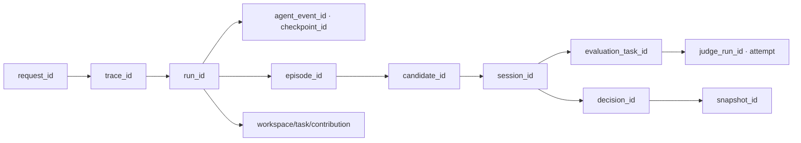

# 13. Observability와 운영

## 1. 운영 목표

Observability는 단순 장애 감지가 아니라 다음 질문에 답해야 한다.

- 어떤 외부 Agent descriptor와 Cultural Snapshot이 어느 session에서 사용되었는가?
- 어떤 memory와 source가 context에 포함되었는가?
- Mnemome latency가 context, memory, workspace, evaluation 중 어디서 발생했는가?
- 동일 source를 독립 evidence로 잘못 세었는가?
- Artifact withdrawal이 모든 serving surface에 반영되었는가?
- privacy operation이 원본과 파생 projection까지 완료되었는가?

---

## 2. Correlation model



각 ID는 log, trace와 event에 필요한 범위만 포함한다. tenant ID와 user ID는 telemetry backend의 privacy 정책에 따라 hash/pseudonymize한다.

---

## 3. Trace

OpenTelemetry semantic convention을 확장해 다음 span을 사용한다.

- `http.request`
- `interaction.open`, `interaction.prepare_context`, `agent_event.ingest`, `checkpoint.record`, `interaction.finalize`
- `memory.recall`, `memory.expand_source`, `memory.write_episode`
- `culture.resolve_snapshot`, `culture.filter_artifact`
- `evaluation.create`, `evaluation.judge.execute`, `evaluation.aggregate`
- `workspace.mutate`, `workspace.project`
- `deliberation.review`, `deliberation.round`, `experiment.execute`
- `governance.decide`, `snapshot.publish`

Span attribute에 query, response, memory, Agent observation 또는 Judge prompt/output 원문을 기본 저장하지 않는다. content 관찰이 필요하면 tenant 정책과 sampling permission을 별도로 적용한다.

---

## 4. Metric

### 4.1 Agent interaction

- `runs_started_total`, `runs_completed_total`, `runs_failed_total`
- `run_session_duration_seconds` by Agent descriptor/result
- `context_prepare_duration_seconds`
- `working_context_bytes`, `context_tokens`
- `agent_events_ingested_total`, `agent_event_rejected_total`
- `checkpoint_write_duration_seconds`
- `cultural_snapshot_cache_hit_ratio`
- `run_cancel_signal_latency_seconds`, `abandoned_sessions_total`

### 4.2 Memory

- `episodes_finalized_total`
- `memory_recall_duration_seconds`
- `memory_recall_candidates`, `memory_recall_selected`
- `embedding_backlog`, `index_projection_lag_seconds`
- `provenance_missing_refs_total`
- `memory_corrections_total`, `erasure_lag_seconds`

### 4.3 Workspace와 Culture

- `workspace_projection_lag_seconds`
- `workspace_version_conflicts_total`
- `candidates_by_source_total`
- `deliberation_sessions_by_phase`
- `sealed_review_timeout_total`
- `evidence_group_correlation_ratio`
- `experiments_completed_total`
- `evaluation_queue_age_seconds`, `judge_runs_total`
- `judge_abstention_ratio`, `judge_disagreement_ratio`
- `snapshot_publish_duration_seconds`
- `withdrawal_propagation_seconds`

### 4.4 Infrastructure와 cost

- queue depth/age, DB saturation, cache eviction, object errors
- tenant/evaluator별 usage unit
- session당 memory/storage 비용과 evaluation task당 Judge 비용
- background workload budget consumption

Metric label에는 run/user/candidate 같은 무제한 cardinality ID를 넣지 않는다.

---

## 5. Structured log

공통 field:

```json
{
  "timestamp": "...",
  "level": "INFO",
  "service": "interaction-api",
  "environment": "production",
  "event": "agent.event.recorded",
  "request_id": "req_...",
  "trace_id": "...",
  "tenant_ref": "hashed-or-internal-ref",
  "run_id": "run_...",
  "agent_event_id": "aev_...",
  "duration_ms": 120,
  "outcome": "success",
  "error_code": null
}
```

금지 대상:

- access/refresh token, API key, cookie
- raw query, Agent observation/tool output, Judge prompt/output, memory content
- signed URL과 database DSN
- 사용자의 직접 식별 정보

필요한 content debugging은 기본 log가 아니라 접근 통제된 trace sample/export 기능으로 분리한다.

---

## 6. Dashboard

| Dashboard | 핵심 관점 |
| --- | --- |
| Service Overview | traffic, error, latency, saturation |
| Agent Interaction | session completion, event rejection, abandon, context size |
| Memory Health | recall latency, index lag, provenance completeness |
| Workspace Health | conflict, feed lag, active task |
| Cultural Pipeline | candidate funnel, phase age, experiment, publish |
| Evaluation Health | Judge queue, schema failure, abstention, disagreement, cost |
| Safety/Privacy | withdrawal lag, denied access, erasure SLA |
| Tenant Usage | quota, cost, noisy-neighbor signal |
| On-Prem Site | version, component health, offline backlog, support bundle |

---

## 7. Alert

Page 기준:

- API/Run SLO burn rate 초과
- tenant isolation 또는 authorization anomaly
- active snapshot이 철회 Artifact를 포함함
- DB write 불가, event loss 위험, backup 실패
- privacy erasure SLA 위반 임박

Ticket 기준:

- embedding/index lag 증가
- deliberation phase 장기 정체
- cache hit 하락, workspace projection 지연
- cost anomaly 또는 tenant quota 반복 초과

Alert는 증상과 사용자 영향에 기반하고 단일 pod restart 같은 원인 후보만으로 page하지 않는다.

---

## 8. Runbook 구조

각 runbook은 다음을 포함한다.

1. 사용자에게 보이는 증상
2. 관련 SLO와 severity
3. dashboard/log/trace 확인 순서
4. 안전한 mitigation
5. rollback 또는 degraded mode
6. 데이터 무결성 검사
7. 복구 확인 query/synthetic test
8. escalation owner
9. 사후조치와 evidence 보존

필수 runbook:

- Run queue saturation
- LLM Judge endpoint outage
- External Agent connector/notification outage
- PostgreSQL failover
- Cache loss와 snapshot rebuild
- Event backlog/outbox stall
- Cross-tenant access suspicion
- Artifact emergency withdrawal
- Privacy deletion partial failure
- On-prem offline upgrade rollback

---

## 9. Cultural audit trace

Artifact 상세 화면이나 API는 다음 연결을 재현할 수 있어야 한다.

```text
Active Snapshot
  -> Governance Decision
  -> Recommendation
  -> Deliberation Session and Arguments
  -> Independent Reviews and Evidence Groups
  -> Evaluation Tasks and Judge Results
  -> Experiment Results
  -> Candidate Version
  -> Episode/Workspace Contribution
  -> Original SourceRef
```

일부 source를 볼 권한이 없으면 존재와 제한 이유만 보여주고 content는 숨긴다.

---

## 10. Supportability와 on-prem telemetry

- 온프레미스 기본값은 외부 telemetry 전송 없음이다.
- 운영자는 local metrics/log/trace endpoint를 고객 observability stack에 연결할 수 있다.
- 선택적 support bundle은 기간, component, redaction level을 명시하고 사용자가 생성/검토한 뒤 export한다.
- phone-home licensing이나 mandatory cloud control plane에 correctness를 의존하지 않는다.
- hybrid 환경의 중앙 지표는 aggregate/allowlisted signal만 전송하며 content와 tenant secret을 제외한다.
