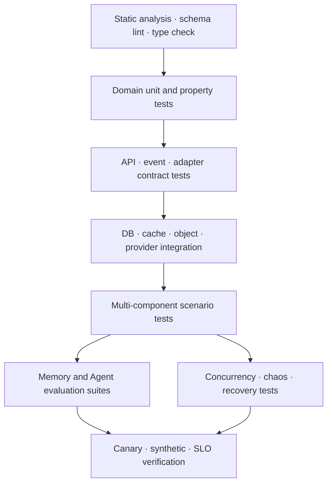

# 14. 테스트와 품질 검증

## 1. 품질 전략

Mnemome은 일반 API 정확성뿐 아니라 memory provenance, multi-agent independence와 cultural selection의 품질을 검증해야 한다. 테스트를 다음 네 축으로 나눈다.

1. Software correctness: 상태, contract, transaction, concurrency
2. Memory quality: recall, provenance, correction, deletion
3. Agent/Culture evaluation: accuracy, efficiency, generalization, safety, recoverability, explainability, strategy diversity
4. Operational fitness: latency, scalability, failure recovery, deployability

---

## 2. Test portfolio



---

## 3. Domain unit과 property test

대상:

- Run, WorkspaceTask, Candidate, DeliberationSession, MemeArtifact state transition
- invalid transition 거부
- WorkingContext budget과 compaction invariant
- provenance graph 연결과 source expansion
- Evidence Group correlation
- snapshot manifest determinism
- privacy policy와 visibility composition

Property 예:

- 어떤 compaction 후에도 선택된 fact의 `source_ref`가 사라지지 않는다.
- withdrawn Artifact는 새 active snapshot에 포함되지 않는다.
- 같은 source lineage에 속한 review 수를 늘려도 independent evidence group 수는 증가하지 않는다.
- event 중복/순서 변경 뒤 projection 최종 상태가 동일하다.

---

## 4. Contract test

- OpenAPI schema와 SDK generated client compatibility
- error envelope, idempotency와 `If-Match`
- SSE resume와 terminal event
- event envelope, schema version과 consumer compatibility
- storage, Agent connector와 Evaluation/Judge adapter의 technology compatibility kit
- embedded library public API와 service API의 동작 동등성
- Agent/Workspace/Deliberation/Experiment Environment wrapper의 phase/action conformance
- Core/Application이 general-purpose Agent model/tool executor에 의존하지 않는 architecture test

각 adapter는 공통 test suite를 통과해야 한다. 예를 들어 PostgreSQL repository와 in-memory repository는 동일 domain contract를 만족해야 한다.

---

## 5. Integration과 scenario test

| Scenario | 확인할 결과 |
| --- | --- |
| External AgentRun → Episode | Agent outcome 제출 후 episode와 source provenance 생성 |
| Recall → source expansion | 요약에서 원래 source turn까지 복귀 |
| Two-agent Workspace | Environment wrapper를 통한 독립 proposal freeze, 이후 비교와 decision |
| Nomination → Deliberation | realtime path와 분리된 비동기 session |
| Blind review | freeze 전 타 reviewer 결과 비가시성 |
| Debate → Evaluation/Experiment | evidence gap이 typed Judge task 또는 experiment 결과로 닫힘 |
| Governance → Snapshot | immutable manifest publish와 next-run 적용 |
| Withdrawal | hot deny + 새 snapshot + descendant impact |
| Erasure | source, summary, vector, cache와 export 반영 |
| Tenant isolation | 모든 API/job/index/object path에서 교차 접근 거부 |

---

## 6. Agent와 Memory evaluation

### 6.1 Dataset 구조

Evaluation case는 다음을 포함한다.

```text
case_id
context fixtures
query/task
permitted memory scope
expected evidence/source constraints
baseline procedure
candidate procedure
metric definitions
safety constraints
seed and environment digest
```

### 6.2 Evaluation dimensions

| Dimension | 예시 측정 |
| --- | --- |
| Accuracy | 사실/작업 성공률, source entailment |
| Efficiency | latency, token, tool call, 비용 |
| Generalization | 다른 task/agent/domain에서 효과 |
| Safety | policy violation, harmful action |
| Recoverability | 실패 인지와 baseline 복귀 성공 |
| Explainability | source/decision trace completeness |
| Strategy Diversity | population 내 대안 보존 정도 |

하나의 scalar fitness만으로 승인하지 않는다. metric 간 trade-off와 제한 조건을 Decision에 남긴다.

### 6.3 비교 실험

- exploratory와 confirmatory dataset을 분리한다.
- baseline/candidate assignment, seed, model version, tool version과 snapshot을 고정한다.
- paired design이 가능하면 동일 case 쌍으로 비교한다.
- effect size와 uncertainty를 보고한다.
- early stop, safety stop과 sample exclusion을 사전 명세한다.

### 6.4 Online Query Router 평가

Demo service shell의 LLM Query Router는 사용자 요청을 typed route로 제한한다. Core memory domain의
일부가 아니며, 동일 Query에서 선호 저장 여부와 information source 경로를 한 번에 결정한다.

평가 dataset은 다음 의도를 구분해야 한다.

- 현재 news 또는 외부 사실 확인
- 과거 대화와 저장된 선호 조회
- 지속 선호 저장만 수행
- 선호 저장과 현재 요청을 함께 수행
- 일반 지식 또는 Agent tool 판단 위임

품질 gate는 exact 문구가 아니라 structured route를 기준으로 한다.

- fresh route false positive/negative
- preference write precision과 다음 대화 적용률
- memory-context intent accuracy
- 복합 의도 정확도
- schema failure, timeout과 provider fallback 뒤 장기 memory 오염 여부
- route latency, token과 비용

PR에서는 deterministic fake/recorded model로 schema와 orchestration을 검증한다. 실제 provider 평가는
고정된 model/prompt version과 semantic fixture로 별도 수행한다. Router 실패 시 keyword heuristic으로
복귀하지 않고 `general_or_agent_decides`로 제한되며, 검증되지 않은 preference write는 금지한다.

---

## 7. Independence와 deliberation 검증

- reviewer가 seal 전 다른 review를 읽을 수 없는지 확인한다.
- 같은 agent build, prompt, source와 model lineage를 correlation feature로 묶는다.
- majority count와 evidence group count를 의도적으로 다르게 만든 fixture를 사용한다.
- unsupported argument, 잘못된 target, budget 초과를 거부한다.
- minority objection이 recommendation과 governance record에 남는지 확인한다.
- candidate 변경이 새 immutable version과 새/restarted review를 요구하는지 확인한다.
- DeliberationEnvironment가 phase 밖의 method와 visibility 위반을 거부하는지 확인한다.
- 같은 model/prompt/source의 LLM Judge retry가 독립 reviewer로 중복 집계되지 않는지 확인한다.

---

## 8. Security와 privacy test

- tenant boundary fuzzing과 authorization matrix
- malicious SourceRef, 외부 Agent observation과 LLM Judge prompt injection
- object path traversal과 signed URL replay
- secret/PII telemetry leak scanner
- erasure propagation과 backup expiry 검증
- restricted lineage traversal의 partial disclosure
- emergency withdrawal 권한과 separation of duty
- dependency/SBOM/image/IaC scanning

---

## 9. Concurrency와 failure test

- 동일 Run lease takeover와 stale fencing token
- Workspace optimistic version conflict
- outbox publish 직전/직후 process crash
- duplicate/out-of-order event
- DB failover, cache flush, object temporary failure
- LLM Judge timeout/invalid schema와 외부 Agent session disconnect
- snapshot publish 중 worker version 혼재
- reindex 중 correction/deletion

Failure injection 뒤에는 단순 service recovery뿐 아니라 lost/duplicated state와 provenance integrity를 검사한다.

---

## 10. Performance test

Workload profile:

- short Run / long multi-step Run
- memory cold/hot recall
- large Workspace fan-out
- candidate burst와 experiment batch
- large active snapshot와 lineage traversal
- tenant noisy-neighbor

결과는 throughput만이 아니라 p50/p95/p99 latency, error, saturation, queue age, 비용과 quality degradation을 함께 기록한다.

---

## 11. CI/CD quality gate

| 단계 | 필수 gate |
| --- | --- |
| Pull Request | format/type/static, unit, domain property, contract diff |
| Merge | integration, migration compatibility, security scan |
| Release Candidate | scenario, evaluation regression, performance smoke |
| Staging | upgrade/rollback, synthetic E2E, restore smoke |
| Production canary | SLO/error/cost/quality guardrail |
| Cultural publish | provenance, independence, policy, withdrawal check |

외부 Agent와 LLM Judge가 비결정적일 수 있으므로 evaluation regression은 exact string보다 structured rubric, deterministic fixture와 반복 sample을 결합한다. threshold 변경도 code review와 versioning 대상이다.

---

## 12. On-prem compatibility kit

배포 전 자동 검증 도구를 제공한다.

- 지원 DB/Valkey/object endpoint와 version 확인
- migration dry-run과 storage permission 확인
- Agent connector와 optional local LLM Judge adapter connectivity test
- 외부 network 없이 startup/run/recall 가능 여부
- backup/export/import와 restore smoke
- observability endpoint와 redaction 설정 확인
- license/config 만료가 data export를 막지 않는지 확인

Core library는 fake clock, deterministic ID, in-memory adapter와 recorded provider fixture를 제공해 host application에서 독립적으로 테스트할 수 있어야 한다.
