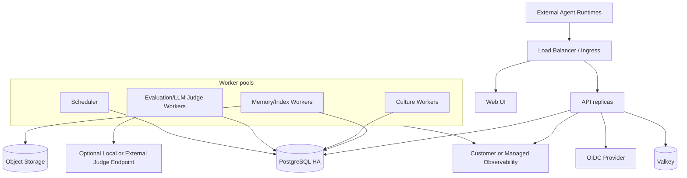
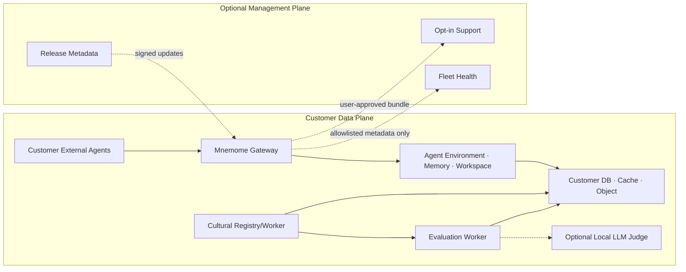
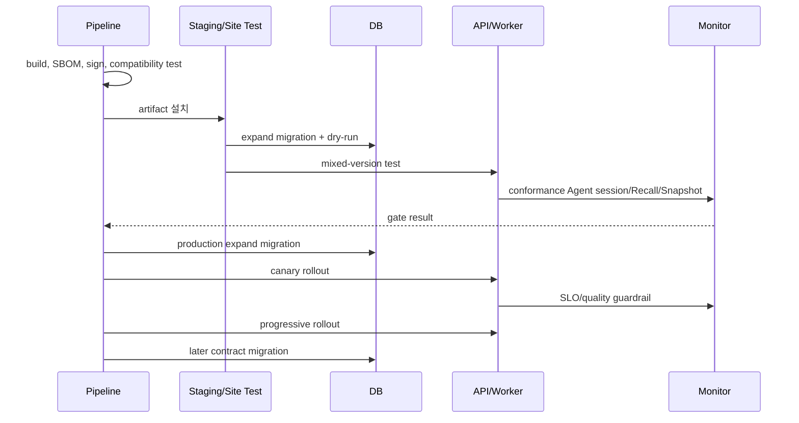

# 15. 배포와 환경 구성

## 1. 지원 배포 profile

Mnemome은 특정 cloud control plane에 종속되지 않는다. 동일 Core와 contract를 사용해 다음 profile을 지원한다.

| Profile | 실행 위치 | 적합한 사용자 | 운영 책임 |
| --- | --- | --- | --- |
| Embedded Library | 고객 application process | 일부 memory/culture 기능만 내장 | 고객 application |
| Full On-Premises | 고객 VM/Kubernetes/air-gapped site | 모든 데이터와 연산을 내부 유지 | 고객 또는 공동 운영 |
| Hybrid | 민감 data/runtime은 고객 환경, 선택적 management는 SaaS | data residency와 중앙 운영 병행 | 공동 운영 |
| SaaS | Mnemome cloud | 빠른 도입과 managed operation | 서비스 운영자 |

Profile은 기능 의미를 바꾸지 않는다. `Run`, `Episode`, `Workspace`, `Candidate`, `Deliberation`, `Snapshot` contract와 식별/내보내기 형식은 호환되어야 한다.

---

## 2. 배포 artifact

| Artifact | 내용 |
| --- | --- |
| `mnemome-core` | domain model, lifecycle, policy, orchestration primitive |
| `mnemome-sdk` | embedded facade와 typed client |
| `mnemome-adapters-*` | PostgreSQL, Valkey, object, Agent connector, Judge, telemetry adapter |
| API image | REST/SSE, identity/tenant boundary |
| Worker image | memory, culture, evaluation workload별 worker entrypoint |
| Scheduler image | retention, experiment, snapshot, maintenance job |
| Web image | 관리/Workspace/Governance UI |
| Migration bundle | schema migration과 compatibility check |
| Helm chart | Kubernetes 배포 |
| Compose bundle | local/소규모 on-prem reference deployment |
| Offline bundle | image, package, SBOM, signature, 설치 문서 |

API/worker image가 Core source를 복제하지 않고 동일 library package를 사용해야 한다.

---

## 3. Production topology



초기에는 API, scheduler와 memory/culture/evaluation worker가 같은 image의 다른 entrypoint일 수 있다. LLM Judge는 GPU, egress와 data policy가 다르므로 우선 분리 후보가 된다.

---

## 4. Hybrid data plane



Hybrid 원칙:

- query, memory content, source, Artifact body와 credential은 기본적으로 customer data plane을 떠나지 않는다.
- management plane 연결이 끊겨도 Agent Environment와 데이터 export가 가능하다.
- outbound channel은 allowlist와 tenant policy로 끌 수 있다.
- 외부 LLM Judge 사용 여부는 evaluation adapter와 egress policy로 결정한다. Agent inference 연결은 고객 Agent host의 책임이다.

---

## 5. 환경

| 환경 | 목적 | 데이터 |
| --- | --- | --- |
| Local | 개발, 단위/통합 test | synthetic fixture |
| CI | deterministic validation | ephemeral |
| Development | shared feature integration | 비민감 synthetic |
| Staging | production-like release/restore | anonymized 또는 generated |
| Production SaaS | managed customer workload | tenant production data |
| Customer Site | on-prem/hybrid workload | 고객 관리 production data |

Production 데이터를 개발 환경으로 복사하지 않는다. 재현에는 redacted support bundle이나 synthetic fixture를 사용한다.

---

## 6. Configuration과 secret

- configuration은 schema/version을 가진 파일 또는 environment binding으로 주입한다.
- secret reference와 일반 config를 분리한다.
- deployment profile은 feature flag 집합이 아니라 validation된 profile manifest다.
- startup 시 storage schema, Agent connector, Evaluation/Judge capability와 snapshot compatibility를 검사한다.
- tenant별 policy는 code deployment 없이 versioned resource로 바꿀 수 있으나 audit와 rollback을 제공한다.

Profile manifest 예:

```yaml
profile: full-on-prem
network:
  outbound_mode: deny-by-default
storage:
  relational: postgresql
  cache: valkey
  object: s3-compatible
evaluation:
  llm_judge:
    enabled: true
    allowed_adapters: [local-openai-compatible]
telemetry:
  export: local-only
```

실제 secret 값은 manifest에 넣지 않는다.

---

## 7. Release와 migration



- DB migration은 application rollout과 분리하고 backward compatibility window를 둔다.
- API, worker, event consumer가 혼재하는 동안 N/N-1 contract를 지원한다.
- rollback이 schema rollback을 요구하지 않도록 expand/contract를 사용한다.
- Cultural Snapshot manifest에는 필요한 AgentEnvironment/Core compatibility range를 기록한다.

---

## 8. Air-gapped installation

Offline bundle은 다음을 포함한다.

- architecture/platform별 signed OCI image 또는 wheel
- dependency lock, license notice와 SBOM
- signature/provenance 검증 도구
- schema migration과 preflight binary
- Helm/Compose configuration schema
- external Agent connector와 optional local LLM Judge adapter guide
- backup/restore와 upgrade/rollback runbook

License 검증이나 정상 실행을 위해 외부 서버에 연결하도록 강제하지 않는다. 시간 제한 license가 있더라도 만료 시 기존 data의 read/export를 막지 않는 정책을 별도 결정해야 한다.

---

## 9. Backup과 restore responsibility

SaaS에서는 운영자가 backup, restore drill과 key rotation을 수행한다. 온프레미스에서는 제품이 다음 인터페이스와 검증 도구를 제공하고, 실행 책임은 배포 계약으로 정한다.

- consistent DB backup point 생성
- object manifest export와 digest 검사
- active Cultural Snapshot export
- cache/search rebuild command
- restore 후 integrity/synthetic test
- tenant 또는 전체 site export/import

외부 SaaS control plane에 연결하지 않아도 restore가 가능해야 한다.

---

## 10. Sizing baseline

고정 최소 사양보다 workload 입력으로 sizing한다.

- peak concurrent Agent session과 event ingest rate
- 평균/최대 WorkingContext
- 하루 Episode/Fact/Embedding 증가량
- Workspace 동시 사용자와 event rate
- Cultural pipeline 처리량과 실험 compute
- LLM Judge task rate, model 위치와 GPU/endpoint budget
- retention 기간과 object 크기
- HA/RPO/RTO 요구

설치 전 estimator와 benchmark workload로 CPU, memory, DB IOPS, cache와 storage를 계산하고 고객 환경에서 preflight를 실행한다.
