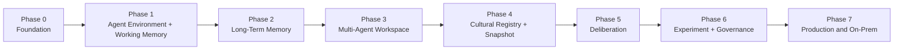

# 16. 구현 로드맵

## 1. 추진 원칙

- Core library와 service shell의 경계를 Phase 0부터 유지한다.
- 각 phase는 독립적으로 사용 가능한 vertical slice와 exit criteria를 가진다.
- SaaS와 on-prem을 별도 codebase로 만들지 않는다.
- Cultural Learning은 Agent Environment와 provenance가 확보된 뒤 확장한다.
- 기능 수보다 contract, migration, audit와 recovery를 먼저 검증한다.

---

## 2. 단계 개요

일부 작업은 병렬로 가능하지만 데이터 lineage는 `P1 → P2 → P4`, collaboration contribution은 `P3 → P5` 순서를 지켜야 한다.

---

## 3. Phase 0 — Foundation과 Core 경계

### 산출물

- `mnemome-core`, SDK, adapter protocol package
- Tenant/Principal/Agent/Policy 기본 domain
- PostgreSQL migration, outbox와 repository base
- in-memory reference adapter와 contract test kit
- OpenAPI/event schema 관리 방식
- OTel, structured error와 audit skeleton
- Compose 기반 local profile

### Exit criteria

- Core unit test가 network/service 없이 실행된다.
- API와 embedded facade가 같은 domain test를 통과한다.
- tenant-scoped repository와 RLS test가 있다.
- schema expand/rollback smoke test가 자동화된다.

---

## 4. Phase 1 — Agent Environment와 Working Memory

### 산출물

- Agent descriptor와 AgentRun session lifecycle
- ContextBundle, event/checkpoint/outcome API와 SSE
- WorkingContext TTL/cache + durable checkpoint
- push/pull/callback Agent connector와 typed Environment SDK
- context budget, expiry, optimistic version과 fencing
- no-culture 기본 snapshot interface

### Exit criteria

- 외부 Agent session의 재연결, cooperative cancel과 concurrent writer가 검증된다.
- Mnemome이 Agent inference/tool 실행 없이 conformance Agent와 연동된다.
- p95 context preparation 초기 목표를 synthetic load에서 측정한다.

---

## 5. Phase 2 — Long-Term Memory

### 산출물

- 외부 Agent outcome finalization → Episode/Fact/SourceRef
- hybrid recall과 source expansion
- correction, suppression, retention과 erasure
- embedding/index rebuild pipeline
- memory export/import

### Exit criteria

- AgentEnvironment contract를 바꾸지 않고 recall context를 주입한다.
- compacted fact에서 원래 source까지 복귀할 수 있다.
- correction/deletion이 cache, vector와 파생 summary에 전파된다.

---

## 6. Phase 3 — Multi-Agent Workspace

### 산출물

- Workspace/Task/Assignment/Contribution/Decision
- 독립 proposal freeze/reveal
- evidence, disagreement와 realtime feed
- workspace authorization과 retention
- explicit Candidate nomination boundary

### Exit criteria

- version conflict에서 기여가 유실되지 않는다.
- 서로 다른 Agent의 contribution/source lineage를 추적한다.
- Workspace 합의가 Cultural validation으로 자동 승격되지 않는다.

---

## 7. Phase 4 — Cultural Registry와 Snapshot

### 산출물

- Meme/Meme Artifact/Variant/Lineage aggregate
- Candidate intake와 qualification
- applicability, exclusion, recovery policy
- Governance Decision 최소형
- immutable Cultural Snapshot publisher/reader
- active cache와 withdrawal denylist

### Exit criteria

- Run이 snapshot을 pin하고 동일 snapshot으로 재현된다.
- withdrawal이 목표 시간 안에 신규 Run에서 차단된다.
- Artifact에서 source Episode/Contribution까지 provenance를 추적한다.

---

## 8. Phase 5 — Cultural Deliberation

### 산출물

- Reviewer assignment와 independence grouping
- sealed review와 freeze/reveal
- typed argument, round/budget/closure
- evidence gap, minority objection, recommendation
- deliberation UI/API와 audit trace
- `DeliberationEnvironment` wrapper와 외부 Reviewer Agent conformance fixture
- EvaluationSpec/Task/Result와 Rule/Metric/LLM Judge adapter

### Exit criteria

- review leakage 방지와 sealed integrity가 검증된다.
- 같은 source 반복이 independent evidence로 집계되지 않는다.
- 무합의 종료도 구조화된 결과를 생성한다.
- Judge retry/model correlation이 독립 evidence로 과대 집계되지 않는다.

---

## 9. Phase 6 — Experiment와 Governance

### 산출물

- experiment plan, assignment, stop condition과 result
- exploratory/confirmatory dataset 분리
- evaluation dimension별 report
- human/automated governance policy와 separation of duty
- restricted validation, replication, revision과 descendant impact

### Exit criteria

- baseline/candidate 비교를 재현할 수 있다.
- safety stop과 traffic budget을 강제한다.
- Decision이 evidence, uncertainty, objection과 policy version을 보존한다.

---

## 10. Phase 7 — Production, hybrid와 on-prem hardening

### 산출물

- Helm/Compose/offline bundle, SBOM와 signature
- managed/bring-your-own storage, Agent connector와 Judge adapter certification
- HA, backup/restore, DR와 upgrade/rollback
- air-gapped preflight/compatibility kit
- local-only telemetry와 opt-in support bundle
- quota, billing/metering adapter와 fleet management optional plane

### Exit criteria

- 외부 network 없는 full on-prem E2E가 통과한다.
- SaaS와 on-prem의 동일 conformance suite가 통과한다.
- N/N-1 mixed version upgrade와 rollback이 검증된다.
- site backup에서 독립 restore가 가능하다.

---

## 11. MVP 경계

초기 유료/파일럿 MVP는 Phase 0–4를 기본으로 한다.

포함:

- Core SDK와 API deployment
- AgentEnvironment SDK; Agent implementation은 포함하지 않음
- Working/Long-Term Memory
- 기본 Multi-Agent Workspace
- 수동 governance 기반 Cultural Registry/Snapshot
- provenance, tenant isolation, export와 withdrawal

후속:

- 자동 reviewer 배정과 완전한 Structured Deliberation
- managed A/B Test
- cross-tenant cultural federation
- graph DB projection
- 복잡한 automated governance

단, 특정 고객의 핵심 가치가 deliberation이면 Phase 5의 좁은 vertical slice를 앞당길 수 있다.

---

## 12. 주요 risk와 조기 검증

| Risk | 조기 검증 |
| --- | --- |
| memory recall이 실제 성능을 낮춤 | source-grounded benchmark와 no-memory baseline |
| provenance 저장 비용 과다 | sampling이 아닌 실제 representative trace sizing |
| snapshot이 너무 커짐 | manifest/chunk/cache benchmark |
| debate가 비용만 증가 | bounded round와 recommendation utility 비교 |
| reviewer independence 추정 오류 | lineage feature와 adversarial fixture |
| Agent 기능이 Mnemome으로 새어 들어옴 | no-inference architecture test와 external conformance Agent |
| LLM Judge 편향/불안정 | versioned rubric, abstention, multi-evaluator disagreement 보존 |
| SaaS/on-prem drift | 하나의 Core + conformance kit + build pipeline |
| 고객 stack 다양성 | capability-based adapter contract와 certification matrix |
| privacy deletion이 lineage와 충돌 | reverse-impact prototype과 erasure rehearsal |

---

## 13. 각 phase의 Definition of Done

- 설계/ADR와 public contract 갱신
- domain/API/event/migration test 통과
- security/privacy threat 검토
- telemetry/dashboard/runbook 준비
- resource/cost baseline 측정
- export와 rollback path 검증
- library, SaaS, on-prem 중 해당 profile의 conformance 결과 기록
