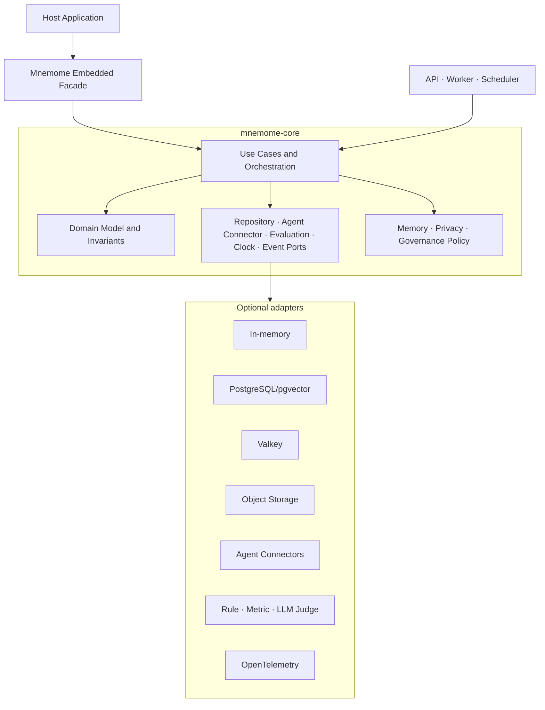

# 18. Library Embedding과 On-Premises

## 1. 목적

Mnemome은 완성된 온라인 서비스인 동시에 기존 Agent 제품이 필요한 기능만 가져다 쓸 수 있는 구성 요소여야 한다. 이를 위해 다음을 함께 제공한다.

- **Core Library**: memory, workspace, culture의 domain semantics와 lifecycle
- **Embedded SDK**: 한 process에서 사용하는 facade
- **Service SDK/Client**: 원격 Mnemome API를 같은 개념으로 호출
- **Service Shell**: multi-tenant API, identity, distributed worker와 운영 기능
- **Deployment Bundle**: full on-prem/hybrid/SaaS 실행 구성

Mnemome package는 Agent 구현을 포함하지 않는다. Host의 외부 Agent가 사용할 Environment interface object와 내부 bounded evaluator를 제공한다.

Library-first는 단순 code reuse가 아니라 배포 독립성과 데이터 주권을 보장하는 설계 제약이다.

---

## 2. Package architecture



Dependency는 항상 바깥에서 Core 방향이다. Core는 FastAPI, Kubernetes, 특정 DB driver나 provider SDK를 import하지 않는다.

---

## 3. Core와 Service 책임

| 책임 | Core Library | Service Shell |
| --- | --- | --- |
| Aggregate/state transition | 소유 | 호출 |
| Working/Long-Term Memory policy | 소유 | tenant config 제공 |
| Cultural lifecycle와 snapshot rule | 소유 | distributed workflow 실행 |
| Agent/Workspace/Deliberation Environment | interface와 invariant | remote transport와 assignment delivery |
| LLM Judge | Evaluation port와 result contract | configured worker/adapter 실행 |
| Storage interface | port 정의 | adapter/config 제공 |
| HTTP/SSE/OIDC | 없음 | 소유 |
| Multi-tenancy/RLS binding | tenant context contract | identity와 DB binding |
| Distributed lease/queue | 추상 contract | 구현 |
| Background scheduling | job semantics | scheduler/worker 실행 |
| Telemetry semantic event | 정의 | exporter 연결 |
| UI와 operator workflow | 없음 | 소유 |

Embedded mode에서도 tenant/security context를 생략하지 않고 단일 local scope를 명시적으로 주입한다.

---

## 4. Public library facade

개념적 Python API 예시다. `external_agent`는 고객이 제공하는 객체이며 Mnemome package의 일부가 아니다.

```python
from mnemome import Mnemome, OpenRunRequest
from mnemome.adapters.memory import InMemoryStores

mnemome = Mnemome(
    stores=InMemoryStores(),
    policy=my_policy,
    judge=my_optional_judge_adapter,
)

env = await mnemome.agent_environment.open_run(
    OpenRunRequest(
        tenant="local",
        agent_descriptor=external_agent.descriptor,
        retrieval_text="이전 장애의 재발 방지책",
        cultural_scope="team/default",
    )
)

context = await env.get_context()
result = await external_agent.run(context)  # Mnemome 밖의 추론
await env.complete(outcome=result.outcome, response_ref=result.reference)
```

실제 API는 구현 시 ADR로 고정한다. 중요한 불변조건은 facade가 service API와 같은 use case를 호출하고 별도 간이 로직을 갖지 않는다는 점이다.

### 4.1 기능별 facade

- `agent_environment.open_run()` / `get_context()` / `record_event()` / `checkpoint()` / `complete()`
- `memory.recall()` / `memory.finalize_episode()` / `memory.correct()`
- `workspace.environment()` / `submit_contribution()` / `record_decision()`
- `culture.resolve_snapshot()` / `culture.nominate()` / `culture.trace_lineage()`
- `deliberation.environment()` / `seal_review()` / `submit_argument()`
- `experiment.environment()` / `record_measurement()` / `complete_arm()`
- `evaluation.create_task()` / `execute_assignment()` / `aggregate()`

동기 wrapper를 제공할 수 있지만 domain operation과 event semantics는 async-safe하게 설계한다.

---

## 5. Port contract

| Port | 최소 capability |
| --- | --- |
| `UnitOfWork` | transaction, commit, rollback |
| `AgentRunRepository` | external Agent session, versioned checkpoint, terminal transition |
| `MemoryRepository` | episode/fact/source write, scoped query |
| `VectorIndex` | upsert, filtered search, delete/rebuild |
| `WorkspaceRepository` | versioned aggregate와 append feed |
| `CulturalRepository` | candidate/artifact/lineage/decision/snapshot |
| `EphemeralStore` | TTL value, lease, fencing token |
| `BlobStore` | immutable put/get, digest, delete |
| `EventSink` | durable event append |
| `AgentConnector` | assignment/cancel notification; push, pull 또는 callback capability |
| `JudgeExecutor` | frozen EvaluationBundle과 spec으로 typed result 생성 |
| `EmbeddingProvider` | memory retrieval용 embedding; Agent inference와 분리 |
| `MemoryEnrichmentProcessor` | optional fact/summary extraction; provenance 필수 |
| `PolicyEvaluator` | action/resource/context decision |
| `Clock/IdGenerator` | deterministic test 지원 |

Adapter는 capability를 선언한다. 예를 들어 transaction이 없는 document store adapter가 strong aggregate operation을 지원한다고 가장해서는 안 된다.

---

## 6. 사용 mode

### 6.1 Embedded minimal

- 단일 process, in-memory 또는 SQLite급 개발 adapter
- Working Memory와 간단한 Long-Term Memory
- 외부 Agent가 호출하는 process-local AgentEnvironment
- 개발, 개인 application, test에 적합
- HA, 분산 lease, 대규모 multi-agent collaboration은 제공하지 않음

### 6.2 Embedded durable

- host process + PostgreSQL/object adapter
- 기존 서비스가 자체 identity/API/UI를 유지
- Mnemome Core의 memory/culture 기능만 호출
- background job은 host scheduler 또는 제공 worker를 선택

### 6.3 Full service on-prem

- Mnemome API/UI/worker 전체 설치
- 고객 OIDC, DB, Valkey, object, 외부 Agent connector와 optional local LLM Judge 연결
- multi-tenant 또는 단일 조직 profile
- 외부 network 없이 운영 가능

### 6.4 Hybrid

- Core/AgentEnvironment/data는 고객 환경
- signed update, aggregate fleet health, opt-in support 같은 management만 연결
- data egress는 명시적 adapter/policy로 제한

### 6.5 SaaS

- 동일 Core를 managed service shell에서 실행
- tenant provisioning, quota, billing과 fleet operation 추가

---

## 7. 기능 지원 matrix

| 기능 | Embedded minimal | Embedded durable | Full on-prem | Hybrid | SaaS |
| --- | --- | --- | --- | --- | --- |
| Working Memory | 지원 | 지원 | 지원 | 지원 | 지원 |
| Agent Environment | process-local | 지원 | 지원 | 지원 | 지원 |
| Long-Term Memory | 제한형 | 지원 | 지원 | 지원 | 지원 |
| Multi-Agent Workspace | process-local/제한 | host 구현 필요 | 지원 | 지원 | 지원 |
| Cultural Registry/Snapshot | local scope | 지원 | 지원 | 지원 | 지원 |
| Deliberation/Experiment wrapper | 수동 호출 | 선택 worker | 지원 | 지원 | 지원 |
| Internal LLM Judge | 선택 | 선택 | 선택 | 선택 | managed option |
| HA/Distributed lease | 미지원 | host 의존 | 지원 | 지원 | 지원 |
| OIDC/Multi-tenancy | host 책임 | host 책임 | service 제공 | service 제공 | service 제공 |
| Air-gapped | 지원 | 지원 | 지원 | 부분 | 해당 없음 |

“제한형”은 의미가 다른 축약 구현이 아니라 adapter와 운영 capability가 부족한 상태를 뜻한다.

---

## 8. Extension과 compatibility

- Public package는 semantic versioning을 사용한다.
- domain serialization, event와 snapshot manifest는 별도 schema version을 가진다.
- adapter protocol에는 capability negotiation을 둔다.
- Core N은 최소 service/adapter compatibility range를 명시한다.
- custom adapter는 공통 Technology Compatibility Kit를 통과해야 한다.
- extension은 lifecycle hook보다 typed port/domain event를 우선한다.
- plugin code가 tenant context나 policy evaluation을 우회하지 못하게 한다.

---

## 9. Data portability

모든 profile은 다음 canonical export/import를 지원해야 한다.

- Agent descriptor/Policy configuration
- Episode/Fact/SourceRef와 visibility metadata
- Workspace와 contribution/decision history
- Meme Artifact, lineage, governance와 snapshot manifest
- object bundle과 content digest
- schema/version/adapter capability manifest

Export는 단순 DB dump가 아니라 권한, provenance와 integrity를 보존하는 portable package다. SaaS에서 on-prem으로, on-prem에서 SaaS로 이동할 때 동일 검증기를 사용한다.

---

## 10. On-prem product requirements

- 고객 관리 key와 secret manager 지원
- local OIDC/LDAP 연동은 identity adapter 뒤에 배치
- private registry와 offline install
- mandatory phone-home 없음
- customer-managed backup와 local observability
- 외부 LLM Judge endpoint 차단 가능; 외부 Agent inference network는 고객이 소유
- support bundle은 사용자가 생성하고 redaction을 검토
- documented version/support lifecycle
- data read/export가 license server availability에 종속되지 않음

---

## 11. 금지할 구조

- Core domain에서 SaaS URL이나 cloud credential을 직접 참조
- embedded와 service가 서로 다른 lifecycle 규칙 구현
- on-prem용 장기 fork와 고객별 patch branch
- Valkey나 broker 없이는 domain unit test가 불가능한 구조
- 외부 control plane 장애로 local Run이 중단되는 구조
- Core나 Environment SDK가 Agent plan/inference/tool execution을 구현하는 구조
- LLM Judge가 일반 Agent endpoint 또는 Governance 승인자로 동작하는 구조
- adapter가 authorization/tenant scope를 임의로 생략하는 구조
- proprietary export만 제공해 deployment profile 이동을 막는 구조
