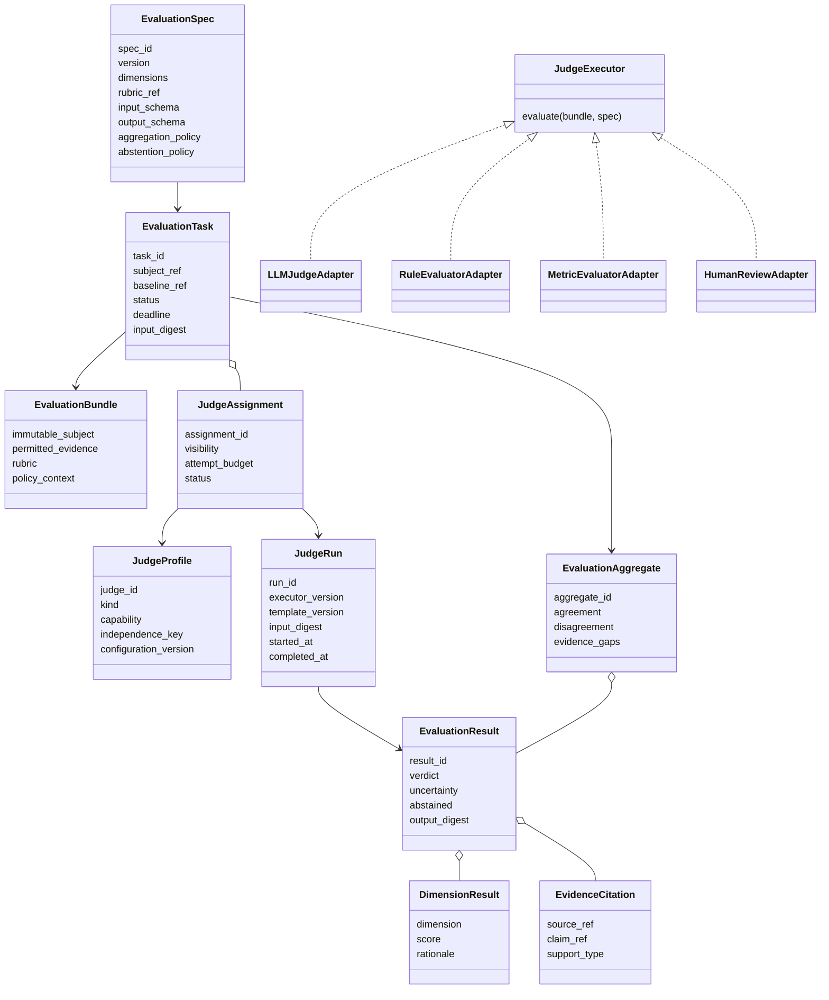
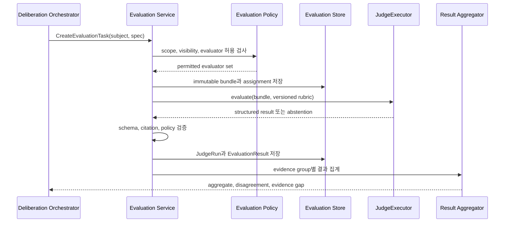

# 19. Evaluation Subsystem과 LLM Judge

## 1. 책임 경계

Mnemome은 일반 목적 Agent inference를 제공하지 않지만, memory와 Cultural Learning의 품질을 검증하기 위한 bounded evaluation은 제공한다.

Evaluation Subsystem의 대상:

- Candidate와 Baseline의 비교
- Independent Review의 rubric 충족 여부
- Argument가 연결한 Evidence의 entailment/관련성
- Experiment 결과의 Evaluation Dimension 산출
- Artifact의 applicability, safety와 recoverability 평가
- Memory extraction/summary의 source grounding 평가

내부 `LLM Judge`는 Agent가 아니다. 고정된 입력과 rubric을 받아 schema가 정해진 EvaluationResult를 반환하는 evaluator다.

### 하지 않는 것

- 사용자 Query에 답변
- 자율적인 목표/Plan 생성
- 임의 Tool 탐색과 side effect 실행
- Candidate 또는 Evidence를 몰래 수정
- Governance Decision 직접 확정
- 다른 tenant의 데이터로 평가 범위 확장

---

## 2. Evaluator 종류

| Evaluator | 용도 | 예 |
| --- | --- | --- |
| Deterministic Rule Evaluator | 형식·정책·불변조건 | provenance 누락, schema, 금지 조건 |
| Metric Evaluator | 수치 비교 | accuracy, latency, cost, failure rate |
| LLM Judge | 의미 기반 구조화 평가 | entailment, relevance, explanation quality |
| Human Evaluator | 고위험·모호한 판단 | safety, policy exception, final approval |
| External Reviewer Agent | 독립 proposal/review 생성 | DeliberationEnvironment를 통한 검토 |

External Reviewer Agent는 Mnemome 밖에서 reasoning한다. LLM Judge는 Mnemome이 관리하는 제한된 evaluation job 안에서만 inference한다.

---

## 3. 클래스 모델



---

## 4. 주요 interface

개념적 protocol:

```python
class JudgeExecutor(Protocol):
    async def evaluate(
        self,
        bundle: EvaluationBundle,
        spec: EvaluationSpec,
        context: EvaluationContext,
    ) -> EvaluationResult: ...


class EvaluationService(Protocol):
    async def create_task(self, command: CreateEvaluationTask) -> EvaluationTask: ...
    async def execute_assignment(self, assignment_id: str) -> EvaluationResult: ...
    async def aggregate(self, task_id: str) -> EvaluationAggregate: ...
```

`LLMJudgeAdapter`는 provider API나 local inference endpoint 차이를 숨긴다. Domain은 model vendor가 아니라 `JudgeProfile`, capability와 result schema만 본다.

---

## 5. Evaluation sequence



Evaluation은 Cultural Learning slow path에서 실행한다. Online Agent interaction이 Judge 완료를 기다리지 않는다.

---

## 6. LLM Judge 실행 계약

### 6.1 고정 입력

Judge 시작 전에 다음을 freeze한다.

- EvaluationSpec과 rubric version
- Candidate/Artifact/Episode subject version
- Baseline version
- permitted Evidence set과 digest
- visibility/redaction policy
- output JSON Schema
- model endpoint, model version과 inference parameter
- attempt와 cost budget

### 6.2 출력

```json
{
  "verdict": "PARTIALLY_SUPPORTED",
  "dimensions": [
    {
      "dimension": "source_grounding",
      "score": 0.72,
      "rationale": "The claim is supported only within the stated environment.",
      "evidence_refs": ["src_01..."]
    }
  ],
  "uncertainty": 0.31,
  "abstained": false,
  "evidence_gaps": ["No independent failure-case replication"],
  "policy_flags": []
}
```

자유 형식 chain-of-thought를 저장하거나 요구하지 않는다. 짧은 rationale과 EvidenceRef만 보존한다.

### 6.3 실패와 abstention

- 입력이 부족하거나 visibility로 핵심 source를 볼 수 없으면 abstain한다.
- schema validation 실패는 새 attempt로 기록한다.
- retry가 성공해도 이전 실패 attempt를 audit metadata로 유지한다.
- timeout 결과를 낮은 점수로 바꾸지 않는다.
- Judge disagreement를 평균으로 숨기지 않는다.

---

## 7. Judge independence

여러 LLM 호출은 자동으로 독립 평가가 아니다.

`independence_key` 후보:

- model provider와 foundation model family
- model/version/checkpoint
- rubric/prompt template lineage
- supplied Evidence bundle
- few-shot example set
- evaluator implementation과 aggregation owner

동일 model, prompt와 Evidence를 사용한 5회 호출은 반복 측정일 수는 있지만 5개의 독립 Evidence Group으로 세지 않는다. 서로 다른 Judge 결과도 공통 source에 의존하면 source independence는 증가하지 않는다.

---

## 8. Aggregation

EvaluationAggregate는 다음을 별도로 계산한다.

- deterministic policy pass/fail
- dimension별 metric distribution
- Judge 간 agreement와 disagreement
- Evidence Group별 support/rebuttal
- abstention과 missing visibility 비율
- safety veto
- unresolved evidence gap

단일 평균 score로 Governance Decision을 자동 결정하지 않는다. Aggregation policy는 versioned하며 원래 result를 보존한다.

---

## 9. Deliberation과 연결

LLM Judge는 다음 역할로 참여할 수 있다.

1. sealed Independent Review의 자동 evaluator
2. Argument-Evidence 연결의 grounding checker
3. round 종료 시 unresolved claim detector
4. Experiment output의 rubric evaluator
5. Governance packet의 completeness checker

LLM Judge가 `Recommendation` 초안을 만들 수는 있지만, 이는 typed EvaluationResult 또는 derived draft다. GovernanceDecision은 별도 policy와 권한을 통해 기록한다.

`DeliberationEnvironment`는 외부 Reviewer Agent의 참여 wrapper이고, `EvaluationService`는 내부 Judge job을 실행한다. 두 경로의 결과는 동일 Evidence/Argument graph에서 출처를 구분해 결합한다.

---

## 10. Security와 privacy

- Judge input은 evaluation 목적에 필요한 최소 Evidence로 제한한다.
- tenant와 data classification에 허용된 model endpoint만 사용한다.
- on-prem에서는 local inference endpoint를 선택할 수 있다.
- provider의 training/retention policy를 configuration에 기록한다.
- prompt injection을 막기 위해 Evidence는 instruction이 아닌 quoted data 영역으로 전달한다.
- Judge에는 tool access를 기본 제공하지 않는다.
- 외부 retrieval이 필요하면 사전 정의된 read-only EvidenceResolver만 허용한다.
- prompt, output, source content의 telemetry 저장은 tenant policy를 따른다.

---

## 11. Observability

- `evaluation_tasks_total` by spec/result
- `judge_runs_total` by kind/model family/status
- `judge_duration_seconds`
- `judge_schema_failure_total`
- `judge_abstention_ratio`
- `judge_disagreement_ratio`
- `evaluation_cost_units`
- `evaluation_queue_age_seconds`
- `grounding_citation_failure_total`

High-cardinality subject/task ID는 metric label이 아니라 trace/log correlation에 둔다.

---

## 12. Test contract

- 같은 frozen input/spec에 대한 serialization 재현성
- JSON Schema와 citation 검증
- missing evidence에서 abstention
- prompt injection fixture에서 policy 준수
- 동일 model 반복 호출의 independence overcount 방지
- Judge result 순서가 바뀌어도 aggregation 의미 유지
- model timeout/invalid output/retry 기록
- restricted Evidence가 provider로 유출되지 않음
- LLM Judge 없이 deterministic/human evaluator만으로 workflow 진행 가능
- local on-prem endpoint와 managed endpoint adapter conformance

---

## 13. On-premises 구성

온프레미스 고객은 다음 중 하나를 선택할 수 있다.

- LLM Judge 비활성화 후 rule/metric/human evaluation만 사용
- 고객의 OpenAI-compatible local endpoint 연결
- 고객이 구현한 `JudgeExecutor` adapter 설치
- 별도 GPU worker pool에 Evaluation Worker 배치

Core lifecycle은 LLM Judge availability에 의존하지 않는다. Judge가 없으면 자동 평가가 대기하거나 human review로 전환되며, 기존 Agent Environment와 memory service는 계속 동작한다.
