# Mnemome Software System Design

## 1. 문서 목적

이 디렉터리는 Mnemome을 multi-tenant 온라인 서비스로 구현하면서, 같은 기능을 Embedded Library, Full On-Premises와 Hybrid 방식으로도 제공하기 위한 소프트웨어 설계도다.

- 한 번의 Agent run을 위한 Working Memory
- Session을 넘어 유지되는 Agent Long-Term Memory
- 여러 Agent가 task state, evidence와 disagreement를 공유하는 Multi-Agent Workspace
- 검증된 Meme Artifact와 lineage를 제공하는 Cultural Memory
- 사용자 요청과 분리된 Cultural Deliberation, A/B Test와 Governance
- 모든 계층을 연결하는 provenance, privacy, permission과 audit
- 기존 제품에 내장할 수 있는 Core Library와 교체 가능한 adapter
- 외부 control plane 없이 운영 가능한 온프레미스 배포와 profile 간 data portability
- 외부 Agent가 memory와 collaboration protocol에 참여하기 위한 Environment interface object
- Agent 추론과 분리된 bounded Evaluation Subsystem과 LLM Judge

개념적 근거는 [Cultural Memory 통합 문서](../develop/cultural-memory-hivemind.md)와 [상세 개념 문서](../develop/cultural-memory/README.md)를 따른다. `ssd/`는 이를 실제 서비스 경계, 데이터 모델, API, 이벤트, 보안과 운영 설계로 변환한다.

---

## 2. 문서 지도

| 번호 | 문서 | 핵심 내용 |
| --- | --- | --- |
| 00 | [설계 목표와 범위](./00-design-goals-and-scope.md) | 제품 범위, 원칙, 품질 속성, 불변조건 |
| 01 | [요구사항과 Use Case](./01-requirements-and-use-cases.md) | 사용자, 역할, 기능·비기능 요구사항, 주요 여정 |
| 02 | [시스템 컨텍스트와 컨테이너](./02-system-context-and-containers.md) | 외부 actor, 신뢰 경계, 전체 컨테이너 구조 |
| 03 | [서비스와 모듈 아키텍처](./03-service-and-module-architecture.md) | 논리 서비스, module responsibility, fast/slow path |
| 04 | [도메인 모델과 Lifecycle](./04-domain-model-and-lifecycles.md) | Aggregate, entity, value object, 상태 기계 |
| 05 | [Agent Environment와 Working Memory](./05-agent-environment-and-working-memory.md) | 외부 Agent interface, ContextBundle, checkpoint, event protocol |
| 06 | [Long-Term Memory와 Retrieval](./06-long-term-memory-and-retrieval.md) | Episode, fact, provenance, indexing, hybrid recall |
| 07 | [Multi-Agent Workspace](./07-multi-agent-workspace.md) | 협업 상태, evidence, disagreement, realtime sync |
| 08 | [Cultural Memory와 Deliberation](./08-cultural-memory-and-deliberation.md) | 토론의 정의, blind review, A/B Test, governance, snapshot |
| 09 | [데이터와 저장 구조](./09-data-and-storage-architecture.md) | 논리 schema, PostgreSQL, Valkey, object storage, retention |
| 10 | [API와 Event Contract](./10-api-and-event-contracts.md) | Public API, internal command/query, event envelope, 오류 |
| 11 | [보안·Privacy·Governance](./11-security-privacy-and-governance.md) | Tenant isolation, authorization, deletion, audit, threat control |
| 12 | [신뢰성·Consistency·확장성](./12-reliability-consistency-and-scalability.md) | SLO, idempotency, outbox, snapshot consistency, backpressure |
| 13 | [Observability와 운영](./13-observability-and-operations.md) | Metric, log, trace, alert, runbook, cost visibility |
| 14 | [테스트와 품질 검증](./14-testing-and-quality-strategy.md) | Unit, contract, integration, E2E, evaluation, failure injection |
| 15 | [배포와 환경 구성](./15-deployment-and-environments.md) | Local, staging, production, topology, migration, release |
| 16 | [구현 로드맵](./16-implementation-roadmap.md) | 단계, 산출물, 의존성, exit criteria |
| 17 | [ADR과 미결정 사항](./17-decisions-and-open-questions.md) | 결정 기록, 기본 선택, 대안, open question |
| 18 | [Library Embedding과 On-Premises](./18-library-embedding-and-on-premises.md) | Core SDK, port/adapter, embedded·on-prem·hybrid·SaaS profile |
| 19 | [Evaluation Subsystem과 LLM Judge](./19-evaluation-and-llm-judge.md) | bounded evaluator, LLM Judge class, rubric, aggregation, independence |

---

## 3. 한눈에 보는 시스템

```mermaid
flowchart TB
    Users["User · Calling Application"]
    Agents["External Agent Runtimes"]
    Clients["Environment SDK · HTTP Client"]
    Edge["API Gateway and Identity Boundary"]

    subgraph Online["Agent Interaction Plane"]
        Environment["Agent Environment and Interaction Gateway"]
        MemoryGateway["Memory Gateway"]
        Working["Working Memory"]
        SnapshotReader["Cultural Snapshot Reader"]
        WorkspaceAPI["Workspace Environment"]
    end

    subgraph Durable["Durable Memory Plane"]
        LongTerm["Long-Term Memory"]
        Workspace["Multi-Agent Workspace"]
        Cultural["Cultural Registry"]
    end

    subgraph Learning["Cultural Learning Plane"]
        Contribution["Contribution Intake"]
        Deliberation["Deliberation Orchestrator"]
        DelibEnv["Deliberation Environment"]
        Evaluation["Evaluation Service"]
        Judge["Rule · Metric · LLM Judge"]
        Experiment["Experiment Coordinator"]
        Governance["Governance Engine"]
        Publisher["Snapshot Publisher"]
    end

    EventBackbone["Durable Event Backbone"]
    Data["PostgreSQL · Valkey · Object Storage"]
    Users --> Agents --> Clients --> Edge --> Environment
    Environment <--> MemoryGateway
    Environment <--> WorkspaceAPI
    MemoryGateway <--> Working
    MemoryGateway <--> LongTerm
    SnapshotReader --> Environment
    Cultural --> SnapshotReader
    WorkspaceAPI <--> Workspace
    Environment -.-> EventBackbone
    LongTerm -.-> EventBackbone
    Workspace -.-> EventBackbone
    EventBackbone --> Contribution --> Deliberation
    Agents --> DelibEnv --> Deliberation
    Deliberation --> Evaluation --> Judge
    Deliberation --> Experiment --> Governance --> Cultural
    Evaluation --> Governance
    Governance --> Publisher --> SnapshotReader
    Working --> Data
    LongTerm --> Data
    Workspace --> Data
    Cultural --> Data
```

---

## 4. 기준 기술 구성

설계 문서는 논리 계약을 우선하지만, 구현 가능성을 검증하기 위해 다음을 reference stack으로 둔다.

| 영역 | 기준 선택 | 책임 |
| --- | --- | --- |
| Application | Python, FastAPI, Pydantic | HTTP API, domain service, worker |
| Primary data | PostgreSQL | Tenant, run metadata, episode, workspace, cultural registry, audit의 source of truth |
| Vector retrieval | pgvector | Semantic recall candidate 검색 |
| Ephemeral state | Valkey | Working Memory TTL, hot snapshot, rate limit, short lease |
| Large payload | S3-compatible object storage | 원문 artifact, export, 대형 experiment result |
| Async delivery | Transactional Outbox + worker | 초기 durable event 전달; 확장 시 broker adapter 사용 |
| Frontend realtime | SSE 우선, 필요 시 WebSocket | Run stream과 workspace update |
| Identity | OIDC/OAuth 2.1 compatible IdP | 사용자 인증과 tenant federation |
| Observability | OpenTelemetry compatible stack | Trace, metric, structured log |
| Internal evaluation | Versioned Evaluator port | Rule, metric, human과 optional LLM Judge 실행 |

배포 독립성을 위해 domain lifecycle과 orchestration primitive는 `mnemome-core` 라이브러리에 두고, HTTP·OIDC·분산 worker는 service adapter로 제공한다. 따라서 고객은 일부 기능을 기존 application에 내장하거나 전체 서비스를 온프레미스로 설치할 수 있다.

Mnemome은 Agent, Agent model inference 또는 tool execution을 제공하지 않는다. 외부 Agent가 Environment interface를 통해 context를 받고 event/outcome을 제출한다. LLM 사용은 memory enrichment나 evaluation처럼 범위가 고정된 내부 processor에 한정한다.

원칙:

- PostgreSQL을 authoritative source로 사용한다.
- Valkey나 search index는 재생성 가능한 serving state로 취급한다.
- Lineage는 초기에는 relational edge table로 관리한다.
- 별도 graph database는 query 복잡도와 규모가 실제로 필요할 때 projection으로 추가한다.
- 비동기 broker는 domain event contract 뒤에 adapter로 둬 제품 교체가 가능해야 한다.

---

## 5. 권장 읽기 순서

### 제품과 시스템 전체 이해

`00 → 01 → 02 → 03 → 04`

### Agent memory 구현

`04 → 05 → 06 → 09 → 10`

### Multi-Agent collaboration 구현

`04 → 07 → 10 → 11 → 12`

### Cultural Memory 구현

`04 → 08 → 19 → 09 → 10 → 11 → 14`

### Production 준비

`11 → 12 → 13 → 14 → 15 → 18 → 16`

### Library 또는 On-Premises 도입

`03 → 04 → 09 → 10 → 15 → 18`

---

## 6. 문서 상태 규칙

- `Decided`: 초기 구현의 기준으로 채택된 결정
- `Provisional`: 가설이며 prototype 또는 benchmark로 확인해야 하는 결정
- `Open`: 구현 전에 선택하거나 범위를 확정해야 하는 사항
- `Deferred`: 초기 release 범위에서 제외된 사항

구체적인 결정 상태는 [ADR과 미결정 사항](./17-decisions-and-open-questions.md)에서 추적한다.
